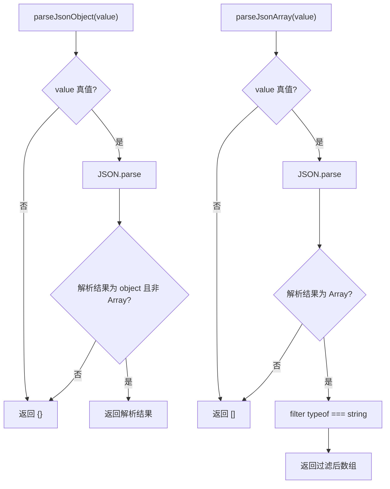

# serde.ts 需求说明

> 源文件：`src/storage/sqlite/serde.ts` ｜ 类型：源码 ｜ 行数：26 ｜ 所属模块：storage/sqlite ｜ 分析日期：2026-07-23

## 1. 文件定位总述

本文件是 SQLite 存储层的 JSON 序列化/反序列化工具集，提供三组对称的序列化-反序列化函数。由于 SQLite 不支持原生 JSON 类型，所有结构化字段以 TEXT 存储后再通过 serde 转换为内存对象。本模块被同目录下多个 Repository 文件引用（projects、teams、server-sessions、auth、memory-items），是存储层的基础设施。

## 2. 功能需求

| 编号 | 需求描述（系统应当…） | 触发条件 / 输入 | 处理规则与输出 | 证据 |
|------|----------------------|----------------|---------------|------|
| FR-stringify-01 | 系统应当将任意值序列化为 JSON 字符串 | 调用 `stringifyJson(value)` | 对 `null`/`undefined` 输出 `{}`（空对象），其他值走 `JSON.stringify` | `src/storage/sqlite/serde.ts:3-5` |
| FR-parse-obj-01 | 系统应当将 JSON 字符串反序列化为对象 | 调用 `parseJsonObject(value)` | null/undefined/空串返回 `{}`；解析后非 object 或数组类型返回 `{}`；合法对象直接返回 | `src/storage/sqlite/serde.ts:7-15` |
| FR-parse-arr-01 | 系统应当将 JSON 字符串反序列化为字符串数组 | 调用 `parseJsonArray(value)` | null/undefined/空串返回 `[]`；解析后非数组返回 `[]`；合法数组过滤保留 string 类型元素 | `src/storage/sqlite/serde.ts:17-25` |

## 3. 业务规则与约束

1. **防御性解析**：所有 parse 函数在 JSON.parse 失败或结果类型不符时均返回安全的空默认值（`{}` 或 `[]`），绝不抛出异常。`src/storage/sqlite/serde.ts:10-15,19-25`
2. **空值处理**：`stringifyJson` 将 `null`/`undefined` 视为空对象 `{}`，与 SQLite TEXT 列的 NOT NULL DEFAULT '{}' 约束对齐。`src/storage/sqlite/serde.ts:4`
3. **数组元素类型过滤**：`parseJsonArray` 仅保留 `string` 类型元素，丢弃其他类型（number、object 等）。`src/storage/sqlite/serde.ts:22`

## 4. 对外暴露

| 名称 | 类型 | 签名 | 说明 |
|------|------|------|------|
| `stringifyJson` | exported function | `(value: unknown) => string` | 序列化，null/undefined 输出 `{}` |
| `parseJsonObject` | exported function | `(value: string \| null \| undefined) => Record<string, unknown>` | 反序列化为对象，失败返回 `{}` |
| `parseJsonArray` | exported function | `(value: string \| null \| undefined) => string[]` | 反序列化为字符串数组，失败返回 `[]` |

## 5. 依赖关系

- **上游依赖**：无（仅使用原生 `JSON`）
- **下游调用方**：`projects.ts`, `teams.ts`, `server-sessions.ts`, `auth.ts`, `memory-items.ts`（同目录各 Repository）

## 6. 数据结构

不适用。

## 7. 复杂逻辑图示

## 8. 逆向备注

无。
