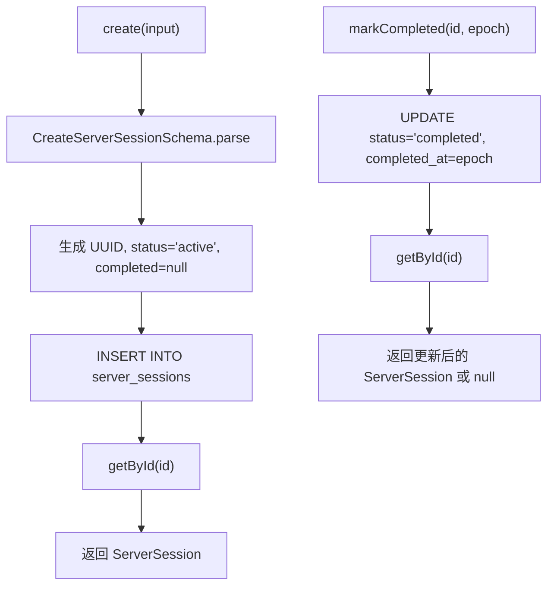

# server-sessions.ts（SQLite）需求说明

> 源文件：`src/storage/sqlite/server-sessions.ts` ｜ 类型：源码 ｜ 行数：97 ｜ 所属模块：storage/sqlite ｜ 分析日期：2026-07-23

## 1. 文件定位总述

本文件是 SQLite 存储层中服务会话（ServerSession）实体的 Repository 实现，提供会话的创建、完成标记和多种查询能力。ServerSession 代表一次从开始到结束的完整 AI 交互周期，关联项目、内容会话和记忆会话，是 agent-events 和 memory-items 的父级聚合实体。

## 2. 功能需求

| 编号 | 需求描述（系统应当…） | 触发条件 / 输入 | 处理规则与输出 | 证据 |
|------|----------------------|----------------|---------------|------|
| FR-ss-create-01 | 系统应当创建服务会话 | 调用 `create(input: CreateServerSession)` | 通过 Zod Schema 验证；自动生成 UUID；platformSource 默认为 `'claude'`；status 默认为 `'active'`；completed_at_epoch 为 null；返回完整对象 | `src/storage/sqlite/server-sessions.ts:44-70` |
| FR-ss-complete-01 | 系统应当标记会话为已完成 | 调用 `markCompleted(id, completedAtEpoch)` | 将 status 设为 `'completed'`，设置 completed_at_epoch（默认当前时间）；返回更新后的对象或 null（ID 不存在时） | `src/storage/sqlite/server-sessions.ts:72-80` |
| FR-ss-get-01 | 系统应当按 ID 查询会话 | 调用 `getById(id)` | 返回 ServerSession 或 null | `src/storage/sqlite/server-sessions.ts:82-85` |
| FR-ss-memory-01 | 系统应当按记忆会话 ID 查询关联的服务会话 | 调用 `getByMemorySessionId(memorySessionId)` | 取最新一条（`started_at_epoch DESC LIMIT 1`）；返回 ServerSession 或 null | `src/storage/sqlite/server-sessions.ts:87-90` |
| FR-ss-list-01 | 系统应当按项目列出所有会话 | 调用 `listByProject(projectId)` | 按 `started_at_epoch DESC` 排序返回 | `src/storage/sqlite/server-sessions.ts:92-95` |

## 3. 业务规则与约束

1. **status 生命周期**：创建时为 `'active'`，通过 `markCompleted` 转为 `'completed'`；数据库 CHECK 约束还包含 `'failed'`（代码中未提供 markFailed 方法）。`src/storage/sqlite/schema.ts:62`
2. **platformSource 默认值**：未指定时默认 `'claude'`，数据库列 DEFAULT 也是 `'claude'`，双重保障。`src/storage/sqlite/server-sessions.ts:60`
3. **Schema 验证**：创建时用 `CreateServerSessionSchema`，查询映射时用 `ServerSessionSchema`。`src/storage/sqlite/server-sessions.ts:45,23-37`
4. **外键级联**：`server_sessions` 被 `agent_events` 和 `memory_items` 以 `ON DELETE SET NULL` 引用，删除会话不会级联删除子记录但会清除关联。`src/storage/sqlite/schema.ts:82,103`

## 4. 对外暴露

| 名称 | 类型 | 签名 | 说明 |
|------|------|------|------|
| `ServerSessionsRepository` | exported class | 构造函数接收 `Database` | 会话 Repository |
| `create()` | public method | `(input: CreateServerSession) => ServerSession` | 创建会话 |
| `markCompleted()` | public method | `(id, completedAtEpoch?) => ServerSession \| null` | 标记完成 |
| `getById()` | public method | `(id: string) => ServerSession \| null` | 按 ID 查询 |
| `getByMemorySessionId()` | public method | `(memorySessionId: string) => ServerSession \| null` | 按记忆会话查询 |
| `listByProject()` | public method | `(projectId: string) => ServerSession[]` | 按项目列出 |

## 5. 依赖关系

- **上游依赖**：`crypto`（randomUUID）、`bun:sqlite`（Database）、`../../core/schemas/session.js`、`./schema.js`、`./serde.js`
- **下游调用方**：推断为 worker-service 的 session 管理逻辑

## 6. 数据结构

### ServerSessionRow（数据库行）

| 字段 | 类型 | 说明 |
|------|------|------|
| id | string | UUID |
| project_id | string | 所属项目 |
| content_session_id | string \| null | 内容会话 |
| memory_session_id | string \| null | 记忆会话 |
| platform_source | string | 平台来源（默认 'claude'） |
| title | string \| null | 会话标题 |
| status | ServerSessionStatus | 状态（active/completed/failed） |
| metadata | string | JSON 字符串 |
| started_at_epoch | number | 开始时间 |
| completed_at_epoch | number \| null | 完成时间 |
| updated_at_epoch | number | 更新时间 |

## 7. 复杂逻辑图示

## 8. 逆向备注

1. **缺失的 markFailed**：数据库 schema 支持 `'failed'` 状态，但 SQLite 版 Repository 未提供 `markFailed` 方法。Postgres 版有 `markGenerationFailed` 方法。推断 SQLite 版尚未实现或通过其他途径处理失败状态。
