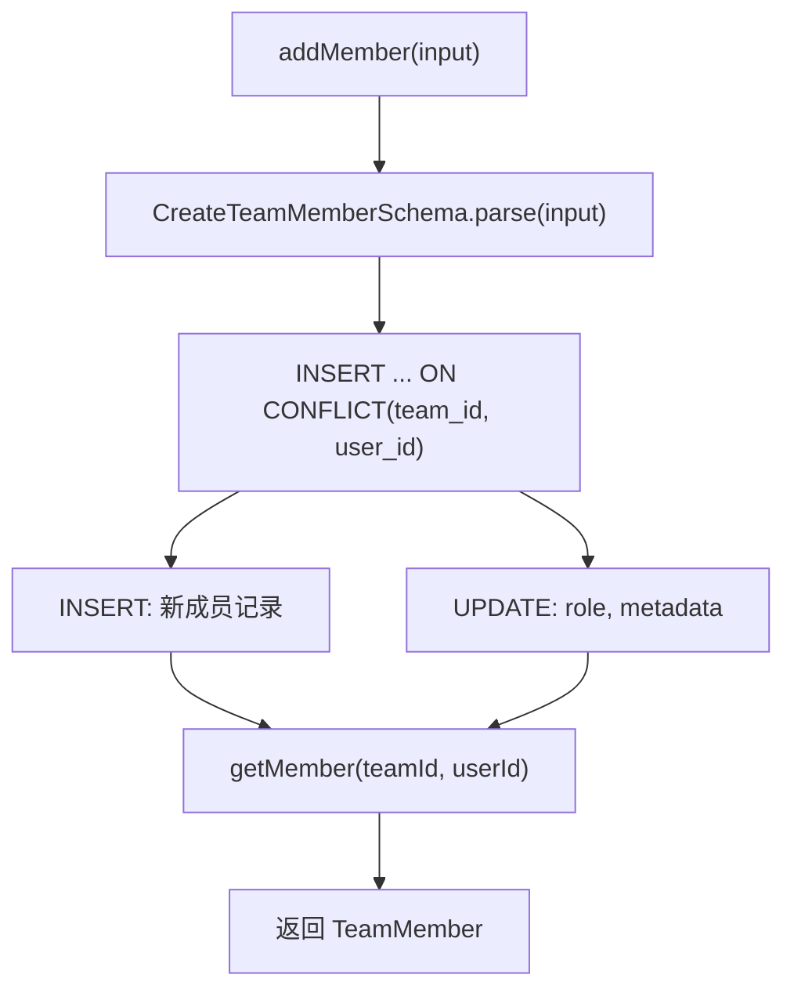

# teams.ts（SQLite）需求说明

> 源文件：`src/storage/sqlite/teams.ts` ｜ 类型：源码 ｜ 行数：98 ｜ 所属模块：storage/sqlite ｜ 分析日期：2026-07-23

## 1. 文件定位总述

本文件是 SQLite 存储层中团队（Team）和团队成员（TeamMember）实体的 Repository 实现，提供团队的创建、查询和成员的添加/查询能力。团队是 Server 模式下多租户架构的组织单元，成员关系通过 `team_id + user_id` 唯一约束实现，支持 owner/admin/member/viewer 四种角色。

## 2. 功能需求

| 编号 | 需求描述（系统应当…） | 触发条件 / 输入 | 处理规则与输出 | 证据 |
|------|----------------------|----------------|---------------|------|
| FR-team-create-01 | 系统应当创建团队 | 调用 `create(input: CreateTeam)` | 通过 Zod Schema 验证；自动生成 UUID；slug 可选；metadata 序列化；返回完整 Team 对象 | `src/storage/sqlite/teams.ts:54-65` |
| FR-team-member-add-01 | 系统应当添加或更新团队成员 | 调用 `addMember(input: CreateTeamMember)` | 使用 `ON CONFLICT(team_id, user_id) DO UPDATE` 实现幂等写入；冲突时更新 role 和 metadata | `src/storage/sqlite/teams.ts:67-81` |
| FR-team-get-01 | 系统应当按 ID 查询团队 | 调用 `getById(id)` | 返回 Team 或 null | `src/storage/sqlite/teams.ts:83-86` |
| FR-team-member-get-01 | 系统应当按 teamId+userId 查询成员 | 调用 `getMember(teamId, userId)` | 返回 TeamMember 或 null | `src/storage/sqlite/teams.ts:88-91` |
| FR-team-member-list-01 | 系统应当列出团队成员 | 调用 `listMembers(teamId)` | 按 `created_at_epoch ASC` 排序返回全部成员 | `src/storage/sqlite/teams.ts:93-96` |

## 3. 业务规则与约束

1. **角色约束**：数据库 CHECK 约束限定 role 为 `owner | admin | member | viewer` 四种。`src/storage/sqlite/schema.ts:48`
2. **成员唯一约束**：`(team_id, user_id)` 联合唯一，同一用户在同一团队只能有一条成员记录。`src/storage/sqlite/schema.ts:52`
3. **Schema 验证**：团队创建用 `CreateTeamSchema`，成员添加用 `CreateTeamMemberSchema`，查询映射分别用 `TeamSchema` 和 `TeamMemberSchema`。`src/storage/sqlite/teams.ts:55,67,28-47`
4. **级联删除**：`team_members` 表通过 `FOREIGN KEY(team_id) REFERENCES teams(id) ON DELETE CASCADE` 确保团队删除时成员记录同步删除。`src/storage/sqlite/schema.ts:51`

## 4. 对外暴露

| 名称 | 类型 | 签名 | 说明 |
|------|------|------|------|
| `TeamsRepository` | exported class | 构造函数接收 `Database` | 团队 Repository |
| `create()` | public method | `(input: CreateTeam) => Team` | 创建团队 |
| `addMember()` | public method | `(input: CreateTeamMember) => TeamMember` | 添加/更新成员 |
| `getById()` | public method | `(id: string) => Team \| null` | 按 ID 查询 |
| `getMember()` | public method | `(teamId, userId) => TeamMember \| null` | 查询成员 |
| `listMembers()` | public method | `(teamId: string) => TeamMember[]` | 列出成员 |

## 5. 依赖关系

- **上游依赖**：`crypto`（randomUUID）、`bun:sqlite`（Database）、`../../core/schemas/team.js`（Schema 定义）、`./schema.js`（ensureServerStorageSchema）、`./serde.js`
- **下游调用方**：推断为 server 层的团队管理 API

## 6. 数据结构

### TeamRow / TeamMemberRow（数据库行）

| 字段 | 类型 | 说明 |
|------|------|------|
| id | string | UUID |
| name | string | 团队名称 |
| slug | string \| null | URL 友好标识 |
| metadata | string | JSON 字符串 |
| created_at_epoch / updated_at_epoch | number | 时间戳 |
| team_id | string | 所属团队（成员表） |
| user_id | string | 用户 ID（成员表） |
| role | TeamRole | 角色（owner/admin/member/viewer） |

## 7. 复杂逻辑图示

## 8. 逆向备注

无。
