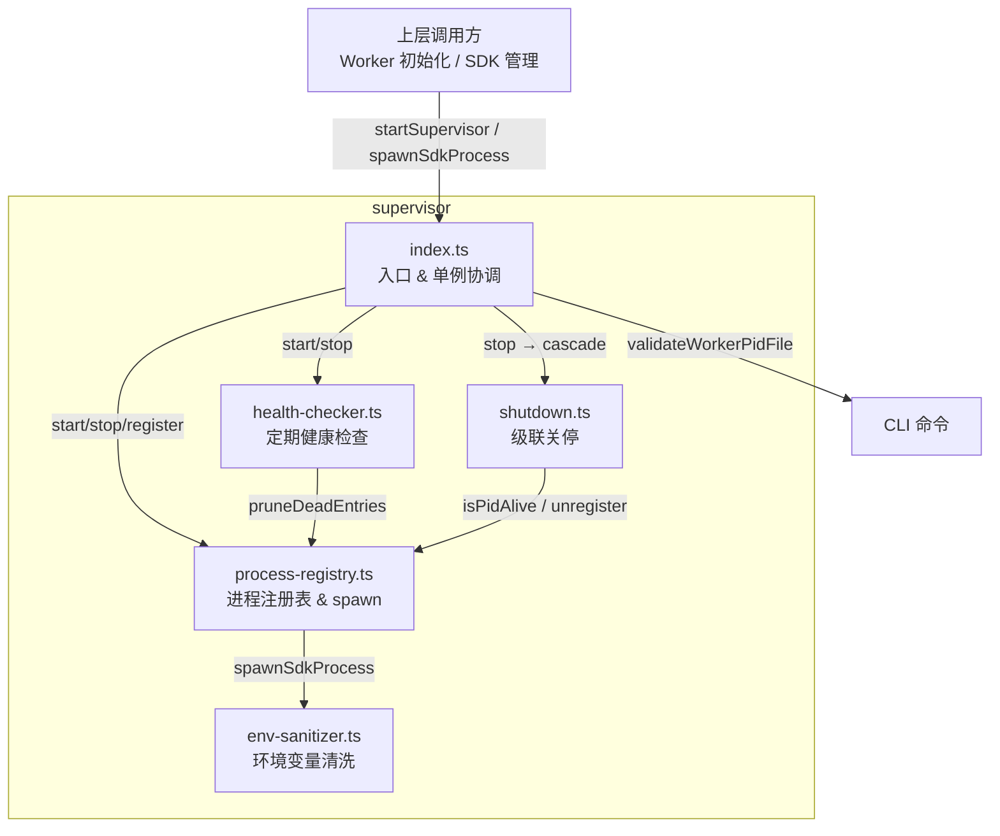

# SUPERVISOR 模块汇总

## 1. 模块职责总述

Supervisor 是 Claude-Mem Worker 的进程监管器，负责子进程（尤其是 SDK 进程）的全生命周期管理。它在系统中的位置是 Worker 启动后的第一道基础设施层：通过 PID 文件防止多实例运行、注册与跟踪所有衍生子进程、以两阶段信号策略（SIGTERM → SIGKILL）执行级联关停，并辅以定期健康检查清理僵尸注册。模块对外暴露进程 spawn/注销/查询等 API，供上层 SDK 管理逻辑调用。

## 2. 功能需求汇总

以下合并自 5 个源文件的 FR 表，保留原编号与来源。

| 编号 | 需求描述 | 触发条件 / 输入 | 处理规则与输出 | 来源 |
|------|---------|---------------|---------------|------|
| FR-ENV-01 | 过滤 `CLAUDECODE_` 和 `CLAUDE_CODE_` 前缀的所有环境变量 | 传入 env 对象 | 匹配 ENV_PREFIXES 的键全部移除 | [env-sanitizer.ts.md](env-sanitizer.ts.md) |
| FR-ENV-02 | 过滤精确匹配的内部环境变量列表 | 键名完全匹配 | ENV_EXACT_MATCHES 中的键全部移除 | [env-sanitizer.ts.md](env-sanitizer.ts.md) |
| FR-ENV-03 | 过滤所有代理相关环境变量（HTTP_PROXY 等 10 个） | 键名匹配 | ENV_PROXY_VARS 中的键全部移除 | [env-sanitizer.ts.md](env-sanitizer.ts.md) |
| FR-ENV-04 | 保留白名单中指定的环境变量 | ENV_PRESERVE 中的键 | 白名单优先，匹配则保留并跳过后续过滤（15 个变量） | [env-sanitizer.ts.md](env-sanitizer.ts.md) |
| FR-ENV-05 | 返回清洗后的环境变量副本，不修改原始 env 对象 | 调用 `sanitizeEnv()` | 构造新对象，undefined 值条目直接跳过 | [env-sanitizer.ts.md](env-sanitizer.ts.md) |
| FR-HC-01 | 启动时开启定时健康检查 | 调用 `startHealthChecker()` | 创建 setInterval（30 秒）+ unref；幂等 | [health-checker.ts.md](health-checker.ts.md) |
| FR-HC-02 | 每次健康检查时清理已死亡的进程注册记录 | 定时触发 `runHealthCheck()` | 调用 registry.pruneDeadEntries()，清理数量 > 0 时记录日志 | [health-checker.ts.md](health-checker.ts.md) |
| FR-HC-03 | 支持停止健康检查 | 调用 `stopHealthChecker()` | clearInterval 并置空引用；幂等 | [health-checker.ts.md](health-checker.ts.md) |
| FR-SUP-01 | 通过 Supervisor 单例管理进程监管生命周期 | 调用 `startSupervisor()` / `getSupervisor()` | 单例模式，start 幂等 | [index.ts.md](index.ts.md) |
| FR-SUP-02 | 启动时初始化 ProcessRegistry 并校验 PID 文件 | 调用 `start()` | PID 状态为 alive 时抛出 Error('Worker already running') | [index.ts.md](index.ts.md) |
| FR-SUP-03 | 启动时自动启动健康检查器 | start() 内部 | 调用 startHealthChecker() | [index.ts.md](index.ts.md) |
| FR-SUP-04 | 注册自定义 shutdown handler 并配置信号处理器 | 调用 `configureSupervisorSignalHandlers(shutdownHandler)` | 注册 SIGTERM/SIGINT；非 Windows 额外处理 SIGHUP | [index.ts.md](index.ts.md) |
| FR-SUP-05 | 收到关停信号时执行幂等关停流程 | SIGTERM/SIGINT/SIGHUP | shutdownInitiated 标志防重入；先调 shutdownHandler，失败 fallback stop()；最终 process.exit(0) | [index.ts.md](index.ts.md) |
| FR-SUP-06 | 停止时级联关停：停止健康检查器 → 运行 shutdown cascade | 调用 `stop()` | stopPromise 保证并发只执行一次 | [index.ts.md](index.ts.md) |
| FR-SUP-07 | 拒绝在关停过程中生成新进程 | 调用 `assertCanSpawn(type)` | stopPromise 非 null 时抛出 Error | [index.ts.md](index.ts.md) |
| FR-SUP-08 | 提供 PID 文件校验函数，返回四种状态 | 调用 `validateWorkerPidFile()` | missing/alive/stale/invalid；stale/invalid 自动清理 | [index.ts.md](index.ts.md) |
| FR-SUP-09 | 支持进程注册与注销的代理方法 | 调用 registerProcess/unregisterProcess | 委托给内部 registry | [index.ts.md](index.ts.md) |
| FR-PR-01 | 检测 PID 是否存活，处理 EPERM 和非法 PID | 调用 `isPidAlive(pid)` | pid < 0/0 返回 false；kill(pid,0) 成功 true；EPERM true；其他异常 false | [process-registry.ts.md](process-registry.ts.md) |
| FR-PR-02 | Linux 上通过 /proc/<pid>/stat 读取 starttime 作为启动 token，防止 PID 复用 | Linux + `captureProcessStartToken(pid)` | 提取第 19 字段；Windows null；macOS/BSD 用 ps | [process-registry.ts.md](process-registry.ts.md) |
| FR-PR-03 | 验证 PID 文件中的进程是否仍为原始进程 | `verifyPidFileOwnership(info)` | 无 token 跳过；有 token 比较当前 token | [process-registry.ts.md](process-registry.ts.md) |
| FR-PR-04 | 通过 ProcessRegistry 管理进程注册表，支持初始化/注册/注销/查询/持久化 | 调用 ProcessRegistry 方法 | initialize 从 JSON 加载；register/unregister 修改 Map 后持久化；getAll 按 startedAt 排序 | [process-registry.ts.md](process-registry.ts.md) |
| FR-PR-05 | 初始化时自动清理已死亡进程条目 | initialize() | 调用 pruneDeadEntries()，removed > 0 时记录日志 | [process-registry.ts.md](process-registry.ts.md) |
| FR-PR-06 | 注销 SDK 类型进程时通知槽位等待者 | unregister() 中 type === 'sdk' | 调用 notifySlotAvailable() | [process-registry.ts.md](process-registry.ts.md) |
| FR-PR-07 | 提供按 sessionId 和按 pid 查询进程记录的方法 | 调用 getBySession/getByPid | sessionId 归一化字符串比较；pid 精确匹配 | [process-registry.ts.md](process-registry.ts.md) |
| FR-PR-08 | 按 sessionId 批量终止进程（SIGTERM 5 秒 → SIGKILL 1 秒） | `reapSession(sessionId)` | 复用 shutdown.ts 两阶段策略，最终清理注册记录 | [process-registry.ts.md](process-registry.ts.md) |
| FR-PR-09 | waitForSlot 实现 SDK 进程并发控制，支持 AbortSignal 取消 | `waitForSlot(maxConcurrent, signal)` | 硬上限 10；超 maxConcurrent 进入等待队列；5 秒重检死亡进程 | [process-registry.ts.md](process-registry.ts.md) |
| FR-PR-10 | spawnSdkProcess 启动 SDK 子进程并自动注册 | `spawnSdkProcess(sessionDbId, options)` | 清洗环境变量；过滤空参数；Windows .cmd 用 cmd.exe 包装；detached 启动；退出时自动注销 | [process-registry.ts.md](process-registry.ts.md) |
| FR-PR-11 | 自动过滤空字符串参数及其前置 -- 选项 | 参数中含空字符串 | 遍历 args，空串跳过，前一个 '--' 选项一并移除 | [process-registry.ts.md](process-registry.ts.md) |
| FR-PR-12 | createSdkSpawnFactory 在 spawn 新 SDK 前杀掉同 session 旧进程 | `createSdkSpawnFactory(sessionDbId)` | 查询同 session SDK 进程，存活进程 SIGTERM，然后 spawnSdkProcess | [process-registry.ts.md](process-registry.ts.md) |
| FR-PR-13 | 查找指定 session 的活跃 SDK 进程及 ChildProcess 引用 | `getSdkProcessForSession(sessionDbId)` | 查找 type='sdk' + sessionId 匹配的记录 | [process-registry.ts.md](process-registry.ts.md) |
| FR-PR-14 | 确保进程退出，超时后升级为 SIGKILL | `ensureSdkProcessExit(tracked, timeoutMs)` | 等待 exit 事件（默认 5 秒），超时 SIGKILL，再等 1 秒 | [process-registry.ts.md](process-registry.ts.md) |
| FR-SHUT-01 | 级联关停时过滤掉当前进程自身，仅处理子进程 | `runShutdownCascade()` | childRecords 排除 currentPid，按 startedAt 降序 | [shutdown.ts.md](shutdown.ts.md) |
| FR-SHUT-02 | 对每个存活子进程先发送 SIGTERM | 子进程 PID 存活 | Unix 优先进程组信号，ESRCH 回退单 PID | [shutdown.ts.md](shutdown.ts.md) |
| FR-SHUT-03 | SIGTERM 后等待 5 秒让进程优雅退出 | SIGTERM 发送完毕 | waitForExit 轮询 100ms 间隔 | [shutdown.ts.md](shutdown.ts.md) |
| FR-SHUT-04 | 对仍存活的进程发送 SIGKILL 强制终止 | 5 秒后仍有存活 | Unix 进程组 SIGKILL；Windows tree-kill / taskkill | [shutdown.ts.md](shutdown.ts.md) |
| FR-SHUT-05 | SIGKILL 后等待 1 秒，清理所有进程注册记录 | SIGKILL 发送完毕 | waitForExit(survivors, 1000)，unregister 全部 | [shutdown.ts.md](shutdown.ts.md) |
| FR-SHUT-06 | 关停完成后删除 PID 文件并清理注册表死亡条目 | 所有进程清理完毕 | rmSync(pidFilePath, force)；pruneDeadEntries() | [shutdown.ts.md](shutdown.ts.md) |
| FR-SHUT-07 | Windows SIGKILL 使用 tree-kill 模块，回退 taskkill 命令 | Windows + SIGKILL | import('tree-kill')，失败则 execFile('taskkill', ['/PID', pid, '/T', '/F']) | [shutdown.ts.md](shutdown.ts.md) |

## 3. 模块内部结构

Supervisor 由 5 个文件组成，核心依赖关系如下：`index.ts` 作为入口协调者，驱动 `process-registry.ts`（注册表核心）、`health-checker.ts`（定期清理）和 `shutdown.ts`（级联关停）三个子系统；`env-sanitizer.ts` 作为纯工具模块被 `process-registry.ts` 在 spawn 子进程时调用。



### 关键调用链

- **启动链**：`startSupervisor()` → `registry.initialize()` → `validateWorkerPidFile()` → `startHealthChecker()`
- **关停链**：`SIGTERM/SIGINT` → `Supervisor.stop()` → `stopHealthChecker()` → `runShutdownCascade()`（两阶段信号）
- **spawn 链**：`spawnSdkProcess()` → `sanitizeEnv()` → `spawnHidden(detached)` → `registry.register()` → exit 时 `unregister()`

## 4. 对外接口

### 函数 API

| 导出项 | 所属文件 | 类型 | 用途 |
|--------|---------|------|------|
| `startSupervisor` | index.ts | async function | 启动 Supervisor 单例 |
| `getSupervisor` | index.ts | function | 获取 Supervisor 单例实例 |
| `configureSupervisorSignalHandlers` | index.ts | function | 配置进程信号处理器 |
| `validateWorkerPidFile` | index.ts | function | 校验 PID 文件状态（可独立使用） |
| `ProcessRegistry` | process-registry.ts | class | 进程注册表核心类 |
| `isPidAlive` | process-registry.ts | function | PID 存活检测 |
| `captureProcessStartToken` | process-registry.ts | function | 获取进程启动 token（Linux/macOS） |
| `verifyPidFileOwnership` | process-registry.ts | function | 验证 PID 文件所有权 |
| `getProcessRegistry` | process-registry.ts | function | 获取全局注册表单例 |
| `createProcessRegistry` | process-registry.ts | function | 创建自定义路径的注册表实例 |
| `waitForSlot` | process-registry.ts | async function | 等待 SDK 并发槽位 |
| `spawnSdkProcess` | process-registry.ts | function | 启动 SDK 子进程 |
| `createSdkSpawnFactory` | process-registry.ts | function | 创建 SDK 进程 spawn 工厂 |
| `getSdkProcessForSession` | process-registry.ts | function | 查找 session 对应的 SDK 进程 |
| `ensureSdkProcessExit` | process-registry.ts | async function | 确保 SDK 进程退出 |
| `startHealthChecker` | health-checker.ts | function | 启动健康检查定时器 |
| `stopHealthChecker` | health-checker.ts | function | 停止健康检查定时器 |
| `runShutdownCascade` | shutdown.ts | async function | 级联关停入口 |
| `sanitizeEnv` | env-sanitizer.ts | function | 环境变量清洗入口 |

### 导出类型

| 类型 | 所属文件 | 用途 |
|------|---------|------|
| `ValidateWorkerPidStatus` | index.ts | PID 文件状态联合类型（`'missing' \| 'alive' \| 'stale' \| 'invalid'`） |
| `Supervisor` | index.ts | Supervisor 类（通常通过函数式 API 使用） |
| `ShutdownCascadeOptions` | shutdown.ts | 关停配置接口 |
| `ManagedProcessInfo` | process-registry.ts | 进程信息模型（pid, type, sessionId, startedAt, pgid） |
| `ManagedProcessRecord` | process-registry.ts | 含 id 的进程记录 |
| `PidInfo` | process-registry.ts | PID 文件信息模型（pid, port, startedAt, startToken） |
| `TrackedSdkProcess` | process-registry.ts | 带 ChildProcess 的进程跟踪对象 |
| `SpawnedSdkProcess` | process-registry.ts | 已 spawn 进程的 stdio 接口 |
| `SpawnSdkOptions` | process-registry.ts | spawn 选项 |
| `ENV_PREFIXES` | env-sanitizer.ts | 需过滤的前缀常量列表 |
| `ENV_EXACT_MATCHES` | env-sanitizer.ts | 精确过滤变量名集合 |
| `ENV_PROXY_VARS` | env-sanitizer.ts | 代理变量名集合 |
| `ENV_PRESERVE` | env-sanitizer.ts | 保留白名单集合 |

## 5. 数据与外部资源

### 磁盘文件

| 资源 | 路径 | 用途 | 来源文件 |
|------|------|------|---------|
| 进程注册表 JSON | `paths.supervisorRegistry()` | 持久化存储所有已注册进程信息 | process-registry.ts |
| PID 文件 | `paths.workerPidFile()` | 记录 Worker 主进程 PID，防止多实例 | index.ts / shutdown.ts |

### 注册表磁盘格式（PersistedRegistry）

```typescript
{
  processes: Record<string, ManagedProcessInfo>
}
```

其中 `ManagedProcessInfo` 包含：pid(number), type(string), sessionId(string|number|undefined), startedAt(string), pgid(number|undefined)。

### 进程 ID（record id）格式

- SDK 进程：`sdk:<sessionDbId>:<pid>`

### 系统资源

| 资源 | 说明 | 来源文件 |
|------|------|---------|
| /proc/\<pid\>/stat（Linux） | 读取进程 starttime 作为启动 token | process-registry.ts |
| ps 命令（macOS/BSD） | 获取进程启动时间作为 token | process-registry.ts |
| tree-kill 模块（可选） | Windows SIGKILL 进程树终止 | shutdown.ts |
| taskkill 命令（Windows） | tree-kill 回退方案 | shutdown.ts |

### 外部常量引用

| 常量 | 来源模块 | 用途 |
|------|---------|------|
| `HOOK_TIMEOUTS` | shared/hook-constants | 关停超时参数（SIGTERM 5s, SIGKILL 1s） | shutdown.ts |
| `paths.supervisorRegistry()` | shared/paths | 注册表持久化路径 | process-registry.ts |
| `paths.workerPidFile()` | shared/paths | PID 文件路径 | index.ts, shutdown.ts |

## 6. 存疑与备注

以下汇总自各文件的"逆向备注"，标注原文中"未在代码中证实/推断"的项目。

1. **Supervisor 类虽为 class，但对外以函数式 API 暴露单例**，推断是为了保持 API 简洁同时内部有状态管理。——来源 [index.ts.md](index.ts.md)

2. **validateWorkerPidFile 可独立于 Supervisor 使用**，推断供 CLI 命令（如 status 检查）直接调用。——来源 [index.ts.md](index.ts.md)

3. **关停信号处理中使用 fire-and-forget 模式**（`void handleSignal('SIGTERM')`），确保不阻塞信号处理线程。——来源 [index.ts.md](index.ts.md)

4. **pgid 被赋值为 pid**（`process-registry.ts:586`），注释说明在 detached 模式下新进程组 ID 等于进程 PID，但变量名 pgid 暗示可能有被覆盖的场景（**未在代码中证实**）。——来源 [process-registry.ts.md](process-registry.ts.md)

5. **spawnSdkProcess 中过滤空参数的逻辑会移除空字符串及其前一个 -- 选项**，推断是为了处理某些 CLI 框架将空值序列化为空字符串参数的问题。——来源 [process-registry.ts.md](process-registry.ts.md)

6. **ProcessRegistry 的 initialize() 在 register/unregister 中也会被调用**，属于惰性初始化模式。——来源 [process-registry.ts.md](process-registry.ts.md)

7. **slotWaiters 是模块级数组，notifySlotAvailable 逐个 shift 唤醒**，实现了简单的 FIFO 等待队列。——来源 [process-registry.ts.md](process-registry.ts.md)

8. **ENV_PRESERVE 中包含了 AWS 凭证和 Bedrock/Vertex 配置**，说明子进程可能需要直接调用这些云服务，不应被过滤掉。——来源 [env-sanitizer.ts.md](env-sanitizer.ts.md)

9. **代理变量的过滤（大小写共 10 个）可防止子进程走不同的代理路径。**——来源 [env-sanitizer.ts.md](env-sanitizer.ts.md)

10. **健康检查定时器使用 `.unref()`** 确保不会阻止 Node.js 事件循环退出，是进程管理场景的标准做法。——来源 [health-checker.ts.md](health-checker.ts.md)

11. **ESRCH 错误码被静默忽略**，因为进程可能在信号发送的瞬间已经退出，属于竞态条件下的正常行为。——来源 [shutdown.ts.md](shutdown.ts.md)

12. **Windows 平台 SIGKILL 采用三级 fallback：tree-kill 模块 → taskkill 命令**，确保在不同 Windows 环境下都能有效终止进程树。——来源 [shutdown.ts.md](shutdown.ts.md)

13. **waitForExit 使用 100ms 轮询间隔而非事件监听**，推断是因为注册表中的进程不一定是当前 spawn 的子进程（可能是之前会话残留），无法直接监听 exit 事件。——来源 [shutdown.ts.md](shutdown.ts.md)
