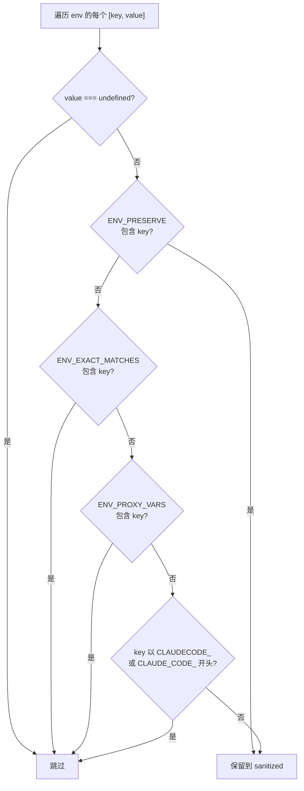

# env-sanitizer.ts 需求说明

> 源文件：src/supervisor/env-sanitizer.ts ｜ 类型：源码 ｜ 行数：52 ｜ 所属模块：supervisor ｜ 分析日期：2026-07-23

## 1. 文件定位总述

本文件提供环境变量清洗功能，用于在生成子进程（特别是 SDK 进程）时过滤掉 Claude Code 内部环境变量和代理配置，防止子进程继承不必要的敏感或干扰性环境变量。它定义了三类过滤规则集——精确匹配、前缀匹配、代理变量，以及一个白名单——需要保留的特定环境变量。sanitizeEnv 函数遍历整个 env 对象，返回清洗后的副本。

## 2. 功能需求

| 编号 | 需求描述（系统应当…） | 触发条件 / 输入 | 处理规则与输出 | 证据 |
|------|----------------------|----------------|---------------|------|
| FR-ENV-01 | 系统应当过滤掉 CLAUDECODE_ 和 CLAUDE_CODE_ 前缀的所有环境变量 | 传入 env 对象 | 匹配 ENV_PREFIXES 中两个前缀的键全部移除 | `src/supervisor/env-sanitizer.ts:1,46` |
| FR-ENV-02 | 系统应当过滤掉精确匹配的内部环境变量列表 | 键名完全匹配 | ENV_EXACT_MATCHES 中的键全部移除（CLAUDECODE, CLAUDE_CODE_SESSION, CLAUDE_CODE_ENTRYPOINT, MCP_SESSION_ID） | `src/supervisor/env-sanitizer.ts:2-7` |
| FR-ENV-03 | 系统应当过滤掉所有代理相关环境变量（HTTP_PROXY 等） | 键名匹配 | ENV_PROXY_VARS 中的 10 个代理配置变量全部移除 | `src/supervisor/env-sanitizer.ts:9-20` |
| FR-ENV-04 | 系统应当保留白名单中指定的环境变量，即使它们匹配上述过滤规则 | ENV_PRESERVE 中的键 | 优先检查 ENV_PRESERVE，匹配则保留并跳过后续过滤；白名单含 OAuth token、Git Bash 路径、Bedrock/Vertex 配置、AWS 凭证等 15 个变量 | `src/supervisor/env-sanitizer.ts:22-36,43-44` |
| FR-ENV-05 | 系统应当返回清洗后的环境变量副本，不修改原始 env 对象 | 调用 sanitizeEnv() | 构造新对象 sanitized，undefined 值的条目直接跳过 | `src/supervisor/env-sanitizer.ts:39-51` |

## 3. 业务规则与约束

| 编号 | 规则描述 | 证据 |
|------|---------|------|
| BR-ENV-01 | 过滤优先级：ENV_PRESERVE 白名单 > ENV_EXACT_MATCHES > ENV_PROXY_VARS > ENV_PREFIXES 前缀匹配 | `src/supervisor/env-sanitizer.ts:42-47` |
| BR-ENV-02 | value 为 undefined 的环境变量条目直接跳过，不进入 sanitized 结果 | `src/supervisor/env-sanitizer.ts:42` |

## 4. 对外暴露

| 导出项 | 类型 | 用途 |
|--------|------|------|
| `ENV_PREFIXES` | const string[] | 需过滤的前缀列表 |
| `ENV_EXACT_MATCHES` | Set\<string\> | 需精确过滤的变量名集合 |
| `ENV_PROXY_VARS` | Set\<string\> | 代理变量名集合 |
| `ENV_PRESERVE` | Set\<string\> | 保留白名单集合 |
| `sanitizeEnv` | function | 环境变量清洗入口 |

## 5. 依赖关系

- **被依赖**：`./process-registry.ts`（spawnSdkProcess 中调用 sanitizeEnv）

## 6. 数据结构

不适用。

## 7. 复杂逻辑图示

环境变量清洗的逐条决策流程如上图，白名单具有最高优先级。

## 8. 逆向备注

- ENV_PRESERVE 中包含了 AWS 凭证和 Bedrock/Vertex 配置，说明子进程可能需要直接调用这些云服务，不应被过滤掉。
- 代理变量的过滤（大小写共 10 个）可防止子进程走不同的代理路径。
