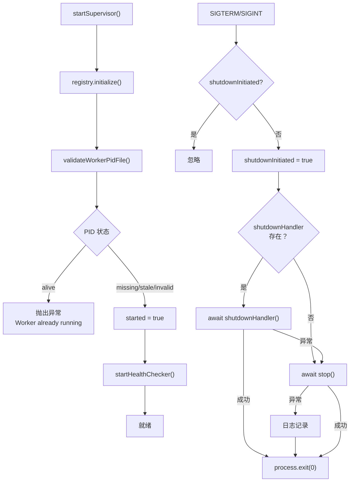

# index.ts 需求说明

> 源文件：src/supervisor/index.ts ｜ 类型：源码 ｜ 行数：199 ｜ 所属模块：supervisor ｜ 分析日期：2026-07-23

## 1. 文件定位总述

本文件是 Supervisor（进程监管器）模块的入口与核心协调者。它封装了 Supervisor 单例的生命周期管理——启动、停止、信号处理——并通过 PID 文件机制防止多实例运行。Supervisor 在启动时初始化 ProcessRegistry、校验 PID 文件、启动健康检查器，在停止时执行级联关停流程。它还对外暴露 validateWorkerPidFile 工具函数供外部（如 CLI）使用。

## 2. 功能需求

| 编号 | 需求描述（系统应当…） | 触发条件 / 输入 | 处理规则与输出 | 证据 |
|------|----------------------|----------------|---------------|------|
| FR-SUP-01 | 系统应当通过 Supervisor 单例管理进程监管生命周期 | 调用 `startSupervisor()` / `getSupervisor()` | 单例模式，内部使用 supervisorSingleton；start 幂等——重复调用不重复初始化 | `src/supervisor/index.ts:141,143-149` |
| FR-SUP-02 | 系统应当在 Supervisor 启动时初始化 ProcessRegistry，并校验 PID 文件确保无已有实例运行 | 调用 `start()` | PID 状态为 'alive' 时抛出 Error('Worker already running') | `src/supervisor/index.ts:35-47` |
| FR-SUP-03 | 系统应当在启动时自动启动健康检查器 | start() 内部逻辑 | 调用 startHealthChecker() | `src/supervisor/index.ts:46` |
| FR-SUP-04 | 系统应当支持注册自定义 shutdown handler 并配置信号处理器 | 调用 `configureSupervisorSignalHandlers(shutdownHandler)` | 注册 SIGTERM、SIGINT 处理器；非 Windows 平台额外处理 SIGHUP（daemon 模式忽略，其他模式触发关停） | `src/supervisor/index.ts:49-102` |
| FR-SUP-05 | 系统应当在收到关停信号时执行幂等关停流程 | SIGTERM/SIGINT/SIGHUP 触发 | shutdownInitiated 标志防重入；先调 shutdownHandler（若存在），失败则 fallback 调 stop()；最终 process.exit(0) | `src/supervisor/index.ts:55-88` |
| FR-SUP-06 | 系统应当在停止 Supervisor 时执行级联关停：停止健康检查器 → 运行 shutdown cascade | 调用 `stop()` | 停止健康检查器，执行 runShutdownCascade；stopPromise 保证并发调用只执行一次 | `src/supervisor/index.ts:104-120` |
| FR-SUP-07 | 系统应当拒绝在关停过程中生成新进程 | 调用 `assertCanSpawn(type)` | stopPromise 非 null 时抛出 Error | `src/supervisor/index.ts:122-126` |
| FR-SUP-08 | 系统应当提供 PID 文件校验函数，返回四种状态：missing/alive/stale/invalid | 调用 `validateWorkerPidFile()` | missing → 文件不存在；invalid → 解析失败自动删除；alive → PID 存活；stale → PID 已死或被复用，自动清理 | `src/supervisor/index.ts:155-198` |
| FR-SUP-09 | 系统应当支持进程注册与注销的代理方法 | 调用 registerProcess/unregisterProcess | 委托给内部 registry 的同名方法 | `src/supervisor/index.ts:128-134` |

## 3. 业务规则与约束

| 编号 | 规则描述 | 证据 |
|------|---------|------|
| BR-SUP-01 | Supervisor 是单例模式，全局唯一实例 | `src/supervisor/index.ts:141` |
| BR-SUP-02 | 关停流程幂等——并发调用 stop() 时，后续调用等待首次完成的 Promise | `src/supervisor/index.ts:105-108` |
| BR-SUP-03 | 信号处理器注册也幂等——重复调用 configureSignalHandlers 不会注册多个 handler | `src/supervisor/index.ts:52` |
| BR-SUP-04 | daemon 模式（--daemon 参数）下 SIGHUP 被忽略 | `src/supervisor/index.ts:94-97` |

## 4. 对外暴露

| 导出项 | 类型 | 用途 |
|--------|------|------|
| `startSupervisor` | async function | 启动 Supervisor 单例 |
| `getSupervisor` | function | 获取 Supervisor 单例实例 |
| `configureSupervisorSignalHandlers` | function | 配置进程信号处理器 |
| `validateWorkerPidFile` | function | 校验 PID 文件状态（可独立于 Supervisor 使用） |
| `ValidateWorkerPidStatus` | type | PID 文件状态类型 |
| `Supervisor` | class | Supervisor 类（虽导出但通常通过函数式 API 使用） |

## 5. 依赖关系

- **内部依赖**：`./process-registry.js`（getProcessRegistry、ManagedProcessInfo、PidInfo、ProcessRegistry）、`./shutdown.js`（runShutdownCascade）、`./health-checker.js`（start/stopHealthChecker）、`../utils/logger.js`、`../shared/paths.js`
- **被依赖**：应用初始化流程（worker 启动时调用 startSupervisor）

## 6. 数据结构

**ValidateWorkerPidStatus**: `'missing' | 'alive' | 'stale' | 'invalid'` — PID 文件校验结果

## 7. 复杂逻辑图示

Supervisor 启动与信号处理流程如上图所示，PID 校验失败直接阻止启动，信号处理具备幂等与容错能力。

## 8. 逆向备注

- Supervisor 类虽为 class，但对外以函数式 API（startSupervisor/getSupervisor）暴露单例，推断是为了保持 API 简洁同时内部有状态管理。
- validateWorkerPidFile 可独立于 Supervisor 使用，推断供 CLI 命令（如 status 检查）直接调用。
- 关停信号处理中使用 fire-and-forget 模式（`void handleSignal('SIGTERM')`），确保不阻塞信号处理线程。
