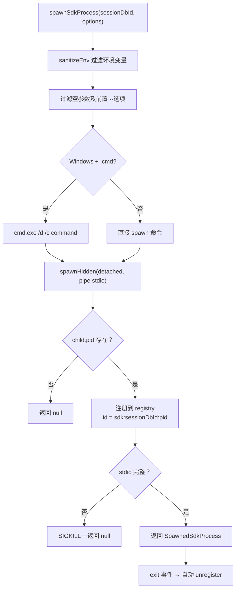
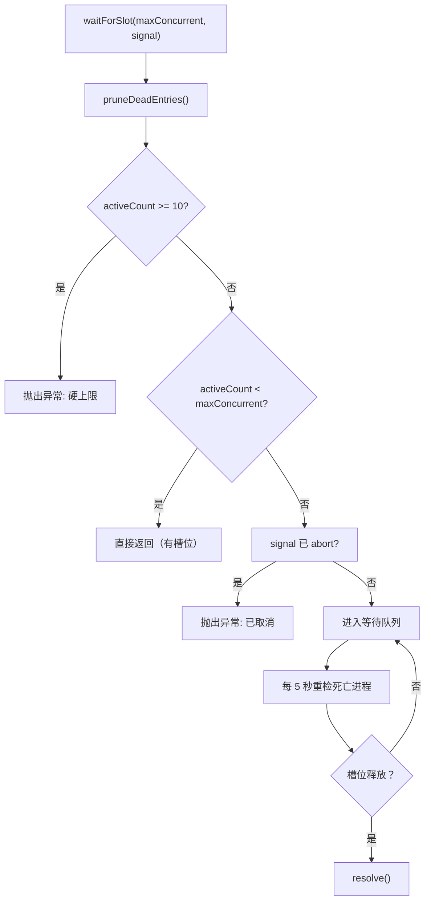

# process-registry.ts 需求说明

> 源文件：src/supervisor/process-registry.ts ｜ 类型：源码 ｜ 行数：680 ｜ 所属模块：supervisor ｜ 分析日期：2026-07-23

## 1. 文件定位总述

本文件是 Supervisor 的进程注册与生命周期管理核心。它提供 ProcessRegistry 类（持久化到磁盘 JSON 文件的进程注册表）、PID 存活检测、PID 文件所有权验证（含 Linux start token 防复用机制）、SDK 进程的 spawn/reap/waitForSlot 全套管理、以及并发槽位等待机制。文件同时包含若干工具函数（isPidAlive、captureProcessStartToken、verifyPidFileOwnership）和工厂函数（createSdkSpawnFactory），是 Supervisor 模块中体量最大、职责最集中的文件。

## 2. 功能需求

| 编号 | 需求描述（系统应当…） | 触发条件 / 输入 | 处理规则与输出 | 证据 |
|------|----------------------|----------------|---------------|------|
| FR-PR-01 | 系统应当通过 isPidAlive 检测 PID 是否存活，处理 EPERM（有权限但可确认存活）和非法 PID 情况 | 调用 isPidAlive(pid) | pid < 0 或 pid === 0 返回 false；kill(pid, 0) 成功返回 true；EPERM 返回 true；其他异常返回 false | `src/supervisor/process-registry.ts:30-47` |
| FR-PR-02 | 系统应当在 Linux 上通过 /proc/<pid>/stat 读取 starttime 作为进程启动 token，防止 PID 复用误判 | Linux 平台 + 调用 captureProcessStartToken(pid) | 读取 /proc/pid/stat，提取第 19 个字段（从 ) 后开始计数）；Windows 返回 null；macOS/BSD 用 ps -p pid -o lstart= | `src/supervisor/process-registry.ts:56-96` |
| FR-PR-03 | 系统应当通过 verifyPidFileOwnership 验证 PID 文件中的进程是否仍为原始进程（非 PID 复用） | 调用 verifyPidFileOwnership(info) | 无 startToken 则跳过验证；有 startToken 则比较当前 token，不匹配返回 false | `src/supervisor/process-registry.ts:98-116` |
| FR-PR-04 | 系统应当通过 ProcessRegistry 管理进程注册表，支持初始化（从磁盘加载）、注册、注销、查询、持久化 | 调用 ProcessRegistry 方法 | initialize() 从 JSON 文件加载；register/unregister 修改内存 Map 后持久化；getAll 按 startedAt 排序 | `src/supervisor/process-registry.ts:118-199` |
| FR-PR-05 | 系统应当在注册表初始化时自动清理已死亡的进程条目，并记录清理数量 | initialize() | 调用 pruneDeadEntries()，removed > 0 时记录日志 | `src/supervisor/process-registry.ts:159-163` |
| FR-PR-06 | 系统应当在注销 SDK 类型进程时通知槽位等待者（释放并发槽位） | unregister() 中 type === 'sdk' | 调用 notifySlotAvailable() | `src/supervisor/process-registry.ts:181` |
| FR-PR-07 | 系统应当提供按 sessionId 和按 pid 查询进程记录的方法 | 调用 getBySession(sessionId) / getByPid(pid) | getBySession 归一化为字符串比较；getByPid 精确匹配 | `src/supervisor/process-registry.ts:201-212` |
| FR-PR-08 | 系统应当提供 reapSession 方法，按 sessionId 批量终止进程（先 SIGTERM 5秒，后 SIGKILL 1秒） | 调用 reapSession(sessionId) | 复用 shutdown.ts 的两阶段信号策略，最终清理注册记录 | `src/supervisor/process-registry.ts:235-339` |
| FR-PR-09 | 系统应当提供 waitForSlot 方法实现 SDK 进程并发控制，支持 AbortSignal 取消 | 调用 waitForSlot(maxConcurrent, signal) | 先检查硬上限 10；超过 maxConcurrent 时进入等待队列；定时 5 秒重检死亡进程 | `src/supervisor/process-registry.ts:451-510` |
| FR-PR-10 | 系统应当提供 spawnSdkProcess 方法启动 SDK 子进程，自动注册到 ProcessRegistry | 调用 spawnSdkProcess(sessionDbId, options) | 清洗环境变量；过滤空参数；Windows .cmd 命令使用 cmd.exe 包装；detached 启动；注册到 registry（recordId = sdk:<sessionDbId>:<pid>）；退出时自动注销 | `src/supervisor/process-registry.ts:532-635` |
| FR-PR-11 | 系统应当在 spawnSdkProcess 中自动过滤空字符串参数（同时移除其前一个 -- 选项） | 参数中包含空字符串 | 遍历 args，空字符串 '' 被跳过，若前一个参数以 '--' 开头也一并移除 | `src/supervisor/process-registry.ts:541-550` |
| FR-PR-12 | 系统应当通过 createSdkSpawnFactory 创建工厂函数，在 spawn 新 SDK 进程前先杀掉同 session 的旧进程 | 调用 createSdkSpawnFactory(sessionDbId) | 查询同 session 的 SDK 进程，对存活进程发送 SIGTERM，然后调用 spawnSdkProcess | `src/supervisor/process-registry.ts:637-679` |
| FR-PR-13 | 系统应当提供 getSdkProcessForSession 查找指定 session 的活跃 SDK 进程及其 ChildProcess 引用 | 调用 getSdkProcessForSession(sessionDbId) | 在注册表中查找 type='sdk' + sessionId 匹配的记录，返回带 ChildProcess 的 TrackedSdkProcess | `src/supervisor/process-registry.ts:371-394` |
| FR-PR-14 | 系统应当提供 ensureSdkProcessExit 确保进程退出，超时后升级为 SIGKILL | 调用 ensureSdkProcessExit(tracked, timeoutMs) | 先等待 exit 事件（默认 5 秒），超时发送 SIGKILL，再等 1 秒 | `src/supervisor/process-registry.ts:396-436` |

## 3. 业务规则与约束

| 编号 | 规则描述 | 证据 |
|------|---------|------|
| BR-PR-01 | SDK 进程全局硬上限为 TOTAL_PROCESS_HARD_CAP = 10，超过则拒绝生成新进程 | `src/supervisor/process-registry.ts:438` |
| BR-PR-02 | SDK 进程并发由 waitForSlot 的 maxConcurrent 参数控制，默认值由调用方传入 | `src/supervisor/process-registry.ts:451` |
| BR-PR-03 | 槽位等待定时器间隔 5 秒，期间会自动清理死亡进程条目 | `src/supervisor/process-registry.ts:439,501-507` |
| BR-PR-04 | 进程组 ID (pgid) 在非 Windows 平台上等于进程 PID（detached 模式下的默认行为） | `src/supervisor/process-registry.ts:586` |
| BR-PR-05 | SIGTERM 超时 5 秒，SIGKILL 超时 1 秒（reapSession 与 shutdown cascade 一致） | `src/supervisor/process-registry.ts:9-10` |
| BR-PR-06 | 注册表持久化路径默认为 paths.supervisorRegistry()，可通过构造函数参数覆盖 | `src/supervisor/process-registry.ts:12,124` |

## 4. 对外暴露

| 导出项 | 类型 | 用途 |
|--------|------|------|
| `ProcessRegistry` | class | 进程注册表核心类 |
| `isPidAlive` | function | PID 存活检测 |
| `captureProcessStartToken` | function | 获取进程启动 token（Linux / macOS） |
| `verifyPidFileOwnership` | function | 验证 PID 文件所有权 |
| `getProcessRegistry` | function | 获取全局单例 |
| `createProcessRegistry` | function | 创建自定义路径的注册表实例 |
| `waitForSlot` | async function | 等待 SDK 并发槽位 |
| `spawnSdkProcess` | function | 启动 SDK 子进程 |
| `createSdkSpawnFactory` | function | 创建 SDK 进程 spawn 工厂 |
| `getSdkProcessForSession` | function | 查找 session 对应的 SDK 进程 |
| `ensureSdkProcessExit` | async function | 确保 SDK 进程退出 |
| `ManagedProcessInfo` | interface | 进程信息模型 |
| `ManagedProcessRecord` | interface | 含 id 的进程记录 |
| `PidInfo` | interface | PID 文件信息模型 |
| `TrackedSdkProcess` | interface | 带 ChildProcess 的进程跟踪对象 |
| `SpawnedSdkProcess` | interface | 已 spawn 进程的 stdio 接口 |
| `SpawnSdkOptions` | interface | spawn 选项 |

## 5. 依赖关系

- **内部依赖**：`../shared/spawn.js`（spawnHidden）、`../utils/logger.js`、`./env-sanitizer.js`（sanitizeEnv）、`../shared/paths.js`
- **Node.js 内置**：child_process（spawnSync）、fs、path
- **被依赖**：`./index.ts`、`./shutdown.ts`、`./health-checker.ts` 以及上层 SDK 管理逻辑

## 6. 数据结构

**ManagedProcessInfo**: pid(number), type(string), sessionId(string|number|undefined), startedAt(string), pgid(number|undefined)

**PidInfo**: pid(number), port(number), startedAt(string), startToken(string|undefined)

**PersistedRegistry**（磁盘格式）: processes: Record\<string, ManagedProcessInfo\>

## 7. 复杂逻辑图示

SDK 进程的 spawn 流程包含环境清洗、参数过滤、平台适配、注册和生命周期绑定等多个步骤。

并发槽位等待机制通过队列 + 定时重检实现，支持 AbortSignal 取消。

## 8. 逆向备注

- pgid 被赋值为 pid（`src/supervisor/process-registry.ts:586`），注释说明在 detached 模式下新进程组 ID 等于进程 PID，但变量名 pgid 暗示可能有被覆盖的场景（未在代码中证实）。
- spawnSdkProcess 中过滤空参数的逻辑会移除空字符串及其前一个 -- 选项，推断是为了处理某些 CLI 框架将空值序列化为空字符串参数的问题。
- ProcessRegistry 的 initialize() 方法在 register/unregister 中也会被调用（确保延迟初始化），属于惰性初始化模式。
- slotWaiters 是模块级数组，notifySlotAvailable 逐个 shift 唤醒，实现了简单的 FIFO 等待队列。
