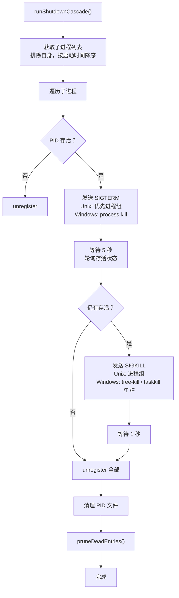

# shutdown.ts 需求说明

> 源文件：src/supervisor/shutdown.ts ｜ 类型：源码 ｜ 行数：205 ｜ 所属模块：supervisor ｜ 分析日期：2026-07-23

## 1. 文件定位总述

本文件实现 Supervisor 的级联关停（Shutdown Cascade）逻辑。当 Supervisor 停止时，本模块负责按"最新启动的进程先停止"的顺序，依次向所有已注册的子进程发送 SIGTERM，等待 5 秒优雅退出；超时后升级为 SIGKILL，再等待 1 秒。它同时支持 Unix（进程组优先）和 Windows（taskkill / tree-kill）两种平台的信号机制，最终清理 PID 文件和注册表。

## 2. 功能需求

| 编号 | 需求描述（系统应当…） | 触发条件 / 输入 | 处理规则与输出 | 证据 |
|------|----------------------|----------------|---------------|------|
| FR-SHUT-01 | 系统应当在级联关停时先过滤掉当前进程自身，仅处理子进程记录 | runShutdownCascade() | childRecords = allRecords.filter(pid !== currentPid)，按 startedAt 降序排列（最新先停） | `src/supervisor/shutdown.ts:24-27` |
| FR-SHUT-02 | 系统应当对每个存活子进程先发送 SIGTERM 信号 | 子进程 PID 存活 | Unix 优先尝试进程组信号（kill -pgid），失败（ESRCH）回退到单 PID 信号 | `src/supervisor/shutdown.ts:34-52,115-146` |
| FR-SHUT-03 | 系统应当在发送 SIGTERM 后等待 5 秒让进程优雅退出 | SIGTERM 发送完毕 | waitForExit 轮询（100ms 间隔），超时后继续下一步 | `src/supervisor/shutdown.ts:54` |
| FR-SHUT-04 | 系统应当对 SIGTERM 后仍存活的进程发送 SIGKILL 强制终止 | 5 秒等待后仍有存活进程 | Unix 继续尝试进程组 SIGKILL；Windows 优先尝试 tree-kill 模块，回退到 taskkill 命令 | `src/supervisor/shutdown.ts:56-76,115-192` |
| FR-SHUT-05 | 系统应当在 SIGKILL 后等待 1 秒，然后清理所有进程注册记录 | SIGKILL 发送完毕 | waitForExit(survivors, 1000)，然后 unregister 所有子进程和当前进程 | `src/supervisor/shutdown.ts:78-85` |
| FR-SHUT-06 | 系统应当在关停完成后删除 PID 文件并清理注册表中死亡条目 | 所有进程清理完毕 | rmSync(pidFilePath, { force: true })；registry.pruneDeadEntries() | `src/supervisor/shutdown.ts:87-100` |
| FR-SHUT-07 | 系统应当在 Windows 平台上 SIGKILL 时使用 tree-kill 模块（如可用），回退到 taskkill 命令 | Windows + SIGKILL | 先尝试 import('tree-kill')，失败则 execFile('taskkill', ['/PID', pid, '/T', '/F']) | `src/supervisor/shutdown.ts:163-192` |

## 3. 业务规则与约束

| 编号 | 规则描述 | 证据 |
|------|---------|------|
| BR-SHUT-01 | 子进程按 startedAt 降序处理（最新启动的最先停止） | `src/supervisor/shutdown.ts:26` |
| BR-SHUT-02 | SIGTERM 优雅退出等待 5 秒，SIGKILL 强制等待 1 秒 | `src/supervisor/shutdown.ts:54,78` |
| BR-SHUT-03 | Unix 平台优先使用进程组信号（kill -pgid），可以到达被 init 收养的孙进程 | `src/supervisor/shutdown.ts:124-135` |
| BR-SHUT-04 | Windows 上 SIGKILL 的 taskkill 使用 /T（树终止）和 /F（强制）标志 | `src/supervisor/shutdown.ts:184-186` |

## 4. 对外暴露

| 导出项 | 类型 | 用途 |
|--------|------|------|
| `runShutdownCascade` | async function | 级联关停入口 |
| `ShutdownCascadeOptions` | interface | 关停配置（registry、currentPid、pidFilePath） |

## 5. 依赖关系

- **内部依赖**：`./process-registry.js`（isPidAlive、ManagedProcessRecord、ProcessRegistry）、`../utils/logger.js`、`../shared/hook-constants.js`（HOOK_TIMEOUTS）、`../shared/paths.js`
- **外部依赖**：`tree-kill`（可选动态导入，Windows 平台 SIGKILL 使用）
- **被依赖**：`./index.ts`（Supervisor.stop() 调用 runShutdownCascade）

## 6. 数据结构

**ShutdownCascadeOptions**: registry(ProcessRegistry), currentPid(number, 可选, 默认 process.pid), pidFilePath(string, 可选)

## 7. 复杂逻辑图示

级联关停的两阶段信号发送策略如上图：SIGTERM 优雅关闭 → 超时后 SIGKILL 强制终止。

## 8. 逆向备注

- ESRCH 错误码被静默忽略，因为进程可能在信号发送的瞬间已经退出，属于竞态条件下的正常行为。
- Windows 平台的 SIGKILL 采用三级 fallback：tree-kill 模块 → taskkill 命令，确保在不同 Windows 环境下都能有效终止进程树。
- waitForExit 使用 100ms 轮询间隔而非事件监听，推断是因为注册表中的进程不一定是当前 spawn 的子进程（可能是之前会话残留），无法直接监听 exit 事件。
