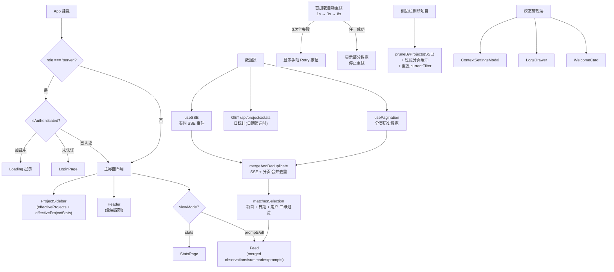

# App.tsx 需求说明

> 源文件：src/ui/viewer/App.tsx ｜ 类型：源码 ｜ 行数：462 ｜ 所属模块：Viewer UI ｜ 分析日期：2026-07-23

## 1. 文件定位总述

App 是 claude-mem Viewer 的根组件，承担全局状态编排与布局组合的核心职责。它通过 12 个自定义 hook 汇聚数据层状态（SSE 实时流、分页、设置、主题、语言、角色、认证、用户、同步状态），在 App 层完成数据合并（SSE 实时数据 + 分页历史数据去重）、筛选（项目/日期/用户三维过滤）和错误重试逻辑后，将处理后的数据分发到三个主要视图区域（侧边栏、头部、信息流/统计页）。App 同时管理模态对话框（设置、日志、欢迎卡片）的开关状态，并在服务端模式下强制进行认证门控。

## 2. 功能需求

| 编号 | 需求描述（系统应当…） | 触发条件 / 输入 | 处理规则与输出 | 证据 |
|------|----------------------|----------------|---------------|------|
| FR-ViewMode-01 | 系统应当支持三种视图模式（prompts/all/stats），并将选择持久化到 localStorage | 用户切换视图模式 | 将模式存入 `claude-mem.viewMode` localStorage 键，支持 prompts/all/stats 三种值；页面刷新后恢复 | `App.tsx:25-35,65-72` |
| FR-DataMerge-01 | 系统应当将 SSE 实时数据与分页历史数据合并去重 | 数据更新时 | `mergeAndDeduplicateByProject` 函数合并 SSE 数组和分页数组，基于 content_hash 或 project 去重 | `App.tsx:194-212` |
| FR-FilterProject-01 | 系统应当支持按项目筛选所有视图数据 | 用户在侧边栏/头部选择项目 | `matchesSelection` 函数检查 `item.project !== currentFilter` | `App.tsx:130-143` |
| FR-FilterDate-01 | 系统应当支持按日期筛选数据（本地时区 YYYY-MM-DD） | 用户选择日期筛选器 | 将 YYYY-MM-DD 转为本地时区的半开区间 `[start, end)` ms epoch，检查 `created_at_epoch` 是否在区间内 | `App.tsx:109-117` |
| FR-FilterUser-01 | 系统应当支持按用户标签筛选 SSE 数据 | 用户选择用户（服务端模式） | 大小写不敏感匹配 `item.user_label` 与 `userLabelFilter`；分页 API 数据不含 user_label 故不参与此过滤 | `App.tsx:138-139` |
| FR-DayStats-01 | 系统应当在日期筛选激活时拉取该天的项目统计数据 | `dateFilter` 变化 | GET `/api/projects/stats?dateStart=X&dateEnd=Y`，响应体 `projects` 作为当天统计，覆盖侧边栏显示 | `App.tsx:148-173` |
| FR-DayProjects-01 | 系统应当在日期筛选激活时仅显示有活动的项目 | 日期统计拉取完成 | 过滤 `projects` 列表，仅保留当天 `total > 0` 的项目 | `App.tsx:180-183` |
| FR-FilterReset-01 | 系统应当当当前选中的项目不再可用（被删除或无数据）时自动重置为"全部项目" | `effectiveProjects` 变化且不含当前 `currentFilter` | `setCurrentFilter('')` 重置 | `App.tsx:185-192` |
| FR-Pagination-01 | 系统应当在筛选条件变化时重置分页并重新加载首页数据 | `currentFilter`、`dayBounds`、`userLabelFilter` 变化 | 清空三个分页数组，重置首加载重试状态，调用 `handleLoadMore()` | `App.tsx:260-271` |
| FR-LoadMore-01 | 系统应当并发加载三种数据类型（observations/summaries/prompts） | 用户触发加载更多 | `Promise.allSettled` 并行请求三种数据，各自独立处理成功/失败 | `App.tsx:222-258` |
| FR-Retry-01 | 系统应当在首屏加载全部失败时自动按 1s/3s/8s 间隔重试 | 所有数据为空且有错误且未成功加载过 | 3 次重试后停止，显示手动重试按钮 | `App.tsx:43,286-313` |
| FR-ManualRetry-01 | 系统应当提供手动重试入口，重置自动重试计数器 | 用户点击 Feed 的重试按钮 | `handleRetry` 重置 `firstLoadRetryCountRef` 为 0 并重新加载 | `App.tsx:276-280` |
| FR-DeleteProject-01 | 系统应当在项目被删除时从 SSE 状态和本地分页缓冲中同步清除数据 | 侧边栏删除项目 | `handleProjectsDeleted` 同时调用 `pruneByProjects`（SSE 数据）和过滤三个分页数组 | `App.tsx:324-334` |
| FR-DeletePrompt-01 | 系统应当在单条提示词被删除时从本地分页缓冲中清除 | 用户点击提示词卡片的删除按钮 | `handlePromptDeleted` 从 `paginatedPrompts` 中过滤掉该 id | `App.tsx:342-344` |
| FR-PickerUsers-01 | 系统应当汇总 SSE 数据和服务端用户列表构建用户选择器列表 | 数据更新时 | 从 serverUsers、observations、summaries、prompts、role.userLabel 中提取不重复的 user_label，大写归一化后排序 | `App.tsx:84-103` |
| FR-AuthGate-01 | 系统应当在服务端模式下强制认证：加载中显示 Loading，未认证显示 LoginPage | `role.role === 'server'` 且未认证 | 通过 `auth.isLoading` 和 `auth.isAuthenticated` 判断；认证后显示主界面 | `App.tsx:352-366` |
| FR-Layout-01 | 系统应当渲染三区域布局：项目侧边栏 + 头部/信息流（主区域） | 认证通过后 | `ProjectSidebar` + `Header` + `Feed`（或 `StatsPage` 当 viewMode=stats） | `App.tsx:371-428` |
| FR-Modals-01 | 系统应当管理设置弹窗、日志抽屉、欢迎卡片三个浮层 | 用户操作触发 | `ContextSettingsModal`、`LogsDrawer`、`WelcomeCard` 各自独立的开关状态 | `App.tsx:430-458` |
| FR-Logout-01 | 系统应当仅在服务端模式下向 Header 传递登出回调 | `isServer` 为 true | `onLogout` 传入 `auth.logout`，非服务端传入 undefined | `App.tsx:409` |
| FR-StatsRefresh-01 | 系统应当在 observations 数量变化时刷新统计数据 | observations.length 变化 | 调用 `refreshStats()` | `App.tsx:346-349` |

## 3. 业务规则与约束

| 编号 | 规则描述 | 证据 |
|------|---------|------|
| BR-01 | 视图模式默认值为 `'prompts'`（`readInitialViewMode`），仅支持 prompts/all/stats 三种 | `App.tsx:27-35` |
| BR-02 | 首加载重试延迟序列为 `[1000, 3000, 8000]` ms，共 3 次 | `App.tsx:43` |
| BR-03 | 一旦任一数据类型成功加载（`everLoadedRef.current = true`），自动重试立即停止，不覆盖已显示的部分数据 | `App.tsx:291-294` |
| BR-04 | 日期过滤使用本地时区（`new Date(y, m-1, d).getTime()`），确保用户在不同时区看到一致的日期边界 | `App.tsx:114-116` |
| BR-05 | 用户标签过滤对分页 API 数据不生效（`App.tsx:135-136` 注释），因为分页 API 响应不含 `user_label` 字段——推断：服务端过滤由 API 参数 `userLabel` 处理 |
| BR-06 | 用户选择器列表中的 user_label 以大写归一化（`toUpperCase()`），确保大小写变体合并为同一条目 | `App.tsx:90` |
| BR-07 | 日期统计请求支持 AbortController 取消（`App.tsx:153`），筛选条件快速变化时不会产生竞态请求 |
| BR-08 | 三种数据类型的加载互不阻塞（`Promise.allSettled`），某一类型失败不影响其他类型的成功结果 | `App.tsx:229` |
| BR-09 | 日期筛选激活时，侧边栏项目统计使用日统计而非全量统计，避免展示误导性的全量数字 | `App.tsx:179` |
| BR-10 | `settings` 保存由 `useSettings` hook 管理，`isSaving` 和 `saveStatus` 控制保存按钮状态和反馈文本 | `App.tsx:75` |

## 4. 对外暴露

| 类型 | 名称 | 说明 |
|------|------|------|
| 导出组件 | `App` | Viewer 根组件，无 props（所有状态自管理） |
| 内部状态（隐式暴露给子组件） | 多个 useState | currentFilter, dateFilter, userLabelFilter, viewMode, 各种 modal 开关状态 |
| 内部方法 | `handleLoadMore`, `handleRetry`, `handleProjectsDeleted`, `handlePromptDeleted` | 分页加载、重试、删除操作的回调 |

## 5. 依赖关系

| 方向 | 依赖项 | 用途 |
|------|--------|------|
| 下游（子组件） | ProjectSidebar | 项目侧边栏 |
| 下游（子组件） | Header | 顶部导航栏 |
| 下游（子组件） | Feed | 信息流主体 |
| 下游（子组件） | ContextSettingsModal | 设置模态框 |
| 下游（子组件） | LogsDrawer | 日志抽屉 |
| 下游（子组件） | WelcomeCard | 欢迎卡片 |
| 下游（子组件） | StatsPage | 统计分析页 |
| 下游（子组件） | LoginPage | 登录页（服务端模式） |
| 下游（hook） | useSSE | 实时数据流 |
| 下游（hook） | useSettings | 设置管理 |
| 下游（hook） | useStats | 统计数据 |
| 下游（hook） | usePagination | 分页加载 |
| 下游（hook） | useTheme | 主题管理 |
| 下游（hook） | useLocale | 国际化 |
| 下游（hook） | useRole | 部署角色检测 |
| 下游（hook） | useUsers | 服务端用户列表 |
| 下游（hook） | useSyncStatus | 同步状态 |
| 下游（hook） | useAuth | 认证管理 |
| 下游（工具） | authFetch | 认证 HTTP 请求 |
| 下游（工具） | mergeAndDeduplicateByProject | SSE+分页数据合并去重 |

## 6. 数据结构

不适用（App 是编排组件，核心数据结构定义在各 hook 和 types.ts 中）。关键状态维度如下：

| 状态 | 类型 | 说明 |
|------|------|------|
| `currentFilter` | string | 当前选中的项目 ID，空字符串表示"全部项目" |
| `dateFilter` | string \| null | 本地时区 YYYY-MM-DD 日期筛选，null 表示无日期限制 |
| `userLabelFilter` | string \| null | 用户标签筛选，null 表示全部用户 |
| `viewMode` | ViewMode | 'prompts' / 'all' / 'stats' |
| `paginatedObservations/Summaries/Prompts` | 数组 | 分页加载的历史数据缓冲 |
| `dayStats` | Record<string, ProjectStat> \| null | 日筛选统计，null 时回退到全量统计 |
| `effectiveProjectStats` | Record<string, ProjectStat> | 实际使用的统计（日统计 or 全量） |
| `effectiveProjects` | string[] | 实际显示的项目列表（日筛选时过滤无数据项目） |

## 7. 复杂逻辑图示

App 的核心数据流是：SSE 实时数据与分页历史数据并行进入，经合并去重和三维筛选后统一渲染到 Feed。认证门控、首加载重试、项目删除同步、模态管理是四个独立的控制流。

## 8. 逆向备注

| 编号 | 备注 |
|------|------|
| RN-01 | `handleLoadMore` 在 `useEffect` 的依赖列表中被省略（`App.tsx:270` 的 eslint-disable），这意味着 `handleLoadMore` 引用的 `pagination` 变化不会触发重新加载——推断：这是为了避免分页 hook 内部状态变化导致的无限重渲染循环，依赖链通过 `[currentFilter, dayBounds?.start, dayBounds?.end, userLabelFilter]` 间接触发 |
| RN-02 | `matchesSelection` 对分页 API 数据的 `user_label` 过滤被显式跳过（`App.tsx:135-136` 注释说明分页 API 响应不含 user_label），但推断服务端通过 `userLabel` 查询参数处理了过滤——客户端过滤仅针对 SSE 广播的含 user_label 的数据 |
| RN-03 | `firstLoadRetrying` 被聚合到 Feed 的 `isLoading`（`App.tsx:422`），确保自动重试期间 spinner 持续显示而非闪烁——这是一个精心设计的 UX 细节 |
| RN-04 | `pickerUsers` 的构建（`App.tsx:84-103`）将所有 SSE 数据中的 user_label 与 serverUsers 列表合并，每次 SSE 数据变化都会重新计算——推断：在用户量很大时可能有性能影响，但实际场景中用户数通常较少 |
| RN-05 | `setViewMode` 将 `'stats'` 视图模式也存入 localStorage（`App.tsx:67-68`），但 `readInitialViewMode` 也检查了 `'stats'`（`App.tsx:30`）——两个函数对 stats 模式的处理一致 |
