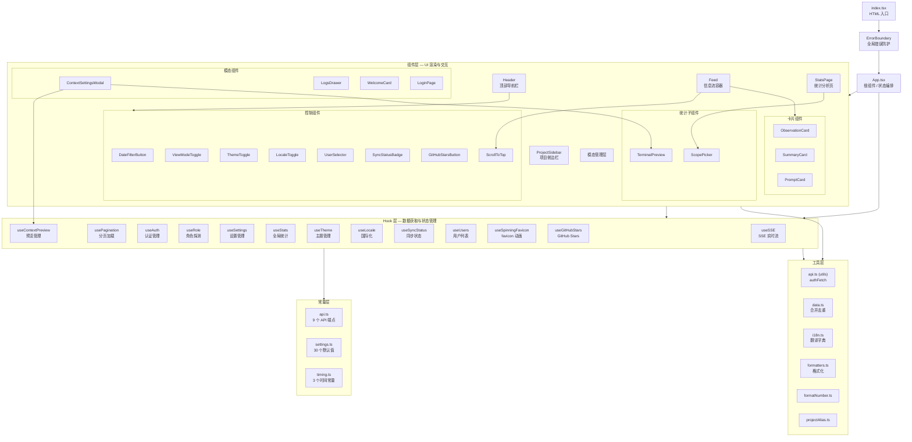

# Viewer UI 模块汇总

> 范围：`src/ui/viewer/` 下 44 个源文件 ｜ 生成日期：2026-07-23

## 1. 模块职责总述

Viewer UI 是 claude-mem 的浏览器端管理界面，以 React SPA 形式构建，部署为 Worker HTTP 服务内嵌的 `viewer.html` 单页应用。该模块承担三大核心职责：通过 SSE 实时流展示 AI 编码活动的观察记录、会话总结和用户提示词；提供运行配置（模型/Provider/上下文参数）的可视化编辑与实时预览；支撑统计分析（多粒度图表）、日报/周报管理及项目批量运维。模块内部按 Hook 层（数据获取与状态管理）、组件层（UI 渲染与交互）、常量层（API 端点/默认值/时序参数）、工具层（认证/格式化/国际化/去重）四层组织，通过 `App` 根组件完成全局状态编排与数据分发。

## 2. 功能需求汇总

> 编号前缀来源：`App` = App.tsx, `Feed` = Feed.tsx, `Header` = Header.tsx, `Modal` = ContextSettingsModal.tsx, `DFB` = DateFilterButton.tsx, `Logs` = LogsModal.tsx, `PS` = ProjectSidebar.tsx, `SP` = ScopePicker.tsx, `Stats` = StatsPage.tsx, `SSE` = useSSE.ts, `Auth` = useAuth.ts, `Role` = useRole.ts, `Settings` = useSettings.ts, `Pag` = usePagination.ts, `CP` = useContextPreview.ts, `Filter` = 筛选相关, `Retry` = 重试相关, `Entry` = index.tsx, `EB` = ErrorBoundary.tsx, `OC` = ObservationCard.tsx, `SC` = SummaryCard.tsx, `PC` = PromptCard.tsx, `SSB` = SyncStatusBadge.tsx, `LP` = LoginPage.tsx, `WC` = WelcomeCard.tsx, `TP` = TerminalPreview.tsx, `GHS` = GitHubStarsButton.tsx, `Merge` = data.ts, `AF` = api.ts, `Translate` = i18n.ts, `Locale` = useLocale.ts, `Theme` = useTheme.ts, `Favicon` = useSpinningFavicon.ts, `Sync` = useSyncStatus.ts, `Users` = useUsers.ts, `Stars` = useGitHubStars.ts, `Stats-H` = useStats.ts, `FN` = formatNumber.ts, `FMT` = formatters.ts, `PA` = projectAlias.ts, `STT` = ScrollToTop.tsx, `VT` = ViewModeToggle.tsx, `LT` = LocaleToggle.tsx, `US` = UserSelector.tsx, `TT` = ThemeToggle.tsx, `TIM` = timing.ts, `SET` = settings.ts, `API-C` = api.ts(constants)

### 2.1 应用入口与错误防护

| 编号 | 需求描述 | 来源文档 |
|------|---------|---------|
| FR-Entry-01 | DOM 中查找 id="root" 元素，不存在则阻止启动 | [index.tsx](index.tsx.md) |
| FR-Entry-02 | 使用 React 18 createRoot API 渲染应用 | [index.tsx](index.tsx.md) |
| FR-Entry-03 | ErrorBoundary 包裹 App 组件，捕获渲染异常 | [index.tsx](index.tsx.md) |
| FR-EB-01 | 子组件渲染错误时切换到错误状态 | [ErrorBoundary.tsx](components/ErrorBoundary.tsx.md) |
| FR-EB-02 | 记录错误信息和组件调用栈到 console | [ErrorBoundary.tsx](components/ErrorBoundary.tsx.md) |
| FR-EB-03 | 错误状态下渲染可折叠的错误恢复面板 | [ErrorBoundary.tsx](components/ErrorBoundary.tsx.md) |

### 2.2 全局状态编排（App）

| 编号 | 需求描述 | 来源文档 |
|------|---------|---------|
| FR-App-01 | 支持三种视图模式（prompts/all/stats），持久化到 localStorage | [App.tsx](App.tsx.md) |
| FR-DataMerge-01 | SSE 实时数据与分页历史数据合并去重 | [App.tsx](App.tsx.md) |
| FR-FilterProject-01 | 按项目筛选所有视图数据 | [App.tsx](App.tsx.md) |
| FR-FilterDate-01 | 按日期筛选（本地时区 YYYY-MM-DD 半开区间） | [App.tsx](App.tsx.md) |
| FR-FilterUser-01 | 按用户标签筛选 SSE 数据（分页 API 不参与） | [App.tsx](App.tsx.md) |
| FR-DayStats-01 | 日期筛选激活时拉取当天项目统计 | [App.tsx](App.tsx.md) |
| FR-DayProjects-01 | 日期筛选激活时仅显示有活动的项目 | [App.tsx](App.tsx.md) |
| FR-FilterReset-01 | 选中项目不可用时自动重置为"全部项目" | [App.tsx](App.tsx.md) |
| FR-Pagination-01 | 筛选条件变化时重置分页并重新加载 | [App.tsx](App.tsx.md) |
| FR-LoadMore-01 | 并发加载 observations/summaries/prompts 三种数据 | [App.tsx](App.tsx.md) |
| FR-Retry-01 | 首屏加载全失败时自动按 1s/3s/8s 重试 | [App.tsx](App.tsx.md) |
| FR-ManualRetry-01 | 提供手动重试入口，重置自动重试计数器 | [App.tsx](App.tsx.md) |
| FR-DeleteProject-01 | 项目删除时同步清除 SSE 和分页缓冲 | [App.tsx](App.tsx.md) |
| FR-DeletePrompt-01 | 提示词删除时从分页缓冲清除 | [App.tsx](App.tsx.md) |
| FR-PickerUsers-01 | 汇总多来源数据构建用户选择器列表 | [App.tsx](App.tsx.md) |
| FR-AuthGate-01 | 服务端模式下强制认证门控 | [App.tsx](App.tsx.md) |
| FR-Layout-01 | 三区域布局（侧边栏 + 头部 + 信息流/统计页） | [App.tsx](App.tsx.md) |
| FR-Modals-01 | 管理设置弹窗、日志抽屉、欢迎卡片 | [App.tsx](App.tsx.md) |
| FR-StatsRefresh-01 | observations 数量变化时刷新统计数据 | [App.tsx](App.tsx.md) |

### 2.3 实时数据层（useSSE）

| 编号 | 需求描述 | 来源文档 |
|------|---------|---------|
| FR-Connect-01 | 挂载时自动建立 SSE 连接 | [useSSE.ts](hooks/useSSE.ts.md) |
| FR-Connect-02 | SSE 连接携带 localStorage token 查询参数 | [useSSE.ts](hooks/useSSE.ts.md) |
| FR-Reconnect-01 | SSE 断开后延迟 3s 自动重连 | [useSSE.ts](hooks/useSSE.ts.md) |
| FR-Reconnect-02 | 重连成功后拉取权威项目统计 | [useSSE.ts](hooks/useSSE.ts.md) |
| FR-InitLoad-01 | 处理 initial_load 事件，设置初始项目列表 | [useSSE.ts](hooks/useSSE.ts.md) |
| FR-NewObs-01 | 处理 new_observation 事件，追加到数据流头部 | [useSSE.ts](hooks/useSSE.ts.md) |
| FR-NewSum-01 | 处理 new_summary 事件 | [useSSE.ts](hooks/useSSE.ts.md) |
| FR-NewPrompt-01 | 处理 new_prompt 事件 | [useSSE.ts](hooks/useSSE.ts.md) |
| FR-Processing-01 | 处理 processing_status 事件，更新处理状态和队列深度 | [useSSE.ts](hooks/useSSE.ts.md) |
| FR-PromptDel-01 | 处理 prompt_deleted 事件，移除本地提示词 | [useSSE.ts](hooks/useSSE.ts.md) |
| FR-ProjectsDel-01 | 处理 projects_deleted 事件，从全部状态移除项目 | [useSSE.ts](hooks/useSSE.ts.md) |
| FR-StatsFetch-01 | 从 `/api/projects/stats` 拉取权威统计 | [useSSE.ts](hooks/useSSE.ts.md) |
| FR-StatsDebounce-01 | 统计变更事件后 3s 防抖刷新权威统计 | [useSSE.ts](hooks/useSSE.ts.md) |
| FR-Prune-01 | 暴露 pruneByProjects 供外部裁剪本地状态 | [useSSE.ts](hooks/useSSE.ts.md) |
| FR-UserLabel-01 | 增量更新项目-用户映射 | [useSSE.ts](hooks/useSSE.ts.md) |

### 2.4 信息流与卡片

| 编号 | 需求描述 | 来源文档 |
|------|---------|---------|
| FR-Feed-01 | 三种数据合并为按时间降序的统一列表 | [Feed.tsx](components/Feed.tsx.md) |
| FR-Feed-02 | IntersectionObserver 自动触发加载更多 | [Feed.tsx](components/Feed.tsx.md) |
| FR-Feed-03 | 按 itemType 路由渲染对应卡片组件 | [Feed.tsx](components/Feed.tsx.md) |
| FR-Feed-04~08 | 空状态、错误重试、spinner、哨兵、结束提示 | [Feed.tsx](components/Feed.tsx.md) |
| FR-OC-01~08 | ObservationCard：事实/叙述互斥视图、合并标记、路径缩短 | [ObservationCard.tsx](components/ObservationCard.tsx.md) |
| FR-SC-01~06 | SummaryCard：四章节过滤、平台来源、用户信息、动画 | [SummaryCard.tsx](components/SummaryCard.tsx.md) |
| FR-PC-01~08 | PromptCard：复制（Clipboard API）、删除（API）、处理时间、取消状态 | [PromptCard.tsx](components/PromptCard.tsx.md) |

### 2.5 导航与头部

| 编号 | 需求描述 | 来源文档 |
|------|---------|---------|
| FR-Brand-01 | 按部署角色显示不同品牌标题并同步 document.title | [Header.tsx](components/Header.tsx.md) |
| FR-Favicon-01 | 处理中旋转 favicon 并显示队列深度气泡 | [Header.tsx](components/Header.tsx.md) |
| FR-SyncBadge-01 | 展示同步状态徽章 | [Header.tsx](components/Header.tsx.md) |
| FR-SyncTrigger-01 | client 模式下手动触发同步 | [Header.tsx](components/Header.tsx.md) |
| FR-UserSelector-01 | server 模式下渲染用户选择器 | [Header.tsx](components/Header.tsx.md) |
| FR-DateFilter-01 | 日期筛选按钮 | [Header.tsx](components/Header.tsx.md) |
| FR-ViewMode-01 | 视图模式切换（全部/仅提示词） | [Header.tsx](components/Header.tsx.md) |
| FR-StatsToggle-01 | 统计分析模式切换 | [Header.tsx](components/Header.tsx.md) |
| FR-ExternalLinks-01 | 文档/X/Discord 外部链接和 GitHub Stars | [Header.tsx](components/Header.tsx.md) |
| FR-ProjectFilter-01 | 项目筛选下拉框 | [Header.tsx](components/Header.tsx.md) |
| FR-Theme-01 | 主题切换（浅色/深色/跟随系统） | [Header.tsx](components/Header.tsx.md) |
| FR-Locale-01 | 语言切换（en/zh） | [Header.tsx](components/Header.tsx.md) |
| FR-Logout-01 | server 模式下登出按钮 | [Header.tsx](components/Header.tsx.md) |
| FR-SettingsBtn-01 | 设置按钮打开上下文设置弹窗 | [Header.tsx](components/Header.tsx.md) |

### 2.6 项目侧边栏

| 编号 | 需求描述 | 来源文档 |
|------|---------|---------|
| FR-List-01~06 | 项目列表、排序、筛选、计数显示 | [ProjectSidebar.tsx](components/ProjectSidebar.tsx.md) |
| FR-Stats-01~03 | 本地聚合统计 + 服务端覆盖降级 | [ProjectSidebar.tsx](components/ProjectSidebar.tsx.md) |
| FR-Group-01~09 | 多用户分组（折叠/展开/持久化/优先级解析） | [ProjectSidebar.tsx](components/ProjectSidebar.tsx.md) |
| FR-Select-01~05 | 多选管理模式 | [ProjectSidebar.tsx](components/ProjectSidebar.tsx.md) |
| FR-Del-01~10 | 批量删除（确认/过滤/重试/跳过/锁定/Toast） | [ProjectSidebar.tsx](components/ProjectSidebar.tsx.md) |
| FR-Resize-01~06 | 拖拽调整宽度（视口比例持久化） | [ProjectSidebar.tsx](components/ProjectSidebar.tsx.md) |

### 2.7 设置与预览

| 编号 | 需求描述 | 来源文档 |
|------|---------|---------|
| FR-Modal-01~Save-01 | 设置模态框（双栏布局、三区段折叠、Provider 条件表单） | [ContextSettingsModal.tsx](components/ContextSettingsModal.tsx.md) |
| FR-TP-01~06 | TerminalPreview（ANSI→HTML、DOMPurify、滚动保持、换行切换） | [TerminalPreview.tsx](components/TerminalPreview.tsx.md) |
| FR-UCP-01~07 | useContextPreview（项目目录获取、来源筛选、300ms 防抖刷新） | [useContextPreview.ts](hooks/useContextPreview.ts.md) |

### 2.8 统计分析与报表

| 编号 | 需求描述 | 来源文档 |
|------|---------|---------|
| FR-Scope-01~04 | 六档时间范围选择与数据加载（含客户端时区） | [StatsPage.tsx](components/StatsPage.tsx.md) |
| FR-Chart-01~06 | SVG 柱状图（用户分配颜色、图例控制、自适应宽度） | [StatsPage.tsx](components/StatsPage.tsx.md) |
| FR-Summary-01~03 | 7 张汇总卡片、用户摘要表、项目排名 | [StatsPage.tsx](components/StatsPage.tsx.md) |
| FR-Daily-01~04 | 日报管理（生成/批量/删除/下载/完成锁定） | [StatsPage.tsx](components/StatsPage.tsx.md) |
| FR-Weekly-01~03 | 周报管理 | [StatsPage.tsx](components/StatsPage.tsx.md) |
| FR-History-01~04 | 历史视图（26 周网格、批量刷新） | [StatsPage.tsx](components/StatsPage.tsx.md) |
| FR-Batch-01~03 | 统一批量任务驱动器（POST→jobId→轮询→localStorage 恢复） | [StatsPage.tsx](components/StatsPage.tsx.md) |
| FR-Trigger-01~05 | ScopePicker 触发按钮（粒度前缀、ARIA 属性） | [ScopePicker.tsx](components/ScopePicker.tsx.md) |
| FR-Popover-01~06 | 浮层面板（Portal 渲染、视口夹紧） | [ScopePicker.tsx](components/ScopePicker.tsx.md) |
| FR-Day-01~07 | 日模式月历网格（周一起始、未来禁用、导航游标独立） | [ScopePicker.tsx](components/ScopePicker.tsx.md) |
| FR-Week-01~08 | 周模式（ISO 8601 周、周一日期锚点） | [ScopePicker.tsx](components/ScopePicker.tsx.md) |
| FR-Month-01~04 | 月模式（本地化月份名） | [ScopePicker.tsx](components/ScopePicker.tsx.md) |
| FR-Quarter-01~04 | 季度模式（Q 编号 + 月份范围子标题） | [ScopePicker.tsx](components/ScopePicker.tsx.md) |

### 2.9 日志抽屉

| 编号 | 需求描述 | 来源文档 |
|------|---------|---------|
| FR-Toggle-01~Fetch-02 | 日志抽屉开关、自动拉取、手动刷新 | [LogsModal.tsx](components/LogsModal.tsx.md) |
| FR-AutoRefresh-01 | 自动刷新（2s 间隔） | [LogsModal.tsx](components/LogsModal.tsx.md) |
| FR-Parse-01~02 | 逐行正则解析（时间戳/级别/组件/关联ID/特殊标记） | [LogsModal.tsx](components/LogsModal.tsx.md) |
| FR-FilterLevel-01~FilterAll-01 | 级别/组件/全选 过滤 | [LogsModal.tsx](components/LogsModal.tsx.md) |
| FR-Alignment-01 | 会话对齐快速筛选 | [LogsModal.tsx](components/LogsModal.tsx.md) |
| FR-Clear-01 | 清空日志（确认对话框 + API） | [LogsModal.tsx](components/LogsModal.tsx.md) |
| FR-Scroll-01~ScrollBottom-01 | 自动滚动到底部 / 手动滚到底部 | [LogsModal.tsx](components/LogsModal.tsx.md) |
| FR-Resize-01 | 顶部拖拽调整高度（150px~innerHeight-100） | [LogsModal.tsx](components/LogsModal.tsx.md) |
| FR-Color-01 | 日志行着色（级别 + 特殊标记） | [LogsModal.tsx](components/LogsModal.tsx.md) |

### 2.10 认证与权限

| 编号 | 需求描述 | 来源文档 |
|------|---------|---------|
| FR-UA-01~09 | useAuth：session 探测、登录/登出、429 冷却、账户锁定 | [useAuth.ts](hooks/useAuth.ts.md) |
| FR-LP-01~08 | LoginPage：固定 admin、自动聚焦、倒计时冷却、锁定提示 | [LoginPage.tsx](components/LoginPage.tsx.md) |
| FR-UR-01~05 | useRole：角色探测、client/server/standalone 解析、失败降级 | [useRole.ts](hooks/useRole.ts.md) |
| FR-UU-01~04 | useUsers：server 模式用户列表获取、client 降级 | [useUsers.ts](hooks/useUsers.ts.md) |

### 2.11 辅助交互组件

| 编号 | 需求描述 | 来源文档 |
|------|---------|---------|
| FR-DFB-01~08 | DateFilterButton：弹出面板、date input、快捷按钮、Portal | [DateFilterButton.tsx](components/DateFilterButton.tsx.md) |
| FR-SSB-01~06 | SyncStatusBadge：隐藏规则、分级显示（disabled/error/pending/ok） | [SyncStatusBadge.tsx](components/SyncStatusBadge.tsx.md) |
| FR-WC-01~07 | WelcomeCard：功能介绍、关闭持久化（v3） | [WelcomeCard.tsx](components/WelcomeCard.tsx.md) |
| FR-STT-01~04 | ScrollToTop：300px 阈值显示、smooth scroll | [ScrollToTop.tsx](components/ScrollToTop.tsx.md) |
| FR-GHS-01~04 | GitHubStarsButton：star 数显示、加载降级 | [GitHubStarsButton.tsx](components/GitHubStarsButton.tsx.md) |
| FR-TT-01~03 | ThemeToggle：system→light→dark 循环 | [ThemeToggle.tsx](components/ThemeToggle.tsx.md) |
| FR-LT-01~03 | LocaleToggle：EN/ZH 双按钮 | [LocaleToggle.tsx](components/LocaleToggle.tsx.md) |
| FR-VMT-01~03 | ViewModeToggle：全部/提示词切换 | [ViewModeToggle.tsx](components/ViewModeToggle.tsx.md) |
| FR-USL-01~04 | UserSelector：select 下拉框、null 映射 | [UserSelector.tsx](components/UserSelector.tsx.md) |

### 2.12 Hooks 与工具

| 编号 | 需求描述 | 来源文档 |
|------|---------|---------|
| FR-UP-01~07 | usePagination：三类型独立分页、50 条/页、选择签名重置 | [usePagination.ts](hooks/usePagination.ts.md) |
| FR-US-01~06 | useSettings：GET/POST 设置、默认值回退、保存反馈 | [useSettings.ts](hooks/useSettings.ts.md) |
| FR-UT-01~06 | useTheme：localStorage 持久化、data-theme 应用、系统主题监听 | [useTheme.ts](hooks/useTheme.ts.md) |
| FR-UL-01~05 | useLocale：locale 管理、翻译函数 t、自定义事件联动 | [useLocale.ts](hooks/useLocale.ts.md) |
| FR-USS-01~04 | useSyncStatus：30s 轮询同步状态 | [useSyncStatus.ts](hooks/useSyncStatus.ts.md) |
| FR-USF-01~05 | useSpinningFavicon：Canvas 动画旋转 favicon | [useSpinningFavicon.ts](hooks/useSpinningFavicon.ts.md) |
| FR-GH-01~04 | useGitHubStars：GitHub API 获取 star 数 | [useGitHubStars.ts](hooks/useGitHubStars.ts.md) |
| FR-US-H-01~04 | useStats：GET /api/stats 全局统计 | [useStats.ts](hooks/useStats.ts.md) |
| FR-AF-01~03 | authFetch：admin token 注入、localStorage 异常降级 | [api.ts (utils)](utils/api.ts.md) |
| FR-MERGE-01~03 | mergeAndDeduplicateByProject：id + content_hash 双键去重 | [data.ts](utils/data.ts.md) |
| FR-Translate-01~FR-Dict-01 | i18n：双字典（en/zh 130+ 键）、三级回退、{var} 占位符、localStorage 持久化 | [i18n.ts](utils/i18n.ts.md) |
| FR-FMT-01~03 | formatters：formatDate/formatUptime/formatBytes | [formatters.ts](utils/formatters.ts.md) |
| FR-FN-01~03 | formatStarCount：数字缩写（k/M） | [formatNumber.ts](utils/formatNumber.ts.md) |
| FR-PA-01~05 | projectAlias：新旧格式项目 ID 解析、别名生成、用户名提取 | [projectAlias.ts](utils/projectAlias.ts.md) |

## 3. 模块内部结构

## 4. 对外接口

### 4.1 对后端 API 的调用

| 端点 | 方法 | 调用方 | 用途 |
|------|------|--------|------|
| `/stream` | SSE (EventSource) | useSSE | 实时数据推送 |
| `/api/observations` | GET | usePagination | 分页观察记录 |
| `/api/summaries` | GET | usePagination | 分页会话总结 |
| `/api/prompts` | GET | usePagination | 分页用户提示 |
| `/api/prompt/{id}` | DELETE | PromptCard | 删除单条提示词 |
| `/api/settings` | GET/POST | useSettings | 读取/保存设置 |
| `/api/stats` | GET | useStats | 全局统计 |
| `/api/stats/analytics` | GET | StatsPage | 分析数据 |
| `/api/processing-status` | GET | (常量定义) | 处理状态 |
| `/api/projects/stats` | GET | useSSE, App | 项目统计 |
| `/api/projects/delete` | POST | ProjectSidebar | 批量删除项目 |
| `/api/projects` | GET | useContextPreview | 项目目录 |
| `/api/logs` | GET | LogsDrawer | 拉取日志 |
| `/api/logs/clear` | POST | LogsDrawer | 清空日志 |
| `/api/sync/status` | GET | useSyncStatus | 同步状态 |
| `/api/sync/trigger` | POST | Header | 手动触发同步 |
| `/api/admin/session` | GET | useAuth | 探测认证状态 |
| `/api/admin/login` | POST | useAuth | 登录 |
| `/api/admin/logout` | POST | useAuth | 登出 |
| `/api/admin/role` | GET | useRole | 角色探测 |
| `/api/users` | GET | useUsers | 用户列表 |
| `/api/context/preview` | GET | useContextPreview | 上下文预览 |
| `/api/reports/generate` | POST | StatsPage | 生成周报 |
| `/api/reports/delete` | POST | StatsPage | 删除周报 |
| `/api/reports/batch` | POST | StatsPage | 批量生成周报 |
| `/api/reports/download` | GET | StatsPage | 下载周报 |
| `/api/reports/:jobId` | GET | StatsPage | 轮询批量任务 |
| `/api/reports/history-weeks` | GET | StatsPage | 历史周报网格 |
| `/api/daily-reports/overview` | GET | StatsPage | 日报状态总览 |
| `/api/daily-reports/generate` | POST | StatsPage | 生成日报 |
| `/api/daily-reports/delete` | POST | StatsPage | 删除日报 |
| `/api/daily-reports/batch` | POST | StatsPage | 批量生成日报 |
| `/api/daily-reports/download` | GET | StatsPage | 下载日报 |
| `/report` | GET | StatsPage | 查看周报页面 |
| `/daily-report` | GET | StatsPage | 查看日报页面 |
| `/api/onboarding/explainer` | GET | WelcomeCard | 工作原理说明 |

### 4.2 对外部服务的调用

| 服务 | URL | 调用方 | 用途 |
|------|-----|--------|------|
| GitHub API | `https://api.github.com/repos/{user}/{repo}` | useGitHubStars | 获取仓库 Star 数 |

### 4.3 导出的公共类型

| 类型 | 定义位置 | 用途 |
|------|---------|------|
| `Observation` | types.ts | 核心业务实体 |
| `Summary` | types.ts | 核心业务实体 |
| `UserPrompt` | types.ts | 核心业务实体 |
| `FeedItem` | types.ts | 联合类型（三种卡片的统一标识） |
| `StreamEvent` | types.ts | SSE 事件类型 |
| `ProjectCatalog` | types.ts | 项目目录 |
| `Settings` | types.ts | 全部设置项（string 类型） |
| `AnalyticsResponse` | types.ts | 统计分析数据 |
| `Stats` | types.ts | WorkerStats + DatabaseStats |
| `ViewMode` | ViewModeToggle.tsx | 视图模式联合类型 |
| `ScopeMode` | ScopePicker.tsx | 统计粒度联合类型 |
| `Locale` | i18n.ts | 语言类型 |
| `ThemePreference` | useTheme.ts | 主题偏好类型 |
| `SyncStatus` | useSyncStatus.ts | 同步状态结构 |
| `RoleInfo` | useRole.ts | 角色信息结构 |
| `UserRow` | useUsers.ts | 用户行数据 |
| `ProjectStat` | useSSE.ts | 项目统计结构 |

### 4.4 导出的公共函数

| 函数 | 位置 | 用途 |
|------|------|------|
| `authFetch` | utils/api.ts | 带 admin token 的 fetch 包装器 |
| `mergeAndDeduplicateByProject` | utils/data.ts | SSE + 分页数据合并去重 |
| `translate` | utils/i18n.ts | 翻译查找函数 |
| `getStoredLocale` / `setStoredLocale` | utils/i18n.ts | locale 持久化 |
| `formatDate` / `formatUptime` / `formatBytes` | utils/formatters.ts | 通用格式化 |
| `formatStarCount` | utils/formatNumber.ts | Star 数缩写 |
| `parseProjectId` / `getProjectAlias` | utils/projectAlias.ts | 项目 ID 解析与别名 |
| `getStoredWelcomeDismissed` / `setStoredWelcomeDismissed` | WelcomeCard.tsx | 欢迎卡片 dismissed 状态 |

## 5. 数据与外部资源

### 5.1 后端数据源

| 数据源 | 关联 Hook/组件 | 数据结构 |
|--------|----------------|---------|
| SSE `/stream` 端点 | useSSE | Observation[], Summary[], UserPrompt[], project string[], projectStats Record, isProcessing, queueDepth |
| REST `/api/stats` | useStats | Stats（WorkerStats + DatabaseStats） |
| REST `/api/stats/analytics` | StatsPage | AnalyticsResponse（含多维度聚合数据） |
| REST `/api/projects/stats` | useSSE | projects: Record<string, ProjectStat>, projectUsers: Record<string, string\|null> |
| REST `/api/settings` | useSettings | Settings（30 个 string 键值对） |
| REST `/api/users` | useUsers | UserRow[] |
| REST `/api/sync/status` | useSyncStatus | SyncStatus |
| REST `/api/admin/role` | useRole | { role, deployment, userLabel } |
| REST `/api/admin/session` | useAuth | { authenticated, token?, attemptsRemaining?, retryAfterSec? } |
| REST `/api/reports/history-weeks` | StatsPage | HistoryWeekRow[] |

### 5.2 localStorage 键

| 键名 | 写入方 | 用途 |
|------|--------|------|
| `claude-mem.viewMode` | App | 视图模式持久化 |
| `claude-mem.sidebarRatio` | ProjectSidebar | 侧边栏宽度比例 |
| `claude-mem.expandedUsers` | ProjectSidebar | 用户分组展开状态 |
| `claude-mem.statsScope` | StatsPage | 统计页时间范围 |
| `claude-mem.activeBatch` | StatsPage | 批量任务恢复信息 |
| `claude-mem-admin-token` | useAuth | 认证 token |
| `claude-mem.locale` | i18n | 语言偏好 |
| `claude-mem-theme` | useTheme | 主题偏好 |
| `claude-mem-welcome-dismissed-v3` | WelcomeCard | 欢迎卡片关闭状态 |

### 5.3 外部资源

| 资源 | 引用位置 | 用途 |
|------|---------|------|
| GitHub Octocat SVG | GitHubStarsButton | 仓库链接图标 |
| SVG 图标（investigated/learned/completed/next-steps） | SummaryCard | 章节图标（绝对路径） |
| claude-mem-logomark.webp | useSpinningFavicon | favicon 动画源图 |
| `docs.claude-mem.ai` | WelcomeCard, Header | 外部文档链接 |
| `https://github.com/thedotmack/claude-mem` | GitHubStarsButton | 仓库链接 |
| `ansi-to-html` 库 | TerminalPreview | ANSI 转义码转 HTML |
| `dompurify` 库 | TerminalPreview | XSS 清理 |

## 6. 存疑与备注

> 以下汇总各文件"逆向备注"中的未证实推断项，原文标注保留。

### 6.1 架构与设计推断

| 编号 | 内容 | 来源 |
|------|------|------|
| RN-App-01 | `handleLoadMore` 在 useEffect 依赖列表中被省略（eslint-disable），推断为避免分页 hook 内部状态变化导致的无限重渲染循环 | [App.tsx](App.tsx.md) |
| RN-App-02 | 分页 API 数据不含 user_label 字段，推断服务端通过 `userLabel` 查询参数处理过滤 | [App.tsx](App.tsx.md) |
| RN-App-04 | `pickerUsers` 每次 SSE 数据变化都会重新计算全部 user_label，推断在用户量很大时可能有性能影响 | [App.tsx](App.tsx.md) |
| RN-Entry-01 | 使用 React 18 createRoot API，推断项目已迁移到 Concurrent Mode | [index.tsx](index.tsx.md) |
| RN-Header-01 | 同步触发按钮使用 authFetch 但未检查 isConnected，推断断连状态下点击会因请求失败而弹窗错误 | [Header.tsx](components/Header.tsx.md) |
| RN-Header-03 | 登出按钮 title/aria-label 硬编码为 "Sign out" 未国际化，与其他按钮不一致 | [Header.tsx](components/Header.tsx.md) |
| RN-Header-04 | useSpinningFavicon 的 isProcessing 传入全局处理状态，推断旋转反映整个 worker 的处理状态 | [Header.tsx](components/Header.tsx.md) |
| RN-Stats-01 | anchor 不持久化的设计意图推断为确保新会话默认回到当前时段 | [StatsPage.tsx](components/StatsPage.tsx.md) |
| RN-Stats-02 | LineChart 注释为 "line chart" 但实际渲染柱状图，推断注释与实现不一致 | [StatsPage.tsx](components/StatsPage.tsx.md) |
| RN-Stats-03 | 日报/周报表头列名复用日报翻译 key，推断为减少翻译条目数量 | [StatsPage.tsx](components/StatsPage.tsx.md) |
| RN-PS-01 | CSS token 具体来源未在 ScopePicker 文件内体现，推断由外部样式文件提供 | [ScopePicker.tsx](components/ScopePicker.tsx.md) |
| RN-PS-02 | today 使用 useMemo 固定，推断跨午夜不自动更新是有意的性能优化 | [ScopePicker.tsx](components/ScopePicker.tsx.md) |
| RN-PS-03 | week 模式锚点存储为周一 YYYY-MM-DD 格式，推断是前后端格式约定 | [ScopePicker.tsx](components/ScopePicker.tsx.md) |

### 6.2 数据与状态推断

| 编号 | 内容 | 来源 |
|------|------|------|
| RN-PS-01 | "全部项目"的总计数仅反映 prompt 数量不包含 observations 和 summaries，推断是有意设计还是遗漏未在代码中明确注释 | [ProjectSidebar.tsx](components/ProjectSidebar.tsx.md) |
| RN-PC-01 | `(prompt as any).processing_time_display` 类型断言，推断类型定义可能滞后于实际数据 | [PromptCard.tsx](components/PromptCard.tsx.md) |
| RN-Settings-01 | 21 个设置字段每个手动 `??` 回退，推断后续字段增加时可能需要重构为循环合并 | [useSettings.ts](hooks/useSettings.ts.md) |
| RN-Types-01 | 所有 Settings 字段为 string 类型（包括数值配置），推断与后端 JSON 序列化一致 | [types.ts](types.ts.md) |
| RN-Types-02 | content_hash 用于"跨本地+同步源的去重"（注释标注） | [types.ts](types.ts.md) |
| RN-FMT-01 | formatDate 输入为毫秒级 epoch，推断前端 epoch 确为毫秒级（与 SQLite 秒级不同） | [formatters.ts](utils/formatters.ts.md) |
| RN-FMT-02 | formatUptime 不处理秒级和天数显示，推断短时长场景精度不足 | [formatters.ts](utils/formatters.ts.md) |

### 6.3 SSE 与连接推断

| 编号 | 内容 | 来源 |
|------|------|------|
| RN-SSE-01 | SSE 重连采用固定 3s 延迟无指数退避，推断在网络长时间不可达时会产生高频重连请求 | [useSSE.ts](hooks/useSSE.ts.md) |
| RN-SSE-03 | bumpStat 中 epoch 比较可能因时钟不同步不准确，但防抖刷新机制会在 3s 后用权威数据修正 | [useSSE.ts](hooks/useSSE.ts.md) |
| RN-SSE-04 | scheduleStatsRefresh 的 3000ms 延迟硬编码未使用 TIMING 常量，推断是有意为之 | [useSSE.ts](hooks/useSSE.ts.md) |
| RN-SSE-05 | initial_load 的 projectUsers 直接替换整个映射，推断服务端全量快照具有最高优先级 | [useSSE.ts](hooks/useSSE.ts.md) |
| RN-Auth-01 | 登录和 session 探测使用原生 fetch 而非 authFetch，因为此时可能还没有有效 token | [useAuth.ts](hooks/useAuth.ts.md) |

### 6.4 UI 与交互推断

| 编号 | 内容 | 来源 |
|------|------|------|
| RN-Modal-01 | 保存状态判断使用字符串包含检查（includes '✓'/'✗'），推断是临时的 UI 层 hack | [ContextSettingsModal.tsx](components/ContextSettingsModal.tsx.md) |
| RN-Modal-03 | formState 与 settings 同步使用直接赋值，推断用户正在编辑中外部更新会丢弃未保存修改 | [ContextSettingsModal.tsx](components/ContextSettingsModal.tsx.md) |
| RN-Logs-01 | 文件名 LogsModal 但导出名 LogsDrawer，推断功能从模态框变更为抽屉但文件名未同步 | [LogsModal.tsx](components/LogsModal.tsx.md) |
| RN-Logs-02 | 自动刷新间隔 2000ms 硬编码，推断与项目中其他时间配置使用 TIMING 常量的做法不一致 | [LogsModal.tsx](components/LogsModal.tsx.md) |
| RN-Logs-04 | alignmentOnly 与级别/组件过滤互斥但 UI 上两者同时可见，推断用户启用后级别和组件芯片无效果 | [LogsModal.tsx](components/LogsModal.tsx.md) |
| RN-Logs-05 | 抽屉打开时强制滚到底部，推断每次打开会丢失未读日志位置 | [LogsModal.tsx](components/LogsModal.tsx.md) |
| RN-PS-03 | ProjectSidebar 使用 window.confirm() 进行删除确认而非自定义对话框，推断与项目极简风格一致 | [ProjectSidebar.tsx](components/ProjectSidebar.tsx.md) |
| RN-PS-04 | 拖拽缩放时添加 is-sidebar-resizing CSS 类到 body，推断用于禁用文本选中但具体 CSS 规则未在文件内定义 | [ProjectSidebar.tsx](components/ProjectSidebar.tsx.md) |
| RN-PS-05 | localStorage 键从像素值重命名为比例值但未提供迁移逻辑，推断升级后首次加载回退到默认 20% | [ProjectSidebar.tsx](components/ProjectSidebar.tsx.md) |
| RN-PS-06 | authFetch 在 localStorage 不可用时静默降级为无认证 fetch，推断删除操作可能因缺少 token 而失败 | [ProjectSidebar.tsx](components/ProjectSidebar.tsx.md) |
| RN-STT-01 | ScrollToTop 的 useEffect 依赖为空，推断父组件确保在 ScrollToTop 挂载前目标容器已存在 | [ScrollToTop.tsx](components/ScrollToTop.tsx.md) |
| RN-VMT-01 | ViewMode 类型包含 'stats' 但 UI 仅渲染两个按钮，推断 stats 由其他入口触发或预留扩展 | [ViewModeToggle.tsx](components/ViewModeToggle.tsx.md) |
| RN-USL-01 | "全部用户"选择对应 null 推断后端通过 absence of query param 使用未过滤快速路径 | [UserSelector.tsx](components/UserSelector.tsx.md) |
| RN-WC-01 | handleDismiss 在 useEffect 中被引用但未列入依赖数组，推断避免 onDismiss 变化时重复注册 | [WelcomeCard.tsx](components/WelcomeCard.tsx.md) |

### 6.5 国际化与主题推断

| 编号 | 内容 | 来源 |
|------|------|------|
| RN-Locale-01 | 选择 window 自定义事件而非 React Context 进行跨组件通信，推断因 locale 状态存在于 localStorage 中 | [useLocale.ts](hooks/useLocale.ts.md) |
| RN-I18N-01 | 翻译字典中部分键似乎未被当前代码直接引用，推断为预留翻译 | [i18n.ts](utils/i18n.ts.md) |
| RN-I18N-03 | translate 函数涉及 localStorage 但 SSR 环境有兼容处理，推断 Viewer 可能在服务端预渲染场景中使用 | [i18n.ts](utils/i18n.ts.md) |
| RN-API-C-01 | STREAM 端点 `/stream` 不带 `/api` 前缀，推断使用 SSE 协议与其他 REST API 风格不同 | [api.ts (constants)](constants/api.ts.md) |
| RN-API-C-02 | PROJECTS_DELETE 使用子路径而非 RESTful DELETE 方法，推断通过路由路径区分读写操作 | [api.ts (constants)](constants/api.ts.md) |
| RN-AF-01 | Server 模式下依赖 authFetch header 的端点主要是破坏性删除操作，推断只读 API 无需认证 | [api.ts (utils)](utils/api.ts.md) |
