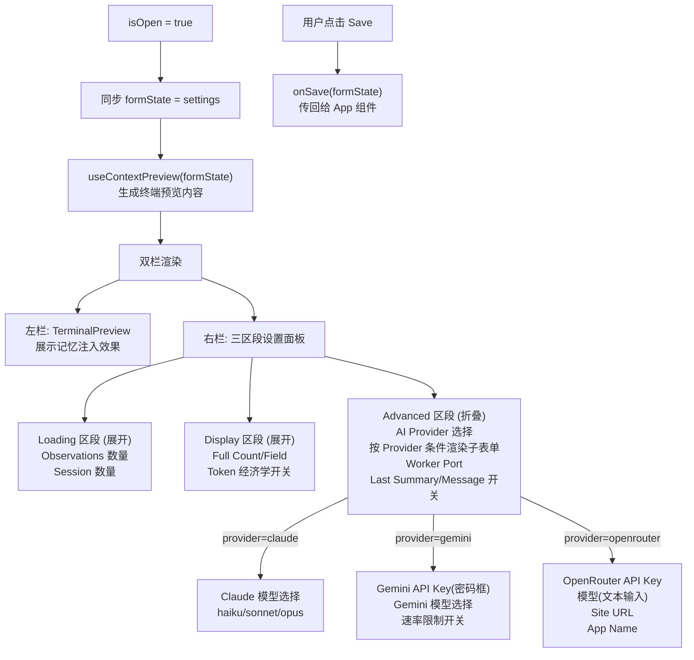

# ContextSettingsModal.tsx 需求说明

> 源文件：src/ui/viewer/components/ContextSettingsModal.tsx ｜ 类型：源码 ｜ 行数：501 ｜ 所属模块：Viewer UI / Components ｜ 分析日期：2026-07-23

## 1. 文件定位总述

ContextSettingsModal 是 claude-mem Viewer 的上下文设置模态对话框组件，提供系统配置的可视化编辑界面。它采用双栏布局——左侧为实时终端预览（展示当前配置下的记忆注入效果），右侧为分组折叠式设置面板（加载参数、显示选项、高级配置）。该组件管理的配置涵盖观察记录加载数量、会话数量、展开显示规则、Token 经济学开关、AI 提供商选择（Claude/Gemini/OpenRouter）及其配套参数、Worker 端口等。

## 2. 功能需求

| 编号 | 需求描述（系统应当…） | 触发条件 / 输入 | 处理规则与输出 | 证据 |
|------|----------------------|----------------|---------------|------|
| FR-Modal-01 | 系统应当在 `isOpen` 为 true 时渲染模态框，false 时返回 null | `isOpen` prop 变化 | 渲染带遮罩层的模态框，点击遮罩关闭，点击模态体内部阻止冒泡 | `ContextSettingsModal.tsx:173,176-177` |
| FR-Esc-01 | 系统应当支持按 Escape 键关闭模态框 | 模态框打开且用户按 Esc | 监听 `keydown` 事件，Escape 键触发 `onClose` | `ContextSettingsModal.tsx:163-171` |
| FR-FormSync-01 | 系统应当在外部 `settings` prop 变化时同步表单状态 | `settings` prop 更新 | 通过 `useEffect` 将 `formState` 重置为最新 `settings` 值 | `ContextSettingsModal.tsx:132-134` |
| FR-Preview-01 | 系统应当在左侧栏展示当前配置的实时终端预览 | 表单状态变化 | 通过 `useContextPreview` hook 根据当前 `formState` 生成预览内容，使用 `TerminalPreview` 组件渲染 | `ContextSettingsModal.tsx:136-146,229` |
| FR-PreviewSource-01 | 系统应当支持选择预览的数据来源 | 用户选择 Source 下拉框 | 传入 `selectedSource` 和 `setSelectedSource`，由 `useContextPreview` 管理 | `ContextSettingsModal.tsx:184-192` |
| FR-PreviewProject-01 | 系统应当支持选择预览的项目 | 用户选择 Project 下拉框 | 传入 `selectedProject` 和 `setSelectedProject`，由 `useContextPreview` 管理 | `ContextSettingsModal.tsx:195-205` |
| FR-SectionCollapse-01 | 系统应当将设置分为可折叠的三个区段 | 始终 | "Loading"（默认展开）、"Display"（默认展开）、"Advanced"（默认折叠） | `ContextSettingsModal.tsx:237-480` |
| FR-ObsCount-01 | 系统应当允许配置加载的观察记录数量（1-200） | 用户输入数字 | 更新 `CLAUDE_MEM_CONTEXT_OBSERVATIONS`，默认值 50，HTML min=1 max=200 | `ContextSettingsModal.tsx:244-252` |
| FR-SessionCount-01 | 系统应当允许配置拉取观察的会话数量（1-50） | 用户输入数字 | 更新 `CLAUDE_MEM_CONTEXT_SESSION_COUNT`，默认值 10，HTML min=1 max=50 | `ContextSettingsModal.tsx:254-264` |
| FR-FullCount-01 | 系统应当允许配置完整展开的观察记录数量（0-20） | 用户输入数字 | 更新 `CLAUDE_MEM_CONTEXT_FULL_COUNT`，默认值 5，HTML min=0 max=20 | `ContextSettingsModal.tsx:277-284` |
| FR-FullField-01 | 系统应当允许选择完整展开的字段（narrative 或 facts） | 用户选择下拉框 | 更新 `CLAUDE_MEM_CONTEXT_FULL_FIELD`，默认值 narrative | `ContextSettingsModal.tsx:287-297` |
| FR-Toggle-01 | 系统应当提供布尔开关切换（show-read-tokens/show-work-tokens/show-savings-amount） | 用户点击 ToggleSwitch | 调用 `toggleBoolean` 在 'true'/'false' 之间翻转 | `ContextSettingsModal.tsx:303-324` |
| FR-Provider-01 | 系统应当允许选择 AI 提供商（claude/gemini/openrouter） | 用户选择下拉框 | 更新 `CLAUDE_MEM_PROVIDER`，默认值 claude | `ContextSettingsModal.tsx:338-345` |
| FR-ClaudeModel-01 | 系统应当根据 Claude 提供商选择显示 Claude 模型选择（haiku/sonnet/opus） | `CLAUDE_MEM_PROVIDER === 'claude'` | 条件渲染，默认 haiku | `ContextSettingsModal.tsx:348-362` |
| FR-GeminiConfig-01 | 系统应当根据 Gemini 提供商选择显示 API Key（密码框）、模型选择、速率限制开关 | `CLAUDE_MEM_PROVIDER === 'gemini'` | 条件渲染三个表单项，API Key 为密码类型输入框 | `ContextSettingsModal.tsx:364-400` |
| FR-OpenRouterConfig-01 | 系统应当根据 OpenRouter 提供商选择显示 API Key、模型（文本输入）、Site URL、App Name | `CLAUDE_MEM_PROVIDER === 'openrouter'` | 条件渲染四个表单项，App Name 默认 claude-mem | `ContextSettingsModal.tsx:402-449` |
| FR-WorkerPort-01 | 系统应当允许配置 Worker 端口（1024-65535） | 用户输入数字 | 更新 `CLAUDE_MEM_WORKER_PORT`，默认值 37777 | `ContextSettingsModal.tsx:451-462` |
| FR-LastSummary-01 | 系统应当允许开关"包含上次会话总结"选项 | 用户点击 ToggleSwitch | 更新 `CLAUDE_MEM_CONTEXT_SHOW_LAST_SUMMARY` | `ContextSettingsModal.tsx:465-469` |
| FR-LastMessage-01 | 系统应当允许开关"包含上次会话最终消息"选项 | 用户点击 ToggleSwitch | 更新 `CLAUDE_MEM_CONTEXT_SHOW_LAST_MESSAGE` | `ContextSettingsModal.tsx:471-478` |
| FR-Save-01 | 系统应当提供保存按钮，点击后调用 `onSave` 回调并传入当前表单状态 | 用户点击保存按钮 | 保存中按钮显示 "Saving..." 并禁用；保存状态通过 `saveStatus` prop 展示（含 ✓/✗ 图标判断样式） | `ContextSettingsModal.tsx:489-495` |

## 3. 业务规则与约束

| 编号 | 规则描述 | 证据 |
|------|---------|------|
| BR-01 | 所有布尔型设置以字符串 'true'/'false' 存储（Settings 类型约束），非原生 boolean | `ContextSettingsModal.tsx:158-160` |
| BR-02 | Gemini 模型列表：gemini-2.5-flash-lite（10 RPM free）、gemini-2.5-flash（5 RPM free）、gemini-3-flash-preview（5 RPM free） | `ContextSettingsModal.tsx:385-388` |
| BR-03 | OpenRouter 模型为自由文本输入，默认值 `xiaomi/mimo-v2-flash:free` | `ContextSettingsModal.tsx:421-423` |
| BR-04 | "Advanced" 区段默认折叠（`defaultOpen={false}`），"Loading"和"Display"默认展开 | `ContextSettingsModal.tsx:238,268,333` |
| BR-05 | API Key 输入框使用 `type="password"` 隐藏明文 | `ContextSettingsModal.tsx:371,409` |
| BR-06 | 表单状态 `formState` 始终与外部 `settings` 同步——外部更新会覆盖本地编辑（`useEffect` 直接赋值） | `ContextSettingsModal.tsx:132-134` |
| BR-07 | 保存状态指示器根据是否包含 ✓/✗ 字符决定 CSS 类（success/error），无精确的状态码判断 | `ContextSettingsModal.tsx:487` |

## 4. 对外暴露

| 类型 | 名称 | 说明 |
|------|------|------|
| 导出组件 | `ContextSettingsModal` | 上下文设置模态框 |
| Props 接口 | `ContextSettingsModalProps` | `isOpen`, `onClose`, `settings`, `onSave`, `isSaving`, `saveStatus` |
| 内部组件 | `CollapsibleSection` | 折叠区段（未导出） |
| 内部组件 | `FormField` | 表单字段（带标签和工具提示，未导出） |
| 内部组件 | `ToggleSwitch` | 布尔开关（带 ARIA role="switch"，未导出） |

## 5. 依赖关系

| 方向 | 依赖项 | 用途 |
|------|--------|------|
| 上游（props） | App.tsx | settings/onSave/isSaving/saveStatus 由 App 管理 |
| 下游（子组件） | TerminalPreview | 左侧终端预览渲染 |
| 下游（hook） | useContextPreview | 根据当前配置生成预览内容 |
| 下游（hook） | useLocale | 国际化翻译函数 `t()` |
| 上游（类型） | Settings | 设置数据类型 |

## 6. 数据结构

不适用（所有设置项均为 `Settings` 类型的扁平键值对，通过 `formState: Settings` 统一管理）。关键设置键值分布如下：

| 设置键 | 类型 | 默认值 | 范围/选项 |
|--------|------|--------|----------|
| `CLAUDE_MEM_CONTEXT_OBSERVATIONS` | number (string) | '50' | 1-200 |
| `CLAUDE_MEM_CONTEXT_SESSION_COUNT` | number (string) | '10' | 1-50 |
| `CLAUDE_MEM_CONTEXT_FULL_COUNT` | number (string) | '5' | 0-20 |
| `CLAUDE_MEM_CONTEXT_FULL_FIELD` | enum (string) | 'narrative' | narrative / facts |
| `CLAUDE_MEM_PROVIDER` | enum (string) | 'claude' | claude / gemini / openrouter |
| `CLAUDE_MEM_MODEL` | enum (string) | 'haiku' | haiku / sonnet / opus |
| `CLAUDE_MEM_WORKER_PORT` | number (string) | '37777' | 1024-65535 |

## 7. 复杂逻辑图示

模态框的核心交互逻辑是：配置变更实时驱动左侧预览更新，用户确认后通过回调将表单状态提交给父组件保存。

## 8. 逆向备注

| 编号 | 备注 |
|------|------|
| RN-01 | 保存状态判断使用字符串包含检查（`saveStatus.includes('✓')` / `includes('✗')`）而非状态码或布尔值——推断：这是一个临时的 UI 层 hack，可能在后续迭代中改为更精确的状态枚举 |
| RN-02 | `CollapsibleSection`、`FormField`、`ToggleSwitch` 三个子组件在文件内定义但未导出——这些是纯 UI 原子组件，仅在本文件中使用 |
| RN-03 | `formState` 与 `settings` 的同步使用直接赋值（`setFormState(settings)`），如果用户正在编辑中且外部 settings 突然更新（例如其他客户端修改），用户的未保存修改会被丢弃——推断：这是有意设计，因为每次保存后 settings 会立即回传 |
| RN-04 | ToggleSwitch 组件实现了 `role="switch"` 和 `aria-checked` 属性（`ContextSettingsModal.tsx:110-111`），具备较好的无障碍支持，但 FormField 的 tooltip 仅使用原生 `title` 属性，无自定义 tooltip 组件 |
| RN-05 | OpenRouter 的 App Name 默认值为 `'claude-mem'`（`ContextSettingsModal.tsx:443`），而 Site URL 默认为空字符串（`ContextSettingsModal.tsx:432`） |
