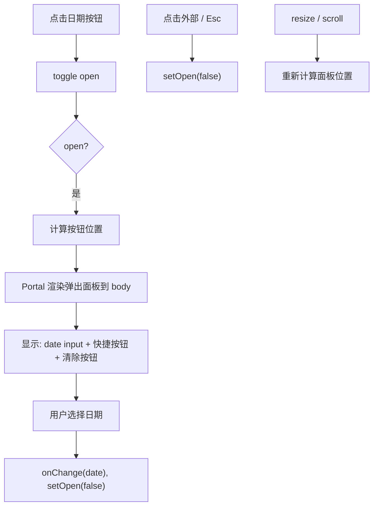

# DateFilterButton.tsx 需求说明

> 源文件：src/ui/viewer/components/DateFilterButton.tsx ｜ 类型：源码 ｜ 行数：222 ｜ 所属模块：viewer/components ｜ 分析日期：2026-07-23

## 1. 文件定位总述

DateFilterButton 是 Header 区域的日期筛选按钮组件，提供一个弹出式日期选择器。它支持手动选择任意日期、三个快捷按钮（今天/昨天/前天）和清除筛选功能。弹出面板通过 React Portal 渲染到 document.body，避免被父元素的 overflow/transform 裁剪，并自动根据视口宽度进行右对齐和边界钳制。

## 2. 功能需求

| 编号 | 需求描述（系统应当…） | 触发条件 / 输入 | 处理规则与输出 | 证据 |
|------|----------------------|----------------|---------------|------|
| FR-DFB-01 | 系统应当以弹出面板形式展示日期选择器 | 用户点击按钮 | 面板固定定位在按钮下方，宽度 360px，通过 Portal 渲染 | `src/ui/viewer/components/DateFilterButton.tsx:159-219` |
| FR-DFB-02 | 系统应当提供原生 date 输入框 | 弹出面板打开 | 预填充今天日期（无筛选时），max 限制为今天 | `src/ui/viewer/components/DateFilterButton.tsx:170-177` |
| FR-DFB-03 | 系统应当提供三个快捷日期按钮 | 弹出面板打开 | "Day before"(前天)、"Yesterday"(昨天)、"Today"(今天)，各自调用 daysAgoIso(2/1/0) | `src/ui/viewer/components/DateFilterButton.tsx:183-206` |
| FR-DFB-04 | 系统应当在有筛选时显示清除按钮 | value 非空 | 渲染全宽度的 "Clear" 按钮，调用 onChange(null) | `src/ui/viewer/components/DateFilterButton.tsx:207-215` |
| FR-DFB-05 | 系统应当按钮内显示当前筛选日期或"日期"标签 | 渲染按钮 | 有筛选时显示格式化日期（zh: "YYYY年M月D日"，en: "Mon DD, YYYY"），无筛选时显示 "Date" | `src/ui/viewer/components/DateFilterButton.tsx:11-20, 112` |
| FR-DFB-06 | 系统应当在点击外部区域时关闭弹出面板 | 面板打开时点击外部 | mousedown 事件监听，检查是否在 containerRef 或 popoverRef 之外 | `src/ui/viewer/components/DateFilterButton.tsx:80-86` |
| FR-DFB-07 | 系统应当在按 Esc 时关闭弹出面板 | 面板打开时按 Esc | keydown 事件监听，关闭面板 | `src/ui/viewer/components/DateFilterButton.tsx:87-89` |
| FR-DFB-08 | 系统应当根据视口宽度右对齐弹出面板 | 面板打开 | `left = Math.max(8, Math.min(window.innerWidth - 360 - 8, r.right - 360))` | `src/ui/viewer/components/DateFilterButton.tsx:66` |

## 3. 业务规则与约束

- 弹出面板宽度固定 360px（`POPOVER_WIDTH`），注释说明 260px 导致英文标签换行。`src/ui/viewer/components/DateFilterButton.tsx:45`
- daysAgoIso 使用本地时区计算日期（`setHours(0,0,0,0)` 后 `setDate`），输出 YYYY-MM-DD 格式。`src/ui/viewer/components/DateFilterButton.tsx:32-39`
- Portal 渲染目标是 `document.body`，解决父容器 overflow/transform 导致的定位问题。`src/ui/viewer/components/DateFilterButton.tsx:218`
- 按钮内显示 `✕` 清除图标（内联在按钮内部），独立于弹出面板内的清除按钮。`src/ui/viewer/components/DateFilterButton.tsx:144-156`

## 4. 对外暴露

**Props 接口**：
| 属性 | 类型 | 说明 |
|------|------|------|
| `value` | `string \| null` | 当前筛选日期（ISO YYYY-MM-DD）或 null |
| `onChange` | `(value: string \| null) => void` | 日期变更回调 |

## 5. 依赖关系

- 上游：Header 组件
- 下游：`useLocale` Hook、`createPortal`（react-dom）

## 7. 复杂逻辑图示

## 8. 逆向备注

- 面板位置使用 `useLayoutEffect` 计算（同步布局），避免闪烁。`src/ui/viewer/components/DateFilterButton.tsx:59`
- resize 和 scroll 事件使用 capture 模式（第三个参数 `true`），因为 scroll 事件可能被子元素 stopPropagation。`src/ui/viewer/components/DateFilterButton.tsx:71`
