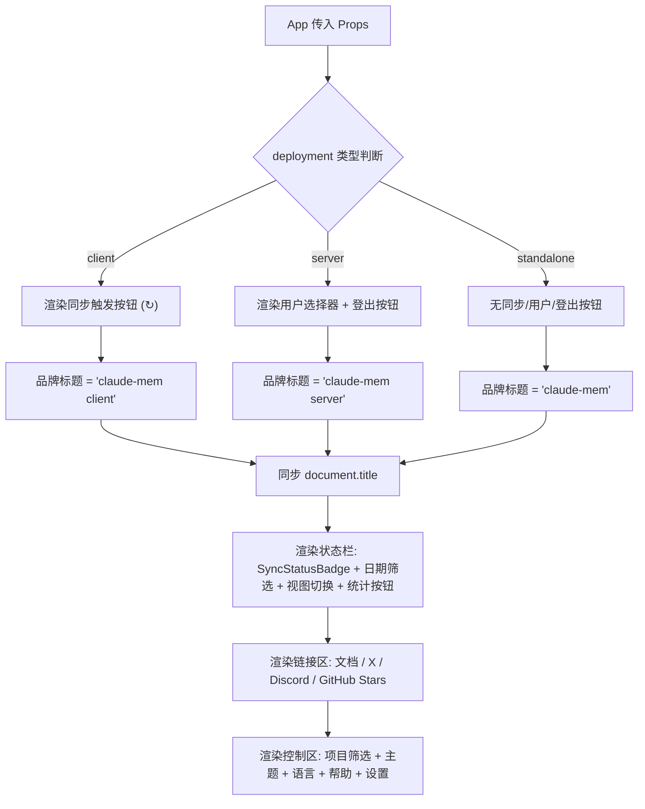

# Header.tsx 需求说明

> 源文件：src/ui/viewer/components/Header.tsx ｜ 类型：源码 ｜ 行数：243 ｜ 所属模块：Viewer UI ｜ 分析日期：2026-07-23

## 1. 文件定位总述

Header 是 claude-mem Viewer 的全局顶部导航栏组件，负责汇聚所有全局控制入口。它向上接收来自 App 的状态与回调（连接状态、项目列表、处理队列深度、部署角色、用户权限等），向下渲染品牌标识、同步状态徽章、项目筛选下拉框、视图模式切换、日期筛选、用户选择器、主题/语言切换、外部链接以及设置按钮。Header 是用户与系统交互频率最高的组件之一，几乎所有全局操作（筛选、切换模式、打开设置、查看文档、登出）都从此组件发起。

## 2. 功能需求

| 编号 | 需求描述（系统应当…） | 触发条件 / 输入 | 处理规则与输出 | 证据 |
|------|----------------------|----------------|---------------|------|
| FR-Brand-01 | 系统应当根据部署角色（client/server/standalone）显示不同的品牌标题文字 | `deployment` prop 变化 | client 显示 "claude-mem client"，server 显示 "claude-mem server"，standalone 显示 "claude-mem"；同时同步浏览器 `document.title` | `Header.tsx:80-88` |
| FR-Favicon-01 | 系统应当在后端正在处理任务时旋转网站 favicon 并显示队列深度气泡 | `isProcessing` 为 true 且 `queueDepth > 0` | logomark 图片添加 `spinning` CSS 类；在 logomark 右上角叠加一个显示 `queueDepth` 数值的气泡元素 | `Header.tsx:74,95-99` |
| FR-SyncBadge-01 | 系统应当在状态栏展示同步状态徽章 | 始终渲染 | 渲染 `SyncStatusBadge` 组件，传入 `syncStatus` 和 `syncStatusReady` | `Header.tsx:106` |
| FR-SyncTrigger-01 | 系统应当在 client 部署模式下提供手动触发同步的按钮 | `deployment === 'client'` | 渲染一个按钮，点击后 POST `/api/sync/trigger`，成功弹窗显示同步结果含 lag 信息，失败弹窗显示错误 | `Header.tsx:107-122` |
| FR-UserSelector-01 | 系统应当在服务端模式下渲染用户选择器 | `showUserSelector` 为 true | 渲染 `UserSelector` 组件，支持按 `userLabel` 筛选 | `Header.tsx:123-129` |
| FR-DateFilter-01 | 系统应当提供日期筛选按钮，允许用户按天过滤数据流 | 用户点击 | 渲染 `DateFilterButton`，传入当前 `dateFilter` 和变更回调 | `Header.tsx:130` |
| FR-ViewMode-01 | 系统应当提供视图模式切换（全部/仅提示词），标签文字支持国际化 | 用户点击 | 渲染 `ViewModeToggle`，传入当前 `viewMode`、变更回调和通过 `t()` 获取的国际化标签 | `Header.tsx:131-135` |
| FR-StatsToggle-01 | 系统应当提供统计分析模式切换按钮 | 用户点击 | 切换 `statsMode` 按钮的 `active` CSS 类，调用 `onStatsToggle` 回调 | `Header.tsx:136-148` |
| FR-ExternalLinks-01 | 系统应当提供文档、X(Twitter)、Discord 外部链接和 GitHub Stars 按钮 | 始终渲染 | 三个 `<a>` 标签分别链接到 docs.claude-mem.ai、x.com/Claude_Memory、discord.gg 链接；`GitHubStarsButton` 指向 thedotmack/claude-mem 仓库 | `Header.tsx:149-183` |
| FR-ProjectFilter-01 | 系统应当提供项目筛选下拉框，默认显示"全部项目"选项 | 始终渲染 | 渲染 `<select>` 元素，第一个 option 为空值（全部项目），后续 option 遍历 `projects` 数组，最大宽度 360px | `Header.tsx:184-193` |
| FR-Theme-01 | 系统应当提供主题切换功能（浅色/深色/跟随系统） | 用户点击 | 渲染 `ThemeToggle` 组件 | `Header.tsx:194-197` |
| FR-Locale-01 | 系统应当提供语言切换功能（en/zh），标签支持国际化 | 用户点击 | 渲染 `LocaleToggle` 组件，标签文字通过 `t('header.languageLabel')` 获取 | `Header.tsx:198-202` |
| FR-HelpBtn-01 | 系统应当提供帮助按钮，点击后显示欢迎卡片 | 用户点击 | 调用 `onShowHelp` 回调（可选 prop） | `Header.tsx:203-214` |
| FR-Logout-01 | 系统应当在服务端模式下提供登出按钮 | `onLogout` prop 存在（非 undefined） | 渲染登出按钮，点击调用 `onLogout` 回调 | `Header.tsx:215-228` |
| FR-SettingsBtn-01 | 系统应当提供设置按钮，点击后打开上下文设置弹窗 | 用户点击 | 调用 `onContextPreviewToggle` 回调 | `Header.tsx:229-238` |

## 3. 业务规则与约束

| 编号 | 规则描述 | 证据 |
|------|---------|------|
| BR-01 | 同步触发按钮仅在 `deployment === 'client'` 时渲染，server 和 standalone 模式不显示 | `Header.tsx:107` |
| BR-02 | 队列深度气泡仅在 `queueDepth > 0` 时显示 | `Header.tsx:96` |
| BR-03 | 登出按钮仅在 `onLogout` 回调被提供时渲染（条件渲染） | `Header.tsx:215` |
| BR-04 | 帮助按钮的 `onShowHelp` 为可选 prop，缺失时按钮仍渲染但点击无效果（`?.()` 安全调用） | `Header.tsx:205` |
| BR-05 | 项目筛选下拉框最大宽度限制为 360px，防止超长项目 ID 撑破布局 | `Header.tsx:187` |
| BR-06 | 品牌标题变更时同步更新浏览器标签页标题（`document.title`） | `Header.tsx:86-88` |

## 4. 对外暴露

| 类型 | 名称 | 说明 |
|------|------|------|
| 导出组件 | `Header` | 顶部导航栏，接收 20 个 props |
| Props 接口 | `HeaderProps` | 组件的 TypeScript 类型定义，包含连接状态、项目列表、筛选回调、主题、部署模式、用户列表、同步状态、登出回调等 |

## 5. 依赖关系

| 方向 | 依赖项 | 用途 |
|------|--------|------|
| 上游（props） | App.tsx | 通过 props 获取所有状态与回调 |
| 下游（子组件） | ThemeToggle | 主题切换 |
| 下游（子组件） | LocaleToggle | 语言切换 |
| 下游（子组件） | ViewModeToggle | 视图模式切换 |
| 下游（子组件） | DateFilterButton | 日期筛选 |
| 下游（子组件） | UserSelector | 用户选择器（服务端模式） |
| 下游（子组件） | SyncStatusBadge | 同步状态显示 |
| 下游（子组件） | GitHubStarsButton | GitHub Star 按钮 |
| 下游（hook） | useSpinningFavicon | 处理时旋转 favicon |
| 下游（hook） | useLocale | 国际化翻译函数 `t()` |
| 下游（工具） | authFetch | 发起同步触发 API 请求 |
| 上游（类型） | SyncStatus, ThemePreference, UserRow | TypeScript 类型导入 |

## 6. 数据结构

不适用（Header 是纯展示组件，不定义独立数据结构）。

## 7. 复杂逻辑图示

Header 组件的核心逻辑是根据 `deployment` 角色条件渲染不同的功能按钮集，其余部分（状态栏、外部链接、通用控制）在所有部署模式下统一渲染。

## 8. 逆向备注

| 编号 | 备注 |
|------|------|
| RN-01 | 同步触发按钮的 API 调用使用 `authFetch`（`Header.tsx:113`），说明该端点需要认证，但按钮渲染条件仅检查 `deployment`，未显式检查 `isConnected`——推断：断连状态下点击按钮会因请求失败而弹窗提示错误 |
| RN-02 | `queueDepth` 气泡直接用文本节点显示数值（`Header.tsx:98`），未做数字格式化或上限截断——当队列深度极大时可能溢出气泡容器 |
| RN-03 | 登出按钮的 title/aria-label 硬编码为 "Sign out"（`Header.tsx:219-220`），未通过 `t()` 国际化，与其他按钮的国际化处理方式不一致 |
| RN-04 | `useSpinningFavicon` hook 的 `isProcessing` 参数传入的是全局处理状态，而非基于当前选中项目的局部状态——推断：旋转效果反映的是整个 worker 的处理状态 |
