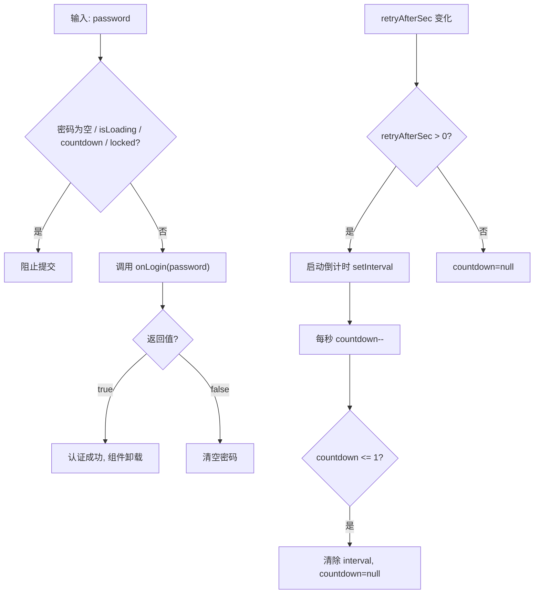

# LoginPage.tsx 需求说明

> 源文件：src/ui/viewer/components/LoginPage.tsx ｜ 类型：源码 ｜ 行数：132 ｜ 所属模块：viewer/components ｜ 分析日期：2026-07-23

## 1. 文件定位总述

LoginPage 是 Viewer 的管理登录页面组件，在服务端模式下需要认证时显示。它提供用户名（固定 admin）和密码输入表单，处理速率限制倒计时、账户锁定状态和剩余尝试次数显示。组件支持自动聚焦密码输入框，并在账户锁定时展示 CLI 重置密码的提示。

## 2. 功能需求

| 编号 | 需求描述（系统应当…） | 触发条件 / 输入 | 处理规则与输出 | 证据 |
|------|----------------------|----------------|---------------|------|
| FR-LP-01 | 系统应当展示管理登录表单 | 未认证状态 | 渲染用户名（disabled，值固定 "admin"）和密码输入框 | `src/ui/viewer/components/LoginPage.tsx:69-89` |
| FR-LP-02 | 系统应当在加载完成且无冷却时自动聚焦密码输入框 | isLoading=false 且 countdown=null | 调用 `inputRef.current?.focus()` | `src/ui/viewer/components/LoginPage.tsx:37-41` |
| FR-LP-03 | 系统应当在登录失败后清空密码字段 | onLogin 返回 false | `setPassword('')` 清空密码 | `src/ui/viewer/components/LoginPage.tsx:47` |
| FR-LP-04 | 系统应当在速率限制时显示倒计时冷却界面 | retryAfterSec > 0 | 启动 1 秒间隔的 setInterval 倒计时，显示 "Cooldown — try again in {n}s" | `src/ui/viewer/components/LoginPage.tsx:18-33, 92-97` |
| FR-LP-05 | 系统应当在冷却期间禁用密码输入和提交 | countdown !== null | 密码框 disabled，提交按钮 disabled | `src/ui/viewer/components/LoginPage.tsx:51, 87, 119` |
| FR-LP-06 | 系统应当在账户锁定时显示 CLI 重置密码提示 | error 包含 'locked' | 显示 `./install-claude-mem --admin-password <new-password>` 命令提示 | `src/ui/viewer/components/LoginPage.tsx:50, 102-109` |
| FR-LP-07 | 系统应当显示剩余尝试次数（非锁定状态） | attemptsRemaining 不为 null | 显示 "{n} attempts remaining today" | `src/ui/viewer/components/LoginPage.tsx:111-113` |
| FR-LP-08 | 系统应当防止在禁用状态下提交表单 | 密码为空 / isLoading / countdown / locked | handleSubmit 提前返回 | `src/ui/viewer/components/LoginPage.tsx:45` |

## 3. 业务规则与约束

- 用户名固定为 "admin"，不可修改（input disabled）。`src/ui/viewer/components/LoginPage.tsx:72`
- 倒计时从 `retryAfterSec` 秒开始，到 1 时清除 interval 并设为 null。`src/ui/viewer/components/LoginPage.tsx:22-28`
- 锁定检测通过 error 字符串是否包含 'locked' 判断。`src/ui/viewer/components/LoginPage.tsx:50`

## 4. 对外暴露

**Props 接口**：
| 属性 | 类型 | 说明 |
|------|------|------|
| `onLogin` | `(password: string) => Promise<boolean>` | 登录回调，返回是否成功 |
| `isLoading` | `boolean` | 是否正在提交 |
| `error` | `string \| null` | 错误信息 |
| `attemptsRemaining` | `number \| null` | 剩余尝试次数 |
| `retryAfterSec` | `number \| null` | 冷却等待秒数 |

## 5. 依赖关系

- 上游：App 根组件（useAuth Hook 提供状态和 login 函数）
- 下游：无子组件

## 7. 复杂逻辑图示

## 8. 逆向备注

- 组件内部管理的倒计时状态（countdown）与外部传入的 retryAfterSec 存在冗余：retryAfterSec 变化时重置 countdown，但 countdown 归零后 retryAfterSec 未被清除——这一状态同步由父组件 useAuth 的 cooldown 定时器负责。`src/ui/viewer/hooks/useAuth.ts:133-135`
