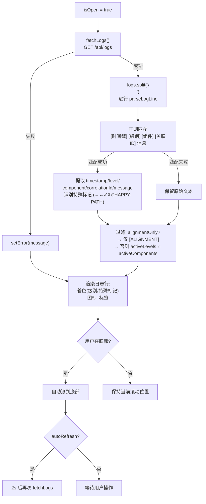

# LogsModal.tsx 需求说明

> 源文件：src/ui/viewer/components/LogsModal.tsx ｜ 类型：源码 ｜ 行数：457 ｜ 所属模块：Viewer UI / Components ｜ 分析日期：2026-07-23

## 1. 文件定位总述

LogsModal（导出名 `LogsDrawer`）是 claude-mem Viewer 的底部可调整高度日志抽屉组件，提供后端 Worker 日志的实时查看、过滤和清空功能。它通过 REST API 从后端拉取日志文本，在客户端进行逐行解析（提取时间戳、级别、组件、关联 ID 等结构化字段），并提供多维度过滤（日志级别、组件类型、会话对齐快速筛选）。LogsDrawer 还支持自动刷新、底部拖拽调整高度、自动滚动到底部等交互特性。

## 2. 功能需求

| 编号 | 需求描述（系统应当…） | 触发条件 / 输入 | 处理规则与输出 | 证据 |
|------|----------------------|----------------|---------------|------|
| FR-Toggle-01 | 系统应当在 `isOpen` 为 true 时渲染日志抽屉，false 时返回 null | `isOpen` prop 变化 | 抽屉面板以固定像素高度渲染，默认 350px | `LogsModal.tsx:246-248,313` |
| FR-Fetch-01 | 系统应当在抽屉打开时自动拉取日志 | `isOpen` 变为 true | 调用 `fetchLogs()`，GET `/api/logs`，将响应中的 `logs` 字符串存入状态；拉取前记录当前是否在底部 | `LogsModal.tsx:190-195` |
| FR-Fetch-02 | 系统应当支持手动刷新日志 | 用户点击刷新按钮 | 再次调用 `fetchLogs()`，按钮在加载时禁用 | `LogsModal.tsx:334-340` |
| FR-AutoRefresh-01 | 系统应当支持自动刷新模式，每 2 秒拉取一次日志 | 用户勾选"Auto-refresh" | 以 2000ms 间隔循环调用 `fetchLogs()`；关闭抽屉或取消勾选时清除定时器 | `LogsModal.tsx:197-204` |
| FR-Parse-01 | 系统应当将原始日志文本逐行解析为结构化数据 | 日志文本更新 | 正则 `/^\[([^\]]+)\]\s+\[(\w+)\s*\]\s+\[(\w+)\s*\]\s+(?:\[([^\]]+)\]\s+)?(.*)$/` 提取 timestamp、level、component、correlationId、message；匹配失败则保留原始文本 | `LogsModal.tsx:37-64` |
| FR-Parse-02 | 系统应当识别特殊日志标记（数据流入/流出、成功/失败/计时/幸福路径） | 日志行解析后 | 根据消息前缀（→/←/✓/✗/⏱）或内容（[HAPPY-PATH]）设置 `isSpecial` 字段 | `LogsModal.tsx:47-53` |
| FR-FilterLevel-01 | 系统应当支持按日志级别（DEBUG/INFO/WARN/ERROR）过滤 | 用户点击级别过滤芯片 | 切换对应级别的选中状态，仅显示同时匹配级别和组件的日志行 | `LogsModal.tsx:206-216,389-409` |
| FR-FilterComp-01 | 系统应当支持按组件（HOOK/WORKER/SDK/PARSER/DB/SYSTEM/HTTP/SESSION/CHROMA）过滤 | 用户点击组件过滤芯片 | 同 FR-FilterLevel-01 逻辑，作用于组件维度 | `LogsModal.tsx:218-228,414-435` |
| FR-FilterAll-01 | 系统应当支持一键全选/全不选级别和组件 | 用户点击全选/全不选按钮 | 级别/组件各自独立的全选按钮；当全部选中时显示 ○（表示可全不选），否则显示 ●（表示可全选） | `LogsModal.tsx:230-244` |
| FR-Alignment-01 | 系统应当提供"会话对齐"快速筛选，仅显示含 `[ALIGNMENT]` 的日志行 | 用户点击 Alignment 芯片 | 启用 `alignmentOnly` 模式，过滤条件变为 `line.raw.includes('[ALIGNMENT]')`，忽略级别和组件过滤 | `LogsModal.tsx:99-101,375-384` |
| FR-Clear-01 | 系统应当支持清空日志 | 用户点击清空按钮 | 弹出确认对话框，确认后 POST `/api/logs/clear`，成功后清空本地日志文本 | `LogsModal.tsx:142-159` |
| FR-Scroll-01 | 系统应当在日志更新时自动滚动到底部（若用户当前在底部） | 日志内容变化 | 通过 `wasAtBottomRef` 记录上次是否在底部（距底部 < 50px），在底部时自动滚动 | `LogsModal.tsx:107-117,138-140` |
| FR-ScrollBottom-01 | 系统应当提供手动滚到底部按钮 | 用户点击⬇按钮 | 强制设置 `wasAtBottomRef = true` 并滚动到底部 | `LogsModal.tsx:344-349` |
| FR-Resize-01 | 系统应当支持通过顶部拖拽手柄调整抽屉高度 | 用户鼠标按下拖拽手柄 | 高度范围 150px 到 `window.innerHeight - 100`；拖拽期间实时更新高度状态 | `LogsModal.tsx:161-188` |
| FR-Color-01 | 系统应当根据日志级别和特殊标记为日志行着色 | 渲染每行日志 | ERROR 红色背景高亮，WARN 黄色背景浅高亮，success/failure/happyPath 特殊颜色 | `LogsModal.tsx:250-275` |
| FR-Close-01 | 系统应当提供关闭按钮 | 用户点击关闭/点击抽屉外区域 | 调用 `onClose` 回调 | `LogsModal.tsx:361-366` |

## 3. 业务规则与约束

| 编号 | 规则描述 | 证据 |
|------|---------|------|
| BR-01 | 日志级别默认全选（DEBUG/INFO/WARN/ERROR），组件默认全选（9 种组件） | `LogsModal.tsx:84-89` |
| BR-02 | 自动刷新间隔固定 2000ms，不可配置 | `LogsModal.tsx:202` |
| BR-03 | 日志抽屉最小高度 150px，最大高度 `window.innerHeight - 100`px | `LogsModal.tsx:173` |
| BR-04 | "在底部"的判定阈值为距底 50px 以内 | `LogsModal.tsx:110` |
| BR-05 | 未解析成功的日志行（正则不匹配）以原始文本形式显示在 `log-line-raw` 类名下 | `LogsModal.tsx:41-43,278-283` |
| BR-06 | 日志行解析采用正则 `^\[timestamp\] [level] [component] [correlationId] message`，方括号间的空白字符（`\s*`）允许灵活匹配 | `LogsModal.tsx:38` |
| BR-07 | Alignment 快速筛选模式启用时，级别和组件过滤被忽略（仅检查 `[ALIGNMENT]` 关键词） | `LogsModal.tsx:99-101` |
| BR-08 | 空日志列表显示 "No logs available" 提示 | `LogsModal.tsx:447-449` |

## 4. 对外暴露

| 类型 | 名称 | 说明 |
|------|------|------|
| 导出组件 | `LogsDrawer` | 日志抽屉组件（注意：文件名为 LogsModal 但导出名为 LogsDrawer） |
| Props 接口 | `LogsDrawerProps` | `isOpen: boolean` 和 `onClose: () => void` |

## 5. 依赖关系

| 方向 | 依赖项 | 用途 |
|------|--------|------|
| 上游（props） | App.tsx | `isOpen`/`onClose` 由 App 控制 |
| 下游（API） | `GET /api/logs` | 拉取日志文本 |
| 下游（API） | `POST /api/logs/clear` | 清空日志 |
| 下游（工具） | `authFetch` | 认证 HTTP 请求 |
| 下游（hook） | `useLocale` | 国际化翻译函数 `t()` |

## 6. 数据结构

```typescript
// 日志级别枚举（LogsModal.tsx:5）
type LogLevel = 'DEBUG' | 'INFO' | 'WARN' | 'ERROR';

// 日志组件枚举（LogsModal.tsx:6）
type LogComponent = 'HOOK' | 'WORKER' | 'SDK' | 'PARSER' | 'DB' | 'SYSTEM' | 'HTTP' | 'SESSION' | 'CHROMA';

// 解析后的日志行（LogsModal.tsx:8-16）
interface ParsedLogLine {
  raw: string;                          // 原始文本
  timestamp?: string;                   // 时间戳
  level?: LogLevel;                     // 日志级别
  component?: LogComponent;             // 来源组件
  correlationId?: string;                // 关联 ID
  message?: string;                      // 日志消息
  isSpecial?: 'dataIn' | 'dataOut' | 'success' | 'failure' | 'timing' | 'happyPath';
}

// 级别/组件配置项（LogsModal.tsx:18-35）
// { key, label, icon(emoji), color(hex) }
```

## 7. 复杂逻辑图示



日志抽屉的数据流是：打开时拉取→解析→过滤→渲染，其中过滤逻辑支持三个维度独立切换，着色规则根据级别和特殊标记分级处理。

## 8. 逆向备注

| 编号 | 备注 |
|------|------|
| RN-01 | 文件名为 `LogsModal.tsx`，但导出组件名为 `LogsDrawer`——推断：该组件在功能演进过程中从模态框变更为底部抽屉（Drawer），但文件名未同步更新 |
| RN-02 | 自动刷新间隔 2000ms 硬编码在 `useEffect` 中（`LogsModal.tsx:202`），未提取为常量或可配置项——与项目中其他时间配置使用 `TIMING` 常量的做法不一致 |
| RN-03 | 日志着色使用硬编码的十六进制颜色值（如 `#f85149`、`#d29922`），未使用 CSS 变量——推断：这是为了与固定图标颜色方案保持一致，但在暗色主题下可能不协调 |
| RN-04 | `alignmentOnly` 模式与级别/组件过滤是互斥关系（`LogsModal.tsx:99-101` 中的 if 分支），但 UI 上两者看起来同时可见——用户启用 Alignment 筛选后，级别和组件芯片仍然可见但无效果 |
| RN-05 | `wasAtBottomRef.current = true` 在抽屉打开时强制设为 true（`LogsModal.tsx:192`），意味着每次打开抽屉都会自动滚动到底部，无论之前是否有未读日志在上方 |
