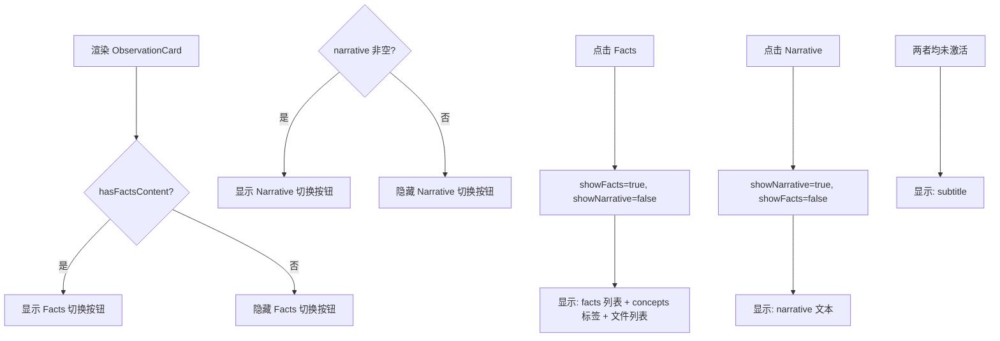

# ObservationCard.tsx 需求说明

> 源文件：src/ui/viewer/components/ObservationCard.tsx ｜ 类型：源码 ｜ 行数：164 ｜ 所属模块：viewer/components ｜ 分析日期：2026-07-23

## 1. 文件定位总述

ObservationCard 是 Feed 列表中展示观察记录的卡片组件。它提供两种内容查看模式：事实视图（facts/concepts/读取文件/修改文件列表）和叙述视图（narrative 文本），通过互斥的切换按钮控制。卡片还支持显示合并标记（merged_into_project）、平台来源和用户信息。内部的 `stripProjectRoot` 函数将长文件路径缩短为可读格式。

## 2. 功能需求

| 编号 | 需求描述（系统应当…） | 触发条件 / 输入 | 处理规则与输出 | 证据 |
|------|----------------------|----------------|---------------|------|
| FR-OC-01 | 系统应当展示观察记录的默认视图（subtitle） | facts 和 narrative 均未激活 | 显示 observation.subtitle | `src/ui/viewer/components/ObservationCard.tsx:101-103` |
| FR-OC-02 | 系统应当提供"事实"视图切换 | hasFactsContent === true（facts/concepts/filesRead/filesModified 有内容） | 切换后显示 facts 列表，底部展开 concepts 标签和文件列表 | `src/ui/viewer/components/ObservationCard.tsx:61-75` |
| FR-OC-03 | 系统应当提供"叙述"视图切换 | observation.narrative 非空 | 切换后显示 narrative 文本 | `src/ui/viewer/components/ObservationCard.tsx:76-92` |
| FR-OC-04 | 系统应当确保事实和叙述视图互斥 | 点击一个切换按钮 | 激活新视图时自动关闭另一个 | `src/ui/viewer/components/ObservationCard.tsx:66, 81` |
| FR-OC-05 | 系统应当在事实视图中展示概念标签 | facts 切换激活且 concepts 列表非空 | 渲染带样式的标签列表 | `src/ui/viewer/components/ObservationCard.tsx:137-148` |
| FR-OC-06 | 系统应当在事实视图中展示读取/修改的文件列表 | filesRead 或 filesModified 非空 | 以 "read:"/"modified:" 前缀显示，文件路径经 stripProjectRoot 缩短 | `src/ui/viewer/components/ObservationCard.tsx:149-158` |
| FR-OC-07 | 系统应当显示合并标记 | observation.merged_into_project 非空 | 显示 "merged → {project}" 标签 | `src/ui/viewer/components/ObservationCard.tsx:54-58` |
| FR-OC-08 | 系统应当将长文件路径缩短为可读格式 | 解析 facts/concepts/files_read/files_modified（JSON 字符串） | 按标记 `/Scripts/`、`/src/`、`/plugin/`、`/docs/` 或 `claude-mem/` 截取后缀，最终回退为最后 3 段 | `src/ui/viewer/components/ObservationCard.tsx:10-27` |

## 3. 业务规则与约束

- facts、concepts、files_read、files_modified 均为 JSON 字符串，需 `JSON.parse` 解析。`src/ui/viewer/components/ObservationCard.tsx:35-38`
- `stripProjectRoot` 按优先级依次匹配路径标记，第一个匹配成功即返回。`src/ui/viewer/components/ObservationCard.tsx:11-26`
- 无标题时显示 "Untitled" 本地化文本。`src/ui/viewer/components/ObservationCard.tsx:97`
- 切换按钮仅在有对应内容时才渲染。`src/ui/viewer/components/ObservationCard.tsx:61, 76`

## 4. 对外暴露

**Props 接口**：
| 属性 | 类型 | 说明 |
|------|------|------|
| `observation` | `Observation` | 观察数据对象 |

## 5. 依赖关系

- 上游：Feed 组件（渲染 observation 类型的 FeedItem）
- 下游：`formatDate`、`useLocale` Hook

## 7. 复杂逻辑图示

## 8. 逆向备注

- 概念标签使用内联样式而非 CSS 类（`style={{ padding, background, borderRadius... }}`），可能是因为这些标签需要精确的微样式控制。`src/ui/viewer/components/ObservationCard.tsx:138-145`
