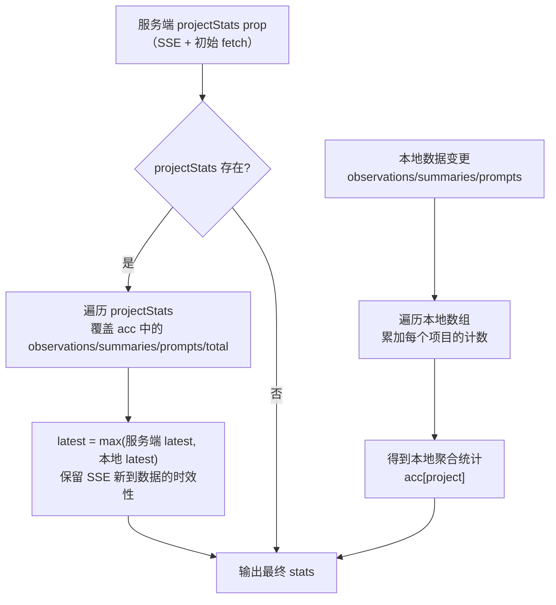
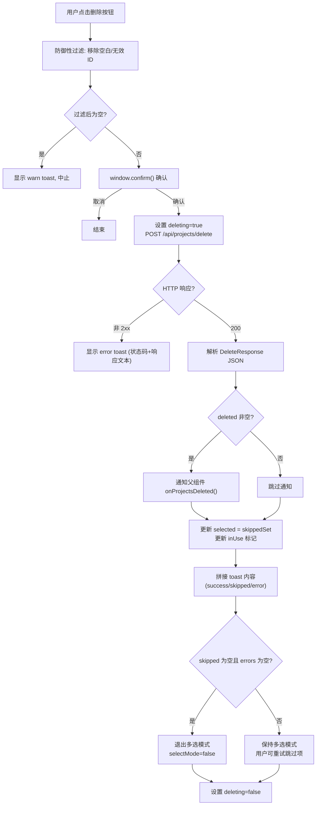
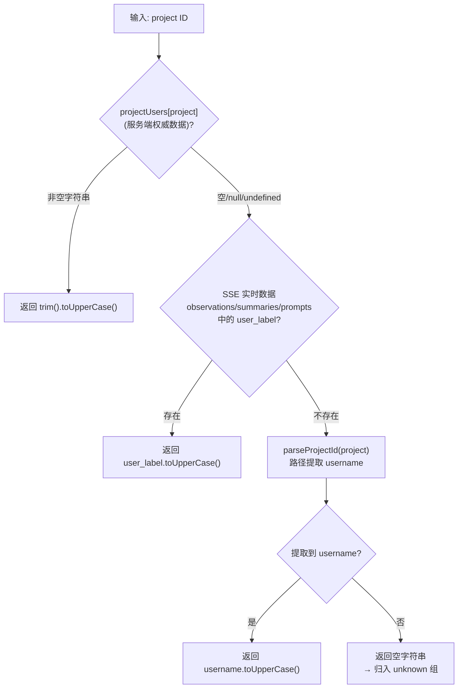

# ProjectSidebar.tsx 需求说明

> 源文件：`src/ui/viewer/components/ProjectSidebar.tsx` ｜ 类型：源码（前端组件） ｜ 行数：668 ｜ 所属模块：Viewer UI — 项目导航侧栏 ｜ 分析日期：2026-07-23

## 1. 文件定位总述

ProjectSidebar 是 Viewer 界面左侧的项目导航侧栏组件，承担项目列表展示、筛选、用户分组、批量删除及拖拽调整宽度等核心交互职责。组件从父组件接收全部项目列表及三种数据实体（Observation、Summary、UserPrompt），在本地聚合每个项目的统计数据并按最近活跃时间降序排列。当系统中存在多用户数据时，侧栏自动将项目按用户分组为可折叠的组，每个组头部显示用户名及消息总数。组件还提供多选管理模式，支持批量删除项目并通过服务端 API 执行实际删除操作。侧栏宽度以视口比例持久化存储，确保跨会话和窗口缩放时保持一致的视觉比例。

## 2. 功能需求

### 2.1 项目列表与筛选

| 编号 | 需求描述（系统应当…） | 触发条件 / 输入 | 处理规则与输出 | 证据 |
|------|----------------------|----------------|---------------|------|
| FR-List-01 | 侧栏顶部应始终显示"全部项目"条目，点击后清空筛选条件 | 渲染 / 用户点击"全部项目" | 调用 `onFilterChange('')`，条目右侧显示所有项目的 prompt 总数 | `src/ui/viewer/components/ProjectSidebar.tsx:545-553` |
| FR-List-02 | 项目列表应为空时显示空状态提示文字 | `sortedProjects.length === 0` | 渲染 `t('sidebar.empty')` | `src/ui/viewer/components/ProjectSidebar.tsx:555-557` |
| FR-List-03 | 项目列表应按最近活跃时间降序排列，活跃时间相同则按项目名字典序 | 数据变化时重新计算 | `sortedProjects` 的 `useMemo` 依据 `stats[a].latest` 降序，回退到 `localeCompare` | `src/ui/viewer/components/ProjectSidebar.tsx:273-280` |
| FR-List-04 | 每个项目条目应显示项目名和 prompt 总数 | 渲染 | 右侧徽章显示 `stats[project].total` | `src/ui/viewer/components/ProjectSidebar.tsx:613` |
| FR-List-05 | 点击项目条目应触发筛选回调 | 非选择模式下点击项目条目 | 调用 `onFilterChange(project)` | `src/ui/viewer/components/ProjectSidebar.tsx:571-574` |
| FR-List-06 | 当前筛选中的项目应具有 `is-active` 视觉样式 | `currentFilter === project` | 添加 `is-active` CSS 类 | `src/ui/viewer/components/ProjectSidebar.tsx:581` |

### 2.2 统计数据聚合

| 编号 | 需求描述（系统应当…） | 触发条件 / 输入 | 处理规则与输出 | 证据 |
|------|----------------------|----------------|---------------|------|
| FR-Stats-01 | 应在本地聚合每个项目的 observations/summaries/prompts 计数及最近活跃时间戳 | 数据变化时重新计算 | 遍历 observations/summaries/prompts 数组累加计数，取 `created_at_epoch` 最大值 | `src/ui/viewer/components/ProjectSidebar.tsx:227-271` |
| FR-Stats-02 | 当服务端统计数据（`projectStats`）可用时，应以服务端数据为准覆盖本地计算值 | `projectStats` prop 存在 | 优先使用 `projectStats` 中的 observations/summaries/prompts/total；`latest` 取服务端与本地中较大值（保留 SSE 新到达数据的时效性） | `src/ui/viewer/components/ProjectSidebar.tsx:255-268` |
| FR-Stats-03 | 当服务端统计数据尚未返回时，应使用本地数组聚合的计数作为降级方案 | `projectStats` 为 undefined | 直接使用本地遍历结果，避免显示全零 | `src/ui/viewer/components/ProjectSidebar.tsx:227-254` |

### 2.3 用户分组

| 编号 | 需求描述（系统应当…） | 触发条件 / 输入 | 处理规则与输出 | 证据 |
|------|----------------------|----------------|---------------|------|
| FR-Group-01 | 当存在多个用户的项目时，应按用户名将项目分组显示 | `projectGroups.length > 1` | 渲染分组结构，每个组含可折叠头部和缩进的项目列表 | `src/ui/viewer/components/ProjectSidebar.tsx:621-645` |
| FR-Group-02 | 当仅有一个或零个用户时，应退化为扁平列表（无分组头部） | `projectGroups.length <= 1`（即 `!groupingEnabled`） | 直接渲染 `sortedProjects` 列表，项目行无缩进 | `src/ui/viewer/components/ProjectSidebar.tsx:621-623` |
| FR-Group-03 | 分组应按组内最近活跃时间降序排列，同活跃时间按用户名字典序 | 数据变化时重新计算 | `projectGroups` 的 `useMemo` 排序逻辑 | `src/ui/viewer/components/ProjectSidebar.tsx:333-336` |
| FR-Group-04 | 分组头部应显示用户名和该用户所有项目的 prompt+summary 合计数 | 渲染 | `group.messageCount`（= prompts 总和）显示在右侧 | `src/ui/viewer/components/ProjectSidebar.tsx:640` |
| FR-Group-05 | 用户名无法识别时应归入"unknown"组，使用本地化提示词 | `resolveUser` 返回空字符串 | `label = group.user \|\| t('sidebar.unknownUser')` | `src/ui/viewer/components/ProjectSidebar.tsx:626` |
| FR-Group-06 | 用户名解析应按优先级进行：服务端 projectUsers > SSE 实时 user_label > 路径提取 > 空 | 每个项目解析时 | `resolveUser` 函数依次尝试四种来源，全部大写归一化后作为分组键 | `src/ui/viewer/components/ProjectSidebar.tsx:311-317` |
| FR-Group-07 | 分组展开/折叠状态应持久化到 localStorage | 用户点击分组头部 | 展开/折叠写入 `claude-mem.expandedUsers` 键 | `src/ui/viewer/components/ProjectSidebar.tsx:341-349` |
| FR-Group-08 | 首次加载且无存储偏好时，应默认展开所有分组 | 无 localStorage 数据且 `projectGroups` 非空 | 初始化 `expandedUsers` 为全部用户名集合 | `src/ui/viewer/components/ProjectSidebar.tsx:352-362` |
| FR-Group-09 | 当存在用户标签筛选（`userLabelFilter`）时，对应分组头部应标记 `is-filtered` 样式 | `userLabelFilter === group.user` | 添加 `is-filtered` CSS 类 | `src/ui/viewer/components/ProjectSidebar.tsx:632` |

### 2.4 多选管理模式

| 编号 | 需求描述（系统应当…） | 触发条件 / 输入 | 处理规则与输出 | 证据 |
|------|----------------------|----------------|---------------|------|
| FR-Select-01 | 侧栏应提供"管理"入口按钮，点击后进入多选模式 | 点击"管理"按钮 | `selectMode` 设为 true，头部切换为全选复选框+删除按钮+取消按钮 | `src/ui/viewer/components/ProjectSidebar.tsx:532-533` |
| FR-Select-02 | 多选模式下，每个项目行应显示复选框，点击可切换选中状态 | selectMode=true，点击项目行或复选框 | 调用 `toggleSelected(project)` | `src/ui/viewer/components/ProjectSidebar.tsx:571-573,588-596` |
| FR-Select-03 | 多选模式下应提供全选/取消全选功能 | 点击头部全选复选框 | `toggleAll()`：已全选则清空，否则全选 | `src/ui/viewer/components/ProjectSidebar.tsx:379-384` |
| FR-Select-04 | 头部应显示已选数量 / 总数量 | 多选模式 | 显示 `{selected.size} / {projects.length}` | `src/ui/viewer/components/ProjectSidebar.tsx:503-504` |
| FR-Select-05 | 无项目时应禁用"管理"按钮 | `projects.length === 0` | `disabled={projects.length === 0}` | `src/ui/viewer/components/ProjectSidebar.tsx:534` |

### 2.5 批量删除

| 编号 | 需求描述（系统应当…） | 触发条件 / 输入 | 处理规则与输出 | 证据 |
|------|----------------------|----------------|---------------|------|
| FR-Del-01 | 点击删除按钮后应弹出确认对话框，用户确认后执行删除 | 选中项 > 0，点击删除 | `window.confirm()` 显示待删除数量，取消则中止 | `src/ui/viewer/components/ProjectSidebar.tsx:405-406` |
| FR-Del-02 | 删除前应过滤掉空白或无效的项目 ID | 准备请求体 | 对 selected 集合执行 `.filter(p => p && p.trim().length > 0)` | `src/ui/viewer/components/ProjectSidebar.tsx:396` |
| FR-Del-03 | 应调用服务端 `/api/projects/delete` 接口执行批量删除 | 确认后 | POST JSON `{ projects: sanitized[] }`，使用 `authFetch` 携带认证 token | `src/ui/viewer/components/ProjectSidebar.tsx:410-414` |
| FR-Del-04 | 删除成功后应通知父组件清理本地缓存 | 服务端返回 `deleted` 数组非空 | 调用 `onProjectsDeleted(data.deleted)` | `src/ui/viewer/components/ProjectSidebar.tsx:430-432` |
| FR-Del-05 | 对于被跳过的项目（如正在使用中），应保留选中状态并在行上显示"使用中"标记 | 服务端返回 `skipped` 数组非空 | `setSelected(skippedSet)`，设置 `is-in-use` CSS 类及提示文字 | `src/ui/viewer/components/ProjectSidebar.tsx:438-450` |
| FR-Del-06 | 应显示操作结果通知（toast），区分成功/跳过/错误三种情况 | 删除请求完成 | toast 内容拼接三部分，严重级别：error > warn > success；5 秒自动消失 | `src/ui/viewer/components/ProjectSidebar.tsx:454-463` |
| FR-Del-07 | 当全部选中项成功删除（无跳过/错误）时，应自动退出多选模式 | `data.skipped.length === 0 && data.errors.length === 0` | `setSelectMode(false)` | `src/ui/viewer/components/ProjectSidebar.tsx:468-469` |
| FR-Del-08 | 当存在跳过项时，应保持多选模式以便用户重试 | `data.skipped.length > 0` | 不退出 selectMode，仅更新 selected 和 inUse | `src/ui/viewer/components/ProjectSidebar.tsx:438-450` |
| FR-Del-09 | 删除过程中应禁用删除按钮防止重复操作 | `deleting` 为 true | `disabled={selected.size === 0 \|\| deleting}` | `src/ui/viewer/components/ProjectSidebar.tsx:510` |
| FR-Del-10 | HTTP 错误或网络异常应通过 toast 通知用户 | 请求失败/异常 | `catch` 块中 `setToast({ kind: 'error', ... })` | `src/ui/viewer/components/ProjectSidebar.tsx:471-477` |

### 2.6 拖拽调整宽度

| 编号 | 需求描述（系统应当…） | 触发条件 / 输入 | 处理规则与输出 | 证据 |
|------|----------------------|----------------|---------------|------|
| FR-Resize-01 | 侧栏右边缘应提供拖拽手柄（resize handle） | 渲染 | 渲染 `.project-sidebar-resizer` div，`onMouseDown` 触发拖拽 | `src/ui/viewer/components/ProjectSidebar.tsx:649-658` |
| FR-Resize-02 | 拖拽时应实时更新侧栏宽度，并阻止文本选中 | mousedown 后的 mousemove | `isResizing=true` 时 body 添加 `is-sidebar-resizing` 类；宽度 = 视口宽 × ratio | `src/ui/viewer/components/ProjectSidebar.tsx:164-196` |
| FR-Resize-03 | 侧栏宽度应限制在最小 160px、最大视口 50% 之间 | 拖拽中及窗口缩放时 | `MIN_WIDTH=160`，`MAX_RATIO=0.50`，通过 `ratioToWidth` 和 `clampRatio` 双重夹紧 | `src/ui/viewer/components/ProjectSidebar.tsx:71-73,81-88` |
| FR-Resize-04 | 拖拽结束后应将宽度比例持久化到 localStorage（4 位小数精度） | mouseup | 写入 `claude-mem.sidebarRatio` 键，值如 `0.2000` | `src/ui/viewer/components/ProjectSidebar.tsx:179-181` |
| FR-Resize-05 | 窗口缩放时应根据持久化的比例重新计算侧栏像素宽度 | 窗口 resize 事件 | 实时监听 `window.innerWidth`，`width = ratioToWidth(ratio, viewportWidth)` | `src/ui/viewer/components/ProjectSidebar.tsx:158-162` |
| FR-Resize-06 | 首次加载应从 localStorage 读取宽度比例，无有效值时使用默认 20% | 组件挂载 | `readInitialRatio()` 读取 `claude-mem.sidebarRatio`，失败则返回 `DEFAULT_RATIO=0.20` | `src/ui/viewer/components/ProjectSidebar.tsx:91-103` |

### 2.7 数据清理

| 编号 | 需求描述（系统应当…） | 触发条件 / 输入 | 处理规则与输出 | 证据 |
|------|----------------------|----------------|---------------|------|
| FR-Prune-01 | 当项目列表变化时（SSE 推送或删除后清理），应自动移除已不存在的项目的选中标记和"使用中"标记 | `projects` prop 变化 | `setSelected(prune)` 和 `setInUse(prune)`，移除不在新 projects 列表中的项目 | `src/ui/viewer/components/ProjectSidebar.tsx:211-225` |

### 2.8 Toast 通知

| 编号 | 需求描述（系统应当…） | 触发条件 / 输入 | 处理规则与输出 | 证据 |
|------|----------------------|----------------|---------------|------|
| FR-Toast-01 | 应在侧栏底部显示操作结果通知，带严重级别样式 | toast state 非空 | `role="status"`, `aria-live="polite"`，CSS 类含 `is-success`/`is-warn`/`is-error` | `src/ui/viewer/components/ProjectSidebar.tsx:660-663` |
| FR-Toast-02 | 通知应在 5 秒后自动消失 | toast 设置后 | `setTimeout(5000)` 清除 toast state，新消息重置计时器 | `src/ui/viewer/components/ProjectSidebar.tsx:200-204` |

## 3. 业务规则与约束

| 编号 | 规则描述 | 证据 |
|------|---------|------|
| BR-01 | 宽度以视口比例存储而非像素值，使侧栏在窗口缩放时保持一致的视觉占比 | `src/ui/viewer/components/ProjectSidebar.tsx:66-73` |
| BR-02 | localStorage 键名从旧的像素值键重命名（`sidebarRatio`），避免旧像素值被误读为新比例 | `src/ui/viewer/components/ProjectSidebar.tsx:68-70`（注释） |
| BR-03 | 用户名全部大写归一化后作为分组键，确保大小写变体（如"Johnson"与"johnson"）归入同一组 | `src/ui/viewer/components/ProjectSidebar.tsx:313,317` |
| BR-04 | 删除请求使用 `authFetch` 包装器，在 server 模式下自动附加 admin bearer token | `src/ui/viewer/components/ProjectSidebar.tsx:410` |
| BR-05 | 删除前防御性过滤空白/无效项目 ID，防止服务端 Zod 校验拒绝整批请求 | `src/ui/viewer/components/ProjectSidebar.tsx:395-396` |
| BR-06 | "全部项目"条目的计数使用 `total` 字段（仅 prompt 计数），而非 observations+summaries+prompts 总和 | `src/ui/viewer/components/ProjectSidebar.tsx:367,553`（`totalCount` 由 `s.total` 累加，而 `total` 仅在 prompts 循环中递增，见 `:251`） |
| BR-07 | 分组消息计数（`messageCount`）仅计算 prompts，不包含 summaries 和 observations | `src/ui/viewer/components/ProjectSidebar.tsx:329`（`group.messageCount += s.prompts`） |
| BR-08 | 删除响应中 `total` 被服务端覆盖为 `server.prompts`（见 FR-Stats-02），这意味着本地 fallback 阶段的 `total` 字段值仅来自 prompts 数组 | `src/ui/viewer/components/ProjectSidebar.tsx:265` |

## 4. 对外暴露

### 4.1 Props 接口（`ProjectSidebarProps`）

| Prop 名称 | 类型 | 必填 | 方向 | 用途 |
|-----------|------|------|------|------|
| `projects` | `string[]` | 是 | 入 | 全部项目 ID 列表 |
| `currentFilter` | `string` | 是 | 入 | 当前筛选的项目 ID（空字符串=全部） |
| `onFilterChange` | `(project: string) => void` | 是 | 出 | 用户点击项目或"全部项目"时回调 |
| `observations` | `Observation[]` | 是 | 入 | 本地 observation 数据（用于本地统计降级和 user_label 提取） |
| `summaries` | `Summary[]` | 是 | 入 | 本地 summary 数据 |
| `prompts` | `UserPrompt[]` | 是 | 入 | 本地 prompt 数据 |
| `projectStats` | `Record<string, ProjectStat>` | 否 | 入 | 服务端权威统计数据，优先于本地聚合 |
| `projectUsers` | `Record<string, string \| null>` | 否 | 入 | 服务端项目→用户标签映射，用于用户分组 |
| `onProjectsDeleted` | `(projects: string[]) => void` | 是 | 出 | 删除成功后通知父组件清理缓存 |
| `userLabelFilter` | `string \| null` | 是 | 入 | 当前用户标签筛选值，用于标记对应分组 |

### 4.2 导出函数

| 导出名 | 签名 | 用途 |
|--------|------|------|
| `ProjectSidebar` | `(props: ProjectSidebarProps) => JSX.Element` | 侧栏组件 |

## 5. 依赖关系

| 依赖项 | 方向 | 作用 |
|--------|------|------|
| `react`（React, useState, useCallback, useEffect, useMemo, useRef） | 入 | 核心 UI 框架 |
| `../types`（Observation, Summary, UserPrompt） | 入 | 数据实体类型定义 |
| `../hooks/useLocale` | 入 | 国际化翻译函数 `t` |
| `../constants/api`（API_ENDPOINTS） | 入 | API 端点常量，使用 `PROJECTS_DELETE` |
| `../utils/projectAlias`（parseProjectId） | 入 | 从项目 ID 路径提取用户名的兜底方案 |
| `../utils/api`（authFetch） | 入 | 带 admin token 的 fetch 包装器 |
| 父组件（推断为 Viewer 主布局） | 出 | 提供全部 props 并消费事件回调 |
| `localStorage` | 双向 | 持久化侧栏宽度比例和分组展开状态 |

## 6. 数据结构

### 6.1 内部接口

| 接口名 | 字段 | 用途 |
|--------|------|------|
| `ProjectStat` | `{ observations: number; summaries: number; prompts: number; total: number; latest: number }` | 单项目的统计数据 |
| `ToastState` | `{ kind: 'success' \| 'warn' \| 'error'; msg: string; ts: number }` | Toast 通知状态，`ts` 用于重置自动消失计时器 |
| `DeleteResponse` | `{ deleted: string[]; skipped: Array<{ project: string; reason: string; detail?: string }>; errors: Array<{ project: string; error: string }>; chromaResidue: string[] }` | 服务端删除接口的响应结构 |
| `ProjectGroup`（内部定义） | `{ user: string; projects: string[]; messageCount: number; latest: number }` | 用户分组聚合数据 |

### 6.2 内部状态

| 状态变量 | 类型 | 初始值 | 用途 |
|---------|------|--------|------|
| `ratio` | `number` | `readInitialRatio()` | 侧栏宽度占视口比例（持久化源） |
| `viewportWidth` | `number` | `window.innerWidth` | 当前视口宽度（实时跟踪） |
| `width` | `number`（派生） | `ratioToWidth(ratio, viewportWidth)` | 侧栏像素宽度 |
| `isResizing` | `boolean` | `false` | 是否正在拖拽调整宽度 |
| `selectMode` | `boolean` | `false` | 是否处于多选管理模式 |
| `selected` | `Set<string>` | `new Set()` | 当前选中的项目 ID 集合 |
| `deleting` | `boolean` | `false` | 是否正在执行删除操作 |
| `toast` | `ToastState \| null` | `null` | 当前显示的 toast 通知 |
| `inUse` | `Set<string>` | `new Set()` | 被标记为"使用中"的项目集合 |
| `expandedUsers` | `Set<string>` | 从 localStorage 读取或空集 | 当前展开的用户分组集合 |
| `initialized` | `boolean` | `false` | 是否已完成首次分组展开初始化 |

### 6.3 常量

| 常量名 | 值 | 用途 |
|--------|------|------|
| `STORAGE_KEY` | `'claude-mem.sidebarRatio'` | localStorage 中侧栏比例的存储键 |
| `EXPANDED_KEY` | `'claude-mem.expandedUsers'` | localStorage 中分组展开状态的存储键 |
| `MIN_WIDTH` | `160` | 侧栏最小像素宽度 |
| `MAX_RATIO` | `0.50` | 侧栏最大占视口比例 |
| `DEFAULT_RATIO` | `0.20` | 默认侧栏占视口比例（20%） |
| `TOAST_DURATION_MS` | `5000` | Toast 自动消失延迟（毫秒） |

## 7. 复杂逻辑图示

### 7.1 统计数据合并策略

图示说明：统计数据合并采用"本地兜底 + 服务端覆盖"策略，`latest` 字段取两者较大值以避免 SSE 推送的新数据被旧快照覆盖。

### 7.2 批量删除处理流程

图示说明：删除流程处理三种服务端返回情况——成功删除、跳过（活跃会话占用）、错误，并据此决定是否自动退出多选模式。

### 7.3 用户分组解析优先级

图示说明：用户名解析按服务端→SSE→路径三级优先级进行，全部归一化为大写后作为分组键。

## 8. 逆向备注

| 编号 | 备注 |
|------|------|
| RN-01 | `totalCount`（"全部项目"徽章值）仅统计 prompts（`s.total`），而服务端覆盖阶段将 `total` 设为 `server.prompts`（`src/ui/viewer/components/ProjectSidebar.tsx:265`）。这意味着"全部项目"的总计数在服务端数据到达后仅反映 prompt 数量，不包含 observations 和 summaries。这是有意设计还是遗漏，未在代码中明确注释说明 |
| RN-02 | `ProjectGroup.messageCount` 同样仅累加 `s.prompts`（`src/ui/viewer/components/ProjectSidebar.tsx:329`），与 `totalCount` 行为一致，表明分组头部的消息计数也是 prompt-only 语义 |
| RN-03 | 组件直接使用 `window.confirm()` 进行删除确认，而非自定义对话框组件，这在现代 UI 开发中较为少见，但与项目的"极简"风格一致 |
| RN-04 | 拖拽缩放时添加了 `is-sidebar-resizing` CSS 类到 `document.body`（`src/ui/viewer/components/ProjectSidebar.tsx:189`），推测用于禁用文本选中（`user-select: none`），但具体 CSS 规则未在文件内定义 |
| RN-05 | localStorage 键从像素值重命名为比例值（注释中提到 old key 遗弃），但未提供迁移逻辑——升级后的首次加载将回退到默认 20% |
| RN-06 | `authFetch` 在 localStorage 不可用（隐私模式等）时静默降级为无认证的 `fetch`（`src/ui/viewer/components/ProjectSidebar.tsx:9-16`），这意味着在隐私模式下删除操作可能因缺少 token 而失败 |
| RN-07 | Toast 的 `ts` 字段（时间戳）专门用于重置自动消失计时器——当新 toast 设置时，`useEffect` 因 toast 引用变化而重新执行，旧的 `clearTimeout` 清除前一个计时器（`src/ui/viewer/components/ProjectSidebar.tsx:200-204`），实现了"后到消息延长显示"的效果 |
