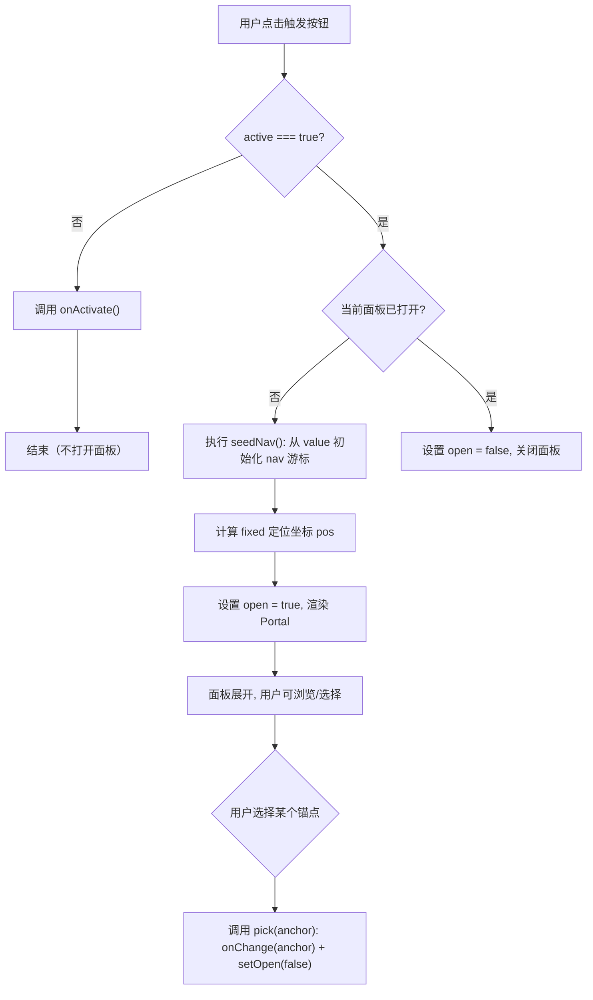
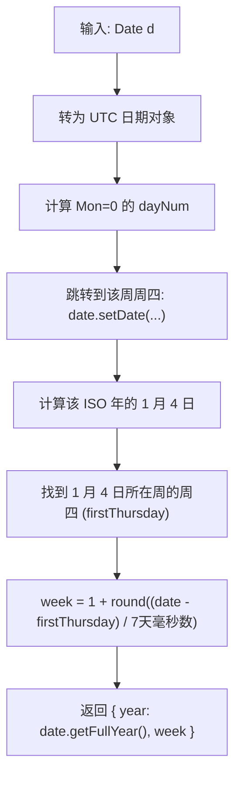

# ScopePicker.tsx 需求说明

> 源文件：`src/ui/viewer/components/ScopePicker.tsx` ｜ 类型：源码（前端组件） ｜ 行数：439 ｜ 所属模块：Viewer UI — 统计面板 ｜ 分析日期：2026-07-23

## 1. 文件定位总述

ScopePicker 是 Viewer 统计面板中的日期范围选择器组件，为用户提供按日、周、月、季四种粒度选取时间锚点（anchor）的能力。组件对外暴露一个触发按钮，点击后在按钮正下方弹出 Portal 化的浮层面板，内含对应粒度的日历/网格供用户选择。选中的锚点字符串通过 `onChange` 回调上报给父组件，由父组件驱动后端统计查询。组件不直接发起任何 API 请求，是一个纯 UI 交互与日期计算的纯前端组件。其核心难点在于 ISO 8601 周的正确计算（含跨年边界处理）以及浮层面板的定位与关闭逻辑。

## 2. 功能需求

### 2.1 触发按钮

| 编号 | 需求描述（系统应当…） | 触发条件 / 输入 | 处理规则与输出 | 证据 |
|------|----------------------|----------------|---------------|------|
| FR-Trigger-01 | 在触发按钮上显示当前所选时间锚点的标签，格式为"粒度前缀 + 锚点值" | 组件渲染 | day 模式直接显示 YYYY-MM-DD；week 模式显示 ISO 年-周（如 `2026-01`）；month 模式显示 YYYY-MM；quarter 模式显示 YYYY-QN。前缀根据 locale 区分：中文用"日/周/月/季"，英文用"D/W/M/Q" | `src/ui/viewer/components/ScopePicker.tsx:124-150` |
| FR-Trigger-02 | 当前激活的粒度按钮应当具有 `is-active` 视觉样式 | `active` prop 为 `true` | 按钮附加 `is-active` CSS 类 | `src/ui/viewer/components/ScopePicker.tsx:413` |
| FR-Trigger-03 | 非激活粒度的按钮点击时，仅切换页面到该粒度，不打开浮层面板 | `active` 为 `false` 时点击按钮 | 调用 `onActivate()`，不改变 `open` 状态 | `src/ui/viewer/components/ScopePicker.tsx:193-196` |
| FR-Trigger-04 | 已激活粒度的按钮点击时，切换浮层面板的展开/收起状态 | `active` 为 `true` 时点击按钮 | 首次打开时从当前 `value` 初始化导航游标（`seedNav`），之后切换 `open` 布尔值 | `src/ui/viewer/components/ScopePicker.tsx:193-196` |
| FR-Trigger-05 | 按钮应具备正确的 ARIA 属性以标识弹窗关系 | 渲染 | `aria-haspopup="dialog"`，`aria-expanded={open}` | `src/ui/viewer/components/ScopePicker.tsx:416-417` |

### 2.2 浮层面板（Popover）

| 编号 | 需求描述（系统应当…） | 触发条件 / 输入 | 处理规则与输出 | 证据 |
|------|----------------------|----------------|---------------|------|
| FR-Popover-01 | 浮层面板应通过 React Portal 渲染到 `<body>`，避免被父级 overflow 裁剪 | `open` 为 `true` 且定位坐标已计算 | 使用 `createPortal(..., document.body)`，面板使用 `position: fixed` | `src/ui/viewer/components/ScopePicker.tsx:422-435` |
| FR-Popover-02 | 面板应定位在触发按钮正下方，水平位置自动夹紧不超出视口 | 面板打开时 | 顶部距按钮底部 6px；左坐标 = `max(8, min(视口宽-面板宽-8, 按钮左坐标))` | `src/ui/viewer/components/ScopePicker.tsx:203-218` |
| FR-Popover-03 | 面板在窗口滚动或缩放时应重新计算定位 | 浏览器 scroll/resize 事件 | 在 capture 阶段监听 scroll，重新执行 `recompute` | `src/ui/viewer/components/ScopePicker.tsx:211-214` |
| FR-Popover-04 | 面板宽度应根据当前粒度模式使用预设值 | 渲染 | day=248px, week=300px, month=232px, quarter=208px | `src/ui/viewer/components/ScopePicker.tsx:33` |
| FR-Popover-05 | 点击面板外部或按 Escape 键应关闭面板 | 面板打开时 | mousedown 事件命中既非 trigger wrapper 也非 popover 时关闭；keydown `Escape` 时关闭 | `src/ui/viewer/components/ScopePicker.tsx:223-238` |
| FR-Popover-06 | 面板角色为 dialog | 渲染 | `role="dialog"` | `src/ui/viewer/components/ScopePicker.tsx:425` |

### 2.3 日模式（Day Mode）

| 编号 | 需求描述（系统应当…） | 触发条件 / 输入 | 处理规则与输出 | 证据 |
|------|----------------------|----------------|---------------|------|
| FR-Day-01 | 渲染以周一为起始的月历网格，含星期表头 | mode=day，面板打开 | 表头行显示周一至周日（中文：一~日；英文：Mo~Su），月1日前用空白单元格对齐 | `src/ui/viewer/components/ScopePicker.tsx:280-316` |
| FR-Day-02 | 网格单元格显示日期数字，可点击选择 | 点击日期按钮 | 调用 `pick(ymd(date))` 即 `onChange` 回调并关闭面板 | `src/ui/viewer/components/ScopePicker.tsx:294-296` |
| FR-Day-03 | 当日及之后的所有日期应禁用不可选 | date > today | 按钮添加 `is-disabled` 类，设置 `disabled=true` | `src/ui/viewer/components/ScopePicker.tsx:292-293` |
| FR-Day-04 | 当天应标记 `is-today` 样式 | 格式化后的日期 === today 的 ymd | 附加 `is-today` CSS 类 | `src/ui/viewer/components/ScopePicker.tsx:293` |
| FR-Day-05 | 当前选中值应标记 `is-selected` 样式 | 格式化后的日期 === value | 附加 `is-selected` CSS 类 | `src/ui/viewer/components/ScopePicker.tsx:293` |
| FR-Day-06 | 提供年份前后导航和月份前后导航 | 点击头部导航按钮 | `«`/`»` 切换年份；`‹`/`›` 切换月份；当导航目标超过当前年/月时对应按钮禁用 | `src/ui/viewer/components/ScopePicker.tsx:299-311` |
| FR-Day-07 | 导航游标独立于已提交值，允许用户浏览其他月份而不改变选中值 | 面板打开 | `nav` state 独立于 `value`，仅在面板打开时从 `value` 初始化 | `src/ui/viewer/components/ScopePicker.tsx:170-185` |

### 2.4 周模式（Week Mode）

| 编号 | 需求描述（系统应当…） | 触发条件 / 输入 | 处理规则与输出 | 证据 |
|------|----------------------|----------------|---------------|------|
| FR-Week-01 | 渲染某 ISO 年的全部 ISO 周编号（1~52/53），每行 7 个 | mode=week，面板打开 | 使用 `isoWeeksInYear(year)` 计算周数，每个单元格显示周号 | `src/ui/viewer/components/ScopePicker.tsx:326-351` |
| FR-Week-02 | 每个周单元格点击后提交该周的周一日期（YYYY-MM-DD）作为锚点 | 点击周号按钮 | 调用 `pick(ymd(mondayOfIsoWeek(year, w)))` | `src/ui/viewer/components/ScopePicker.tsx:340` |
| FR-Week-03 | 未来周应禁用不可选 | 周一日期 > 本周周一 | 添加 `is-disabled` 类并 `disabled` | `src/ui/viewer/components/ScopePicker.tsx:335` |
| FR-Week-04 | 选中比较应基于 ISO 年-周对，而非日历年，确保跨年边界周高亮正确 | value 是周一日期 | 将 value 的周一日期通过 `isoWeekOf` 转为 `{year, week}` 后与网格年-周比较 | `src/ui/viewer/components/ScopePicker.tsx:336` |
| FR-Week-05 | 导航游标基于 ISO 年而非日历年 | 面板打开时初始化导航 | `seedNav` 中对 week 模式使用 `isoWeekOf` 获取 ISO 年 | `src/ui/viewer/components/ScopePicker.tsx:174-180` |
| FR-Week-06 | 提供年份前后导航，下一年按钮在当前年及之后禁用 | 点击头部导航 | `»` 当 year >= today.getFullYear() 时禁用 | `src/ui/viewer/components/ScopePicker.tsx:344-347` |
| FR-Week-07 | 鼠标悬停周号时显示该周的具体周一日期（tooltip） | hover | `title={ymd(monday)}` | `src/ui/viewer/components/ScopePicker.tsx:341` |
| FR-Week-08 | 年标题应显示该年总周数 | 渲染头部 | 格式为 `YYYY · NW`，如 `2026 · 53W` | `src/ui/viewer/components/ScopePicker.tsx:347` |

### 2.5 月模式（Month Mode）

| 编号 | 需求描述（系统应当…） | 触发条件 / 输入 | 处理规则与输出 | 证据 |
|------|----------------------|----------------|---------------|------|
| FR-Month-01 | 渲染某年的 12 个月份，每行 3 个，使用本地化月份名 | mode=month，面板打开 | 中文：1月~12月；英文：Jan~Dec；每个单元格提交 `YYYY-MM` 锚点 | `src/ui/viewer/components/ScopePicker.tsx:357-376` |
| FR-Month-02 | 未来月份应禁用不可选 | year > 当前年 或 (同年且 month > 当前月) | 添加 `is-disabled` 类并 `disabled` | `src/ui/viewer/components/ScopePicker.tsx:362` |
| FR-Month-03 | 当前月份标记 `is-today`，选中月份标记 `is-selected` | 渲染 | 比较逻辑见 `src/ui/viewer/components/ScopePicker.tsx:363-364` | `src/ui/viewer/components/ScopePicker.tsx:363-364` |
| FR-Month-04 | 提供年份前后导航，下一年在当前年及之后禁用 | 点击头部导航 | 同 week 模式的导航禁用逻辑 | `src/ui/viewer/components/ScopePicker.tsx:369-372` |

### 2.6 季度模式（Quarter Mode）

| 编号 | 需求描述（系统应当…） | 触发条件 / 输入 | 处理规则与输出 | 证据 |
|------|----------------------|----------------|---------------|------|
| FR-Quarter-01 | 渲染某年的 4 个季度，每行 1 个，显示 Q 编号和月份范围子标题 | mode=quarter，面板打开 | 锚点格式 `YYYY-Q`（Q=1~4）；子标题中文为"1–3月"等，英文为"Jan–Mar"等 | `src/ui/viewer/components/ScopePicker.tsx:383-406` |
| FR-Quarter-02 | 未来季度应禁用不可选 | year > 当前年 或 (同年且 quarter > 当前季) | 添加 `is-disabled` 类并 `disabled` | `src/ui/viewer/components/ScopePicker.tsx:389` |
| FR-Quarter-03 | 当前季度标记 `is-today`，选中季度标记 `is-selected` | 渲染 | 当前季度 = `floor(today.getMonth()/3)+1` | `src/ui/viewer/components/ScopePicker.tsx:390-391` |
| FR-Quarter-04 | 提供年份前后导航，下一年在当前年及之后禁用 | 点击头部导航 | 同 week/month 模式 | `src/ui/viewer/components/ScopePicker.tsx:399-402` |

## 3. 业务规则与约束

| 编号 | 规则描述 | 证据 |
|------|---------|------|
| BR-01 | 所有粒度模式统一禁止选择未来时间段——"未来"的定义为"严格晚于当前时刻所在周期" | `src/ui/viewer/components/ScopePicker.tsx:292`（day）、`:335`（week）、`:362`（month）、`:389`（quarter） |
| BR-02 | 日历计算使用查看者本地时区（`new Date()` 而非 UTC），ISO 周计算在 UTC 上执行以避免 DST 导致的日边界偏移 | `src/ui/viewer/components/ScopePicker.tsx:36-40`（todayMidnight 使用本地时间）、`:74`（isoWeekOf 在 UTC 上工作） |
| BR-03 | ISO 8601 周定义：周一起始，含 1 月 4 日的周为第 1 周；年初和年末的日期可能属于不同 ISO 年的周编号 | `src/ui/viewer/components/ScopePicker.tsx:55-116`（ISO 8601 注释及算法实现） |
| BR-04 | 年度 ISO 周数为 52 或 53——长年条件：该年第一天为周四，或该年为闰年且第一天为周三 | `src/ui/viewer/components/ScopePicker.tsx:113-116` |
| BR-05 | 触发按钮的两次点击语义不同：首次点击（非激活状态）切换激活模式，二次点击（已激活状态）才打开/关闭浮层 | `src/ui/viewer/components/ScopePicker.tsx:193-196` |
| BR-06 | 主题和国际化完全依赖共享 CSS token 和 `useLocale` hook，暗色/亮色及中/英跟随全局设置 | `src/ui/viewer/components/ScopePicker.tsx:15-16`（注释说明）、`:153`（useLocale 调用） |

## 4. 对外暴露

### 4.1 Props 接口（`ScopePickerProps`）

| Prop 名称 | 类型 | 必填 | 方向 | 用途 |
|-----------|------|------|------|------|
| `mode` | `ScopeMode`（`'day' \| 'week' \| 'month' \| 'quarter'`） | 是 | 入 | 当前组件实例的粒度模式 |
| `value` | `string` | 是 | 入 | 当前已选锚点（day: YYYY-MM-DD, week: YYYY-MM-DD(周一), month: YYYY-MM, quarter: YYYY-Q） |
| `onChange` | `(anchor: string) => void` | 是 | 出 | 用户选择新锚点时回调，传入锚点字符串 |
| `active` | `boolean` | 是 | 入 | 该粒度是否为页面当前活跃的 scope |
| `onActivate` | `() => void` | 是 | 出 | 非激活状态下点击按钮时回调，通知父组件切换到该粒度 |

### 4.2 导出类型

| 导出名 | 类型 | 用途 |
|--------|------|------|
| `ScopeMode` | 类型别名 | 联合类型 `'day' \| 'week' \| 'month' \| 'quarter'`，供父组件引用 |

### 4.3 导出函数

| 导出名 | 签名 | 用途 |
|--------|------|------|
| `ScopePicker` | `(props: ScopePickerProps) => JSX.Element` | 默认导出组件（推断：通过 `export function`） |

## 5. 依赖关系

| 依赖项 | 方向 | 作用 |
|--------|------|------|
| `react`（React, useState, useCallback, useEffect, useLayoutEffect, useMemo, useRef, createPortal） | 入 | 核心 UI 框架及 Portal 能力 |
| `react-dom`（createPortal） | 入 | 浮层面板渲染到 body |
| `../hooks/useLocale` | 入 | 国际化（locale）和翻译函数（t），驱动 label 前缀和星期/月份名 |
| 父组件（推断为统计面板容器） | 出 | 提供 props 并消费 onChange/onActivate 回调 |

## 6. 数据结构

### 6.1 内部状态

| 状态变量 | 类型 | 初始值 | 用途 |
|---------|------|--------|------|
| `open` | `boolean` | `false` | 浮层面板展开状态 |
| `pos` | `{ top: number; left: number } \| null` | `null` | 浮层面板固定定位坐标 |
| `nav` | `{ year: number; month: number }` | 由 `seedNav` 计算 | 导航游标，控制面板当前显示的年/月；`month` 仅在 day 模式有意义 |
| `today` | `Date`（memo） | `todayMidnight()` | 当天零点，组件挂载期间稳定不变 |

### 6.2 日期辅助函数输出

| 函数 | 输出 | 语义 |
|------|------|------|
| `ymd(d: Date)` | `string`（`YYYY-MM-DD`） | 日期格式化为标准字符串 |
| `mondayOf(d: Date)` | `Date` | 给定日期所在周的周一 |
| `isoWeekOf(d: Date)` | `{ year: number; week: number }` | 给定日期的 ISO 8601 周编号 |
| `mondayOfIsoWeek(isoYear, week)` | `Date` | ISO 周编号逆运算——某年第 N 周的周一日期 |
| `isoWeeksInYear(year)` | `number`（52 或 53） | 某年的 ISO 周总数 |
| `buttonLabel(mode, value)` | `string` | 触发按钮上的展示标签 |

## 7. 复杂逻辑图示

### 7.1 按钮点击处理流程

图示说明：按钮的两次点击语义——首次点击仅激活模式，二次点击才展开面板；面板展开时从当前已提交值初始化导航游标。

### 7.2 ISO 周计算逻辑

图示说明：ISO 8601 周编号算法核心——"跳到周四"技巧，先定位到目标日期所在周的周四，再与该 ISO 年第一个周四比较得到周序号。

## 8. 逆向备注

| 编号 | 备注 |
|------|------|
| RN-01 | 组件注释中提到"Theming/i18n ride entirely on the shared CSS tokens + useLocale"，但代码中仅使用了 `useLocale`，CSS token 的具体来源未在文件内体现（推断由外部样式文件提供） |
| RN-02 | `today` 使用 `useMemo` 在挂载时固定，这意味着如果用户保持页面打开跨过午夜，面板不会自动将前一天标记为未来——这是有意为之的性能优化，注释明确说明"stable for the mount"（`src/ui/viewer/components/ScopePicker.tsx:166`） |
| RN-03 | week 模式的锚点存储为周一的 YYYY-MM-DD 格式，但按钮标签通过 `isoWeekOf` 逆向转为 ISO 年-周显示，这是后端与前端之间的格式约定，后端以周一日期为窗口锚点 |
| RN-04 | `pad2` 辅助函数使用 `String.padStart(2, '0')`，是文件内唯一的非组件级工具函数，未导出 |
| RN-05 | 面板的星期表头始终显示完整 7 天（周一至周日），即使月历可能不需要第 6~7 列，这是为了保持布局稳定 |
| RN-06 | 注释提到 `month` 仅在 day 模式的导航游标中有意义（`src/ui/viewer/components/ScopePicker.tsx:163-164`），week/month/quarter 模式的 nav.month 始终为 0，这是合理的设计选择但不是强约束 |
