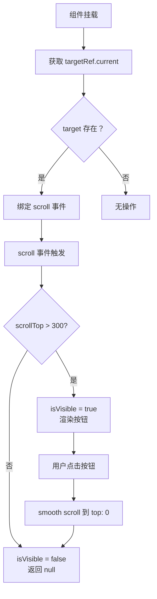

# ScrollToTop.tsx 需求说明

> 源文件：src/ui/viewer/components/ScrollToTop.tsx ｜ 类型：源码（React 组件） ｜ 行数：60 ｜ 所属模块：ui/viewer ｜ 分析日期：2026-07-23

## 1. 文件定位总述

本文件实现"回到顶部"浮动按钮组件。组件监听指定容器的 scroll 事件，当滚动位置超过 300px 时显示按钮，点击后平滑滚动到顶部。按钮使用向上箭头 SVG 图标，并通过 aria-label 提供无障碍描述。它是 Viewer UI 中提升长列表浏览体验的辅助交互控件。

## 2. 功能需求

| 编号 | 需求描述（系统应当…） | 触发条件 / 输入 | 处理规则与输出 | 证据 |
|------|----------------------|----------------|---------------|------|
| FR-STT-01 | 系统应当在目标容器滚动超过 300px 时显示回到顶部按钮 | targetRef.current.scrollTop > 300 | setIsVisible(true) | `src/ui/viewer/components/ScrollToTop.tsx:14-17` |
| FR-STT-02 | 系统应当在目标容器滚动不超过 300px 时隐藏按钮 | scrollTop <= 300 | setIsVisible(false)，组件返回 null | `src/ui/viewer/components/ScrollToTop.tsx:14-17,37` |
| FR-STT-03 | 系统应当在点击按钮时平滑滚动到目标容器顶部 | 用户点击按钮 | target.scrollTo({ top: 0, behavior: 'smooth' }) | `src/ui/viewer/components/ScrollToTop.tsx:27-35` |
| FR-STT-04 | 系统应当在组件挂载时绑定 scroll 事件监听器，卸载时移除 | useEffect | addEventListener / removeEventListener 配对 | `src/ui/viewer/components/ScrollToTop.tsx:22-24` |

## 3. 业务规则与约束

| 编号 | 规则描述 | 证据 |
|------|---------|------|
| BR-STT-01 | 显示阈值固定为 300px | `src/ui/viewer/components/ScrollToTop.tsx:16` |
| BR-STT-02 | useEffect 依赖数组为空，仅在挂载时绑定监听器——如果 targetRef.current 在挂载后才赋值则监听器不会生效 | `src/ui/viewer/components/ScrollToTop.tsx:25` |

## 4. 对外暴露

### Props（ScrollToTopProps）

| 属性 | 类型 | 必填 | 说明 |
|------|------|------|------|
| targetRef | React.RefObject\<HTMLDivElement \| null\> | 是 | 需要监听滚动的容器 ref |

## 5. 依赖关系

- **内部依赖**：`../hooks/useLocale`（t 翻译函数）
- **外部依赖**：react
- **被依赖**：App 组件或列表容器组件

## 6. 数据结构

不适用。

## 7. 复杂逻辑图示

ScrollToTop 组件的显示/隐藏和滚动逻辑如上图所示。

## 8. 逆向备注

- useEffect 依赖数组为空 `[]`，这意味着只在组件挂载时获取一次 targetRef.current。如果 targetRef 在首次渲染时为 null（如条件渲染的容器），后续赋值后不会自动绑定事件。推断父组件确保在 ScrollToTop 挂载前目标容器已存在。
- 按钮使用向上箭头 SVG 内联图标（polyline points="18 15 12 9 6 15"），符合 Lucide/Feather 图标风格的 chevron-up。
- aria-label 使用 i18n 的 t('common.scrollTop')，支持国际化。
