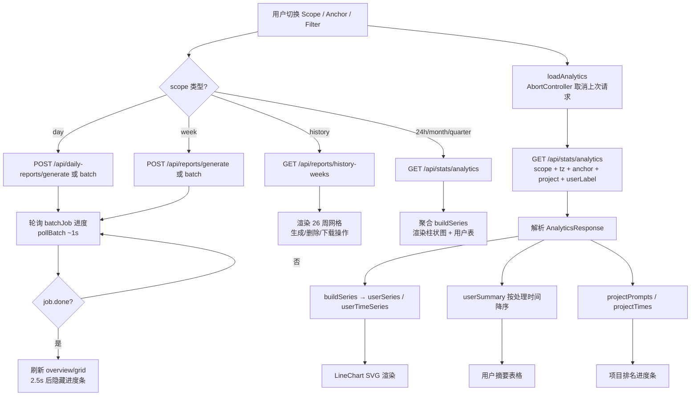

# StatsPage.tsx 需求说明

> 源文件：src/ui/viewer/components/StatsPage.tsx ｜ 类型：源码 ｜ 行数：1350 ｜ 所属模块：UI Viewer ｜ 分析日期：2026-07-23

## 1. 文件定位总述

StatsPage 是 claude-mem Viewer UI 的统计分析主页面，承载全部数据可视化与报表管理能力。它以六档时间范围（24h / day / week / month / quarter / history）驱动全局数据聚合，通过后端 `/api/stats/analytics` 接口获取原始数据后，在前端完成按用户、按项目、按时间桶的聚合与图表渲染。该组件同时集成了日报、周报及历史周报的生成/删除/下载/批量操作，并通过 localStorage 持久化用户偏好（scope、batchJob 恢复信息）。它居于 Viewer 页面的核心位置，是唯一的数据统计与报表管理入口。

## 2. 功能需求

### 2.1 时间范围选择与数据加载

| 编号 | 需求描述（系统应当…） | 触发条件 / 输入 | 处理规则与输出 | 证据 |
|------|----------------------|----------------|---------------|------|
| FR-Scope-01 | 系统应当提供 6 档时间范围切换（24h / day / week / month / quarter / history），并将用户选择持久化到 localStorage | 用户点击 scope 标签页 | scope 值写入 `localStorage('claude-mem.statsScope')`；24h/history 为普通按钮，其余 4 档为 ScopePicker（支持选择具体日期/周/月/季度） | `src/ui/viewer/components/StatsPage.tsx:12-14` |
| FR-Scope-02 | 系统应当在 scope 或 anchor 变更时自动向后端请求分析数据 | scope/anchor/project filter/userLabel filter 任一变更 | 通过 AbortController 取消上一次未完成请求，构造 URLSearchParams（scope、tz、anchor、project、userLabel）后调用 `authFetch('/api/stats/analytics')`；`tz` 取 `-new Date().getTimezoneOffset()` | `src/ui/viewer/components/StatsPage.tsx:372-405` |
| FR-Scope-03 | 系统应当在每次挂载时为 day/week/month/quarter 四档初始化当前时段锚点 | 组件首次渲染 | day 锚点 = 今日本地日期（YYYY-MM-DD）；week 锚点 = 本周一；month 锚点 = 当月（YYYY-MM）；quarter 锚点 = 当季（YYYY-Q）；anchor 不持久化，每次挂载重置为当前 | `src/ui/viewer/components/StatsPage.tsx:61-74,361-366` |
| FR-Scope-04 | 系统应当向后端传递客户端时区偏移，确保日/周/月/季度边界按用户本地时区计算 | 每次数据请求 | `params.set('tz', String(-new Date().getTimezoneOffset()))` | `src/ui/viewer/components/StatsPage.tsx:381` |

### 2.2 数据可视化

| 编号 | 需求描述（系统应当…） | 触发条件 / 输入 | 处理规则与输出 | 证据 |
|------|----------------------|----------------|---------------|------|
| FR-Chart-01 | 系统应当渲染每日每用户 AI 处理时间柱状图 | analytics 数据加载完成且 userTimeSeries 非空 | SVG 柱状图：X 轴 = chartBuckets，Y 轴 = 最大值自动缩放，支持 5 级网格线（0/25%/50%/75%/100%），每个用户一条颜色柱形，共享图例控制隐藏/显示 | `src/ui/viewer/components/StatsPage.tsx:1071-1077` |
| FR-Chart-02 | 系统应当渲染每日每用户提示词数柱状图 | analytics 数据加载完成且 userSeries 非空 | 同 FR-Chart-01 结构，Y 轴直接计数，无图例（`showLegend: false`） | `src/ui/viewer/components/StatsPage.tsx:1078-1083` |
| FR-Chart-03 | 系统应当将后端数据点聚合到 chartBuckets 对应的时间桶 | analytics 数据到达 | `bucketKeyOf` 函数：hour 粒度原样保留；day 粒度原样保留；week 粒度将日期映射到该周的周一（ISO 周一） | `src/ui/viewer/components/StatsPage.tsx:22-30,419-441` |
| FR-Chart-04 | 系统应当为每个用户分配固定颜色，并允许通过图例复选框切换可见性 | 用户点击图例复选框 | 10 种预定义颜色按用户顺序分配（`USER_COLORS`）；`hiddenUsers` Set 管理隐藏状态 | `src/ui/viewer/components/StatsPage.tsx:16-19,290-293` |
| FR-Chart-05 | 系统应当自适应容器宽度调整图表尺寸 | 容器宽度变化 | ResizeObserver 监听 `lineChartRef.current`，更新 `chartWidth` 状态 | `src/ui/viewer/components/StatsPage.tsx:407-415` |
| FR-Chart-06 | 系统应当在 24h scope 下以不同颜色区分今日/前日的小时标签 | 渲染 X 轴标签 | `dayLabelColor`：桶匹配今天日期时使用 `--stats-hour-label-current` CSS 变量，否则使用 `--stats-hour-label-previous` | `src/ui/viewer/components/StatsPage.tsx:76-82` |

### 2.3 汇总卡片与用户摘要表

| 编号 | 需求描述（系统应当…） | 触发条件 / 输入 | 处理规则与输出 | 证据 |
|------|----------------------|----------------|---------------|------|
| FR-Summary-01 | 系统应当展示 7 张汇总卡片：总观测数、总会话数、总提示词数、人均提示词、总处理时间、人均处理时间、总 Token 数 | analytics 数据加载完成 | 从 analytics 直接取值或从 userSummary 聚合计算；人均 = 总和 / 用户数 | `src/ui/viewer/components/StatsPage.tsx:1057-1065` |
| FR-Summary-02 | 系统应当渲染用户摘要表格，按 AI 处理时间降序排列 | analytics 数据加载完成 | 列：用户名、项目数、提示词数、日均提示词、观测数、摘要数、日均处理时间、总处理时间；日均按 `summaryBusinessDays`（工作日）计算；零活动用户被过滤 | `src/ui/viewer/components/StatsPage.tsx:453-476,1089-1121` |
| FR-Summary-03 | 系统应当支持按项目维度展示提示词排名或 AI 时间排名（仅全局视图） | 全局视图（currentFilter 为空）且有项目数据 | 两档 Tab 切换：prompts / time；按水平进度条降序展示，标注项目编辑者 | `src/ui/viewer/components/StatsPage.tsx:1303-1343` |

### 2.4 日报管理（Day scope）

| 编号 | 需求描述（系统应当…） | 触发条件 / 输入 | 处理规则与输出 | 证据 |
|------|----------------------|----------------|---------------|------|
| FR-Daily-01 | 系统应当在 Day scope + 全局视图下展示日报状态表 | scope='day' 且 isAllProjects 且 dailyOverview 非空 | 每用户一行：日期、用户名、操作按钮（生成/重新生成/删除/下载）、查看链接；无内容用户灰显禁用；已完成日报显示"已完成"锁定标记 | `src/ui/viewer/components/StatsPage.tsx:1124-1213` |
| FR-Daily-02 | 系统应当支持为指定用户和日期生成日报 | 用户点击生成按钮 | POST `/api/daily-reports/generate`（user, date, tz）；生成期间该行按钮禁用（busy key = `user\|date`） | `src/ui/viewer/components/StatsPage.tsx:636-649` |
| FR-Daily-03 | 系统应当支持批量生成所有用户的日报 | 用户点击"批量生成"按钮 | POST `/api/daily-reports/batch` → 获取 jobId → 轮询进度 → 刷新 overview | `src/ui/viewer/components/StatsPage.tsx:1128-1134` |
| FR-Daily-04 | 系统应当在进入 Day scope 时自动拉取日报状态总览 | scope 变为 'day' | GET `/api/daily-reports/overview?tz=...&date=<selected day>` | `src/ui/viewer/components/StatsPage.tsx:666-669` |

### 2.5 周报管理（Week scope）

| 编号 | 需求描述（系统应当…） | 触发条件 / 输入 | 处理规则与输出 | 证据 |
|------|----------------------|----------------|---------------|------|
| FR-Weekly-01 | 系统应当在 Week scope + 全局视图下展示周报状态表 | scope='week' 且 isAllProjects 且 weeklyOverview 非空 | 与日报表格式一致；busy key = `user\|week` | `src/ui/viewer/components/StatsPage.tsx:1216-1301` |
| FR-Weekly-02 | 系统应当支持为指定用户和周生成/删除周报 | 用户点击操作按钮 | POST `/api/reports/generate` 或 `/api/reports/delete` | `src/ui/viewer/components/StatsPage.tsx:690-717` |
| FR-Weekly-03 | 系统应当支持批量生成所有用户的周报 | 用户点击"批量生成"按钮 | POST `/api/reports/batch`（mode='week', week）→ 轮询 | `src/ui/viewer/components/StatsPage.tsx:1220-1224` |

### 2.6 历史视图（History scope）

| 编号 | 需求描述（系统应当…） | 触发条件 / 输入 | 处理规则与输出 | 证据 |
|------|----------------------|----------------|---------------|------|
| FR-History-01 | 系统应当在 History scope 下展示按用户分 Tab 的周度/月度历史表格和趋势图 | scope='history' 且 analytics 有历史数据 | 用户 Tab 按总 AI 时间降序；每个用户显示周趋势柱状图（TrendBars）和月趋势柱状图，以及周表和月表 | `src/ui/viewer/components/StatsPage.tsx:818-1038` |
| FR-History-02 | 系统应当为活跃用户加载 26 周历史周报网格 | History scope + 选择用户后 | GET `/api/reports/history-weeks?user=...&tz=...`；返回每周行：week_start/week_end、hasContent、has_report、complete、stats | `src/ui/viewer/components/StatsPage.tsx:515-528` |
| FR-History-03 | 系统应当支持单周生成/重新生成/删除/打开/下载周报 | 用户在周报网格中操作 | 生成：POST `/api/reports/generate`（user, week, tz, force）；删除需 confirm 确认；打开/下载通过 window.open 新标签页 | `src/ui/viewer/components/StatsPage.tsx:532-555` |
| FR-History-04 | 系统应当支持批量刷新全部历史周 | 用户点击"刷新全部历史周"按钮 | POST `/api/reports/batch`（mode='history', user）→ 轮询进度 → 刷新 grid | `src/ui/viewer/components/StatsPage.tsx:962-967` |

### 2.7 批量任务管理

| 编号 | 需求描述（系统应当…） | 触发条件 / 输入 | 处理规则与输出 | 证据 |
|------|----------------------|----------------|---------------|------|
| FR-Batch-01 | 系统应当提供统一的批量任务驱动器，支持 POST 启动 → jobId → 轮询 → 完成 | 用户触发日报/周报/历史批量操作 | POST 返回 `{jobId, total}`；每 ~1s 轮询 GET `.../:jobId`；404 视为 job 过期自动完成；完成后 2.5s 隐藏进度条 | `src/ui/viewer/components/StatsPage.tsx:564-614` |
| FR-Batch-02 | 系统应当在进度条中显示已完成/跳过/失败计数和已用时间 | 批量任务运行中 | 每秒 tick 驱动 elapsed time 更新；首个任务未完成时进度条为不确定态动画 | `src/ui/viewer/components/StatsPage.tsx:750-772` |
| FR-Batch-03 | 系统应当将运行中的 batchJob 状态持久化到 localStorage，以便页面刷新后恢复进度 | 批量任务启动 | `localStorage.setItem('claude-mem.activeBatch', JSON.stringify({...}))`；组件挂载时检查并恢复轮询 | `src/ui/viewer/components/StatsPage.tsx:728-737` |

### 2.8 加载与错误状态

| 编号 | 需求描述（系统应当…） | 触发条件 / 输入 | 处理规则与输出 | 证据 |
|------|----------------------|----------------|---------------|------|
| FR-Load-01 | 系统应当在首次加载时显示全页 loading spinner，后续 scope 切换时保持页面内容不卸载 | loading=true 且 analytics 为 null | 首次加载显示 spinner；scope 切换时仅更新数据不清空页面，保留 scope bar | `src/ui/viewer/components/StatsPage.tsx:804-806` |
| FR-Load-02 | 系统应当在请求失败且无缓存数据时显示错误信息和重试按钮 | error 非 null 且 analytics 为 null | 显示错误消息 + 重试按钮；有缓存数据时仍显示页面 | `src/ui/viewer/components/StatsPage.tsx:807-809` |
| FR-Load-03 | 系统应当在数据为空时显示"无数据"横幅 | totalObservations=0 且 totalSessions=0 | 显示 no-data banner，但 scope bar 始终可见 | `src/ui/viewer/components/StatsPage.tsx:814-815,1053-1055` |

## 3. 业务规则与约束

- **scope 持久化规则**：用户选择的 scope 写入 `localStorage('claude-mem.statsScope')`，但 anchor（日期锚点）不持久化——推断：（每次加载从当前时间计算，确保新会话默认回到"今天"）`src/ui/viewer/components/StatsPage.tsx:345-366`
- **日报/周报可见性规则**：日报表仅在 `scope='day'` 且 `isAllProjects`（currentFilter 为空）时展示；周报同理限 `scope='week'` 且 `isAllProjects` `src/ui/viewer/components/StatsPage.tsx:1124,1216`
- **完成锁定规则**：日报/周报/历史周报标记为 `complete`（已涵盖整时段）后，生成按钮替换为"已完成"文字标记，用户需先删除才能重新生成 `src/ui/viewer/components/StatsPage.tsx:1176-1177`
- **无内容禁用规则**：所选时段无活动内容（`hasContent=false`）的用户/周行灰显（opacity 0.5/0.55），生成按钮不可见 `src/ui/viewer/components/StatsPage.tsx:1167,982-987`
- **忙态粒度规则**：日报 busy key 为 `user|date`，周报 busy key 为 `user|week`——同一用户不同日期/周的操作互不阻塞 `src/ui/viewer/components/StatsPage.tsx:637-638,691-692`
- **用户排序规则**：用户摘要表按 AI 处理时间降序；历史视图用户 Tab 按总 AI 时间降序；日报/周报表按有内容优先 + 字母序 `src/ui/viewer/components/StatsPage.tsx:475,508,1148`
- **token 传递规则**：查看/下载/打开报告时从 `localStorage('claude-mem-admin-token')` 取 token 附加到 URL query `src/ui/viewer/components/StatsPage.tsx:976-981`
- **颜色分配规则**：10 种预定义颜色按用户在 `uniqueUsers` 数组中的索引循环分配 `src/ui/viewer/components/StatsPage.tsx:16-19,437`

## 4. 对外暴露

### Props

| 名称 | 类型 | 说明 |
|------|------|------|
| `currentFilter` | `string` | 当前项目过滤条件；空字符串表示全局视图 |
| `userLabelFilter` | `string \| null` | 用户标签过滤条件（可选） |

### 内部组件

| 名称 | 类型 | 说明 |
|------|------|------|
| `LineChart` | 函数组件 | 通用 SVG 多用户柱状图，支持图例控制 |
| `TrendBars` | 函数组件 | 单系列 SVG 柱状图，用于历史视图趋势 |

## 5. 依赖关系

### 上游依赖（输入）

| 来源 | 用途 |
|------|------|
| `AnalyticsResponse` 类型（`../types`） | 后端分析数据的数据结构定义 |
| `DailyReportOverview` / `WeeklyReportOverview` / `HistoryWeekRow` 类型 | 报表状态数据结构 |
| `useLocale` hook | 国际化翻译函数 `t()` |
| `authFetch` | 带认证的 HTTP 请求封装 |
| `ScopePicker` / `ScopeMode` | 日期选择器组件 |

### 下游调用（API）

| 端点 | 方法 | 用途 |
|------|------|------|
| `/api/stats/analytics` | GET | 获取分析数据 |
| `/api/reports/history-weeks` | GET | 获取历史周报网格 |
| `/api/reports/generate` | POST | 生成周报/历史周报 |
| `/api/reports/delete` | POST | 删除周报 |
| `/api/reports/batch` | POST | 批量生成周报/历史周报 |
| `/api/reports/download` | GET | 下载周报 |
| `/api/reports/:jobId` | GET | 轮询批量任务状态 |
| `/api/daily-reports/overview` | GET | 获取日报状态总览 |
| `/api/daily-reports/generate` | POST | 生成日报 |
| `/api/daily-reports/delete` | POST | 删除日报 |
| `/api/daily-reports/batch` | POST | 批量生成日报 |
| `/api/daily-reports/download` | GET | 下载日报 |
| `/report` / `/daily-report` | GET | 查看报告页面 |

## 6. 数据结构

- **`Scope`**：`'24h' | 'day' | 'week' | 'month' | 'quarter' | 'history'`，全局时间范围类型 `src/ui/viewer/components/StatsPage.tsx:12`
- **`batchJob` 状态**：`{ section, total, generated, skipped, failed, running, startedAt }`，跟踪批量任务进度 `src/ui/viewer/components/StatsPage.tsx:317-319`
- **`hiddenUsers`**：`Set<string>`，控制图表中隐藏的用户集合 `src/ui/viewer/components/StatsPage.tsx:290`
- **`LineSeries`**：`{ user_label, color, points: number[], maxVal: number }`，图表数据系列 `src/ui/viewer/components/StatsPage.tsx:109-114`

## 7. 复杂逻辑图示

上图展示了 StatsPage 的核心数据流：Scope 切换驱动不同 API 调用，analytics 数据到达后在前端完成聚合与图表渲染，批量任务通过 POST→polling→done 的三阶段模式运行。

## 8. 逆向备注

- **推断**：`anchor` 不持久化的设计意图是确保新会话打开时默认回到当前时段，而非停留在用户上次查看的历史时段。依据：`src/ui/viewer/components/StatsPage.tsx:357-360` 注释明确说明 "Not persisted — a fresh load always starts from now"
- **代码与注释不一致**：LineChart 组件的注释标题为 "LineChart: reusable SVG line chart"，但实际渲染的是柱状图（bar chart），函数内注释也多处提到 "Bar chart" `src/ui/viewer/components/StatsPage.tsx:108,138-139`
- **推断**：24h scope 下图表 X 轴标签仅显示小时数（如 "9"、"14"），而日期用于分组着色，是设计上的有意区分——便于用户识别"今天"vs"昨天"的小时分布 `src/ui/viewer/components/StatsPage.tsx:42-47`
- **未在代码中证实**：`ScopePicker` 组件的 popover 交互细节（展开/收起动画、键盘导航等）不在本文件中，属于独立组件的实现范围
- **注释与代码一致性**：日报/周报表的表头列名复用了 `t('stats.dailyDate')` 等日报相关翻译 key，尽管周报表的实际语义是周范围——推断：（为减少翻译条目数量而复用）`src/ui/viewer/components/StatsPage.tsx:1230-1234`
