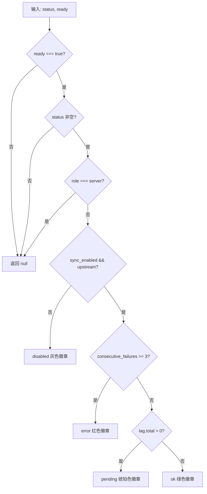

# SyncStatusBadge.tsx 需求说明

> 源文件：src/ui/viewer/components/SyncStatusBadge.tsx ｜ 类型：源码 ｜ 行数：63 ｜ 所属模块：viewer/components ｜ 分析日期：2026-07-23

## 1. 文件定位总述

SyncStatusBadge 是 Header 区域的同步状态徽章组件，以 T-25 标识定义。它根据 useSyncStatus Hook 提供的状态快照，以不同颜色和文字呈现客户端同步代理的健康状态。该组件遵循严格的可见性规则：server 模式隐藏、首次加载未完成时隐藏，其余根据同步启停、错误和延迟状态分级展示。

## 2. 功能需求

| 编号 | 需求描述（系统应当…） | 触发条件 / 输入 | 处理规则与输出 | 证据 |
|------|----------------------|----------------|---------------|------|
| FR-SSB-01 | 系统应当在首次加载未完成时隐藏徽章 | `ready === false` | 返回 null，不渲染任何内容 | `src/ui/viewer/components/SyncStatusBadge.tsx:23` |
| FR-SSB-02 | 系统应当在 server 角色时隐藏徽章 | `status.role === 'server'` | 返回 null | `src/ui/viewer/components/SyncStatusBadge.tsx:25` |
| FR-SSB-03 | 系统应当在同步未启用或无上游时显示低对比度的"已停用"徽章 | `sync_enabled === false` 或 `upstream` 为空 | 渲染 `sync-badge-disabled` 样式，显示 `sync.statusDisabled` 翻译文本 | `src/ui/viewer/components/SyncStatusBadge.tsx:27-34` |
| FR-SSB-04 | 系统应当在连续失败 >= 3 次时显示红色"错误"徽章 | `consecutive_failures >= 3` | 渲染 `sync-badge-error` 样式，title 属性包含 last_error 和 upstream | `src/ui/viewer/components/SyncStatusBadge.tsx:36-46` |
| FR-SSB-05 | 系统应当在有待推送条目时显示琥珀色"待处理"徽章 | `lag.total > 0` | 渲染 `sync-badge-pending` 样式，显示 "Sync: {n} pending" | `src/ui/viewer/components/SyncStatusBadge.tsx:48-55` |
| FR-SSB-06 | 系统应当在正常状态时显示绿色"已同步"徽章 | 以上条件均不满足 | 渲染 `sync-badge-ok` 样式，显示 `sync.statusOk` | `src/ui/viewer/components/SyncStatusBadge.tsx:57-62` |

## 3. 业务规则与约束

- 优先级判断链：ready → status null → server role → disabled → error(>=3) → pending → ok。`src/ui/viewer/components/SyncStatusBadge.tsx:23-62`
- 所有文本均通过 `useLocale().t()` 获取，支持中英文。
- 每种状态都带一个圆点指示器（`sync-badge-dot`）。

## 4. 对外暴露

**Props 接口**：
| 属性 | 类型 | 说明 |
|------|------|------|
| `status` | `SyncStatus \| null` | 同步状态快照（来自 useSyncStatus） |
| `ready` | `boolean` | 首次加载是否完成 |

## 5. 依赖关系

- 上游：`useLocale` Hook、`SyncStatus` 类型（来自 useSyncStatus）
- 下游：Header 组件

## 7. 复杂逻辑图示

## 8. 逆向备注

- 组件代码与文件头部注释（T-25 标识及可见性规则说明）完全一致，注释准确描述了代码逻辑。
