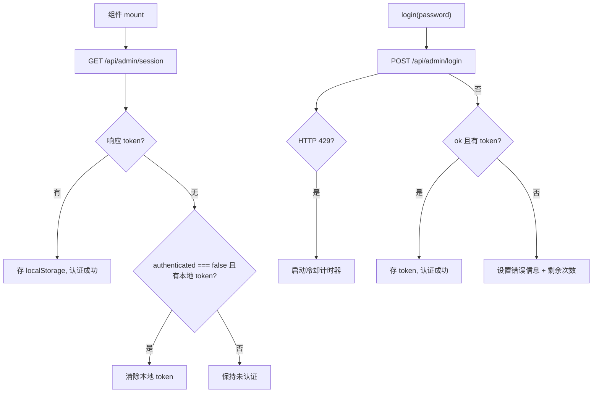

# useAuth.ts 需求说明

> 源文件：src/ui/viewer/hooks/useAuth.ts ｜ 类型：源码 ｜ 行数：178 ｜ 所属模块：viewer/hooks ｜ 分析日期：2026-07-23

## 1. 文件定位总述

useAuth 是 Viewer 的认证管理 Hook，处理登录、登出、会话检查和速率限制。它在组件挂载时通过 `/api/admin/session` 探测认证状态（即使无本地 token 也发起请求，支持本地自动登录 X-005），登录时处理 token 持久化、429 速率限制冷却和账户锁定。该 Hook 是 LoginPage 和 App 路由守卫的核心依赖。

## 2. 功能需求

| 编号 | 需求描述（系统应当…） | 触发条件 / 输入 | 处理规则与输出 | 证据 |
|------|----------------------|----------------|---------------|------|
| FR-UA-01 | 系统应当在挂载时探测认证状态 | 组件 mount | 请求 `GET /api/admin/session`，若有 localStorage token 则附带 Authorization 头 | `src/ui/viewer/hooks/useAuth.ts:36-75` |
| FR-UA-02 | 系统应当在 session 响应中收到新 token 时持久化 | 响应 body.token 存在 | 写入 localStorage key `claude-mem-admin-token` | `src/ui/viewer/hooks/useAuth.ts:51-52` |
| FR-UA-03 | 系统应当在响应表明未认证时清除本地 token | body.authenticated === false 且本地有 token | 从 localStorage 移除 token | `src/ui/viewer/hooks/useAuth.ts:53-54` |
| FR-UA-04 | 系统应当在登录成功时持久化 token | POST /api/admin/login 成功且 body.token 存在 | localStorage 存储 token，状态设为 isAuthenticated=true | `src/ui/viewer/hooks/useAuth.ts:109-118` |
| FR-UA-05 | 系统应当在 429 响应时启动冷却计时器 | HTTP 429 | 根据 retry_after_sec 设置冷却倒计时，到期后自动清除错误状态 | `src/ui/viewer/hooks/useAuth.ts:122-138` |
| FR-UA-06 | 系统应当在登出时清除 token 并通知后端 | 调用 logout() | 移除 localStorage token，best-effort 调用 POST /api/admin/logout | `src/ui/viewer/hooks/useAuth.ts:151-169` |
| FR-UA-07 | 系统应当在组件卸载时清理冷却定时器和请求 | 组件 unmount | 清除 cooldown timeout 和 AbortController | `src/ui/viewer/hooks/useAuth.ts:172-175` |
| FR-UA-08 | 系统应当在登录请求失败时显示连接错误 | fetch 网络异常 | 设置 error 为 "Cannot reach server — is the worker running?" | `src/ui/viewer/hooks/useAuth.ts:87-93` |
| FR-UA-09 | 系统应当在后端返回非 JSON 时给出明确提示 | response.json() 解析失败 | 设置 error 含 "Server returned unexpected response" 提示 | `src/ui/viewer/hooks/useAuth.ts:97-107` |

## 3. 业务规则与约束

- localStorage key 为 `claude-mem-admin-token`，导出为常量 `TOKEN_KEY`。`src/ui/viewer/hooks/useAuth.ts:11`
- 登录用户名固定为 "admin"（硬编码在请求体中）。`src/ui/viewer/hooks/useAuth.ts:85`
- session 探测始终执行（不依赖本地 token 存在与否），支持 X-005 本地自动登录场景。`src/ui/viewer/hooks/useAuth.ts:33-34`
- 429 冷却使用 `setTimeout`，冷却结束后仅清除 retryAfterSec 和 error，不自动重试登录。`src/ui/viewer/hooks/useAuth.ts:133-135`
- AbortController 确保组件卸载时取消进行中的 fetch。`src/ui/viewer/hooks/useAuth.ts:38-39`

## 4. 对外暴露

| 导出名称 | 类型 | 说明 |
|---------|------|------|
| `TOKEN_KEY` | `string` 常量 | localStorage token key |
| `useAuth` | `() => AuthState & { login, logout }` | Hook 函数 |

**AuthState 结构**：
- `isAuthenticated: boolean`
- `isLoading: boolean`
- `error: string | null`
- `attemptsRemaining: number | null`
- `retryAfterSec: number | null`

**额外暴露**：
- `login: (password: string) => Promise<boolean>`
- `logout: () => Promise<void>`

## 5. 依赖关系

- 上游：无外部依赖（直接使用 fetch，不使用 authFetch——因为认证请求本身不携带 token）
- 下游：LoginPage 组件（消费 login 和状态）、App 根组件（路由守卫）

## 7. 复杂逻辑图示

## 8. 逆向备注

- 登录和 session 探测使用原生 `fetch` 而非 `authFetch`，因为此时可能还没有有效 token（authFetch 会尝试附带 token）。`src/ui/viewer/hooks/useAuth.ts:41, 82`
- 429 冷却的 `setTimeout` 回调中做了 stale check：只在 `retryAfterSec` 仍等于原始值时清除，避免后续操作覆盖。`src/ui/viewer/hooks/useAuth.ts:134`
