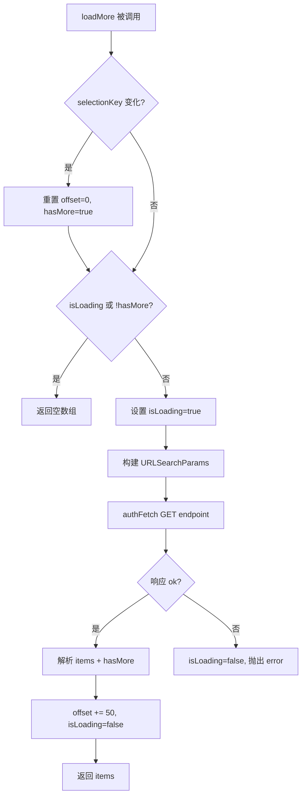

# usePagination.ts 需求说明

> 源文件：src/ui/viewer/hooks/usePagination.ts ｜ 类型：源码 ｜ 行数：148 ｜ 所属模块：viewer/hooks ｜ 分析日期：2026-07-23

## 1. 文件定位总述

usePagination 是 Viewer 的分页数据加载 Hook，为 observations、summaries、prompts 三种数据类型各自管理独立的分页游标和加载状态。它通过"选择签名"机制在项目筛选器或日期范围变化时自动重置游标，并支持 T-22 userLabel 服务端过滤。该 Hook 是 Feed 无限滚动的数据引擎。

## 2. 功能需求

| 编号 | 需求描述（系统应当…） | 触发条件 / 输入 | 处理规则与输出 | 证据 |
|------|----------------------|----------------|---------------|------|
| FR-UP-01 | 系统应当为三种数据类型提供独立的分页状态 | 调用 `usePagination()` | 返回三个独立的 { isLoading, hasMore, error, loadMore } 对象 | `src/ui/viewer/hooks/usePagination.ts:138-148` |
| FR-UP-02 | 系统应当在筛选条件变化时自动重置分页游标 | currentFilter、dateBounds 或 userLabel 变化 | 检测 selectionKey 变化后 offset 归零、hasMore 恢复为 true | `src/ui/viewer/hooks/usePagination.ts:51-60` |
| FR-UP-03 | 系统应当以 50 条为一批从后端分页加载数据 | 调用 loadMore() | 请求 `GET {endpoint}?offset={n}&limit=50&project={filter}&dateStart=...&dateEnd=...&userLabel=...` | `src/ui/viewer/hooks/usePagination.ts:69-86` |
| FR-UP-04 | 系统应当在正在加载或无更多数据时阻止重复加载 | isLoading 或 !hasMore | 直接返回空数组，不发起请求 | `src/ui/viewer/hooks/usePagination.ts:62-64` |
| FR-UP-05 | 系统应当在请求失败时重置 isLoading 以允许重试 | fetch 失败 | setState 设置 isLoading=false 并抛出 error | `src/ui/viewer/hooks/usePagination.ts:116-128` |
| FR-UP-06 | 系统应当支持 T-22 服务端用户标签过滤 | userLabel 非空 | 在请求参数中附加 `userLabel`，服务端按标签过滤 | `src/ui/viewer/hooks/usePagination.ts:83-86` |
| FR-UP-07 | 系统应当在筛选条件变化时阻止重复请求 | selectionKey 变化且 isLoading | 仍重置游标但跳过本次加载（下次 Feed 滚动触发时加载） | `src/ui/viewer/hooks/usePagination.ts:53-60` |

## 3. 业务规则与约束

- 选择签名（selectionKey）格式为 `{currentFilter}|{start}-{end}|{userLabel}`，任一维度变化触发重置。`src/ui/viewer/hooks/usePagination.ts:28-30`
- 每页大小为 `UI.PAGINATION_PAGE_SIZE = 50`。`src/ui/viewer/hooks/usePagination.ts:71`
- 使用 `stateRef` 和 `offsetRef` 避免 useCallback 闭包中的过期状态问题。`src/ui/viewer/hooks/usePagination.ts:47-48`
- 三个端点硬编码在 `API_ENDPOINTS` 常量中：`/api/observations`、`/api/summaries`、`/api/prompts`。`src/ui/viewer/hooks/usePagination.ts:139-141`

## 4. 对外暴露

| 导出名称 | 类型 | 说明 |
|---------|------|------|
| `DateBounds` | interface | 日期范围 `{ start: number, end: number }` |
| `usePagination` | `(currentFilter, dateBounds?, userLabel?) => { observations, summaries, prompts }` | Hook 函数 |

**每种数据类型的返回值**：
- `isLoading: boolean`
- `hasMore: boolean`
- `error: Error | null`
- `loadMore: () => Promise<TItem[]>`

## 5. 依赖关系

- 上游：`authFetch`、`UI` 常量（PAGINATION_PAGE_SIZE、LOAD_MORE_THRESHOLD）、`API_ENDPOINTS` 常量
- 下游：App 根组件（传递给 Feed 组件的 onLoadMore）

## 7. 复杂逻辑图示

## 8. 逆向备注

- 注释解释了为什么错误时必须重置 isLoading：否则 Feed spinner 永久旋转，IntersectionObserver 哨兵不会重新渲染，用户无法重试。`src/ui/viewer/hooks/usePagination.ts:117-125`
- 注释有重复（"Reset isLoading on error..." 出现两次），可能是合并冲突遗留。`src/ui/viewer/hooks/usePagination.ts:117, 120`
