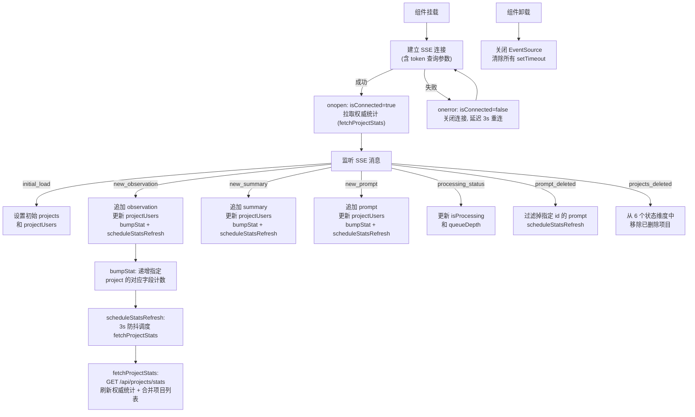

# useSSE.ts 需求说明

> 源文件：src/ui/viewer/hooks/useSSE.ts ｜ 类型：源码 ｜ 行数：310 ｜ 所属模块：Viewer UI / Hooks ｜ 分析日期：2026-07-23

## 1. 文件定位总述

useSSE 是 claude-mem Viewer 的核心数据层 hook，负责通过 Server-Sent Events (SSE) 与后端 Worker 建立实时数据通道，维护前端的全局数据状态。它向上为 App 组件提供 observations、summaries、prompts 三个数据流以及项目列表、项目统计、处理状态等衍生状态；向下通过 `authFetch` 拉取权威统计数据，通过 EventSource 订阅 `/stream` 端点的实时事件。useSSE 是 Viewer 所有实时数据更新的唯一入口，也是项目删除、统计计数等跨组件操作的协调中枢。

## 2. 功能需求

| 编号 | 需求描述（系统应当…） | 触发条件 / 输入 | 处理规则与输出 | 证据 |
|------|----------------------|----------------|---------------|------|
| FR-Connect-01 | 系统应当在组件挂载时自动建立 SSE 连接 | 组件首次渲染 | 创建 EventSource 实例，连接 `/stream` 端点（可选携带 token 查询参数） | `useSSE.ts:104-123` |
| FR-Connect-02 | 系统应当在 SSE 连接携带认证 token（若存在） | 连接建立时 | 从 `localStorage` 读取 `TOKEN_KEY`，存在时追加 `?token=` 查询参数 | `useSSE.ts:114-120` |
| FR-Reconnect-01 | 系统应当在 SSE 连接断开后自动重连 | 连接 error 事件触发 | 关闭当前连接，延迟 `SSE_RECONNECT_DELAY_MS`（3000ms）后重新建立连接 | `useSSE.ts:136-146` |
| FR-Reconnect-02 | 系统应当在每次（重）连接成功后拉取权威项目统计 | SSE `onopen` 事件触发 | 调用 `fetchProjectStats()`，刷新 `projectStats` 和 `projectUsers`，合并项目列表 | `useSSE.ts:124-133` |
| FR-InitLoad-01 | 系统应当处理 `initial_load` 事件，设置初始项目列表和用户映射 | 收到 `initial_load` 事件 | 用 `data.projects` 替换项目列表，用 `data.projectUsers` 替换项目-用户映射 | `useSSE.ts:152-160` |
| FR-NewObs-01 | 系统应当处理 `new_observation` 事件，追加新观察记录到数据流头部 | 收到 `new_observation` 事件 | 去重追加项目名，更新项目-用户映射，将 observation 前置插入 `observations` 数组，递增统计计数，调度延迟刷新 | `useSSE.ts:162-175` |
| FR-NewSum-01 | 系统应当处理 `new_summary` 事件，追加新总结到数据流头部 | 收到 `new_summary` 事件 | 同 FR-NewObs-01 逻辑，作用于 summaries 数组和 summaries 统计字段 | `useSSE.ts:177-189` |
| FR-NewPrompt-01 | 系统应当处理 `new_prompt` 事件，追加新提示词到数据流头部 | 收到 `new_prompt` 事件 | 同 FR-NewObs-01 逻辑，作用于 prompts 数组和 prompts 统计字段 | `useSSE.ts:192-205` |
| FR-Processing-01 | 系统应当处理 `processing_status` 事件，更新处理状态和队列深度 | 收到 `processing_status` 事件 | 当 `data.isProcessing` 为布尔值时，更新 `isProcessing` 和 `queueDepth` 状态 | `useSSE.ts:207-213` |
| FR-PromptDel-01 | 系统应当处理 `prompt_deleted` 事件，从本地数据流中移除已删除的提示词 | 收到 `prompt_deleted` 事件 | 当 `data.id` 为数值时，从 `prompts` 数组中过滤掉该 id 的条目，调度延迟统计刷新 | `useSSE.ts:215-227` |
| FR-ProjectsDel-01 | 系统应当处理 `projects_deleted` 事件，从所有本地数据结构和映射中移除已删除项目 | 收到 `projects_deleted` 事件 | 从 observations、summaries、prompts、projects、projectUsers、projectStats 中过滤掉指定项目集 | `useSSE.ts:229-255` |
| FR-StatsFetch-01 | 系统应当从后端 API 拉取权威项目统计数据 | SSE 连接打开后，以及统计变更事件后延迟 3 秒 | GET `/api/projects/stats`，响应体包含 `projects`（ProjectStat 映射）和 `projectUsers`（项目-用户映射），刷新对应状态，合并项目列表去重 | `useSSE.ts:68-93` |
| FR-StatsDebounce-01 | 系统应当在每次统计变更事件后以 3 秒防抖调度一次权威统计刷新 | 每次统计变更后 | 取消前一次延迟刷新（如有），设置新的 3000ms 超时后执行 `fetchProjectStats` | `useSSE.ts:96-102` |
| FR-Prune-01 | 系统应当暴露 `pruneByProjects` 方法供外部主动裁剪本地状态 | 外部调用 `pruneByProjects(projectsToRemove)` | 从所有数据数组和映射中移除指定项目集（与 FR-ProjectsDel-01 逻辑相同，用于本地即时刷新） | `useSSE.ts:281-295` |
| FR-Cleanup-01 | 系统应当在组件卸载时关闭 SSE 连接并清理所有定时器 | 组件 unmount | 关闭 EventSource，清除重连超时和统计刷新超时 | `useSSE.ts:262-272` |
| FR-UserLabel-01 | 系统应当在收到新事件时增量更新项目-用户映射（projectUsers） | 每次收到含 `user_label` 的新事件 | 仅当 `user_label` 非空且与已有值不同时更新映射；空/缺失的 label 不覆盖已有值 | `useSSE.ts:166-170` |

## 3. 业务规则与约束

| 编号 | 规则描述 | 证据 |
|------|---------|------|
| BR-01 | SSE 重连延迟固定为 3000ms（`TIMING.SSE_RECONNECT_DELAY_MS`），无指数退避机制 | `useSSE.ts:145` |
| BR-02 | 权威统计刷新采用 3000ms 防抖策略，避免短时间内频繁拉取 | `useSSE.ts:98-101` |
| BR-03 | 认证 token 通过查询参数传递（而非 header），因为 EventSource API 不支持自定义请求头 | `useSSE.ts:110-113` |
| BR-04 | `fetchProjectStats` 的网络失败静默降级，不向上抛出错误，依赖增量 SSE 累积 | `useSSE.ts:89-92` |
| BR-05 | 新项目名通过 `addProjectIfNew` 去重添加，不会产生重复项目条目 | `useSSE.ts:35-37` |
| BR-06 | `prompt_deleted` 广播面向所有客户端（包括发起者），是删除操作的单一事实来源 | `useSSE.ts:216-218` 注释 |
| BR-07 | `projects_deleted` 事件过滤所有 6 个状态维度（observations, summaries, prompts, projects, projectUsers, projectStats），确保无幽灵数据残留 | `useSSE.ts:232-254` |
| BR-08 | `projectUsers` 中空或缺失的 `user_label` 不覆盖已有映射值，防止垃圾数据污染已知标签 | `useSSE.ts:167-168` |

## 4. 对外暴露

| 类型 | 名称 | 说明 |
|------|------|------|
| Hook 返回值 | `observations` | Observation[] 实时观察记录数组 |
| Hook 返回值 | `summaries` | Summary[] 实时会话总结数组 |
| Hook 返回值 | `prompts` | UserPrompt[] 实时提示词数组 |
| Hook 返回值 | `projects` | string[] 项目名列表 |
| Hook 返回值 | `projectUsers` | Record<string, string \| null> 项目到用户标签的映射 |
| Hook 返回值 | `projectStats` | Record<string, ProjectStat> 项目统计数据 |
| Hook 返回值 | `isProcessing` | boolean 后端是否正在处理 |
| Hook 返回值 | `queueDepth` | number 处理队列深度 |
| Hook 返回值 | `isConnected` | boolean SSE 是否已连接 |
| Hook 返回值 | `pruneByProjects` | (projects: string[]) => void 本地裁剪方法 |
| 导出接口 | `ProjectStat` | 项目统计结构（observations, summaries, prompts, total, latest） |

## 5. 依赖关系

| 方向 | 依赖项 | 用途 |
|------|--------|------|
| 上游 | App.tsx | 被 App 调用以获取全局数据状态 |
| 下游 | `/stream` SSE 端点 | 实时数据推送 |
| 下游 | `/api/projects/stats` REST 端点 | 权威统计数据拉取 |
| 下游 | `authFetch` | 认证 HTTP 请求工具 |
| 下游 | `API_ENDPOINTS.STREAM` | SSE 连接 URL 常量 |
| 下游 | `TIMING.SSE_RECONNECT_DELAY_MS` | 重连延迟配置 |
| 下游 | `TOKEN_KEY`（from useAuth） | localStorage 中认证 token 的键名 |
| 上游（类型） | Observation, Summary, UserPrompt, StreamEvent | 数据类型定义 |

## 6. 数据结构

```typescript
// 项目统计计数（useSSE.ts:8-14）
interface ProjectStat {
  observations: number;  // 观察记录数
  summaries: number;     // 会话总结数
  prompts: number;       // 提示词数
  total: number;         // 总数（三者之和）
  latest: number;        // 最新记录的 epoch 时间戳
}

// 状态维度概览
// observations: Observation[]         — 实时观察记录
// summaries: Summary[]               — 实时会话总结
// prompts: UserPrompt[]              — 实时提示词
// projects: string[]                 — 项目名列表（去重）
// projectUsers: Record<string, string|null> — 项目→用户标签映射
// projectStats: Record<string, ProjectStat> — 项目统计
// isProcessing: boolean              — 后端处理中标志
// queueDepth: number                 — 处理队列深度
// isConnected: boolean               — SSE 连接标志
```

## 7. 复杂逻辑图示



useSSE 的核心逻辑是一个 SSE 事件驱动的状态机：连接建立后拉取权威统计作为基准，后续通过实时事件增量更新状态，并以 3 秒防抖策略周期性校准统计数。

## 8. 逆向备注

| 编号 | 备注 |
|------|------|
| RN-01 | SSE 重连采用固定 3 秒延迟，无指数退避或最大重试次数限制——推断：在网络长时间不可达时会产生高频重连请求，但实际影响有限因为 EventSource 本身有内置重连机制 |
| RN-02 | `fetchProjectStats` 在 `useEffect`（依赖 `[]`）的 `onopen` 中调用，但 `fetchProjectStats` 本身不是 `useCallback` 包裹的稳定引用——每次渲染都会产生新闭包，不过由于 `onopen` 仅在连接事件触发时调用一次，实际不会造成问题 |
| RN-03 | `bumpStat` 中 `epoch > cur.latest` 的比较使用的是 SSE 事件中的 `created_at_epoch`——推断：在极端情况下（时钟不同步），增量计数的 `latest` 时间戳可能不准确，但防抖刷新机制会在 3 秒后用权威数据修正 |
| RN-04 | `scheduleStatsRefresh` 的 3000ms 延迟是硬编码的（`useSSE.ts:98`），未使用 `TIMING` 常量——推断：这是一个独立于 `TIMING.SSE_RECONNECT_DELAY_MS` 的配置决策，可能是有意为之 |
| RN-05 | `projectUsers` 映射的更新策略是"仅当非空时写入，空值不覆盖已有值"（`useSSE.ts:167-168`），但 `initial_load` 事件中 `projectUsers` 为 `?? {}` 时会直接替换整个映射——推断：`initial_load` 的 projectUsers 来自服务端全量快照，具有最高优先级；增量事件则采用保守策略 |
