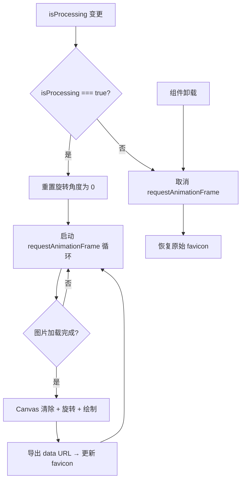

# useSpinningFavicon.ts 需求说明

> 源文件：src/ui/viewer/hooks/useSpinningFavicon.ts ｜ 类型：源码 ｜ 行数：84 ｜ 所属模块：viewer/hooks ｜ 分析日期：2026-07-23

## 1. 文件定位总述

useSpinningFavicon 是一个视觉效果 Hook，在 AI 正在处理任务时将浏览器标签页的 favicon 替换为旋转动画。它利用 Canvas 绘制旋转的 logo，通过 requestAnimationFrame 驱动动画循环，将每帧渲染为 data URL 写入 `<link rel="icon">`。处理完成后恢复原始 favicon。这是一个纯视觉反馈机制，不影响业务逻辑。

## 2. 功能需求

| 编号 | 需求描述（系统应当…） | 触发条件 / 输入 | 处理规则与输出 | 证据 |
|------|----------------------|----------------|---------------|------|
| FR-USF-01 | 系统应当在处理状态下启动 favicon 旋转动画 | `isProcessing === true` | 创建 Canvas 32x32，加载 logo 图片，以 requestAnimationFrame 循环旋转并更新 favicon | `src/ui/viewer/hooks/useSpinningFavicon.ts:64-66` |
| FR-USF-02 | 系统应当在每帧将 logo 旋转 (2*PI/90) 弧度 | 动画帧回调 | 绘制前清除 Canvas，以中心点旋转后绘制图片，导出 PNG data URL | `src/ui/viewer/hooks/useSpinningFavicon.ts:51-61` |
| FR-USF-03 | 系统应当在非处理状态下停止动画并恢复原始 favicon | `isProcessing === false` | 取消 requestAnimationFrame，将 favicon href 恢复为原始值 | `src/ui/viewer/hooks/useSpinningFavicon.ts:67-74` |
| FR-USF-04 | 系统应当在组件卸载时清理动画帧 | 组件 unmount | 取消 requestAnimationFrame，防止内存泄漏 | `src/ui/viewer/hooks/useSpinningFavicon.ts:77-82` |
| FR-USF-05 | 系统应当在每次进入处理状态时重置旋转角度 | `isProcessing` 从 false 变为 true | `rotationRef.current = 0` 重置旋转 | `src/ui/viewer/hooks/useSpinningFavicon.ts:65` |

## 3. 业务规则与约束

- logo 图片源固定为 `claude-mem-logomark.webp`。`src/ui/viewer/hooks/useSpinningFavicon.ts:19`
- Canvas 和 Image 元素通过 useRef 缓存，避免重复创建。`src/ui/viewer/hooks/useSpinningFavicon.ts:11-16`
- 图片未加载完成时（`image.complete === false`）跳过绘制，等待下一帧。`src/ui/viewer/hooks/useSpinningFavicon.ts:46-48`
- 如果页面没有 `<link rel="icon">`，则动态创建一个。`src/ui/viewer/hooks/useSpinningFavicon.ts:37-41`

## 4. 对外暴露

| 导出名称 | 类型 | 说明 |
|---------|------|------|
| `useSpinningFavicon` | `(isProcessing: boolean) => void` | Hook 函数，接受处理状态标志 |

## 5. 依赖关系

- 上游：传入 `isProcessing` 布尔值（通常来自 SSE 的 `processing_status` 事件）
- 下游：无，副作用直接操作 DOM

## 7. 复杂逻辑图示

## 8. 逆向备注

- 旋转速度为每 90 帧完成一圈（约 1.5 秒/圈 @60fps）。`src/ui/viewer/hooks/useSpinningFavicon.ts:51`
- 动画循环未设帧率上限，完全依赖 requestAnimationFrame 的浏览器调度。
