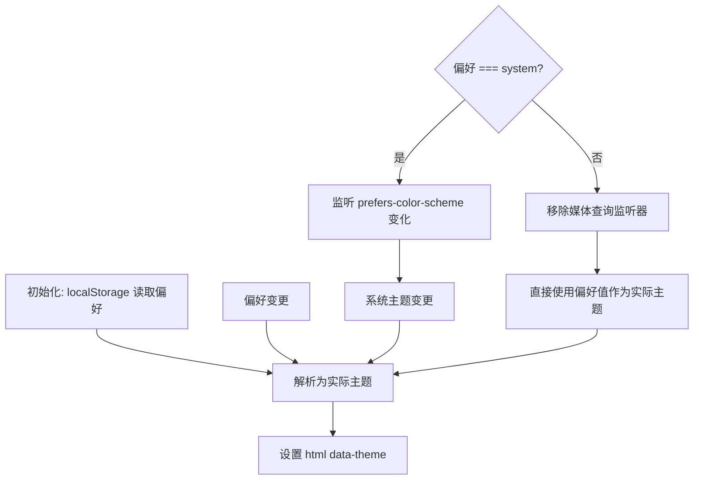

# useTheme.ts 需求说明

> 源文件：src/ui/viewer/hooks/useTheme.ts ｜ 类型：源码 ｜ 行数：73 ｜ 所属模块：viewer/hooks ｜ 分析日期：2026-07-23

## 1. 文件定位总述

useTheme 是 Viewer 的主题管理 Hook，控制应用的外观主题在 light/dark/system 三种模式间切换。它将用户偏好持久化到 localStorage，将解析后的实际主题（light 或 dark）应用到 `<html>` 的 `data-theme` 属性上，并在 system 模式下监听系统主题变化事件实现实时跟随。

## 2. 功能需求

| 编号 | 需求描述（系统应当…） | 触发条件 / 输入 | 处理规则与输出 | 证据 |
|------|----------------------|----------------|---------------|------|
| FR-UT-01 | 系统应当从 localStorage 读取用户主题偏好并初始化 | 组件挂载 | 调用 `getStoredPreference()`，无效值默认 'system' | `src/ui/viewer/hooks/useTheme.ts:33` |
| FR-UT-02 | 系统应当将偏好解析为实际主题（light 或 dark） | 偏好为 'system' 时 | 调用 `getSystemTheme()` 检测 `prefers-color-scheme` 媒体查询 | `src/ui/viewer/hooks/useTheme.ts:8-11` |
| FR-UT-03 | 系统应当在偏好变更时更新 `<html data-theme>` | `preference` 状态变化 | 计算 resolvedTheme 并设为 `document.documentElement` 的 `data-theme` 属性 | `src/ui/viewer/hooks/useTheme.ts:41` |
| FR-UT-04 | 系统应当在 system 模式下监听操作系统主题变化 | `preference === 'system'` | 添加 `matchMedia('prefers-color-scheme: dark').change` 监听器，实时更新 resolvedTheme 和 data-theme | `src/ui/viewer/hooks/useTheme.ts:44-56` |
| FR-UT-05 | 系统应当在偏好非 system 时移除媒体查询监听器 | `preference !== 'system'` | 直接 return，不添加监听器（cleanup 移除已存在的） | `src/ui/viewer/hooks/useTheme.ts:45` |
| FR-UT-06 | 系统应当将主题偏好持久化到 localStorage | 调用 `setThemePreference(preference)` | 写入 key 为 `claude-mem-theme` 的 localStorage 条目 | `src/ui/viewer/hooks/useTheme.ts:60` |

## 3. 业务规则与约束

- localStorage key 为 `claude-mem-theme`，有效值为 `'system' | 'light' | 'dark'`，无效值回退到 'system'。`src/ui/viewer/hooks/useTheme.ts:6, 13-23`
- 服务端渲染安全：`getSystemTheme()` 在 `typeof window === 'undefined'` 时返回 'dark'。`src/ui/viewer/hooks/useTheme.ts:9`
- localStorage 读写失败时 console.warn 但不中断流程。`src/ui/viewer/hooks/useTheme.ts:20, 63`

## 4. 对外暴露

| 导出名称 | 类型 | 说明 |
|---------|------|------|
| `ThemePreference` | type | `'system' \| 'light' \| 'dark'` |
| `ResolvedTheme` | type | `'light' \| 'dark'` |
| `useTheme` | `() => { preference, resolvedTheme, setThemePreference }` | Hook 函数 |

## 5. 依赖关系

- 上游：无外部依赖，仅使用 React 和浏览器 API
- 下游：ThemeToggle 组件（调用 setThemePreference）、App 根组件（消费 resolvedTheme）

## 7. 复杂逻辑图示

## 8. 逆向备注

- 在 system 模式下的媒体查询监听器，其 cleanup 依赖于 preference 的变化——当 preference 从 system 切换到其他值时，上一个 effect 的 cleanup 函数执行 `removeEventListener`。`src/ui/viewer/hooks/useTheme.ts:55`
