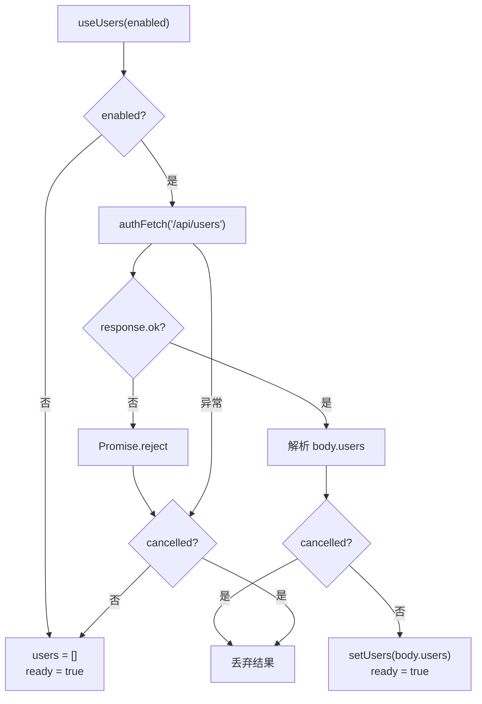

# useUsers.ts 需求说明

> 源文件：src/ui/viewer/hooks/useUsers.ts ｜ 类型：源码（React Hook） ｜ 行数：48 ｜ 所属模块：ui/viewer ｜ 分析日期：2026-07-23

## 1. 文件定位总述

本文件实现一个 React Hook，用于在 Server 模式下从 Worker 后端获取用户列表（`/api/users` 端点）。Hook 通过 enabled 标志控制是否发起请求——在 Client 模式下直接返回空列表。它支持取消机制（组件卸载时中止请求），并将 API 错误静默处理为空列表。返回的用户数据用于 UserSelector 组件的下拉选择。

## 2. 功能需求

| 编号 | 需求描述（系统应当…） | 触发条件 / 输入 | 处理规则与输出 | 证据 |
|------|----------------------|----------------|---------------|------|
| FR-UU-01 | 系统应当在 enabled=true 时从 `/api/users` 端点获取用户列表 | enabled 为 true | authFetch('/api/users') → 解析 body.users 数组 | `src/ui/viewer/hooks/useUsers.ts:31-37` |
| FR-UU-02 | 系统应当在 enabled=false 时直接返回空列表（Client 模式降级） | enabled 为 false | setUsers([]), setReady(true)，不发起网络请求 | `src/ui/viewer/hooks/useUsers.ts:25-29` |
| FR-UU-03 | 系统应当在请求失败或返回非 2xx 时静默降级为空列表 | fetch 异常或 !r.ok | catch 块设置 users=[] 和 ready=true | `src/ui/viewer/hooks/useUsers.ts:38-42` |
| FR-UU-04 | 系统应当在组件卸载时取消正在进行的请求 | useEffect cleanup | 通过 cancelled 标志位阻止 setState | `src/ui/viewer/hooks/useUsers.ts:30,43` |

## 3. 业务规则与约束

| 编号 | 规则描述 | 证据 |
|------|---------|------|
| BR-UU-01 | `/api/users` 端点为 Server 模式专用，Client 模式返回 404 | `src/ui/viewer/hooks/useUsers.ts:5-8` 注释 |

## 4. 对外暴露

| 导出项 | 类型 | 用途 |
|--------|------|------|
| `useUsers` | React Hook | 返回 { users: UserRow[], ready: boolean } |
| `UserRow` | interface | 用户行数据：{ user_label: string, sessions: number, last_active: number \| null } |
| `UseUsersResult` | interface | Hook 返回值类型 |

### 返回值结构

| 字段 | 类型 | 说明 |
|------|------|------|
| users | UserRow[] | 用户列表（可能为空） |
| ready | boolean | 数据是否已加载完成 |

## 5. 依赖关系

- **内部依赖**：`../utils/api`（authFetch）
- **外部依赖**：react
- **被依赖**：UserSelector 组件

## 6. 数据结构

**UserRow**: `{ user_label: string, sessions: number, last_active: number | null }`

## 7. 复杂逻辑图示

useUsers 的请求与降级流程，Server 模式请求失败或 Client 模式均返回空列表。

## 8. 逆向备注

- 注释标明 `/api/users` 聚合自 sdk_sessions 表（T-19），这是引用了内部表编号，推断文档或设计文档中有对应映射。
- ready 状态的设计允许 UI 展示加载骨架屏，在数据返回前显示占位内容。
- 使用 cancelled 标志位而非 AbortController，推断 authFetch 底层不支持 AbortSignal。
