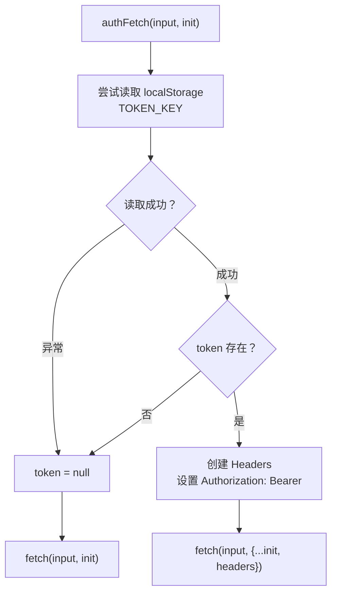

# api.ts 需求说明

> 源文件：src/ui/viewer/utils/api.ts ｜ 类型：源码（工具函数） ｜ 行数：22 ｜ 所属模块：ui/viewer ｜ 分析日期：2026-07-23

## 1. 文件定位总述

本文件提供前端 HTTP 请求的认证包装函数 authFetch。它在标准 fetch 之上自动附加 admin bearer token（存储在 localStorage 中），使前端在 Server 模式下能够通过认证访问受保护的后端 API。在 Client/standalone 模式下，若无 token 则透明降级为无认证的普通 fetch。

## 2. 功能需求

| 编号 | 需求描述（系统应当…） | 触发条件 / 输入 | 处理规则与输出 | 证据 |
|------|----------------------|----------------|---------------|------|
| FR-AF-01 | 系统应当从 localStorage 读取 admin token 并附加到请求的 Authorization 头 | localStorage 中存在 token | 读取 TOKEN_KEY 对应值，设置 `Authorization: Bearer <token>` | `src/ui/viewer/utils/api.ts:11-19` |
| FR-AF-02 | 系统应当在无 token 时透明降级为普通 fetch（不附加任何认证头） | localStorage 无 token 或不可用 | 直接返回 fetch(input, init)，不做任何修改 | `src/ui/viewer/utils/api.ts:16,21` |
| FR-AF-03 | 系统应当处理 localStorage 不可用的异常情况（如隐私模式限制） | localStorage.getItem 抛出异常 | catch 块静默忽略异常，token 设为 null，降级为无认证 fetch | `src/ui/viewer/utils/api.ts:12-14` |

## 3. 业务规则与约束

| 编号 | 规则描述 | 证据 |
|------|---------|------|
| BR-AF-01 | token 键名由 useAuth hook 中的 TOKEN_KEY 常量定义 | `src/ui/viewer/utils/api.ts:1` |

## 4. 对外暴露

| 导出项 | 类型 | 用途 |
|--------|------|------|
| `authFetch` | function | 带 admin token 认证的 fetch 包装器，签名与 fetch 一致 |

## 5. 依赖关系

- **内部依赖**：`../hooks/useAuth`（TOKEN_KEY 常量）
- **被依赖**：useStats、useUsers 等 Hook 以及所有需要调用后端 API 的地方

## 6. 数据结构

不适用。

## 7. 复杂逻辑图示

authFetch 的 token 读取与注入流程，localStorage 异常时优雅降级。

## 8. 逆向备注

- 注释说明 Server 模式下依赖此 header 的端点主要是破坏性删除操作（destructive deletes），推断只读 API 无需认证。
- authFetch 签名与原生 fetch 完全一致，可作为 drop-in replacement 使用。
