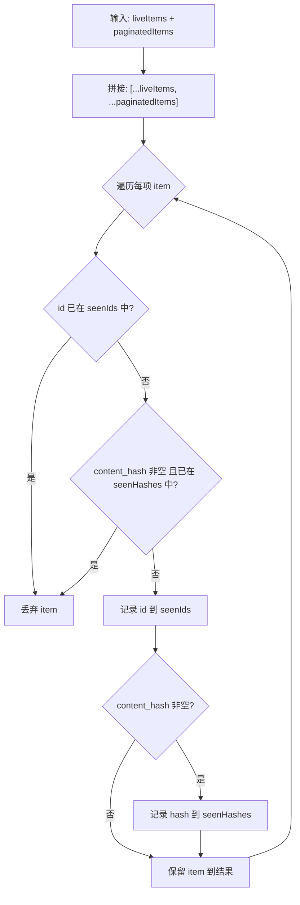

# data.ts 需求说明

> 源文件：src/ui/viewer/utils/data.ts ｜ 类型：源码 ｜ 行数：27 ｜ 所属模块：viewer/utils ｜ 分析日期：2026-07-23

## 1. 文件定位总述

data.ts 是 Viewer 前端的数据去重工具模块，提供单一的合并去重函数。它解决的核心问题是：当同一个观察记录通过 SSE 实时推送和 REST 分页查询两条路径同时到达前端时，必须在渲染前合并并去重，避免 Feed 列表出现重复卡片。该函数被 Feed 组件的上游调用者使用，是连接实时流与分页数据的关键桥梁。

## 2. 功能需求

| 编号 | 需求描述（系统应当…） | 触发条件 / 输入 | 处理规则与输出 | 证据 |
|------|----------------------|----------------|---------------|------|
| FR-MERGE-01 | 系统应当将实时推送项与分页查询项合并为一个去重列表 | 传入 `liveItems`（SSE 实时项）和 `paginatedItems`（REST 分页项），两者均包含 `id` 和可选的 `content_hash` | 先放 liveItems 再放 paginatedItems，按 id 和 content_hash 双键去重后返回合并数组 | `src/ui/viewer/utils/data.ts:20` |
| FR-MERGE-02 | 系统应当基于 id 去重：若后续项的 id 已出现在前面项中，则丢弃后续项 | 遍历合并数组时检查 seenIds Set | 已见 id 的项直接过滤掉 | `src/ui/viewer/utils/data.ts:21` |
| FR-MERGE-03 | 系统应当基于 content_hash 去重：若项有 content_hash 且该值已出现，则丢弃 | 遍历时检查 seenHashes Set（仅当 content_hash 非空时参与） | 同 hash 但不同 id 的项（如本地插入与同步副本）被合并为一条 | `src/ui/viewer/utils/data.ts:22` |

## 3. 业务规则与约束

- 泛型约束 `T` 必须包含 `id: number`、可选的 `project?: string` 和 `content_hash?: string | null`，否则编译不通过。`src/ui/viewer/utils/data.ts:2`
- liveItems 优先于 paginatedItems：合并时 live 项排在前面，确保实时数据在视觉上更靠前。`src/ui/viewer/utils/data.ts:20`
- content_hash 为 null 或 undefined 的项不参与 hash 去重（仅参与 id 去重），因为 SSE 广播的观察记录不含 content_hash。`src/ui/viewer/utils/data.ts:22`

## 4. 对外暴露

| 导出名称 | 类型 | 说明 |
|---------|------|------|
| `mergeAndDeduplicateByProject` | `<T>(liveItems: T[], paginatedItems: T[]) => T[]` | 合并去重函数，泛型 T 需满足 `{ id: number; content_hash?: string \| null }` |

## 5. 依赖关系

- 上游：Feed 组件或其父组件（传入实时流数据与分页数据）
- 下游：无，纯函数工具

## 6. 数据结构

- **输入类型约束**：`{ id: number; project?: string; content_hash?: string | null }`
- **内部状态**：`Set<number>` (seenIds)、`Set<string>` (seenHashes)

## 7. 复杂逻辑图示

## 8. 逆向备注

- 注释中详细解释了两种去重来源：同 id 不同 hash（SSE 无 hash vs REST 有 hash）和同 hash 不同 id（本地插入 vs 同步副本）。注释与代码逻辑一致。`src/ui/viewer/utils/data.ts:6-17`
