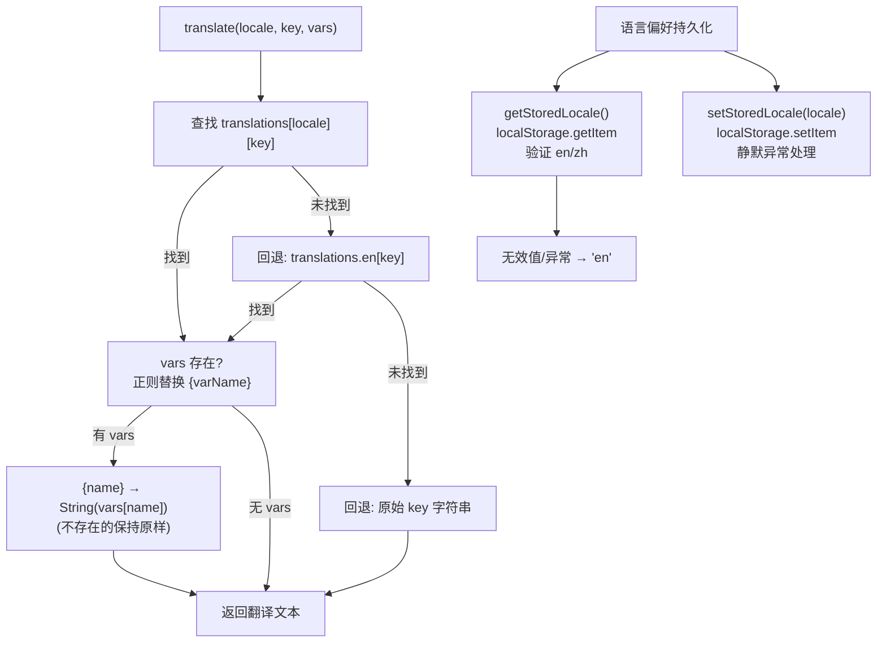

# i18n.ts 需求说明

> 源文件：src/ui/viewer/utils/i18n.ts ｜ 类型：源码 ｜ 行数：511 ｜ 所属模块：Viewer UI / Utils ｜ 分析日期：2026-07-23

## 1. 文件定位总述

i18n 是 claude-mem Viewer 的国际化工具模块，提供英文（en）和中文（zh）两套翻译字典、Locale 持久化存储以及翻译查找函数。它为 Viewer 所有组件的 UI 文案提供统一的国际化支持，覆盖头部、侧边栏、信息流、统计页、设置弹窗、日志抽屉、欢迎卡片等全部功能区域的文本。该模块是 Viewer 中唯一涉及多语言支持的文件，所有组件通过 `useLocale` hook 间接调用其 `translate` 函数。

## 2. 功能需求

| 编号 | 需求描述（系统应当…） | 触发条件 / 输入 | 处理规则与输出 | 证据 |
|------|----------------------|----------------|---------------|------|
| FR-Translate-01 | 系统应当根据当前 Locale 查找翻译文本，支持 `{var}` 占位符替换 | 调用 `translate(locale, key, vars?)` | 查找顺序：当前 locale 字典 → 英文字典 → 原始 key；存在 vars 时用正则替换 `{name}` 为 `String(vars.name)` | `i18n.ts:500-510` |
| FR-Fallback-01 | 系统应当在翻译键在当前 locale 中缺失时回退到英文，英文也缺失时回退到原始 key | key 不存在于当前 locale 字典 | 三级回退链：`translations[locale][key]` → `translations.en[key]` → `key` | `i18n.ts:505` |
| FR-Placeholder-01 | 系统应当支持 `{varName}` 占位符语法，将占位符替换为 vars 对象中对应键的字符串值 | `vars` 参数非空 | 正则 `/\{(\w+)\}/g` 匹配占位符，用 `String(vars[name])` 替换；vars 中不存在的占位符保持原样 | `i18n.ts:507-508` |
| FR-StoreLocale-01 | 系统应当将用户选择的语言偏好持久化到 localStorage | 调用 `setStoredLocale(locale)` | 存储 key 为 `claude-mem.locale`，静默处理 localStorage 不可用的异常 | `i18n.ts:485-491` |
| FR-ReadLocale-01 | 系统应当从 localStorage 读取已保存的语言偏好，无效值回退到英文 | 调用 `getStoredLocale()` | 读取 `claude-mem.locale`，仅接受 'en' 或 'zh'，其他值或异常回退到 `'en'` | `i18n.ts:474-483` |
| FR-ServerEnv-01 | 系统应当在非浏览器环境（`typeof window === 'undefined'`）下直接返回默认 locale | 服务端渲染时 | `getStoredLocale` 在 SSR 环境返回 `'en'` | `i18n.ts:475-476` |
| FR-Dict-01 | 系统应当提供完整的英文和中文翻译字典，覆盖 Viewer 全部 UI 文案 | 模块加载时 | `translations` 对象包含 `en` 和 `zh` 两个子字典，各含约 130+ 个翻译键 | `i18n.ts:9-472` |

## 3. 业务规则与约束

| 编号 | 规则描述 | 证据 |
|------|---------|------|
| BR-01 | 支持的语言仅有 en 和 zh 两种（`Locale` 类型约束） | `i18n.ts:1` |
| BR-02 | 默认语言为英文（`DEFAULT_LOCALE = 'en'`） | `i18n.ts:5` |
| BR-03 | localStorage 存储键为 `claude-mem.locale` | `i18n.ts:4` |
| BR-04 | 翻译键采用点分命名空间（如 `header.docs`、`sidebar.title`、`feed.empty`），无强制约束但形成了约定 | `i18n.ts:11-239` |
| BR-05 | `LOCALES` 数组导出为 `['en', 'zh']`，供 UI 层枚举可切换的语言 | `i18n.ts:3` |
| BR-06 | 占位符中使用 `Object.prototype.hasOwnProperty.call` 检查属性存在性，避免原型链上的属性干扰 | `i18n.ts:508` |
| BR-07 | 翻译键的中英文字典键集一致（均约 130+ 条），无遗漏——推断：所有中文翻译键与英文一一对应，未使用的翻译键保留在字典中不影响运行 |

## 4. 对外暴露

| 类型 | 名称 | 说明 |
|------|------|------|
| 导出类型 | `Locale` | 语言类型 `'en' \| 'zh'` |
| 导出常量 | `LOCALES` | 支持的语言数组 `['en', 'zh']` |
| 导出常量 | `translations` | 翻译字典 `Record<Locale, Record<string, string>>` |
| 导出函数 | `getStoredLocale()` | 从 localStorage 读取语言偏好，返回 Locale |
| 导出函数 | `setStoredLocale(locale)` | 将语言偏好写入 localStorage |
| 导出函数 | `translate(locale, key, vars?)` | 查找翻译并替换占位符 |

## 5. 依赖关系

| 方向 | 依赖项 | 用途 |
|------|--------|------|
| 上游 | `useLocale` hook | `useLocale` 调用 `translate`、`getStoredLocale`、`setStoredLocale` |
| 上游 | Viewer 所有组件 | 通过 `useLocale` 的 `t()` 函数间接使用 |
| 下游 | `window.localStorage` | 语言偏好持久化存储 |

i18n.ts 是工具层模块，无外部依赖（零 import）。

## 6. 数据结构

```typescript
// 语言类型（i18n.ts:1）
type Locale = 'en' | 'zh';

// 翻译字典结构（i18n.ts:7-9）
type Dict = Record<string, string>;
translations: Record<Locale, Dict>;
// 例如：translations['en']['header.docs'] = 'Documentation'
//       translations['zh']['header.docs'] = '文档'
```

翻译字典覆盖的命名空间及其示例键：

| 命名空间 | 示例键 | 用途区域 |
|---------|--------|---------|
| `header.*` | header.docs, header.settings | 头部导航栏 |
| `theme.*` | theme.light, theme.dark | 主题切换提示 |
| `sidebar.*` | sidebar.title, sidebar.deleteSelected | 项目侧边栏 |
| `feed.*` | feed.empty, feed.loading | 信息流 |
| `stats.*` | stats.title, stats.dailyReports | 统计分析页 |
| `card.*` | card.untitled, card.facts | 数据卡片 |
| `user.*` | user.selectorLabel, user.all | 用户选择器 |
| `sync.*` | sync.statusOk, sync.triggerTip | 同步状态 |
| `summary.*` | summary.session, summary.learned | 会话总结卡片 |
| `prompt.*` | prompt.title, prompt.delete | 提示词卡片 |
| `welcome.*` | welcome.title, welcome.feat.* | 欢迎卡片 |
| `logs.*` | logs.refresh, logs.consoleTab | 日志抽屉 |
| `settings.*` | settings.title, settings.sectionLoading | 设置弹窗 |
| `console.*` | console.toggle | 控制台切换按钮 |
| `common.*` | common.scrollTop | 通用 UI 元素 |

## 7. 复杂逻辑图示



翻译查找采用三级回退策略确保 UI 文案始终有可读内容，占位符替换支持模板变量注入以实现动态文本（如 `{count} 个项目`）。

## 8. 逆向备注

| 编号 | 备注 |
|------|------|
| RN-01 | `translations` 字典中存在部分翻译键似乎未被当前代码直接引用（如 `sidebar.alias`、`sidebar.fullId`、`sidebar.lastActive`），但推断这些是为 ProjectSidebar 的用户详情功能预留的翻译 |
| RN-02 | `translate` 函数使用 `Object.prototype.hasOwnProperty.call` 而非 `in` 操作符检查 vars 属性（`i18n.ts:508`），这是防止 vars 对象原型链上意外属性被替换的安全做法 |
| RN-03 | `translate` 函数是纯函数（无副作用），而 `getStoredLocale`/`setStoredLocale` 涉及 DOM API（localStorage），但后两者在 SSR 环境中有兼容处理（`i18n.ts:475-476`）——推断：Viewer 可能在服务端预渲染场景中使用 |
| RN-04 | 翻译字典中 `sidebar.deleteConfirm` 使用了 `{count}` 占位符（`i18n.ts:51`），是少数需要 vars 参数的翻译键之一——实际调用时需传入 `{ count: N }` |
| RN-05 | 模块零依赖（无 import 语句），是完全自包含的工具模块——这是项目中唯一一个完全无外部依赖的源文件 |
