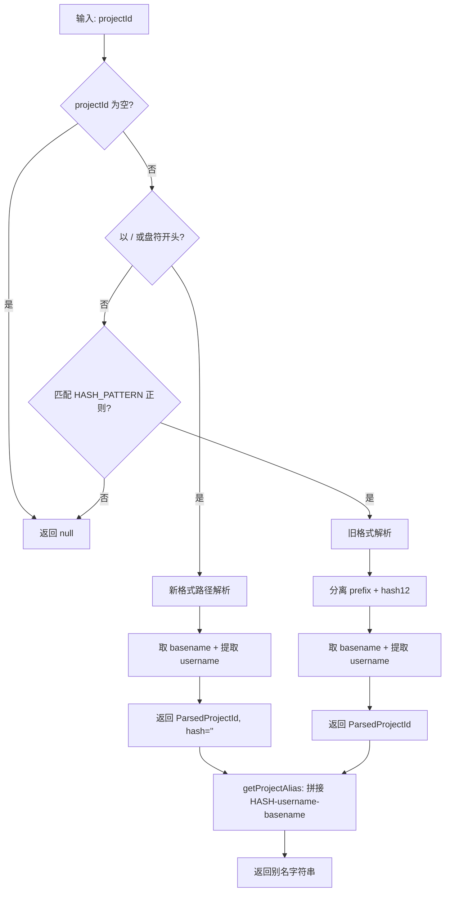

# projectAlias.ts 需求说明

> 源文件：src/ui/viewer/utils/projectAlias.ts ｜ 类型：源码 ｜ 行数：78 ｜ 所属模块：viewer/utils ｜ 分析日期：2026-07-23

## 1. 文件定位总述

projectAlias.ts 是项目 ID 的解析与别名生成工具模块。它将 claude-mem 内部的项目标识符（可能是旧格式 `prefix-hash12` 或新格式的完整文件系统路径）解析为结构化组件，并生成可读的简短别名用于侧栏显示。该模块向后兼容两种 projectId 格式，并支持从路径中提取操作系统用户名。

## 2. 功能需求

| 编号 | 需求描述（系统应当…） | 触发条件 / 输入 | 处理规则与输出 | 证据 |
|------|----------------------|----------------|---------------|------|
| FR-PA-01 | 系统应当解析新格式的完整路径项目 ID | projectId 以 `/` 或 Windows 盘符开头 | 按 `/` 分割取最后一段为 basename，尝试从路径中提取用户名 | `src/ui/viewer/utils/projectAlias.ts:50-55` |
| FR-PA-02 | 系统应当解析旧格式 hash-based 项目 ID | projectId 匹配 `^(.+)-([0-9a-f]{12})$` 正则 | 分离 prefix 和 hash（12位十六进制），basename 取最后一个 `-` 后的部分 | `src/ui/viewer/utils/projectAlias.ts:58-67` |
| FR-PA-03 | 系统应当从路径中提取操作系统用户名 | 路径包含 `/Users/<name>/` 或 `/home/<name>/` | 识别 macOS（Users）和 Linux（home）两种路径格式，返回用户名或 null | `src/ui/viewer/utils/projectAlias.ts:19-38` |
| FR-PA-04 | 系统应当为项目生成可读别名 | 调用 `getProjectAlias(projectId)` | 格式为 `HASH-username-basename`，hash 大写，username 和 basename 可选 | `src/ui/viewer/utils/projectAlias.ts:70-78` |
| FR-PA-05 | 系统应当在无法解析时原样返回项目 ID | projectId 为空或不匹配任何格式 | `parseProjectId` 返回 null，`getProjectAlias` 返回原始字符串 | `src/ui/viewer/utils/projectAlias.ts:47, 72` |

## 3. 业务规则与约束

- HASH_PATTERN 正则：`/^(.+)-([0-9a-f]{12})$/`，要求恰好 12 位十六进制后缀。`src/ui/viewer/utils/projectAlias.ts:1`
- 用户名提取支持两种路径格式：旧格式连字符分隔（`Users-johnson-...`）和新格式斜杠分隔（`/Users/johnson/...`）。`src/ui/viewer/utils/projectAlias.ts:19-38`
- 新格式优先于旧格式：以 `/` 开头的路径不走正则匹配，直接作为路径处理。`src/ui/viewer/utils/projectAlias.ts:50`
- Windows 路径通过 `/^[A-Za-z]:[\\/]/` 正则识别。`src/ui/viewer/utils/projectAlias.ts:50`

## 4. 对外暴露

| 导出名称 | 类型 | 说明 |
|---------|------|------|
| `ParsedProjectId` | interface | 解析后的项目 ID 结构（prefix, hash, basename, username, raw） |
| `parseProjectId` | `(projectId: string) => ParsedProjectId \| null` | 解析函数 |
| `getProjectAlias` | `(projectId: string) => string` | 生成可读别名 |

## 5. 依赖关系

- 上游：侧栏项目列表组件
- 下游：无外部依赖，纯函数工具

## 6. 数据结构

**ParsedProjectId 接口**：
- `prefix: string` — hash 前缀或完整路径
- `hash: string` — 12位十六进制（新格式为空字符串）
- `basename: string` — 项目目录名
- `username: string | null` — 操作系统用户名
- `raw: string` — 原始 projectId

## 7. 复杂逻辑图示

## 8. 逆向备注

- 注释明确说明了向后兼容性设计：新格式的路径 ID 不会匹配旧正则，因此需要先检查路径格式。`src/ui/viewer/utils/projectAlias.ts:43-45`
- `extractUsername` 内部同时处理原始路径（`/` 分隔）和连字符路径（`-` 分隔），注释未完全说明这两种格式的过渡关系。`src/ui/viewer/utils/projectAlias.ts:19-38`
