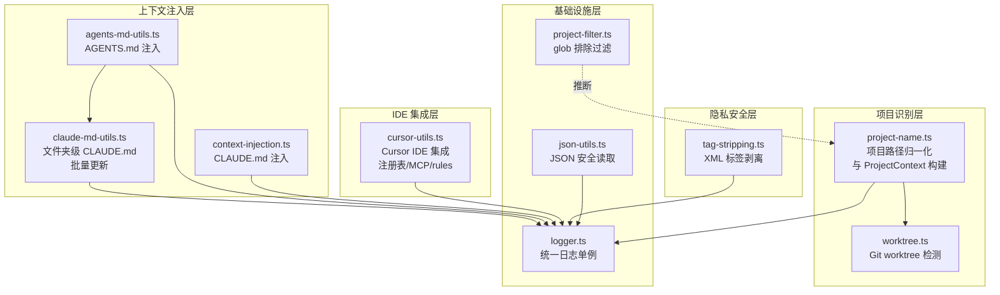

# UTILS 模块汇总

> 汇总范围：src/utils/ 下 10 个源文件的文件级需求文档
> 生成日期：2026-07-23

## 1. 模块职责总述

Utils 模块是 claude-mem 系统的基础设施层，提供横切关注点的通用能力：日志记录、隐私标签剥离、项目路径识别、Markdown 上下文注入、IDE 集成管理、JSON 安全读写以及 Git worktree 检测。它处于业务逻辑与底层运行环境之间，几乎所有上层服务模块（worker-service、ResponseProcessor、Chroma 同步等）都依赖本模块。本模块不直接参与业务流程编排，而是作为工具集被各业务模块按需调用。

## 2. 功能需求汇总

### 2.1 logger.ts（日志基础设施）

| 编号 | 需求描述 | 来源文档 |
|------|---------|---------|
| FR-Level-01 | 系统应当支持 5 个日志级别：DEBUG(0) < INFO(1) < WARN(2) < ERROR(3) < SILENT(4) | [logger.ts.md](logger.ts.md) |
| FR-Level-02 | 系统应当从 settings.json 惰性读取日志级别（默认 INFO） | 同上 |
| FR-Level-03 | 系统应当缓存日志级别，避免每次日志调用都读取文件 | 同上 |
| FR-Format-01 | 系统应当输出结构化日志行：`[时间戳] [级别] [组件] [关联ID] 消息 {context} data` | 同上 |
| FR-Format-02 | 系统应当支持关联 ID 前缀（correlationId 优先于 sessionId） | 同上 |
| FR-Format-03 | 系统应当在 DEBUG 级别输出 Error 对象的完整堆栈 | 同上 |
| FR-Format-04 | 系统应当在非 DEBUG 级别仅输出 Error 对象的 message | 同上 |
| FR-Format-05 | 系统应当在 DEBUG 级别以 JSON 格式化输出对象数据 | 同上 |
| FR-Format-06 | 系统应当对超过 3 个 key 的对象使用摘要格式（非 DEBUG） | 同上 |
| FR-File-01 | 系统应当按日期创建日志文件 `claude-mem-YYYY-MM-DD.log` | 同上 |
| FR-File-02 | 系统应当使用 append 模式写入日志文件 | 同上 |
| FR-File-03 | 系统应当在日志文件写入失败时降级输出到 stderr | 同上 |
| FR-File-04 | 系统应当在日志文件未初始化时输出到 stderr | 同上 |
| FR-Conv-01 | 系统应当提供 `dataIn` 方法，以 `→` 前缀标记数据流入 | 同上 |
| FR-Conv-02 | 系统应当提供 `dataOut` 方法，以 `←` 前缀标记数据流出 | 同上 |
| FR-Conv-03 | 系统应当提供 `success` 方法，以 `✓` 前缀标记成功操作 | 同上 |
| FR-Conv-04 | 系统应当提供 `failure` 方法，以 `✗` 前缀标记失败操作（ERROR 级别） | 同上 |
| FR-Conv-05 | 系统应当提供 `timing` 方法，以 `⏱` 前缀标记计时信息 | 同上 |
| FR-Conv-06 | 系统应当提供 `happyPathError` 方法，以 WARN 级别记录非致命错误并返回 fallback 值 | 同上 |
| FR-Tool-01 | 系统应当将工具调用格式化为简洁的摘要形式 | 同上 |
| FR-Tool-02 | 系统应当对未知工具类型仅返回工具名称 | 同上 |
| FR-Tool-03 | 系统应当将字符串类型的 toolInput 尝试 JSON 解析 | 同上 |
| FR-Corr-01 | 系统应当生成观测关联 ID `obs-{sessionId}-{num}` | 同上 |
| FR-Corr-02 | 系统应当生成会话 ID 标记 `session-{id}` | 同上 |

### 2.2 tag-stripping.ts（标签剥离）

| 编号 | 需求描述 | 来源文档 |
|------|---------|---------|
| FR-Strip-01 | 系统应当从输入文本中剥离所有预定义 XML 标签及其内容，返回剥离结果及计数 | [tag-stripping.ts.md](tag-stripping.ts.md) |
| FR-Strip-02 | 系统应当统计每类标签被剥离的数量 | 同上 |
| FR-Strip-03 | 系统应当在剥离后的文本上执行 trim() | 同上 |
| FR-Strip-04 | 系统应当剥离 6 类标签：private, claude-mem-context, system_instruction, system-instruction, persisted-output, system-reminder | 同上 |
| FR-Strip-05 | 系统应当在标签剥离总数超过 100 时输出 WARN 级别日志 | 同上 |
| FR-Strip-06 | 系统应当为 JSON 内容提供专用的标签剥离方法 `stripMemoryTagsFromJson` | 同上 |
| FR-Strip-07 | 系统应当为用户提示词内容提供专用的标签剥离方法 `stripMemoryTagsFromPrompt` | 同上 |
| FR-Strip-08 | 系统应当导出 `system-reminder` 标签的独立正则 `SYSTEM_REMINDER_REGEX` | 同上 |
| FR-Strip-09 | 系统应当检测仅包含协议标签的内部协议消息 | 同上 |

### 2.3 project-name.ts（项目标识）

| 编号 | 需求描述 | 来源文档 |
|------|---------|---------|
| FR-Name-01 | 系统应当将 cwd 归一化后作为项目标识符返回 | [project-name.ts.md](project-name.ts.md) |
| FR-Name-02 | 系统应当对相同 cwd 的重复调用返回缓存结果 | 同上 |
| FR-Name-03 | 系统应当展开 `~` 前缀为用户主目录 | 同上 |
| FR-Name-04 | 系统应当正确处理 Windows 驱动器路径 | 同上 |
| FR-Name-05 | 系统应当构建项目上下文（ProjectContext），包含主项目、父项目和完整项目列表 | 同上 |
| FR-Name-06 | 系统应当在检测到 worktree 时将父仓库路径添加到 allProjects 列表首位 | 同上 |
| FR-Name-07 | 系统应当在非 worktree 场景下仅返回当前项目 | 同上 |
| FR-Name-08 | 系统应当提供缓存清除方法 | 同上 |
| FR-Name-09 | 系统应当在 cwd 为空时返回预定义的 UNKNOWN_PROJECT_CONTEXT | 同上 |
| FR-Name-10 | 系统应当对空 cwd 输出警告日志 | 同上 |

### 2.4 project-filter.ts（项目排除过滤）

| 编号 | 需求描述 | 来源文档 |
|------|---------|---------|
| FR-Filter-01 | 系统应当根据逗号分隔的排除模式列表判断给定项目路径是否应被排除 | [project-filter.ts.md](project-filter.ts.md) |
| FR-Filter-02 | 系统应当在排除模式为空或纯空白时直接返回 false（不排除） | 同上 |
| FR-Filter-03 | 系统应当将 `~` 前缀展开为用户主目录路径 | 同上 |
| FR-Filter-04 | 系统应当将 glob 模式转换为等效正则表达式进行匹配 | 同上 |
| FR-Filter-05 | 系统应当同时用完整路径和目录名（basename）进行匹配 | 同上 |
| FR-Filter-06 | 系统应当对单个无效模式记录警告并跳过，不影响其他模式 | 同上 |
| FR-Filter-07 | 系统应当将路径中的 Windows 反斜杠统一替换为正斜杠 | 同上 |

### 2.5 worktree.ts（Git worktree 检测）

| 编号 | 需求描述 | 来源文档 |
|------|---------|---------|
| FR-Worktree-01 | 系统应当检测指定目录是否为 Git worktree，并返回父仓库路径 | [worktree.ts.md](worktree.ts.md) |
| FR-Worktree-02 | 系统应当在工作目录不存在 `.git` 文件时判定为非 worktree | 同上 |
| FR-Worktree-03 | 系统应当区分 `.git` 目录（普通仓库）和 `.git` 文件（worktree 指针） | 同上 |
| FR-Worktree-04 | 系统应当从 `.git` 指针文件中解析 `gitdir:` 行获取 gitdir 路径 | 同上 |
| FR-Worktree-05 | 系统应当从 gitdir 路径中提取父仓库根路径 | 同上 |
| FR-Worktree-06 | 系统应当在 gitdir 路径不符合 `.git/worktrees/<name>` 结构时判定为非 worktree | 同上 |
| FR-Worktree-07 | 系统应当在非预期的文件系统错误时输出警告日志并安全降级为非 worktree | 同上 |

### 2.6 claude-md-utils.ts（文件夹级 CLAUDE.md 上下文注入）

| 编号 | 需求描述 | 来源文档 |
|------|---------|---------|
| FR-TARGET-01 | 系统应当根据用户配置决定写入 CLAUDE.md 还是 CLAUDE.local.md | [claude-md-utils.ts.md](claude-md-utils.ts.md) |
| FR-TAG-01 | 系统应当对已有 CLAUDE.md 中的 `<claude-mem-context>` 标签区域进行替换，保留标签外用户内容 | 同上 |
| FR-WRITE-01 | 系统应当将格式化后的上下文内容原子写入指定文件夹的 CLAUDE.md | 同上 |
| FR-FORMAT-01 | 系统应当将 Worker API 返回的时间线文本解析并重新格式化为按日期分组的 Markdown 表格 | 同上 |
| FR-UPDATE-01 | 系统应当根据当前处理的文件列表，批量更新其所在子目录的 CLAUDE.md | 同上 |
| FR-UPDATE-02 | 系统应当在批量更新时跳过项目根目录的 CLAUDE.md | 同上 |
| FR-UPDATE-03 | 系统应当跳过用户在 `CLAUDE_MEM_FOLDER_MD_EXCLUDE` 中配置的排除目录 | 同上 |
| FR-UPDATE-04 | 系统应当限制每个目录的时间线观测条数（默认 50） | 同上 |
| FR-UPDATE-05 | 系统应当避免对已有活跃 CLAUDE.md 的目录进行覆盖写入 | 同上 |

### 2.7 context-injection.ts（CLAUDE.md 上下文注入）

| 编号 | 需求描述 | 来源文档 |
|------|---------|---------|
| FR-Inject-01 | 系统应当将上下文内容用 `<claude-mem-context>` 标签包裹后注入目标 Markdown 文件 | [context-injection.ts.md](context-injection.ts.md) |
| FR-Inject-02 | 系统应当自动创建目标文件的父目录（若不存在） | 同上 |
| FR-Inject-03 | 系统应当在目标文件已包含 context 标签时仅替换标签内内容 | 同上 |
| FR-Inject-04 | 系统应当在目标文件已存在但不含标签时将内容追加到文件末尾 | 同上 |
| FR-Inject-05 | 系统应当在目标文件不存在时创建新文件，并根据 headerLine 决定是否写入标题行 | 同上 |

### 2.8 agents-md-utils.ts（AGENTS.md 上下文写入）

| 编号 | 需求描述 | 来源文档 |
|------|---------|---------|
| FR-AgentsMd-01 | 系统应当将记忆上下文以 `# Memory Context` 标题包裹后写入或更新 AGENTS.md | [agents-md-utils.ts.md](agents-md-utils.ts.md) |
| FR-AgentsMd-02 | 系统应当在 agentsPath 为空时静默跳过 | 同上 |
| FR-AgentsMd-03 | 系统应当拒绝向 `.git` 目录或其子目录写入任何内容 | 同上 |
| FR-AgentsMd-04 | 系统应当自动创建目标文件的父目录（若不存在） | 同上 |
| FR-AgentsMd-05 | 系统应当采用原子写入策略（先临时文件再 rename） | 同上 |
| FR-AgentsMd-06 | 系统应当在写入失败时记录错误日志 | 同上 |

### 2.9 cursor-utils.ts（Cursor IDE 集成）

| 编号 | 需求描述 | 来源文档 |
|------|---------|---------|
| FR-Reg-01 | 系统应当读取 Cursor 项目注册表 JSON 文件 | [cursor-utils.ts.md](cursor-utils.ts.md) |
| FR-Reg-02 | 系统应当将注册表对象序列化为格式化 JSON 写入文件 | 同上 |
| FR-Reg-03 | 系统应当注册一个 Cursor 项目（记录 workspacePath 和注册时间） | 同上 |
| FR-Reg-04 | 系统应当注销一个 Cursor 项目（删除条目） | 同上 |
| FR-Context-01 | 系统应当将记忆上下文写入 Cursor 的 rules 文件（`.cursor/rules/claude-mem-context.mdc`） | 同上 |
| FR-Context-02 | 系统应当读取 Cursor 的 rules 文件内容 | 同上 |
| FR-Context-03 | 系统应当使用固定的 MDC 文件格式，包含 YAML frontmatter 和固定模板文本 | 同上 |
| FR-Mcp-01 | 系统应当向 Cursor 的 MCP 配置文件注入 claude-mem server 条目 | 同上 |
| FR-Mcp-02 | 系统应当从 Cursor 的 MCP 配置中移除 claude-mem server 条目 | 同上 |
| FR-Json-01 | 系统应当支持从 JSON 对象中通过字段路径获取字符串值 | 同上 |
| FR-Json-02 | 系统应当解析 `field[index]` 格式的数组索引语法 | 同上 |
| FR-Json-03 | 系统应当判断字符串是否为空值（含 'null'、'empty' 特殊判定） | 同上 |
| FR-Json-04 | 系统应当提供 URL 编码便捷方法 | 同上 |

### 2.10 json-utils.ts（JSON 安全读取）

| 编号 | 需求描述 | 来源文档 |
|------|---------|---------|
| FR-ReadJson-01 | 系统应当在指定文件不存在时返回调用者提供的默认值 | [json-utils.ts.md](json-utils.ts.md) |
| FR-ReadJson-02 | 系统应当在文件存在且内容为合法 JSON 时解析并返回 | 同上 |
| FR-ReadJson-03 | 系统应当在 JSON 解析失败时抛出携带文件路径和错误详情的异常 | 同上 |

## 3. 模块内部结构

### 3.1 文件间依赖关系

```
logger.ts ←────────────────── 全部其他文件（除 project-filter、worktree）
 │
tag-stripping.ts ←── 引用 logger
 │
worktree.ts ←── 被 project-name.ts 调用（无内部依赖，使用 console.warn）
 ↑
project-name.ts ←── 引用 logger + worktree
 │
project-filter.ts ←── 无内部依赖（使用 console.warn）
 │
json-utils.ts ←── 引用 logger（已导入但未调用）
 │
context-injection.ts ←── 引用 logger（隐式，写入文件系统）
 │
claude-md-utils.ts ←── 引用 logger + tag-stripping 的常量（间接）
 ↑                    └── 被 agents-md-utils.ts 引用 replaceTaggedContent
agents-md-utils.ts ←── 引用 logger + claude-md-utils（replaceTaggedContent）
 │
cursor-utils.ts ←── 引用 logger
```

### 3.2 Mermaid 模块组成图



## 4. 对外接口

### 4.1 导出函数（全部文件合计）

| 来源文件 | 导出符号 | 签名 | 主要调用方 |
|---------|---------|------|-----------|
| logger.ts | `logger`（单例） | `Logger` 实例 | 全系统 |
| logger.ts | `LogLevel` | 枚举 | 外部配置读取 |
| logger.ts | `Component` | 类型联合 | 日志调用方 |
| logger.ts | `correlationId` | `(sessionId, observationNum) => string` | 观测处理 |
| logger.ts | `sessionId` | `(sessionId) => string` | 会话处理 |
| logger.ts | `formatTool` | `(toolName, toolInput?) => string` | 工具调用日志 |
| tag-stripping.ts | `stripTags` | `(input) => { stripped, counts }` | worker-service |
| tag-stripping.ts | `stripMemoryTagsFromJson` | `(content) => string` | JSON 数据处理 |
| tag-stripping.ts | `stripMemoryTagsFromPrompt` | `(content) => string` | 提示词处理 |
| tag-stripping.ts | `isInternalProtocolPayload` | `(text) => boolean` | 协议消息检测 |
| tag-stripping.ts | `SYSTEM_REMINDER_REGEX` | `RegExp` | 外部标签匹配 |
| context-injection.ts | `CONTEXT_TAG_OPEN` | `string` | tag-stripping 等 |
| context-injection.ts | `CONTEXT_TAG_CLOSE` | `string` | tag-stripping 等 |
| context-injection.ts | `injectContextIntoMarkdownFile` | `(filePath, contextContent, headerLine?) => void` | session-init hook |
| project-name.ts | `getProjectName` | `(cwd) => string` | 全系统 |
| project-name.ts | `getProjectContext` | `(cwd) => ProjectContext` | 全系统 |
| project-name.ts | `clearProjectCaches` | `() => void` | 测试/配置变更 |
| project-filter.ts | `isProjectExcluded` | `(projectPath, exclusionPatterns) => boolean` | 推断：session-init |
| worktree.ts | `detectWorktree` | `(cwd) => WorktreeInfo` | project-name.ts |
| claude-md-utils.ts | `getTargetFilename` | `(settings?) => string` | 内部 + regenerate 脚本 |
| claude-md-utils.ts | `replaceTaggedContent` | `(existingContent, newContent) => string` | agents-md-utils |
| claude-md-utils.ts | `writeClaudeMdToFolder` | `(folderPath, newContent, targetFilename?) => void` | 内部 |
| claude-md-utils.ts | `formatTimelineForClaudeMd` | `(timelineText) => string` | 内部 |
| claude-md-utils.ts | `updateFolderClaudeMdFiles` | `(filePaths, project, _port, projectRoot?) => Promise<void>` | ResponseProcessor |
| agents-md-utils.ts | `writeAgentsMd` | `(agentsPath, context) => void` | 推断：OpenCode 集成 |
| cursor-utils.ts | `readCursorRegistry` | `(registryFile) => CursorProjectRegistry` | Cursor install/uninstall |
| cursor-utils.ts | `writeCursorRegistry` | `(registryFile, registry) => void` | 内部 |
| cursor-utils.ts | `registerCursorProject` | `(registryFile, projectName, workspacePath) => void` | Cursor install |
| cursor-utils.ts | `unregisterCursorProject` | `(registryFile, projectName) => void` | Cursor uninstall |
| cursor-utils.ts | `writeContextFile` | `(workspacePath, context) => void` | session-init |
| cursor-utils.ts | `readContextFile` | `(workspacePath) => string | null` | 推断：上下文读取 |
| cursor-utils.ts | `configureCursorMcp` | `(mcpJsonPath, mcpServerScriptPath) => void` | Cursor install |
| cursor-utils.ts | `removeMcpConfig` | `(mcpJsonPath) => void` | Cursor uninstall |
| cursor-utils.ts | `parseArrayField` | `(field) => { field, index } | null` | 内部 + 外部 |
| cursor-utils.ts | `jsonGet` | `(json, field, fallback?) => string` | 推断：外部复用 |
| cursor-utils.ts | `isEmpty` | `(str) => boolean` | 推断：外部复用 |
| cursor-utils.ts | `urlEncode` | `(str) => string` | 推断：外部复用 |
| json-utils.ts | `readJsonSafe` | `<T>(filePath, defaultValue) => T` | 推断：配置读取 |

### 4.2 导出类型/接口

| 类型 | 来源文件 | 说明 |
|------|---------|------|
| `ProjectContext` | project-name.ts | 项目上下文（primary, parent, isWorktree, allProjects） |
| `WorktreeInfo` | worktree.ts | worktree 检测结果（isWorktree, parentRepoPath） |
| `CursorProjectRegistry` | cursor-utils.ts | Cursor 项目注册表结构 |
| `CursorMcpConfig` | cursor-utils.ts | Cursor MCP 配置结构 |
| `LogContext` | logger.ts | 日志上下文（sessionId, correlationId 等） |

## 5. 数据与外部资源

### 5.1 文件系统路径

| 路径 | 读写 | 涉及文件 | 说明 |
|------|------|---------|------|
| `~/.claude-mem/logs/claude-mem-YYYY-MM-DD.log` | 写 | logger.ts | 按日期分文件的日志存储 |
| `~/.claude-mem/settings.json` | 读 | logger.ts, claude-md-utils.ts | 日志级别、观测条数上限、文件名偏好等配置 |
| 项目子目录/`CLAUDE.md` 或 `CLAUDE.local.md` | 读写 | claude-md-utils.ts | 文件夹级记忆上下文 |
| 项目根目录/`CLAUDE.md` | 读写 | context-injection.ts | session-init 注入的项目级上下文 |
| 项目根目录/`AGENTS.md` | 写 | agents-md-utils.ts | OpenCode 集成的记忆上下文 |
| `.cursor/rules/claude-mem-context.mdc` | 读写 | cursor-utils.ts | Cursor IDE 的持久记忆 rules |
| `.cursor/mcp.json` 或指定路径 | 读写 | cursor-utils.ts | Cursor MCP Server 配置 |
| 注册表 JSON 文件 | 读写 | cursor-utils.ts | Cursor 项目注册表 |
| `.git` 文件 | 读 | worktree.ts | Git worktree 指针文件（非目录） |

### 5.2 配置项

| 配置键 | 读取方 | 说明 |
|-------|--------|------|
| `CLAUDE_MEM_LOG_LEVEL` | logger.ts | 日志级别（默认 INFO） |
| `CLAUDE_MEM_FOLDER_USE_LOCAL_MD` | claude-md-utils.ts | 是否使用 CLAUDE.local.md |
| `CLAUDE_MEM_FOLDER_MD_EXCLUDE` | claude-md-utils.ts | 排除目录列表（JSON 数组） |
| `CLAUDE_MEM_CONTEXT_OBSERVATIONS` | claude-md-utils.ts | 每目录时间线观测条数上限（默认 50） |
| `CLAUDE_MEM_EXCLUDED_PROJECTS` | project-filter.ts | 项目排除模式列表（逗号分隔 glob） |

### 5.3 数据库/缓存

本模块不直接操作数据库。`project-name.ts` 维护两个内存缓存（`projectNameCache`、`projectContextCache`），无 TTL、无容量限制。

## 6. 存疑与备注

### 6.1 标签替换逻辑的重复实现

context-injection.ts 与 claude-md-utils.ts 中的 `replaceTaggedContent` 功能高度相似，但实现独立。agents-md-utils.ts 复用 claude-md-utils.ts 的 `replaceTaggedContent`，而 context-injection.ts 有自己的 indexOf 实现。推断：（为保持模块独立性而有意重复）。

### 6.2 logger 未被部分模块使用

project-filter.ts 和 worktree.ts 使用 `console.warn` 而非项目的 `logger` 实例。推断：（可能被 hook 入口脚本在 logger 初始化之前调用，或为避免循环依赖）。

### 6.3 `_port` 参数未使用

`updateFolderClaudeMdFiles` 的第三个参数 `_port: number` 带有下划线前缀，表示有意忽略。Worker HTTP 请求实际上通过 `workerHttpRequest` 内部自行解析端口。推断：（历史遗留或预留扩展）。

### 6.4 context-injection.ts 采用非原子写入

与 agents-md-utils.ts 和 claude-md-utils.ts 的"先 tmp 后 rename"策略不同，context-injection.ts 直接 `writeFileSync`。推断：（消费场景对原子性要求较低，或因注入频率低而简化实现）。

### 6.5 json-utils.ts 中 logger 已导入但未调用

logger 在第 3 行导入但 `readJsonSafe` 函数体中未使用。推断：（为保持模块间的统一日志风格而导入，或历史遗留）。

### 6.6 `basename` 导入未使用

cursor-utils.ts 和 project-name.ts 均导入了 `path.basename` 但未在函数体中使用。推断：（历史遗留或预留用于未来功能）。

### 6.7 cursor-utils.ts 中通用辅助函数的归属

`jsonGet`、`isEmpty`、`urlEncode` 等通用辅助函数放在 cursor-utils.ts 中。推断：（最初仅为 Cursor 集成使用，后来被其他模块复用但未迁移到独立文件）。

### 6.8 旧版项目标识符策略已废弃

project-name.ts 注释说明旧版使用"安全前缀-SHA1前12位"格式，现已直接使用完整归一化路径。推断：（为简化查询和提高可读性）。

### 6.9 stripMemoryTagsFromJson 与 stripMemoryTagsFromPrompt 实现完全相同

两个函数均为 `stripTags(content).stripped`。推断：（为代码可读性提供语义化的调用入口，区分 JSON 和 Prompt 两个处理场景）。

### 6.10 logger 的 `useColor` 属性未使用

`this.useColor` 在构造时赋值但日志输出中未使用颜色代码。推断：（预留用于未来支持彩色终端输出）。

### 6.11 time locale 敏感性

`formatTimelineForClaudeMd` 中 AM/PM 时间的正则匹配为硬编码英文格式。推断：（上游 API 始终输出英文格式时间，未考虑非英文 locale）。

### 6.12 `isValidPathForClaudeMd` 的安全局限性

未传入 `projectRoot` 时，跳过越界检查和重复路径段检查。推断：（单文件写入场景安全性低于批量更新场景）。

### 6.13 `replaceTaggedContent` 未处理标签部分闭合

仅当 `startTag` 和 `endTag` 同时存在时才替换，否则追加。推断：（若标签被部分删除，会导致内容追加而非替换）。
