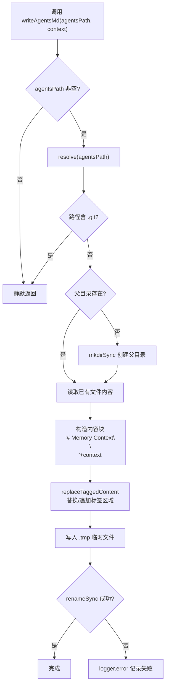

# agents-md-utils.ts 需求说明

> 源文件：src/utils/agents-md-utils.ts ｜ 类型：源码 ｜ 行数：33 ｜ 所属模块：Utils ｜ 分析日期：2026-07-23

## 1. 文件定位总述

agents-md-utils.ts 负责将 claude-mem 的记忆上下文写入 AGENTS.md 文件，主要服务于 OpenCode 等 IDE 集成场景。它通过 `replaceTaggedContent` 在已有内容中定位 `<claude-mem-context>` 标签区域并替换，若标签不存在则追加。写入时采用"先写临时文件再 rename"的原子替换策略，防止写入过程中断导致文件损坏。同时具有 `.git` 路径安全检查，避免写入 Git 内部目录。

## 2. 功能需求

| 编号 | 需求描述（系统应当…） | 触发条件 / 输入 | 处理规则与输出 | 证据 |
|------|----------------------|----------------|---------------|------|
| FR-AgentsMd-01 | 系统应当将记忆上下文内容以 `# Memory Context` 标题包裹后写入或更新 AGENTS.md 文件 | 调用 `writeAgentsMd(agentsPath, context)` 且 agentsPath 非空 | 构造内容块 `# Memory Context\n\n${context}`，通过 `replaceTaggedContent` 嵌入已有文件或追加新内容，原子写入目标文件 | `src/utils/agents-md-utils.ts:6-32` |
| FR-AgentsMd-02 | 系统应当在 agentsPath 为空时静默跳过，不做任何文件操作 | `agentsPath` 为空字符串或 falsy | 直接 return，不抛异常 | `src/utils/agents-md-utils.ts:7` |
| FR-AgentsMd-03 | 系统应当拒绝向 `.git` 目录或其子目录写入任何内容 | resolvedPath 包含 `/.git/`、`\\.git\\` 或以 `/.git`、`\\.git` 结尾 | 直接 return，静默跳过 | `src/utils/agents-md-utils.ts:10` |
| FR-AgentsMd-04 | 系统应当自动创建目标文件的父目录（若不存在） | 目标文件的父目录不存在 | `mkdirSync(dir, { recursive: true })` | `src/utils/agents-md-utils.ts:13-15` |
| FR-AgentsMd-05 | 系统应当采用原子写入策略（先临时文件再 rename）以防止写入中断导致文件损坏 | 任何写入操作 | 先写入 `${agentsPath}.tmp`，再 `renameSync` 到目标路径 | `src/utils/agents-md-utils.ts:24-28` |
| FR-AgentsMd-06 | 系统应当在写入失败时记录错误日志 | writeFileSync 或 renameSync 抛出异常 | 调用 `logger.error('AGENTS_MD', 'Failed to write AGENTS.md', ...)` | `src/utils/agents-md-utils.ts:29-31` |

## 3. 业务规则与约束

- **Git 目录安全**：对路径中包含 `.git` 的各种形态（`/.git/`、`\\.git\\`、以 `/.git` 结尾）进行检测，防止意外写入 Git 内部目录导致仓库损坏 `src/utils/agents-md-utils.ts:10`
- **内容块格式**：写入的内容块固定为 `# Memory Context\n\n${context}`，未使用 XML 标签包裹——推断：（AGENTS.md 的消费端可能不依赖标签提取，而是直接读取整个文件）`src/utils/agents-md-utils.ts:22`
- **路径解析**：使用 `resolve(agentsPath)` 将相对路径转为绝对路径后再进行安全检查 `src/utils/agents-md-utils.ts:9`

## 4. 对外暴露

| 公开方法 | 签名 | 说明 |
|---------|------|------|
| `writeAgentsMd` | `(agentsPath: string, context: string): void` | 将记忆上下文写入或更新指定路径的 AGENTS.md 文件 |

## 5. 依赖关系

### 上游依赖

| 来源 | 用途 |
|------|------|
| `fs`（existsSync, readFileSync, writeFileSync, renameSync, mkdirSync） | 文件系统操作 |
| `path`（dirname, resolve） | 路径解析与规范化 |
| `replaceTaggedContent`（`./claude-md-utils.js`） | 在已有文件中定位并替换 `<claude-mem-context>` 标签区域 |
| `logger`（`./logger.js`） | 错误日志记录 |

### 下游消费者

推断：被 OpenCode 插件的 session-init 或 observation hook 调用，用于将压缩后的记忆上下文注入到项目的 AGENTS.md 文件。

## 6. 数据结构

不适用。

## 7. 复杂逻辑图示

上图展示了 `writeAgentsMd` 的完整执行流程：从路径安全检查到原子写入，每一步都有明确的失败处理路径。

## 8. 逆向备注

- **推断**：AGENTS.md 的消费场景推断为 OpenCode（Amazon 的 AI 编码助手），因为 OpenCode 使用 AGENTS.md 作为项目级指令文件，与 claude-mem 的 CLAUDE.md 注入模式平行 `src/utils/agents-md-utils.ts:22`
- **与 context-injection.ts 的差异**：agents-md-utils 使用 `replaceTaggedContent`（依赖 claude-md-utils.js）进行标签替换，而 context-injection.ts 有自己独立的标签替换逻辑——推断：（两个模块服务于不同的消费端，AGENTS.md 可能需要不同的标签处理策略或独立演化）`src/utils/agents-md-utils.ts:3`
- **安全考虑**：`.git` 目录检查覆盖了 Unix 和 Windows 两种路径分隔符形态，说明代码需要跨平台运行 `src/utils/agents-md-utils.ts:10`
