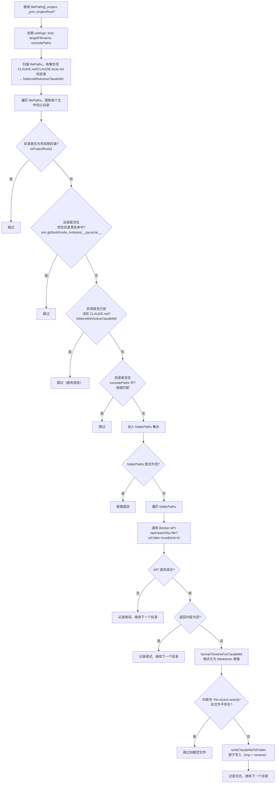

# claude-md-utils.ts 需求说明

> 源文件：src/utils/claude-md-utils.ts ｜ 类型：源码 ｜ 行数：346 ｜ 所属模块：utils ｜ 分析日期：2026-07-23

## 1. 文件定位总述

本文件是 claude-mem 系统的"文件夹级 CLAUDE.md 上下文注入"核心工具模块。它承担两项关键职责：(1) 将 Worker 搜索 API 返回的时间线文本解析为 Markdown 表格格式，并通过 `<claude-mem-context>` 标签写入项目子目录的 CLAUDE.md（或 CLAUDE.local.md）文件；(2) 对目标文件夹路径执行多维度安全校验，防止向 `.git`、`node_modules` 等危险目录写入上下文。

该模块处于 Worker 后端（搜索 API）与文件系统之间的桥梁位置：上游由 `ResponseProcessor`（处理 AI 响应后触发文件夹更新）和 `regenerate-claude-md.ts`（批量重建脚本）调用 `updateFolderClaudeMdFiles`；下游通过 `writeClaudeMdToFolder` 执行原子写入（先写临时文件再 rename）。同模块内的 `replaceTaggedContent` 还被 `agents-md-utils.ts` 复用，用于 AGENTS.md 的标签替换。

## 2. 功能需求

| 编号 | 需求描述（系统应当…） | 触发条件 / 输入 | 处理规则与输出 | 证据 |
|------|----------------------|----------------|---------------|------|
| FR-TARGET-01 | 系统应当根据用户配置决定写入 CLAUDE.md 还是 CLAUDE.local.md | 调用 `getTargetFilename`，可选传入 settings 对象 | 读取 `CLAUDE_MEM_FOLDER_USE_LOCAL_MD` 配置；值为 `'true'` 时返回 `CLAUDE.local.md`，否则返回 `CLAUDE.md`；未传入 settings 时自动从默认路径加载 | `src/utils/claude-md-utils.ts:16-19` |
| FR-TAG-01 | 系统应当对已有 CLAUDE.md 内容中的 `<claude-mem-context>` 标签区域进行替换，保留标签外的用户自定义内容 | 调用 `replaceTaggedContent`，传入已有文件全文与新内容 | 定位 `<claude-mem-context>`...`</claude-mem-context>` 区间；若双标签均存在则替换区间内容；若不存在则追加到文件末尾；若已有内容为空则直接生成带标签的完整内容 | `src/utils/claude-md-utils.ts:55-73` |
| FR-WRITE-01 | 系统应当将格式化后的上下文内容原子写入指定文件夹的 CLAUDE.md | 调用 `writeClaudeMdToFolder`，传入文件夹路径、新内容、可选文件名 | 先写 `.tmp` 临时文件，再通过 `renameSync` 原子替换目标文件；若目标文件夹不存在则跳过；若路径包含 `.git` 则跳过 | `src/utils/claude-md-utils.ts:75-98` |
| FR-FORMAT-01 | 系统应当将 Worker API 返回的时间线文本解析并重新格式化为按日期分组的 Markdown 表格 | 调用 `formatTimelineForClaudeMd`，传入 API 返回的纯文本时间线 | 逐行解析日期标题（`###` 行）和表格行（管道分隔），提取 ID、时间、类型图标、标题、Token 数；将 AM/PM 时间转换为 epoch；连续相同时间显示为 `"`；按日期分组输出 Markdown 表格；无观测记录时返回空字符串 | `src/utils/claude-md-utils.ts:109-190` |
| FR-UPDATE-01 | 系统应当根据当前处理的文件列表，批量更新其所在子目录的 CLAUDE.md 上下文文件 | 调用 `updateFolderClaudeMdFiles`，传入文件路径数组、项目名、Worker 端口、可选项目根目录 | 提取文件所在目录 -> 过滤无效/危险目录 -> 逐目录调用 Worker 搜索 API 获取时间线 -> 格式化 -> 原子写入 | `src/utils/claude-md-utils.ts:223-345` |
| FR-UPDATE-02 | 系统应当在批量更新时跳过项目根目录的 CLAUDE.md | 检测到目录下存在 `.git` 文件夹 | `isProjectRoot` 判断目录是否为 Git 仓库根目录，若是则跳过该目录 | `src/utils/claude-md-utils.ts:206-209, 275-278` |
| FR-UPDATE-03 | 系统应当跳过用户在 `CLAUDE_MEM_FOLDER_MD_EXCLUDE` 中配置的排除目录 | 设置中存在 JSON 数组格式的排除路径列表 | 解析排除路径列表，对每个候选目录进行前缀匹配判断；解析失败时记录警告并使用空列表 | `src/utils/claude-md-utils.ts:233-241, 287-290` |
| FR-UPDATE-04 | 系统应当限制每个目录的时间线观测条数 | Worker 搜索 API 调用时 | 从 `CLAUDE_MEM_CONTEXT_OBSERVATIONS` 配置读取上限值，默认 50；作为 `limit` 参数传递给搜索 API | `src/utils/claude-md-utils.ts:230` |
| FR-UPDATE-05 | 系统应当避免对已有活跃 CLAUDE.md 的目录进行覆盖写入 | 文件路径列表中包含某个目录下的 CLAUDE.md 或 CLAUDE.local.md | 先扫描文件列表，收集包含活跃上下文文件的目录，后续批量更新时跳过这些目录 | `src/utils/claude-md-utils.ts:243-257, 283-286` |

## 3. 业务规则与约束

### 3.1 路径安全约束

系统对候选文件路径执行严格的多层安全校验（`isValidPathForClaudeMd`），以下路径一律视为无效并跳过：

| 规则 | 说明 | 证据 |
|------|------|------|
| 空路径 | 空字符串或纯空白字符 | `src/utils/claude-md-utils.ts:30-31` |
| 波浪号路径 | 以 `~` 开头的路径（防止用户目录展开不确定性） | `src/utils/claude-md-utils.ts:32` |
| URL 路径 | 以 `http://` 或 `https://` 开头 | `src/utils/claude-md-utils.ts:34` |
| 含空格路径 | 路径中包含空格字符 | `src/utils/claude-md-utils.ts:36` |
| 含锚点路径 | 路径中包含 `#` 字符 | `src/utils/claude-md-utils.ts:38` |
| 越界路径 | 解析后的绝对路径不在项目根目录范围内 | `src/utils/claude-md-utils.ts:40-45` |
| 重复路径段 | 路径中存在连续重复的目录段（如 `a/a/b`），可能是路径遍历攻击的迹象 | `src/utils/claude-md-utils.ts:21-27, 47-49` |

### 3.2 危险目录排除

系统内置一组不可写入的目录黑名单，匹配任意路径段即跳过：`src/utils/claude-md-utils.ts:192-198`

| 目录名 | 排除原因（推断） |
|--------|-----------------|
| `res` | 推断：资源目录，可能由构建工具管理 |
| `.git` | Git 内部目录，写入会破坏仓库 |
| `build` | 构建产物目录 |
| `node_modules` | 依赖目录，体积庞大且由包管理器管理 |
| `__pycache__` | Python 字节码缓存目录 |

### 3.3 文件写入原子性

所有 CLAUDE.md 写入操作均采用"先写临时文件再 rename"策略，确保写入过程中断不会破坏已有文件：`src/utils/claude-md-utils.ts:96-97`

### 3.4 空内容不创建文件

若格式化后的内容包含 `*No recent activity*` 且目标 CLAUDE.md 尚不存在，系统跳过创建，避免产生无意义的空上下文文件：`src/utils/claude-md-utils.ts:333-339`

### 3.5 连续重复时间压缩

在时间线表格中，连续相同的时间值显示为 `"`（双引号），与原始 API 输入中的 `″` 和 `"` 约定保持一致：`src/utils/claude-md-utils.ts:136-141, 181`

## 4. 对外暴露

本模块导出 5 个公开函数，供上游模块调用：

| 导出符号 | 签名 | 调用方 |
|---------|------|--------|
| `getTargetFilename` | `(settings?) => string` | `writeClaudeMdToFolder`（内部）、`updateFolderClaudeMdFiles`（内部） |
| `replaceTaggedContent` | `(existingContent: string, newContent: string) => string` | `agents-md-utils.ts:writeAgentsMd`、`scripts/regenerate-claude-md.ts` |
| `writeClaudeMdToFolder` | `(folderPath: string, newContent: string, targetFilename?: string) => void` | `updateFolderClaudeMdFiles`（内部） |
| `formatTimelineForClaudeMd` | `(timelineText: string) => string` | `updateFolderClaudeMdFiles`（内部） |
| `updateFolderClaudeMdFiles` | `(filePaths: string[], project: string, _port: number, projectRoot?: string) => Promise<void>` | `ResponseProcessor.ts`、`scripts/regenerate-claude-md.ts` |

## 5. 依赖关系

### 5.1 上游依赖（本模块导入）

| 依赖模块 | 用途 |
|---------|------|
| `fs`（Node.js 内置） | `existsSync`、`readFileSync`、`writeFileSync`、`renameSync` — 文件读写与原子替换 |
| `path`（Node.js 内置） | 路径解析、规范化、拼接 |
| `./logger.js` | 统一日志记录（前缀 `FOLDER_INDEX`） |
| `../shared/timeline-formatting.js` | `formatDate`、`groupByDate` — 日期格式化与分组排序 |
| `../shared/SettingsDefaultsManager.js` | 读取用户配置（观测条数上限、文件名偏好、排除路径） |
| `../shared/worker-utils.js` | `workerHttpRequest` — 向本地 Worker HTTP API 发起搜索请求 |
| `../shared/paths.js` | `paths.settings()` — 获取 settings.json 文件路径 |

### 5.2 下游调用方

| 调用方模块 | 调用的导出 | 调用场景 |
|-----------|-----------|---------|
| `src/services/worker/agents/ResponseProcessor.ts` | `updateFolderClaudeMdFiles` | AI 响应处理完成后，批量更新受影响文件所在目录的 CLAUDE.md |
| `src/utils/agents-md-utils.ts` | `replaceTaggedContent` | 写入 AGENTS.md 时复用标签替换逻辑 |
| `scripts/regenerate-claude-md.ts` | `replaceTaggedContent` | 批量重建脚本中写入各目录的 CLAUDE.md |
| `tests/utils/claude-md-utils.test.ts` | 全部 5 个导出 | 单元测试 |

## 6. 数据结构

### 6.1 ParsedObservation（内部接口）

时间线解析过程中产生的中间数据结构，不对外导出。

| 字段 | 类型 | 说明 |
|------|------|------|
| `id` | `string` | 观测记录 ID，格式如 `#S123` 或 `#123` |
| `time` | `string` | 时间显示文本，如 `3:45 PM` |
| `typeEmoji` | `string` | 类型图标，如 bugfix 对应的 emoji |
| `title` | `string` | 观测标题摘要 |
| `tokens` | `string` | Token 数量 |
| `epoch` | `number` | 解析后的 Unix 时间戳毫秒值，用于日期分组排序 |

证据：`src/utils/claude-md-utils.ts:100-107`

### 6.2 Worker API 响应结构

`updateFolderClaudeMdFiles` 从 Worker 搜索 API 解析的 JSON 结构（推断，代码中仅有类型断言）：

```typescript
{ content?: Array<{ text?: string }> }
```

证据：`src/utils/claude-md-utils.ts:324`

## 7. 复杂逻辑图示

### 7.1 updateFolderClaudeMdFiles 批量更新流程

下图展示从接收文件路径列表到完成 CLAUDE.md 写入的完整处理流程。每个文件路径需经过路径合法性校验、目录安全性校验、活跃文件排重三重过滤，最终对合法目录逐一查询 Worker API 并执行原子写入。



### 7.2 formatTimelineForClaudeMd 解析流程

```mermaid
flowchart TB
    A["输入 timelineText（API 返回纯文本）"] --> B["按换行符拆分为行"]
    B --> C{"行匹配 ### 日期标题?"}
    C -- 是 --> D["解析日期为 Date 对象\n作为后续记录的 baseDate"]
    C -- 否 --> E{"行匹配管道分隔表格行?\n| ID | Time | Emoji | Title | Tokens |"}
    E -- 是 --> F["提取 id, timeStr, typeEmoji, title, tokens"]
    F --> G{"timeStr 为 ″ 或 \""}
    G -- 是 --> H["复用 lastTimeStr"]
    G -- 否 --> I["使用 timeStr\n更新 lastTimeStr"]
    H --> J["解析 AM/PM 时间\n计算 epoch 毫秒值"]
    I --> J
    J --> K["构建 ParsedObservation 对象"]
    K --> L["加入 observations 数组"]
    E -- 否 --> SKIP["跳过该行"]
    L --> B
    D --> B
    SKIP --> B
    B -- "遍历完毕" --> M{"observations.length == 0?"}
    M -- 是 --> N["返回空字符串"]
    M -- 否 --> O["groupByDate 按 epoch 日期分组"]
    O --> P["按日期排序输出 Markdown 表格\n连续相同时间压缩为双引号"]
    P --> Q["返回格式化后的 Markdown 字符串"]
```

## 8. 逆向备注

1. **`_port` 参数未使用**：`updateFolderClaudeMdFiles` 的第三个参数 `_port: number` 带有下划线前缀，表示有意忽略。Worker HTTP 请求实际上通过 `workerHttpRequest` 内部自行解析端口，此参数可能是历史遗留或预留扩展：`src/utils/claude-md-utils.ts:226`。

2. **时间解析的 locale 敏感性**：`formatTimelineForClaudeMd` 中对 AM/PM 时间的正则匹配为硬编码英文格式（`/(\d+):(\d+)\s*(AM|PM)/i`），推断上游 API 始终输出英文格式时间，未考虑非英文 locale 场景：`src/utils/claude-md-utils.ts:144`。

3. **路径安全校验的局限性**：`isValidPathForClaudeMd` 在未传入 `projectRoot` 时（`projectRoot` 为 undefined），跳过越界检查和重复路径段检查，直接返回 true（仅做空值、波浪号、URL、空格、锚点检查）。推断在单文件写入场景（直接调用 `writeClaudeMdToFolder`）中安全性低于批量更新场景：`src/utils/claude-md-utils.ts:29-53`。

4. **`replaceTaggedContent` 的标签闭合假设**：该函数未处理 `startTag` 存在但 `endTag` 缺失（或反之）的异常情况——仅当两个标签同时存在时才进行替换，否则直接追加。这意味着若已有文件中标签被部分删除，会导致内容追加而非替换：`src/utils/claude-md-utils.ts:66-72`。

5. **推断 `getTargetFilename` 可返回不同文件名**：`writeClaudeMdToFolder` 的 `targetFilename` 参数是可选的，未传入时调用 `getTargetFilename()` 使用默认 settings。但 `updateFolderClaudeMdFiles` 已预先获取 `targetFilename` 并传递给 `writeClaudeMdToFolder`，确保批量更新中所有目录使用一致的文件名：`src/utils/claude-md-utils.ts:80, 231, 341`。
