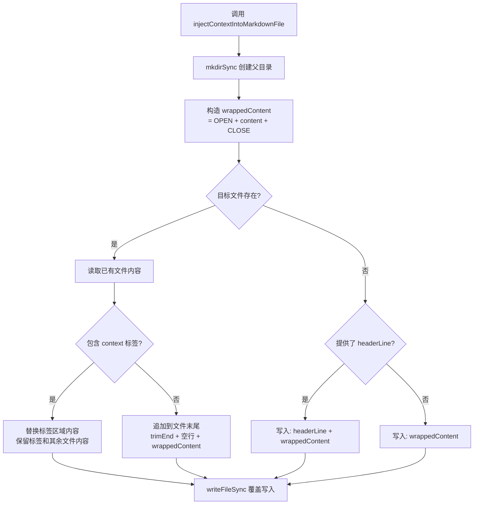

# context-injection.ts 需求说明

> 源文件：src/utils/context-injection.ts ｜ 类型：源码 ｜ 行数：42 ｜ 所属模块：Utils ｜ 分析日期：2026-07-23

## 1. 文件定位总述

context-injection.ts 负责将 claude-mem 的记忆上下文注入到 Markdown 格式的配置文件中（如 CLAUDE.md 等）。它使用自定义 XML 标签 `<claude-mem-context>` / `</claude-mem-context>` 作为内容锚点，在已有文件中定位并替换该区域，或在没有标签时追加到文件末尾。当目标文件不存在时，可选择性地写入自定义标题行。该模块是 session-init hook 注入记忆上下文的核心工具。

## 2. 功能需求

| 编号 | 需求描述（系统应当…） | 触发条件 / 输入 | 处理规则与输出 | 证据 |
|------|----------------------|----------------|---------------|------|
| FR-Inject-01 | 系统应当将上下文内容用 `<claude-mem-context>` / `</claude-mem-context>` 标签包裹后注入目标 Markdown 文件 | 调用 `injectContextIntoMarkdownFile(filePath, contextContent, headerLine?)` | 构造 `${CONTEXT_TAG_OPEN}\n${contextContent}\n${CONTEXT_TAG_CLOSE}` 并写入目标文件 | `src/utils/context-injection.ts:8-41` |
| FR-Inject-02 | 系统应当自动创建目标文件的父目录（若不存在） | 父目录不存在 | `mkdirSync(parentDirectory, { recursive: true })` | `src/utils/context-injection.ts:13-14` |
| FR-Inject-03 | 系统应当在目标文件已包含 context 标签时仅替换标签内的内容，保留文件其余部分不变 | 文件已存在且包含 `<claude-mem-context>...</claude-mem-context>` | 使用 `indexOf` 定位起止标签，替换标签间的文本；标签本身保留 | `src/utils/context-injection.ts:21-28` |
| FR-Inject-04 | 系统应当在目标文件已存在但不含 context 标签时，将包裹后的内容追加到文件末尾 | 文件已存在但无 context 标签 | `existingContent.trimEnd() + '\n\n' + wrappedContent + '\n'` | `src/utils/context-injection.ts:29-30` |
| FR-Inject-05 | 系统应当在目标文件不存在时创建新文件，并根据是否提供 headerLine 决定是否写入标题行 | 文件不存在 | 有 headerLine：写入 `${headerLine}\n\n${wrappedContent}\n`；无 headerLine：仅写入 `${wrappedContent}\n` | `src/utils/context-injection.ts:34-39` |

## 3. 业务规则与约束

- **标签常量导出**：`CONTEXT_TAG_OPEN = '<claude-mem-context>'` 和 `CONTEXT_TAG_CLOSE = '</claude-mem-context>'` 作为命名导出公开，允许其他模块使用相同标签进行内容提取或检测 `src/utils/context-injection.ts:5-6`
- **非原子写入**：与 agents-md-utils.ts 不同，本模块直接 `writeFileSync` 而非先写临时文件再 rename——推断：（消费场景对原子性要求较低，或因注入频率低而简化实现）`src/utils/context-injection.ts:33`
- **标签匹配策略**：使用 `indexOf` 而非正则匹配标签，这意味着只处理文件中第一对标签，忽略后续出现的同名标签 `src/utils/context-injection.ts:21-22`

## 4. 对外暴露

| 公开方法 | 签名 | 说明 |
|---------|------|------|
| `injectContextIntoMarkdownFile` | `(filePath: string, contextContent: string, headerLine?: string): void` | 将记忆上下文注入到 Markdown 文件的 context 标签区域 |

| 公开常量 | 值 | 说明 |
|---------|-----|------|
| `CONTEXT_TAG_OPEN` | `'<claude-mem-context>'` | 上下文区域起始标签 |
| `CONTEXT_TAG_CLOSE` | `'</claude-mem-context>'` | 上下文区域结束标签 |

## 5. 依赖关系

### 上游依赖

| 来源 | 用途 |
|------|------|
| `fs`（existsSync, readFileSync, writeFileSync, mkdirSync） | 文件系统操作 |
| `path`（dirname） | 获取父目录路径 |

### 下游消费者

推断：被 session-init hook（`worker-service.ts` 中的 `context` 子命令）调用，将压缩后的记忆上下文注入到项目的 CLAUDE.md 文件中。`CONTEXT_TAG_OPEN` / `CONTEXT_TAG_CLOSE` 导出常量被 `tag-stripping.ts` 引用以定义需要剥离的标签列表。

## 6. 数据结构

不适用。

## 7. 复杂逻辑图示

上图展示了 context 注入的三条路径：已有标签时替换、无标签时追加、文件不存在时新建。

## 8. 逆向备注

- **与 agents-md-utils.ts 的并行关系**：两个模块都实现"将记忆上下文写入 Markdown 文件"的功能，但 agents-md-utils 服务于 AGENTS.md（OpenCode 场景），而 context-injection.ts 服务于 CLAUDE.md（Claude Code 场景）。两者的标签处理逻辑独立实现，推断：（有意解耦以支持不同消费端的差异化需求）`src/utils/context-injection.ts:5-6`
- **与 claude-md-utils.ts 的 replaceTaggedContent 功能重叠**：`injectContextIntoMarkdownFile` 的标签替换逻辑与 `claude-md-utils.ts` 中的 `replaceTaggedContent` 功能高度相似，但实现方式不同（indexOf vs 同样使用 indexOf + 不同拼接格式）——推断：（为保持模块独立性而有意重复）
- **非原子写入的风险**：直接 `writeFileSync` 在极端情况下（如写入中途进程崩溃）可能导致文件内容不完整，但推断：（该场景发生概率极低且可被下次 session-init 自动修复）
