# cursor-utils.ts 需求说明

> 源文件：src/utils/cursor-utils.ts ｜ 类型：源码 ｜ 行数：176 ｜ 所属模块：Utils ｜ 分析日期：2026-07-23

## 1. 文件定位总述

cursor-utils.ts 是 claude-mem 对 Cursor IDE 集成的工具模块，提供五大类能力：项目注册表管理（注册/注销/读取 Cursor 项目）、上下文文件读写（`.cursor/rules/claude-mem-context.mdc`）、MCP Server 配置注入与清理、以及通用的 JSON 辅助函数（jsonGet、isEmpty、urlEncode、parseArrayField）。该模块使 claude-mem 能在 Cursor IDE 中自动配置持久记忆上下文和 MCP Server 连接，是 Cursor 集成的核心基础设施。

## 2. 功能需求

### 2.1 项目注册表管理

| 编号 | 需求描述（系统应当…） | 触发条件 / 输入 | 处理规则与输出 | 证据 |
|------|----------------------|----------------|---------------|------|
| FR-Reg-01 | 系统应当读取 Cursor 项目注册表 JSON 文件 | 调用 `readCursorRegistry(registryFile)` | 文件不存在返回 `{}`；解析失败返回 `{}` 并记录日志 | `src/utils/cursor-utils.ts:23-34` |
| FR-Reg-02 | 系统应当将注册表对象序列化为格式化 JSON 写入文件 | 调用 `writeCursorRegistry(registryFile, registry)` | 自动创建父目录；`JSON.stringify(registry, null, 2)` 带缩进写入 | `src/utils/cursor-utils.ts:36-40` |
| FR-Reg-03 | 系统应当注册一个 Cursor 项目（记录 workspacePath 和注册时间） | 调用 `registerCursorProject(registryFile, projectName, workspacePath)` | 读取已有注册表 → 添加/更新条目 → 写回；`installedAt` 取 `new Date().toISOString()` | `src/utils/cursor-utils.ts:42-53` |
| FR-Reg-04 | 系统应当注销一个 Cursor 项目（删除条目） | 调用 `unregisterCursorProject(registryFile, projectName)` | 读取注册表 → 删除指定条目 → 写回；条目不存在时仍写回（空操作） | `src/utils/cursor-utils.ts:55-61` |

### 2.2 上下文文件管理

| 编号 | 需求描述（系统应当…） | 触发条件 / 输入 | 处理规则与输出 | 证据 |
|------|----------------------|----------------|---------------|------|
| FR-Context-01 | 系统应当将记忆上下文写入 Cursor 的 rules 文件（`.cursor/rules/claude-mem-context.mdc`） | 调用 `writeContextFile(workspacePath, context)` | 创建 `.cursor/rules/` 目录；写入固定格式的 MDC 文件（含 YAML frontmatter `alwaysApply: true`）；原子写入（先 .tmp 再 rename） | `src/utils/cursor-utils.ts:63-87` |
| FR-Context-02 | 系统应当读取 Cursor 的 rules 文件内容 | 调用 `readContextFile(workspacePath)` | 文件不存在返回 `null`；存在则返回文件全文 | `src/utils/cursor-utils.ts:89-93` |
| FR-Context-03 | 系统应当使用固定的 MDC 文件格式，包含 YAML frontmatter 和固定模板文本 | 写入上下文文件 | frontmatter: `alwaysApply: true`；正文标题: `# Memory Context from Past Sessions`；尾部提示: 使用 MCP search tools 查询更多 | `src/utils/cursor-utils.ts:70-83` |

### 2.3 MCP Server 配置

| 编号 | 需求描述（系统应当…） | 触发条件 / 输入 | 处理规则与输出 | 证据 |
|------|----------------------|----------------|---------------|------|
| FR-Mcp-01 | 系统应当向 Cursor 的 MCP 配置文件注入 claude-mem server 条目 | 调用 `configureCursorMcp(mcpJsonPath, mcpServerScriptPath)` | 读取已有配置（保留其他 server 条目）→ 设置 `mcpServers['claude-mem'] = { command: 'node', args: [scriptPath] }` → 写回 | `src/utils/cursor-utils.ts:95-121` |
| FR-Mcp-02 | 系统应当从 Cursor 的 MCP 配置中移除 claude-mem server 条目 | 调用 `removeMcpConfig(mcpJsonPath)` | 配置文件不存在则跳过；解析后删除 `mcpServers['claude-mem']` → 写回；失败时记录 warn 日志 | `src/utils/cursor-utils.ts:123-138` |

### 2.4 JSON 辅助函数

| 编号 | 需求描述（系统应当…） | 触发条件 / 输入 | 处理规则与输出 | 证据 |
|------|----------------------|----------------|---------------|------|
| FR-Json-01 | 系统应当支持从 JSON 对象中通过字段路径获取字符串值 | 调用 `jsonGet(json, field, fallback)` | 支持 `field[index]` 数组索引语法；值不存在/为 null/undefined 时返回 fallback（默认 `''`） | `src/utils/cursor-utils.ts:149-163` |
| FR-Json-02 | 系统应当解析 `field[index]` 格式的数组索引语法 | field 包含 `[N]` | 正则 `^(.+)\\[(\\d+)\\]$` 提取字段名和索引；非数组时返回 fallback | `src/utils/cursor-utils.ts:140-147` |
| FR-Json-03 | 系统应当判断字符串是否为空值 | 调用 `isEmpty(str)` | `null`、`undefined`、`''`、`'null'`、`'empty'` 均判定为空 | `src/utils/cursor-utils.ts:165-171` |
| FR-Json-04 | 系统应当提供 URL 编码便捷方法 | 调用 `urlEncode(str)` | 返回 `encodeURIComponent(str)` | `src/utils/cursor-utils.ts:173-175` |

## 3. 业务规则与约束

- **原子写入策略**：上下文文件写入采用先 .tmp 后 rename（与 agents-md-utils.ts 一致）；注册表和 MCP 配置写入未使用原子策略——推断：（注册表和 MCP 配置写入频率极低且内容短小，不需要原子写入保护）`src/utils/cursor-utils.ts:85-86`
- **MDC 文件固定路径**：上下文文件固定写入 `.cursor/rules/claude-mem-context.mdc`，不可配置——推断：（Cursor IDE 的 rules 目录结构是约定好的，无需配置化）`src/utils/cursor-utils.ts:64-65`
- **MCP 命令固定为 node**：注入的 MCP Server 配置固定使用 `command: 'node'` 和 `args: [mcpServerScriptPath]`——推断：（claude-mem 的 Cursor MCP Server 是一个 Node.js 脚本）`src/utils/cursor-utils.ts:115-118`
- **配置保护**：`configureCursorMcp` 保留已有配置中的其他 server 条目，仅新增/覆盖 `claude-mem` 条目；`removeMcpConfig` 同样仅删除 `claude-mem` 条目 `src/utils/cursor-utils.ts:95-138`
- **`isEmpty` 的特殊判定**：字符串 `'null'` 和 `'empty'` 被判定为空值——推断：（某些 API 或配置可能将 null 值序列化为字符串 "null"，需要额外处理）`src/utils/cursor-utils.ts:168-169`

## 4. 对外暴露

| 公开方法 | 签名 | 说明 |
|---------|------|------|
| `readCursorRegistry` | `(registryFile: string): CursorProjectRegistry` | 读取 Cursor 项目注册表 |
| `writeCursorRegistry` | `(registryFile: string, registry: CursorProjectRegistry): void` | 写入 Cursor 项目注册表 |
| `registerCursorProject` | `(registryFile, projectName, workspacePath): void` | 注册 Cursor 项目 |
| `unregisterCursorProject` | `(registryFile, projectName): void` | 注销 Cursor 项目 |
| `writeContextFile` | `(workspacePath, context): void` | 写入 Cursor 上下文 rules 文件 |
| `readContextFile` | `(workspacePath): string \| null` | 读取 Cursor 上下文 rules 文件 |
| `configureCursorMcp` | `(mcpJsonPath, mcpServerScriptPath): void` | 注入 claude-mem MCP Server 配置 |
| `removeMcpConfig` | `(mcpJsonPath): void` | 移除 claude-mem MCP Server 配置 |
| `parseArrayField` | `(field: string): { field: string; index: number } \| null` | 解析数组索引语法 |
| `jsonGet` | `(json, field, fallback?): string` | JSON 对象字段安全访问 |
| `isEmpty` | `(str: string \| null \| undefined): boolean` | 判断字符串是否为空 |
| `urlEncode` | `(str: string): string` | URL 编码 |

| 导出接口 | 字段 | 说明 |
|---------|------|------|
| `CursorProjectRegistry` | `[projectName]: { workspacePath, installedAt }` | 项目注册表结构 |
| `CursorMcpConfig` | `mcpServers: { [name]: { command, args?, env? } }` | MCP 配置文件结构 |

## 5. 依赖关系

### 上游依赖

| 来源 | 用途 |
|------|------|
| `fs`（existsSync, readFileSync, writeFileSync, mkdirSync, renameSync） | 文件系统操作 |
| `path`（join, basename） | 路径拼接 |
| `logger`（`./logger.js`） | 错误和警告日志 |

### 下游消费者

推断：被 Cursor 集成的 install/uninstall hook 调用，以及 session-init hook 用于写入上下文文件。`jsonGet`、`isEmpty`、`urlEncode` 可能被其他模块复用。

## 6. 数据结构

```typescript
interface CursorProjectRegistry {
  [projectName: string]: {
    workspacePath: string;
    installedAt: string;    // ISO 8601 格式
  };
}

interface CursorMcpConfig {
  mcpServers: {
    [name: string]: {
      command: string;
      args?: string[];
      env?: Record<string, string>;
    };
  };
}
```
`src/utils/cursor-utils.ts:6-20`

## 7. 复杂逻辑图示

```mermaid
flowchart TB
  subgraph "注册表管理"
    A["registerCursorProject"] --> B["readCursorRegistry"]
    B --> C["更新条目<br/>workspacePath + installedAt"]
    C --> D["writeCursorRegistry"]
  end

  subgraph "上下文文件"
    E["writeContextFile"] --> F["mkdirSync .cursor/rules"]
    F --> G["构造 MDC 内容<br/>YAML frontmatter + 模板"]
    G --> H["写入 .tmp → rename"]
  end

  subgraph "MCP 配置"
    I["configureCursorMcp"] --> J{"配置文件存在?"}
    J -->|是| K["读取已有配置"]
    J -->|否| L["创建空配置"]
    K --> M["设置 claude-mem 条目<br/>command=node args=script"]
    L --> M
    M --> N["写回 JSON"]
  end

  subgraph "辅助函数"
    O["jsonGet"] --> P{"field 含 [N]?"}
    P -->|是| Q["parseArrayField<br/>提取字段名+索引"]
    P -->|否| R["直接 json[field]"]
    Q --> S["数组索引取值"]
    R --> T["值转字符串"]
  end
```



上图展示了 cursor-utils.ts 四组能力的核心逻辑：注册表的读写闭环、上下文文件的原子写入、MCP 配置的保护性更新、以及 JSON 辅助函数的路径解析。

## 8. 逆向备注

- **`basename` 导入但未使用**：`path.basename` 在第 3 行导入但函数体中未使用——推断：（历史遗留或预留用于未来功能）`src/utils/cursor-utils.ts:3`
- **jsonGet/isEmpty/urlEncode 的归属**：这些通用辅助函数放在 cursor-utils.ts 中而非独立的 utils 文件——推断：（最初仅为 Cursor 集成使用，后来被其他模块复用但未迁移）`src/utils/cursor-utils.ts:140-175`
- **MDC 文件格式**：`alwaysApply: true` 是 Cursor IDE 的 rules 文件特性，表示该 rule 始终应用到所有对话——推断：（确保 claude-mem 的记忆上下文在每个 Cursor 会话中都自动注入）`src/utils/cursor-utils.ts:71`
- **writeCursorRegistry 未使用原子写入**：与 `writeContextFile` 不同，注册表写入直接 `writeFileSync` 而非先 tmp 后 rename——推断：（注册表文件通常很小，写入速度极快，中断风险可忽略）`src/utils/cursor-utils.ts:39`
- **parseArrayField 正则**：`/^(.+)\[(\d+)\]$/` 使用贪婪匹配 `(.+)`，推断：（字段名中不应包含 `[` 字符，因此贪婪匹配不影响结果）`src/utils/cursor-utils.ts:141`
