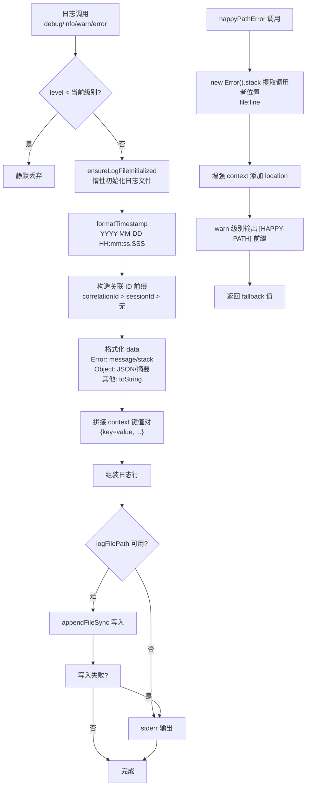

# logger.ts 需求说明

> 源文件：src/utils/logger.ts ｜ 类型：源码 ｜ 行数：344 ｜ 所属模块：Utils ｜ 分析日期：2026-07-23

## 1. 文件定位总述

logger.ts 是 claude-mem 的统一日志基础设施，以单例 `Logger` 类实现，提供 5 个日志级别（DEBUG/INFO/WARN/ERROR/SILENT）和 42 个组件标识符。日志输出为结构化文本行（时间戳 + 级别 + 组件 + 关联ID + 消息 + 数据），按日期分文件存储于 `~/.claude-mem/logs/` 目录。日志级别从 settings.json 惰性读取，支持关联 ID（session/correlation）追踪和工具调用的格式化摘要。该模块被几乎所有其他模块引用，是系统可观测性的基石。

## 2. 功能需求

### 2.1 日志级别管理

| 编号 | 需求描述（系统应当…） | 触发条件 / 输入 | 处理规则与输出 | 证据 |
|------|----------------------|----------------|---------------|------|
| FR-Level-01 | 系统应当支持 5 个日志级别：DEBUG(0) < INFO(1) < WARN(2) < ERROR(3) < SILENT(4) | 枚举 LogLevel 定义 | 低于当前级别的日志消息被静默丢弃 | `src/utils/logger.ts:6-12` |
| FR-Level-02 | 系统应当从 settings.json 惰性读取日志级别（默认 INFO） | 首次调用 log 方法时 | 读取 `paths.settings()` 文件，解析 `CLAUDE_MEM_LOG_LEVEL` 字段（大小写不敏感），未配置则默认 INFO；读取失败也默认 INFO | `src/utils/logger.ts:93-111` |
| FR-Level-03 | 系统应当缓存日志级别，避免每次日志调用都读取文件 | 级别首次解析后 | `this.level` 从 null 变为具体值，后续调用直接返回缓存值 | `src/utils/logger.ts:94,100` |

### 2.2 日志输出格式

| 编号 | 需求描述（系统应当…） | 触发条件 / 输入 | 处理规则与输出 | 证据 |
|------|----------------------|----------------|---------------|------|
| FR-Format-01 | 系统应当输出结构化日志行，格式为 `[时间戳] [级别] [组件] [关联ID] 消息 {context} data` | 任何日志调用 | 时间戳格式 `YYYY-MM-DD HH:mm:ss.SSS`；级别 5 字符右填充；组件 6 字符右填充 | `src/utils/logger.ts:209-268` |
| FR-Format-02 | 系统应当支持关联 ID 前缀（correlationId 优先于 sessionId） | context 包含 correlationId 或 sessionId | `[correlationId] ` 或 `[session-{id}] ` 前缀 | `src/utils/logger.ts:235-240` |
| FR-Format-03 | 系统应当在 DEBUG 级别输出 Error 对象的完整堆栈 | level=DEBUG 且 data 为 Error | 输出 `\n{message}\n{stack}` | `src/utils/logger.ts:245-247` |
| FR-Format-04 | 系统应当在非 DEBUG 级别仅输出 Error 对象的 message | level 非 DEBUG 且 data 为 Error | 输出 ` {message}` | `src/utils/logger.ts:246-247` |
| FR-Format-05 | 系统应当在 DEBUG 级别以 JSON 格式化输出对象数据 | level=DEBUG 且 data 为 object 且非 Error | `JSON.stringify(data, null, 2)` | `src/utils/logger.ts:248-253` |
| FR-Format-06 | 系统应当对超过 3 个 key 的对象使用摘要格式（非 DEBUG） | data 为 object 且 key 数 > 3 | `{N keys: key1, key2, key3...}` | `src/utils/logger.ts:139-143` |

### 2.3 日志文件管理

| 编号 | 需求描述（系统应当…） | 触发条件 / 输入 | 处理规则与输出 | 证据 |
|------|----------------------|----------------|---------------|------|
| FR-File-01 | 系统应当按日期创建日志文件，文件名格式为 `claude-mem-YYYY-MM-DD.log` | 首次日志调用（惰性初始化） | 在 `paths.logsDir()` 目录下创建，目录不存在时自动创建 | `src/utils/logger.ts:74-91` |
| FR-File-02 | 系统应当使用 append 模式写入日志文件 | 每条日志行 | `appendFileSync(logFilePath, logLine + '\\n', 'utf8')` | `src/utils/logger.ts:271-273` |
| FR-File-03 | 系统应当在日志文件写入失败时降级输出到 stderr | appendFileSync 抛出异常 | `process.stderr.write('[LOGGER] Failed to write to log file: ...')` | `src/utils/logger.ts:273-274` |
| FR-File-04 | 系统应当在日志文件未初始化时输出到 stderr | `logFilePath` 为 null | `process.stderr.write(logLine + '\\n')` | `src/utils/logger.ts:277-278` |

### 2.4 日志便捷方法

| 编号 | 需求描述（系统应当…） | 触发条件 / 输入 | 处理规则与输出 | 证据 |
|------|----------------------|----------------|---------------|------|
| FR-Conv-01 | 系统应当提供 `dataIn` 方法，以 `→` 前缀标记数据流入 | 调用 `logger.dataIn(component, message)` | 输出 `[INFO] [COMP ] → {message}` | `src/utils/logger.ts:297-299` |
| FR-Conv-02 | 系统应当提供 `dataOut` 方法，以 `←` 前缀标记数据流出 | 调用 `logger.dataOut(component, message)` | 输出 `[INFO] [COMP ] ← {message}` | `src/utils/logger.ts:301-303` |
| FR-Conv-03 | 系统应当提供 `success` 方法，以 `✓` 前缀标记成功操作 | 调用 `logger.success(component, message)` | 输出 `[INFO] [COMP ] ✓ {message}` | `src/utils/logger.ts:305-307` |
| FR-Conv-04 | 系统应当提供 `failure` 方法，以 `✗` 前缀标记失败操作（使用 ERROR 级别） | 调用 `logger.failure(component, message)` | 输出 `[ERROR] [COMP ] ✗ {message}` | `src/utils/logger.ts:309-311` |
| FR-Conv-05 | 系统应当提供 `timing` 方法，以 `⏱` 前缀标记计时信息 | 调用 `logger.timing(component, message, durationMs)` | 输出 `[INFO] [COMP ] ⏱ {message} {duration: "Nms"}` | `src/utils/logger.ts:313-315` |
| FR-Conv-06 | 系统应当提供 `happyPathError` 方法，以 WARN 级别记录非致命错误并返回 fallback 值 | 调用 `logger.happyPathError(component, message, context, data, fallback)` | 输出 `[WARN] [COMP ] [HAPPY-PATH] {message} {location: "file:line"}`；附加调用者位置信息（从 Error stack 提取） | `src/utils/logger.ts:317-340` |

### 2.5 工具调用格式化

| 编号 | 需求描述（系统应当…） | 触发条件 / 输入 | 处理规则与输出 | 证据 |
|------|----------------------|----------------|---------------|------|
| FR-Tool-01 | 系统应当将工具调用格式化为简洁的摘要形式 | 调用 `formatTool(toolName, toolInput)` | 根据工具类型提取关键参数：Bash→command, file工具→file_path, Glob/Grep→pattern, URL工具→url, query工具→query 等 | `src/utils/logger.ts:149-207` |
| FR-Tool-02 | 系统应当对未知工具类型仅返回工具名称 | 工具名不匹配任何已知模式 | 返回 `toolName` 原始字符串 | `src/utils/logger.ts:206` |
| FR-Tool-03 | 系统应当将字符串类型的 toolInput 尝试 JSON 解析 | toolInput 为 string | `JSON.parse(toolInput)`，失败则保持原字符串 | `src/utils/logger.ts:153-159` |

### 2.6 关联 ID 生成

| 编号 | 需求描述（系统应当…） | 触发条件 / 输入 | 处理规则与输出 | 证据 |
|------|----------------------|----------------|---------------|------|
| FR-Corr-01 | 系统应当生成观测关联 ID | 调用 `correlationId(sessionId, observationNum)` | 返回 `"obs-{sessionId}-{observationNum}"` | `src/utils/logger.ts:113-115` |
| FR-Corr-02 | 系统应当生成会话 ID 标记 | 调用 `sessionId(sessionId)` | 返回 `"session-{sessionId}"` | `src/utils/logger.ts:117-119` |

## 3. 业务规则与约束

- **单例模式**：`logger` 作为模块级导出的 `new Logger()` 实例，全进程共享——推断：（确保日志级别、文件路径等状态一致）`src/utils/logger.ts:343`
- **惰性初始化**：日志文件路径和日志级别均采用惰性初始化（首次使用时读取），而非构造时初始化——推断：（避免构造函数中的循环依赖，因为 `paths.settings()` 可能在模块加载时不可用）`src/utils/logger.ts:71-72`
- **TTY 检测**：`useColor` 基于 `process.stdout.isTTY` 设置，但当前未在输出格式中使用——推断：（为未来支持终端彩色输出预留）`src/utils/logger.ts:70`
- **输出目标选择**：日志文件可用时写入文件，不可用时降级到 stderr——推断：（保证日志不丢失，即使文件系统有问题也能通过 stderr 看到）`src/utils/logger.ts:270-278`
- **组件标识符枚举**：42 个组件标识符覆盖系统的所有子系统（AGENTS_MD、BRANCH、CHROMA、DB、HTTP、SDK、SEARCH 等），确保日志可按组件过滤 `src/utils/logger.ts:14-53`
- **SILENT 级别**：SILENT(4) 高于 ERROR(3)，当设为 SILENT 时所有日志均被静默——推断：（用于完全关闭日志的场景，如性能测试或嵌入式部署）`src/utils/logger.ts:11`

## 4. 对外暴露

| 公开导出 | 类型 | 说明 |
|---------|------|------|
| `logger` | `Logger` 实例 | 全局单例日志器 |
| `LogLevel` | 枚举 | 日志级别常量 |
| `Component` | 类型联合 | 42 个组件标识符类型 |

| Logger 方法 | 签名 | 说明 |
|------------|------|------|
| `debug` | `(component, message, context?, data?): void` | DEBUG 级别日志 |
| `info` | `(component, message, context?, data?): void` | INFO 级别日志 |
| `warn` | `(component, message, context?, data?): void` | WARN 级别日志 |
| `error` | `(component, message, context?, data?): void` | ERROR 级别日志 |
| `dataIn` | `(component, message, context?, data?): void` | 数据流入标记 |
| `dataOut` | `(component, message, context?, data?): void` | 数据流出标记 |
| `success` | `(component, message, context?, data?): void` | 成功操作标记 |
| `failure` | `(component, message, context?, data?): void` | 失败操作标记（ERROR 级别） |
| `timing` | `(component, message, durationMs, context?): void` | 计时信息标记 |
| `happyPathError` | `<T>(component, message, context?, data?, fallback?): T` | 非致命错误标记并返回 fallback |
| `correlationId` | `(sessionId, observationNum): string` | 生成观测关联 ID |
| `sessionId` | `(sessionId): string` | 生成会话 ID 标记 |
| `formatTool` | `(toolName, toolInput?): string` | 工具调用摘要格式化 |

## 5. 依赖关系

### 上游依赖

| 来源 | 用途 |
|------|------|
| `fs`（appendFileSync, existsSync, mkdirSync, readFileSync） | 日志文件操作和 settings 读取 |
| `path.join` | 构造日志文件路径 |
| `paths`（`../shared/paths.js`） | 获取 logs 目录和 settings 文件路径 |

### 下游消费者

- **全系统**：几乎所有模块都导入并使用 `logger` 单例进行日志记录
- `paths` 的循环依赖规避：通过惰性初始化 `ensureLogFileInitialized()` 和 `getLevel()` 避免在构造时访问 `paths`

## 6. 数据结构

```typescript
enum LogLevel {
  DEBUG = 0,   // 详细调试信息
  INFO = 1,    // 常规操作信息（默认）
  WARN = 2,    // 警告信息
  ERROR = 3,   // 错误信息
  SILENT = 4   // 完全静默
}

type Component = 'AGENTS_MD' | 'BRANCH' | 'CHROMA' | /* ... 42 个 ... */ | 'WORKER';

interface LogContext {
  sessionId?: string | number;
  memorySessionId?: string;
  correlationId?: string | number;
  [key: string]: any;    // 扩展上下文字段
}
```
`src/utils/logger.ts:6-60`

## 7. 复杂逻辑图示



上图展示了日志系统的核心处理流程：级别过滤 → 惰性初始化 → 格式化 → 文件/stderr 输出，以及 happyPathError 的特殊处理路径（提取调用位置 + 返回 fallback）。

## 8. 逆向备注

- **循环依赖规避**：Logger 不在构造函数中调用 `paths`，而是通过 `ensureLogFileInitialized()` 和 `getLevel()` 延迟到首次使用时——注释明确说明 "Don't initialize log file in constructor - do it lazily to avoid circular dependency" `src/utils/logger.ts:71`
- **`useColor` 未使用**：`this.useColor` 在构造时赋值但日志输出中未使用颜色代码——推断：（预留用于未来支持彩色终端输出，当前所有日志输出为纯文本）`src/utils/logger.ts:70`
- **LogContext 的 index signature**：`{ [key: string]: any }` 允许任意扩展字段——推断：（不同组件可能需要附加不同的上下文信息，如 HTTP 请求的 status、DB 操作的 table 等）`src/utils/logger.ts:59`
- **同步 I/O**：所有文件操作使用同步 API（`appendFileSync`、`readFileSync`）——推断：（日志操作频繁且需要立即写入，异步写入可能导致日志丢失或顺序错乱；且日志 I/O 通常很快，不构成性能瓶颈）`src/utils/logger.ts:271-272`
- **happyPathError 的调用者位置提取**：通过 `new Error().stack` 获取堆栈并提取第 3 行（index 2）——推断：（第 0 行是 Error 构造，第 1 行是 happyPathError 自身，第 2 行是调用者）`src/utils/logger.ts:324-330`
