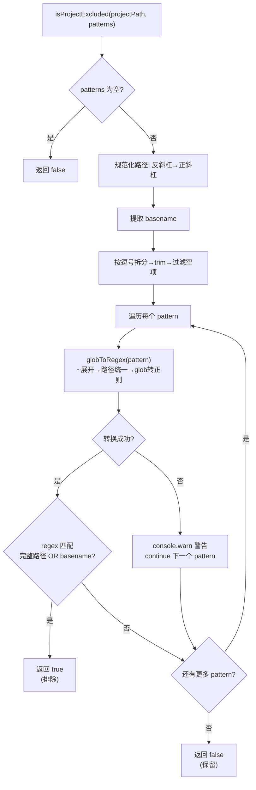

# project-filter.ts 需求说明

> 源文件：src/utils/project-filter.ts ｜ 类型：源码 ｜ 行数：50 ｜ 所属模块：Utils ｜ 分析日期：2026-07-23

## 1. 文件定位总述

project-filter.ts 实现基于 glob 模式的项目路径排除过滤器。它将逗号分隔的排除规则字符串转换为正则表达式，对项目路径和项目目录名进行匹配测试。支持 `~` 展开（指向用户主目录）、`**`（跨目录递归）、`*`（单目录内通配）和 `?`（单字符通配）等标准 glob 语法。该工具用于 settings 中的 `CLAUDE_MEM_EXCLUDED_PROJECTS` 配置项，控制哪些项目路径不应被 claude-mem 跟踪。

## 2. 功能需求

| 编号 | 需求描述（系统应当…） | 触发条件 / 输入 | 处理规则与输出 | 证据 |
|------|----------------------|----------------|---------------|------|
| FR-Filter-01 | 系统应当根据逗号分隔的排除模式列表判断给定项目路径是否应被排除 | 调用 `isProjectExcluded(projectPath, exclusionPatterns)` | 返回 `true`（排除）或 `false`（保留） | `src/utils/project-filter.ts:23-49` |
| FR-Filter-02 | 系统应当在排除模式为空或纯空白时直接返回 false（不排除） | exclusionPatterns 为空/null/纯空白 | `exclusionPatterns.trim()` 为空 → 返回 `false` | `src/utils/project-filter.ts:24-26` |
| FR-Filter-03 | 系统应当将 `~` 前缀展开为用户主目录路径 | 模式以 `~` 开头 | `homedir() + pattern.slice(1)` | `src/utils/project-filter.ts:6-8` |
| FR-Filter-04 | 系统应当将 glob 模式转换为等效正则表达式进行匹配 | 每个排除模式 | `**` → `.*`；`*` → `[^/]*`；`?` → `[^/]`；其余特殊字符转义；最终 `^regex$` 全匹配 | `src/utils/project-filter.ts:5-21` |
| FR-Filter-05 | 系统应当同时用完整路径和目录名（basename）进行匹配 | 转换后的正则 | `regex.test(normalizedProjectPath) \|\| regex.test(projectBasename)` | `src/utils/project-filter.ts:39` |
| FR-Filter-06 | 系统应当对单个无效模式记录警告并跳过，不影响其他模式的匹配 | globToRegex 抛出异常 | `console.warn` 输出警告信息后 `continue` 到下一个模式 | `src/utils/project-filter.ts:42-45` |
| FR-Filter-07 | 系统应当将路径中的 Windows 反斜杠统一替换为正斜杠 | 任何路径 | `projectPath.replace(/\\\\/g, '/')` 和 `pattern.replace(/\\\\/g, '/')` | `src/utils/project-filter.ts:10,28` |

## 3. 业务规则与约束

- **匹配规则**：排除判断是"短路成功"逻辑——任一模式匹配即判定排除，无需全部模式都不匹配才保留 `src/utils/project-filter.ts:36-48`
- **basename 匹配**：除了完整路径匹配外，还额外用目录名匹配——推断：（允许用户使用简短的目录名如 `temp-*` 即可排除所有 temp 开头的项目，无需写完整路径）`src/utils/project-filter.ts:29,39`
- **路径分隔符统一**：所有路径在匹配前将 `\` 替换为 `/`，确保 Windows 和 Unix 路径使用统一格式 `src/utils/project-filter.ts:10,28`
- **日志输出**：使用 `console.warn` 而非模块化的 `logger`——推断：（该模块可能在 hook 脚本的早期阶段执行，此时 logger 可能尚未初始化）`src/utils/project-filter.ts:43`

## 4. 对外暴露

| 公开方法 | 签名 | 说明 |
|---------|------|------|
| `isProjectExcluded` | `(projectPath: string, exclusionPatterns: string): boolean` | 判断项目路径是否匹配排除模式列表 |

## 5. 依赖关系

### 上游依赖

| 来源 | 用途 |
|------|------|
| `os.homedir` | 展开 `~` 为用户主目录路径 |
| `path.basename` | 提取项目目录名用于 basename 匹配 |

### 下游消费者

推断：被 `project-name.ts` 中的 `getProjectContext` 或 worker-service 的 session-init 流程调用，在初始化时判断当前工作目录是否应被排除。

## 6. 数据结构

不适用。

## 7. 复杂逻辑图示

上图展示了排除过滤的完整流程：glob 模式转正则后对完整路径和 basename 进行双重匹配，任一命中即排除。

## 8. 逆向备注

- **未使用 logger**：该模块使用 `console.warn` 而非项目的 `logger` 实例。推断：（可能被 hook 入口脚本在 logger 初始化之前调用，或为减少依赖而简化）`src/utils/project-filter.ts:43`
- **glob 语法覆盖范围**：`globToRegex` 支持 `**`、`*`、`?` 三种通配符和 `~` 展开，但未实现 `[charset]` 等更复杂的 glob 语法——推断：（实际使用场景中这三种通配符已足够覆盖排除需求）`src/utils/project-filter.ts:5-21`
- **内部函数未导出**：`globToRegex` 未导出，仅作为内部实现细节。设计上保持了 API 最小化原则 `src/utils/project-filter.ts:5`
