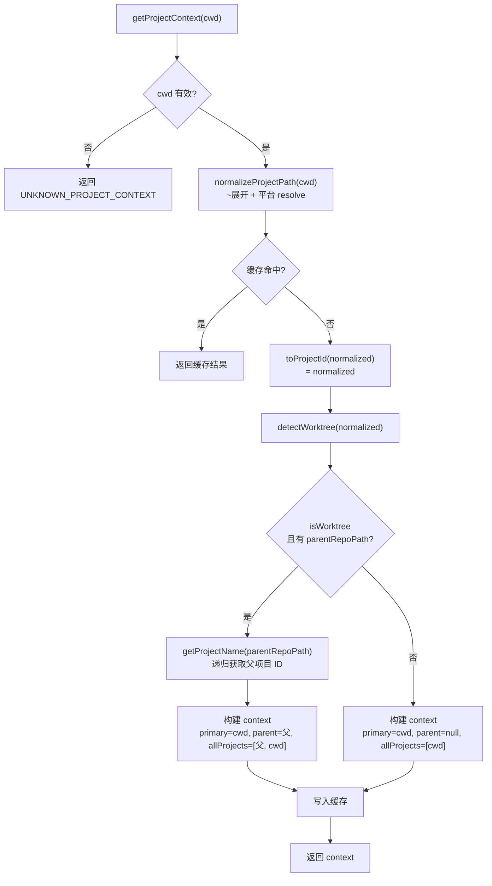

# project-name.ts 需求说明

> 源文件：src/utils/project-name.ts ｜ 类型：源码 ｜ 行数：94 ｜ 所属模块：Utils ｜ 分析日期：2026-07-23

## 1. 文件定位总述

project-name.ts 是 claude-mem 的项目标识核心模块，负责将工作目录（cwd）归一化为项目标识符（projectId），并检测 Git worktree 关系以建立主仓库与工作树的项目关联。它采用路径归一化（`~` 展开、Windows/Unix 路径处理）+ 缓存策略，确保同一路径多次调用返回一致结果。返回的 `ProjectContext` 包含主项目、父项目（worktree 场景）和完整项目列表，是 observation 存储、上下文注入、报表聚合等功能的项目维度基础。

## 2. 功能需求

| 编号 | 需求描述（系统应当…） | 触发条件 / 输入 | 处理规则与输出 | 证据 |
|------|----------------------|----------------|---------------|------|
| FR-Name-01 | 系统应当将 cwd 归一化后作为项目标识符返回 | 调用 `getProjectName(cwd)` | 返回归一化后的完整文件系统绝对路径；空 cwd 返回 `'unknown-project'` | `src/utils/project-name.ts:33-46` |
| FR-Name-02 | 系统应当对相同 cwd 的重复调用返回缓存结果 | 第二次及后续调用 | `projectNameCache` Map 以归一化路径为 key，命中缓存直接返回 | `src/utils/project-name.ts:40-41` |
| FR-Name-03 | 系统应当展开 `~` 前缀为用户主目录 | cwd 以 `~` 或 `~/` 开头 | `p.replace(/^~/, homedir())` | `src/utils/project-name.ts:6-11` |
| FR-Name-04 | 系统应当正确处理 Windows 驱动器路径 | cwd 匹配 `/^[A-Za-z]:([\\/].*)?$/` | 使用 `path.win32.resolve` 归一化；其他平台使用 `path.resolve` | `src/utils/project-name.ts:16-20` |
| FR-Name-05 | 系统应当构建项目上下文（ProjectContext），包含主项目、父项目和完整项目列表 | 调用 `getProjectContext(cwd)` | 返回 `{ primary, parent, isWorktree, allProjects }` | `src/utils/project-name.ts:61-88` |
| FR-Name-06 | 系统应当在检测到 worktree 时将父仓库路径添加到 allProjects 列表首位 | cwd 为 Git worktree | `allProjects: [parentProject, cwdProjectName]`，parent 通过 `detectWorktree` + `getProjectName` 递归获取 | `src/utils/project-name.ts:74-81` |
| FR-Name-07 | 系统应当在非 worktree 场景下仅返回当前项目 | cwd 非 Git worktree | `allProjects: [cwdProjectName]`，parent 为 null | `src/utils/project-name.ts:83` |
| FR-Name-08 | 系统应当提供缓存清除方法 | 调用 `clearProjectCaches()` | 同时清除 `projectNameCache` 和 `projectContextCache` | `src/utils/project-name.ts:90-93` |
| FR-Name-09 | 系统应当在 cwd 为空时返回预定义的 UNKNOWN_PROJECT_CONTEXT | cwd 为 null/undefined/空白字符串 | 返回 `{ primary: 'unknown-project', parent: null, isWorktree: false, allProjects: ['unknown-project'] }` | `src/utils/project-name.ts:55-57,62-63` |
| FR-Name-10 | 系统应当对空 cwd 输出警告日志 | cwd 为空 | `logger.warn('PROJECT_NAME', 'Empty cwd provided, using fallback', { cwd })` | `src/utils/project-name.ts:35-36` |

## 3. 业务规则与约束

- **projectId = 归一化路径**：当前版本直接使用归一化后的完整文件系统路径作为项目标识符。注释说明旧版使用 "安全前缀-SHA1前12位" 格式但已废弃——这是一个重大的标识符策略变更 `src/utils/project-name.ts:23-29`
- **缓存策略**：两个独立的 Map 缓存（`projectNameCache` 和 `projectContextCache`）以归一化路径为 key。缓存无 TTL、无容量限制、无 LRU 淘汰——推断：（进程生命周期内缓存始终有效，适用于长运行的 worker 服务）`src/utils/project-name.ts:31,59`
- **worktree 关联**：worktree 场景下 `allProjects` 包含 [父仓库, 当前工作树]，使得 observation 和报表能同时在两个项目维度下可见 `src/utils/project-name.ts:77-81`
- **Windows 兼容性**：路径归一化阶段区分 Windows 驱动器路径（`C:\...`）和 Unix 路径，使用不同的 resolve 方法——推断：（claude-mem 需要在 Windows 和 macOS/Linux 上运行）`src/utils/project-name.ts:16-20`

## 4. 对外暴露

| 公开方法 | 签名 | 说明 |
|---------|------|------|
| `getProjectName` | `(cwd: string \| null \| undefined): string` | 获取项目标识符（归一化路径） |
| `getProjectContext` | `(cwd: string \| null \| undefined): ProjectContext` | 获取项目上下文（含 worktree 关联） |
| `clearProjectCaches` | `(): void` | 清除所有项目名缓存 |

| 导出接口 | 字段 | 说明 |
|---------|------|------|
| `ProjectContext` | `primary: string` | 主项目标识符（当前 cwd） |
| | `parent: string \| null` | 父仓库项目标识符（仅 worktree） |
| | `isWorktree: boolean` | 是否为 Git worktree |
| | `allProjects: string[]` | 关联项目列表（worktree: [父, 当前]；普通: [当前]） |

## 5. 依赖关系

### 上游依赖

| 来源 | 用途 |
|------|------|
| `os.homedir` | 展开 `~` 为用户主目录 |
| `path`（resolve, win32.resolve, basename） | 路径归一化 |
| `logger`（`./logger.js`） | 空路径警告日志 |
| `detectWorktree`（`./worktree.js`） | 检测 Git worktree 关系 |

### 下游消费者

推断：`getProjectName` 和 `getProjectContext` 被 worker-service.ts 的大部分 hook 处理流程调用，为每个 observation、summary、user prompt 关联项目标识。`allProjects` 列表被用于跨项目的 observation 聚合和报表生成。

## 6. 数据结构

```typescript
interface ProjectContext {
  primary: string;           // 主项目标识符（当前 cwd 归一化路径）
  parent: string | null;      // 父仓库路径（仅 worktree 有值）
  isWorktree: boolean;        // 是否为 Git worktree
  allProjects: string[];      // 关联项目列表
}

const UNKNOWN_PROJECT_CONTEXT: ProjectContext = {
  primary: 'unknown-project',
  parent: null,
  isWorktree: false,
  allProjects: ['unknown-project']
};
```
`src/utils/project-name.ts:48-57`

## 7. 复杂逻辑图示



上图展示了 `getProjectContext` 的核心逻辑：路径归一化后检测 worktree，根据检测结果构建不同结构的 ProjectContext，并缓存结果。

## 8. 逆向备注

- **旧版标识符策略已废弃**：注释明确说明旧版使用 "安全前缀-SHA1前12位" 格式（推断：（对路径做 SHA1 哈希取前12位以避免特殊字符和路径长度问题），现已直接使用完整归一化路径。这个变更推断：（为了简化查询和提高可读性——完整路径在数据库查询和日志中更直观）`src/utils/project-name.ts:23-26`
- **`basename` 导入但未使用**：`path.basename` 在第 2 行导入但函数体中未使用。以代码为准，当前不需要 basename 功能 `src/utils/project-name.ts:2`
- **缓存无清理机制**：`clearProjectCaches` 存在但推断：（主要在测试或配置变更时手动调用，正常工作流中缓存持续有效）`src/utils/project-name.ts:90-93`
- **递归调用**：`getProjectContext` 内部调用 `getProjectName(parentRepoPath)` 获取父项目标识符——这不是无限递归，因为父仓库路径本身不是 worktree（Git worktree 不会嵌套 worktree），所以 `getProjectName` 不会再次调用 `detectWorktree` `src/utils/project-name.ts:75`
