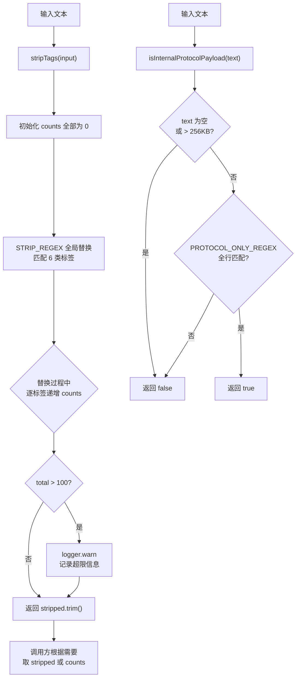

# tag-stripping.ts 需求说明

> 源文件：src/utils/tag-stripping.ts ｜ 类型：源码 ｜ 行数：69 ｜ 所属模块：Utils ｜ 分析日期：2026-07-23

## 1. 文件定位总述

tag-stripping.ts 是 claude-mem 的隐私与协议标签剥离工具，在数据进入存储/处理流程之前作为"边缘处理层"清除特定 XML 标签内容。它剥离 6 类标签（private、claude-mem-context、system_instruction 等）并统计各类标签的出现次数，同时提供内部协议消息检测功能（识别 `<task-notification>` 等协议级标签）。该模块是 Claude Code hook 数据管道中的安全守门员，确保用户隐私标签 `<private>` 内容不被持久化。

## 2. 功能需求

| 编号 | 需求描述（系统应当…） | 触发条件 / 输入 | 处理规则与输出 | 证据 |
|------|----------------------|----------------|---------------|------|
| FR-Strip-01 | 系统应当从输入文本中剥离所有预定义 XML 标签及其内容 | 调用 `stripTags(input)` | 使用正则全局匹配并替换为空字符串；返回 `{ stripped: string, counts: Record<TagName, number> }` | `src/utils/tag-stripping.ts:23-46` |
| FR-Strip-02 | 系统应当统计每类标签被剥离的数量 | stripTags 执行过程中 | 每次正则匹配成功时递增对应标签名的计数器 | `src/utils/tag-stripping.ts:31-35` |
| FR-Strip-03 | 系统应当在剥离后的文本上执行 trim() | 替换完成 | 返回 `stripped.trim()` | `src/utils/tag-stripping.ts:45` |
| FR-Strip-04 | 系统应当剥离以下 6 类标签：private, claude-mem-context, system_instruction, system-instruction, persisted-output, system-reminder | 任何标签剥离调用 | `STRIP_REGEX` 正则包含这 6 个标签名，使用 `\b` 单词边界和 `[^>]*` 属性匹配 | `src/utils/tag-stripping.ts:4-11,14-17` |
| FR-Strip-05 | 系统应当在标签剥离总数超过 100 时输出 WARN 级别日志 | `total > MAX_TAG_COUNT(100)` | `logger.warn('SYSTEM', 'tag count exceeds limit', ...)` 包含 tagCount、maxAllowed、contentLength | `src/utils/tag-stripping.ts:37-43` |
| FR-Strip-06 | 系统应当为 JSON 内容提供专用的标签剥离方法 | 调用 `stripMemoryTagsFromJson(content)` | 内部调用 `stripTags` 并仅返回 stripped 字符串 | `src/utils/tag-stripping.ts:48-50` |
| FR-Strip-07 | 系统应当为用户提示词内容提供专用的标签剥离方法 | 调用 `stripMemoryTagsFromPrompt(content)` | 内部调用 `stripTags` 并仅返回 stripped 字符串 | `src/utils/tag-stripping.ts:52-54` |
| FR-Strip-08 | 系统应当导出 `system-reminder` 标签的独立正则 | 外部需要单独匹配 system-reminder 标签 | `SYSTEM_REMINDER_REGEX = /<system-reminder>[\s\S]*?<\/system-reminder>/g` | `src/utils/tag-stripping.ts:19` |
| FR-Strip-09 | 系统应当检测仅包含协议标签的内部协议消息 | 调用 `isInternalProtocolPayload(text)` | 仅匹配 `<task-notification>` 标签（独立扩展点），要求文本不超过 256KB 且仅含该标签 | `src/utils/tag-stripping.ts:64-68` |

## 3. 业务规则与约束

- **隐私保护规则**：`<private>` 标签被列入剥离列表，确保用户标记为私有的内容不会被 claude-mem 存储——这是核心隐私保障机制 `src/utils/tag-stripping.ts:5`
- **协议级标签识别**：`<task-notification>` 被归类为"协议专属标签"（PROTOCOL_ONLY_TAGS），不参与常规剥离，仅用于识别内部协议消息是否应被特殊处理 `src/utils/tag-stripping.ts:56`
- **正则安全边界**：`STRIP_REGEX` 使用 `\b` 单词边界匹配标签名，防止 `private` 误匹配 `not-private` 等包含该子串的标签名 `src/utils/tag-stripping.ts:15`
- **self-closing 标签不支持**：正则 `<tag[^>]*>[\s\S]*?</tag>` 要求闭合标签，不处理自闭合标签如 `<tag/>`——推断：（实际场景中这些标签均为开闭对形式）`src/utils/tag-stripping.ts:15`
- **标签大小写敏感**：正则中标签名未使用 `i` 标志，匹配区分大小写——推断：（遵循 XML 规范的标签名大小写敏感特性）`src/utils/tag-stripping.ts:14`
- **协议消息大小限制**：`MAX_PROTOCOL_PAYLOAD_BYTES = 256 * 1024`（256KB），超过此大小的文本直接判定为非协议消息 `src/utils/tag-stripping.ts:62`
- **协议正则全行匹配**：`PROTOCOL_ONLY_REGEX` 使用 `^\s*...\s*$` 锚定，要求整行仅包含该标签，前后可有空白 `src/utils/tag-stripping.ts:58-60`

## 4. 对外暴露

| 公开方法 | 签名 | 说明 |
|---------|------|------|
| `stripTags` | `(input: string): { stripped: string; counts: Record<TagName, number> }` | 剥离预定义标签并返回剥离结果及计数 |
| `stripMemoryTagsFromJson` | `(content: string): string` | JSON 内容的标签剥离便捷方法 |
| `stripMemoryTagsFromPrompt` | `(content: string): string` | 提示词内容的标签剥离便捷方法 |
| `isInternalProtocolPayload` | `(text: string): boolean` | 检测是否为仅含协议标签的内部消息 |

| 公开常量 | 类型 | 说明 |
|---------|------|------|
| `SYSTEM_REMINDER_REGEX` | `RegExp` | system-reminder 标签的独立匹配正则 |
| `STRIP_REGEX` | 未导出 | 6 类标签的全局剥离正则（内部使用） |
| `MAX_TAG_COUNT` | 未导出 | 标签计数警告阈值（100）（内部使用） |
| `MAX_PROTOCOL_PAYLOAD_BYTES` | 未导出 | 协议消息最大字节数（256KB）（内部使用） |

## 5. 依赖关系

### 上游依赖

| 来源 | 用途 |
|------|------|
| `logger`（`./logger.js`） | 超限警告日志记录 |

### 下游消费者

推断：被 worker-service.ts 的 observation 处理流程调用（PreToolUse / PostToolUse hook 传入的数据先经过标签剥离再存储）。`stripMemoryTagsFromJson` 和 `stripMemoryTagsFromPrompt` 可能分别用于 JSON 数据和用户提示词的不同处理路径。

## 6. 数据结构

```typescript
type TagName = 'private' | 'claude-mem-context' | 'system_instruction'
             | 'system-instruction' | 'persisted-output' | 'system-reminder';

// stripTags 返回值
{ stripped: string; counts: Record<TagName, number> }
```
`src/utils/tag-stripping.ts:4-12,23`

## 7. 复杂逻辑图示



上图展示了 tag-stripping.ts 的两条核心路径：上方的标签剥离流程和下方的协议消息检测流程。

## 8. 逆向备注

- **标签名列表的重复**：`TAG_NAMES` 中 `system_instruction` 和 `system-instruction` 同时存在——推断：（兼容 Claude Code 不同版本可能使用的两种格式——下划线和连字符）`src/utils/tag-stripping.ts:7-8`
- **stripMemoryTagsFromJson 与 stripMemoryTagsFromPrompt 完全相同**：两个函数实现完全一致，均为 `stripTags(content).stripped`。推断：（为代码可读性提供语义化的调用入口，区分 JSON 和 Prompt 两个处理场景，尽管当前实现无差异）`src/utils/tag-stripping.ts:48-54`
- **协议标签的可扩展性**：`PROTOCOL_ONLY_TAGS` 定义为 `const` 元组（`as const`），推断：（设计上预留了扩展点，可添加更多协议级标签如 `status-update` 等）`src/utils/tag-stripping.ts:56`
- **正则 lastIndex 重置**：`STRIP_REGEX.lastIndex = 0` 在每次 `stripTags` 调用时显式重置——推断：（防止正则在带有 `g` 标志时因 lastIndex 未重置导致间歇性匹配失败，尤其在多次调用之间）`src/utils/tag-stripping.ts:28`
