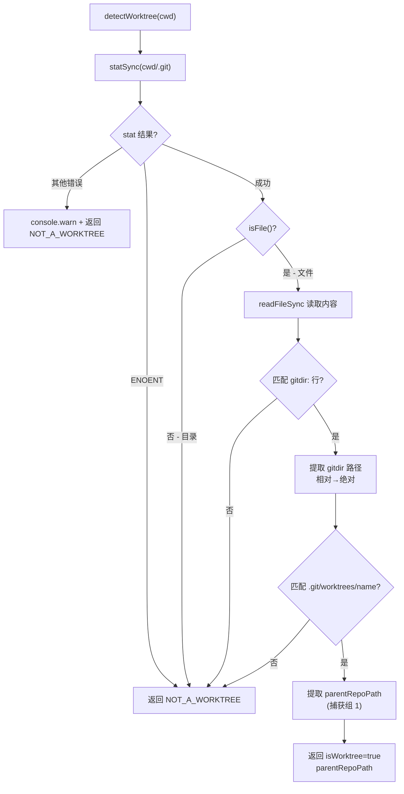

# worktree.ts 需求说明

> 源文件：src/utils/worktree.ts ｜ 类型：源码 ｜ 行数：62 ｜ 所属模块：Utils ｜ 分析日期：2026-07-23

## 1. 文件定位总述

worktree.ts 提供 Git worktree（工作树）检测能力，用于判断当前工作目录是否属于某个 Git 仓库的 worktree，并返回其父仓库路径。它通过检查 `.git` 文件（注意：是文件而非目录）的内容来识别 worktree——Git worktree 的 `.git` 是一个指向主仓库 `.git/worktrees/<name>` 的指针文件。该工具被 project-name.ts 调用，以在 worktree 场景下建立主仓库与工作树的关联关系。

## 2. 功能需求

| 编号 | 需求描述（系统应当…） | 触发条件 / 输入 | 处理规则与输出 | 证据 |
|------|----------------------|----------------|---------------|------|
| FR-Worktree-01 | 系统应当检测指定目录是否为 Git worktree，并返回父仓库路径 | 调用 `detectWorktree(cwd)` | 返回 `WorktreeInfo { isWorktree: boolean, parentRepoPath: string \| null }` | `src/utils/worktree.ts:15-61` |
| FR-Worktree-02 | 系统应当在工作目录不存在 `.git` 文件时判定为非 worktree | `.git` 路径 stat 失败（ENOENT） | 返回 `{ isWorktree: false, parentRepoPath: null }` | `src/utils/worktree.ts:18-26` |
| FR-Worktree-03 | 系统应当区分 `.git` 目录（普通仓库）和 `.git` 文件（worktree 指针） | `.git` 存在但为目录 | `stat.isFile()` 返回 false → 判定为非 worktree | `src/utils/worktree.ts:28-30` |
| FR-Worktree-04 | 系统应当从 `.git` 指针文件中解析 `gitdir:` 行获取 gitdir 路径 | `.git` 为文件且包含 `gitdir:` 行 | 正则匹配 `^gitdir:\s*(.+)$` 提取 gitdir 路径；支持相对路径和绝对路径 | `src/utils/worktree.ts:33-48` |
| FR-Worktree-05 | 系统应当从 gitdir 路径中提取父仓库根路径 | gitdir 匹配 `.git/worktrees/<name>` 模式 | 正则匹配 `^(.+)[/\\]\.git[/\\]worktrees[/\\]([^/\\]+)$`；捕获组 1 即为父仓库路径 | `src/utils/worktree.ts:50-55` |
| FR-Worktree-06 | 系统应当在 gitdir 路径不符合 `.git/worktrees/<name>` 结构时判定为非 worktree | gitdir 不匹配 worktrees 模式 | 返回 `{ isWorktree: false, parentRepoPath: null }` | `src/utils/worktree.ts:51-53` |
| FR-Worktree-07 | 系统应当在非预期的文件系统错误时输出警告日志并安全降级为非 worktree | stat 或 readFileSync 抛出非 ENOENT 错误 | `console.warn` 输出错误信息后返回 NOT_A_WORKTREE | `src/utils/worktree.ts:22-24,36-37` |

## 3. 业务规则与约束

- **Git worktree 识别原理**：Git worktree 的 `.git` 是一个文本文件（非目录），内容格式为 `gitdir: /path/to/main-repo/.git/worktrees/<name>`。该模块通过此特征与普通仓库（`.git` 为目录）区分 `src/utils/worktree.ts:40-55`
- **路径解析安全性**：gitdir 路径支持相对路径和绝对路径两种格式，相对路径基于 cwd 解析为绝对路径 `src/utils/worktree.ts:46-48`
- **跨平台路径分隔符**：worktrees 路径正则同时匹配 `/` 和 `\\`，支持 Windows 和 Unix `src/utils/worktree.ts:50`
- **不可变常量**：`NOT_A_WORKTREE` 作为模块级常量定义，所有非 worktree 场景返回同一对象引用 `src/utils/worktree.ts:10-13`

## 4. 对外暴露

| 公开方法 | 签名 | 说明 |
|---------|------|------|
| `detectWorktree` | `(cwd: string): WorktreeInfo` | 检测给定目录是否为 Git worktree 并返回父仓库路径 |

| 导出接口 | 字段 | 说明 |
|---------|------|------|
| `WorktreeInfo` | `isWorktree: boolean` | 是否为 worktree |
| | `parentRepoPath: string \| null` | 父仓库根路径（非 worktree 时为 null） |

## 5. 依赖关系

### 上游依赖

| 来源 | 用途 |
|------|------|
| `fs.statSync` | 检测 `.git` 是否存在及其类型（文件 vs 目录） |
| `fs.readFileSync` | 读取 `.git` 指针文件内容 |
| `path.join` | 构造 `.git` 路径 |
| `path.isAbsolute` / `path.resolve` | 解析 gitdir 相对路径为绝对路径 |

### 下游消费者

- **`project-name.ts`**：`getProjectContext` 调用 `detectWorktree` 以判断当前项目是否为 worktree，从而构建 `ProjectContext.parent` 关联 `src/utils/project-name.ts:71`

## 6. 数据结构

```typescript
interface WorktreeInfo {
  isWorktree: boolean;       // 是否为 Git worktree
  parentRepoPath: string | null;  // 父仓库根路径
}
```
`src/utils/worktree.ts:5-8`

## 7. 复杂逻辑图示



上图展示了 worktree 检测的多级过滤流程：从文件系统检查到内容解析，每一步都有明确的失败降级路径。

## 8. 逆向备注

- **识别原理**：该模块利用了 Git 内部实现细节——worktree 的 `.git` 是一个 `gitdir:` 指针文件。这是 Git 官方文档记录的行为，属于稳定的内部协议 `src/utils/worktree.ts:40`
- **未使用 logger**：与 project-filter.ts 相同，使用 `console.warn` 而非项目的 `logger` 实例——推断：（同为 hook 早期阶段的工具函数，避免循环依赖）`src/utils/worktree.ts:23,36`
- **正则设计**：worktrees 路径正则 `^(.+)[/\\]\.git[/\\]worktrees[/\\]([^/\\]+)$` 的第一个捕获组 `(.+)` 使用贪婪匹配——这确保了即使主仓库路径中包含 `.git` 子串也能正确提取父仓库路径（因为 `[/\\]\.git[/\\]` 的末尾锚定要求后面跟 `worktrees`）`src/utils/worktree.ts:50`
