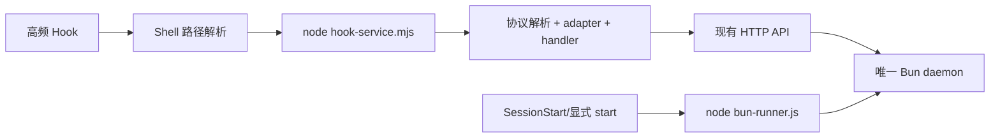

# Bun Hook 进程风暴实现机制审查与优化方案

## 1. 审查结论

当前修复思路只能降低部分“子进程已结束但父进程未退出”的概率，**不能从机制上阻止 Bun 进程风暴再次发生**。根因仍然存在：每个高频 Hook 都会先启动一个 Node 进程，再加载约 4.2 MB 的 Bun worker CLI；`PostToolUse` 又是全量匹配、异步执行，事件突发时会自然形成大量并发进程。

推荐方案不是把完整 Hook 执行迁入常驻 worker，而是增加一个约 143 KB 的轻量 Node ESM Hook 程序：它完成协议解析、平台适配与现有 handler 调用，只通过已有 HTTP API 与唯一的 Bun daemon 通信。Bun 仅负责常驻 worker 和低频生命周期命令，高频 Hook 路径不得再启动 Bun。

结论：该方案技术上可行，改造边界明确，能直接消除“每个 Hook 一个 Bun”的结构性风险；在未完成该改造前，同类问题仍可能发生。

## 2. 当前实现机制

这条链路存在三个放大器：

1. `PostToolUse` 使用 `matcher: "*"` 且为异步 Hook，事件生产速度不受单个 Hook 完成速度限制。
2. 每个事件都创建 Node 和 Bun 两级进程，并重复加载完整 worker bundle。
3. stdin 半关闭或 EOF 未到达时，runner 可能长期停留在启动 Bun 之前；并发事件持续到来后，积压会快速放大。

现场证据：当日日志出现 1,571 次重复启动跳过记录；峰值达到每分钟 129 个 Hook 事件；00:02 单分钟可识别出约 202 次 Bun CLI 初始化。当前热路径实测约 292–311 ms，而直接 worker 健康检查仅约 12–14 ms。检查时系统已恢复为单个低 CPU Bun daemon，但这只能说明风暴结束，不代表触发机制已经消失。

## 3. 审查发现

### R-001 🔴 blocking：高频 Hook 仍按事件启动完整 Bun CLI

- 位置：`plugin/hooks/hooks.json`、`plugin/hooks/codex-hooks.json`、`plugin/scripts/bun-runner.js:148`、`plugin/scripts/bun-runner.js:166`、`src/services/worker-service.ts:1525`
- 机制：所有 Hook 先进入 Node runner，再为单次事件启动 Bun 执行 `worker-service.cjs hook...`。
- 影响：事件突发时进程数与事件数近似线性增长；即使每个进程最终退出，也会产生明显 CPU、内存和调度抖动。
- 必须修复：高频 Hook 直接进入轻量 Node Hook 程序；热路径禁止启动 Bun。

### R-002 🔴 blocking：stdin 兜底逻辑存在自我依赖

- 位置：`plugin/scripts/bun-runner.js:104-145`
- 机制：用于 `stdin.destroy()` 的动作位于超时定时器回调内；历史判断又认为 Node 25 在半关闭 stdin 状态下可能不执行该定时器。
- 影响：如果定时器确实被该状态阻塞，销毁 stdin 的补救逻辑也不会运行，修复无法覆盖宣称的故障路径。
- 必须修复：收到完整 JSON 后立即结束解析，不依赖 EOF；由宿主超时作为最后防线。生命周期命令应在读取 stdin 前直接分流。

### R-003 🟡 important：启动责任重复，热路径具备并发拉起 worker 的能力

- 位置：`src/services/worker-service.ts:1525-1541`、`src/cli/hook-command.ts:74-92`、`src/shared/worker-utils.ts`
- 机制：CLI 主入口先确保 worker 存活，部分 handler 随后又经 `executeWithWorkerFallback` 再次确保 worker 存活。
- 影响：增加每次 Hook 延迟；worker 异常时，多条并发 Hook 都可能参与拉起和探测，放大故障恢复压力。
- 建议：`SessionStart` 和显式生命周期命令是唯一启动责任方；高频 Hook 只做有界健康检查，worker 不可用时按协议 fail-open，不参与启动。

### R-004 🟡 important：直接迁入 worker 会引入新的并发与安全问题

- 位置：`src/cli/hook-command.ts:94-136`、`src/shared/hook-settings.ts:8-14`
- 机制：Hook 命令会临时覆盖全局 `process.stderr.write`；设置在单进程中首次读取后永久缓存。
- 影响：若在常驻 daemon 内并发执行 Hook，stderr 捕获会相互污染，设置变更也不能在下一次 Hook 自动生效。新增通用 Hook HTTP 入口还需解决鉴权、请求大小、平台/event 白名单及自调用问题。
- 建议：不新增通用 Hook 执行端点；保留“每次 Hook 一个轻量 Node 进程”的隔离语义，仅复用现有、窄职责 worker API。

### R-005 🟡 important：源码修复与已安装插件产物存在漂移

- 位置：本地 `plugin/scripts/bun-runner.js` 与 `~/.claude/plugins/cache/.../scripts/bun-runner.js`
- 机制：当前实际执行的是插件缓存产物，其内容与工作区源码不一致，工作区中的新增修复并未完整进入运行路径。
- 影响：仅修改源码或通过单元测试，不能证明线上 Hook 已采用新机制。
- 建议：验收必须包含安装缓存的版本、哈希、命令路径和进程命令行核对；发布采用原子替换并重启 daemon。

## 4. 方案比较

| 方案 | 可行性 | 主要问题 | 结论 |
|---|---:|---|---|
| 在 Bun daemon 新增通用 Hook 执行接口 | 可行 | 需处理鉴权、全局 stderr、配置缓存、cwd/env 隔离及自调用 | 不推荐 |
| 新建轻量 Node Hook 程序，调用现有 worker API | 高 | 需拆开 Bun 专属依赖并保持协议兼容 | **推荐** |
| 新建独立进程池或 Unix Socket 服务 | 可行 | 与现有 HTTP worker 职责重叠，跨平台和生命周期更复杂 | 当前不需要 |

已做结构性打包验证：以现有 Hook 命令依赖图构建 Node ESM bundle，产物为 142,566 字节，约为当前 4,216,061 字节 worker bundle 的 1/30，最终产物未检索到 `bun:sqlite` 引用。该验证证明依赖图可被裁剪，但尚不是完整 CLI 的端到端验收；实现时仍需增加专用入口并执行协议回归测试。

## 5. 指定优化方案

### 阶段 A：切断高频 Bun 启动链路（根治项）

目标架构：

实施内容：

- 新增 `src/cli/hook-service-entry.ts`，构建为 `plugin/scripts/hook-service.mjs`；入口只接受固定的平台和事件白名单。
- 将 Hook 核心整理为纯函数 `executeHookRequest(rawInput, platform, event)`，返回 `{ output, exitCode }`；只有 CLI 入口负责 stdout 和退出码，禁止修改全局 stderr。
- stdin 采用“完整 JSON 到达即解析并结束”，同时设置输入大小上限；空输入、非法 JSON 和半关闭 stdin 必须有确定退出行为。
- 从 `worker-utils` 拆出 Node 可用的 client-only 请求层。热路径只访问现有 worker API，不引用 `ProcessManager`、`bun:sqlite`，也不得执行 worker spawn。
- 修改 Claude/Codex 高频 Hook 配置，直接调用 `node hook-service.mjs`。`bun-runner.js` 仅保留 start/stop/restart/status/daemon 等低频命令，并在读取 stdin 前完成生命周期分流。
- worker 不可用时，高频 Hook 记录有界诊断并按协议退出 0；由 `SessionStart` 或显式 start 恢复 daemon，避免数百个 Hook 同时抢启动权。

### 阶段 B：抗突发、发布一致性与兼容收口

- 为 observation 等热接口增加请求幂等键和按 session 顺序号，避免重试导致重复写入或乱序。
- worker 对队列深度设置上限并返回 429；Hook 对过载执行有界降级，不无限等待或重试。
- 设置事件级超时：高频 observation 建议 3 秒，context/session-init 建议 15 秒；宿主外层超时只比内部超时略长，不再统一使用 60/120 秒。
- 首先切换 Claude/Codex，稳定后迁移 Cursor/Gemini/Windsurf；协议一致性验证通过后再删除旧的 `worker-service.cjs hook` 路径。
- 发布检查同时验证源码版本、构建产物哈希、安装缓存路径和 daemon 版本；更新失败时保留旧版本并明确报错，不允许源码与缓存静默漂移。

## 6. 验收标准

1. 连续注入 200 个 Hook 事件时，Bun 进程数始终为 1 个 daemon；停止状态下为 0，任何事件都不得产生临时 Bun 进程。
2. worker 健康时，Hook 端到端延迟 p95 小于 80 ms；相同突发负载下 CPU 峰值较当前实现下降至少 80%。
3. 非法 JSON、空输入、5 MB 边界输入、半关闭 stdin、worker 离线和 worker 429 均能在内部超时内退出，不残留孤儿进程。
4. 新旧实现对所有平台/event 的 stdout JSON 和退出码保持等价；退出码 0/1/2 的既有语义不得改变。
5. 同一 session 的 observation 不重复、不乱序；设置文件修改后，下一次 Hook 即可读取新设置。
6. 构建流水线若在 `hook-service.mjs` 中发现 `bun:` 引用、worker 启动代码或产物超过约定体积，应直接失败。
7. 安装后通过实际 Hook 命令压测，而不是只测试源码入口；同时核对运行命令行确实指向新产物。

## 7. 最终判断

原“补 stdin 超时并销毁流”的思路只能作为防御性补丁，逻辑上无法覆盖定时器本身不执行的场景，也没有消除每次 Hook 启动 Bun 的成本。原“把 Hook 全部移入常驻 worker”的方向虽能减少进程，却会扩大 worker 的安全边界并引入并发全局状态问题。

应采用“轻量 Node Hook 网关 + 唯一 Bun daemon + 生命周期单一启动责任”的方案。它保留现有 handler 和 worker API，修改范围可控，同时直接消除本次事故最关键的结构性触发条件。
